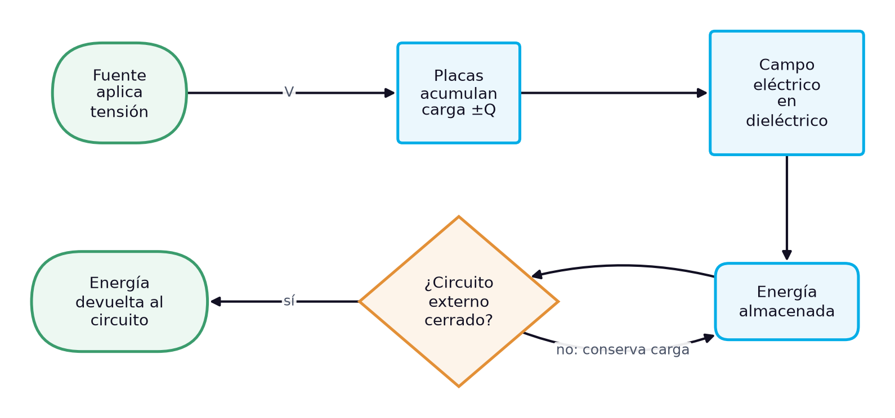
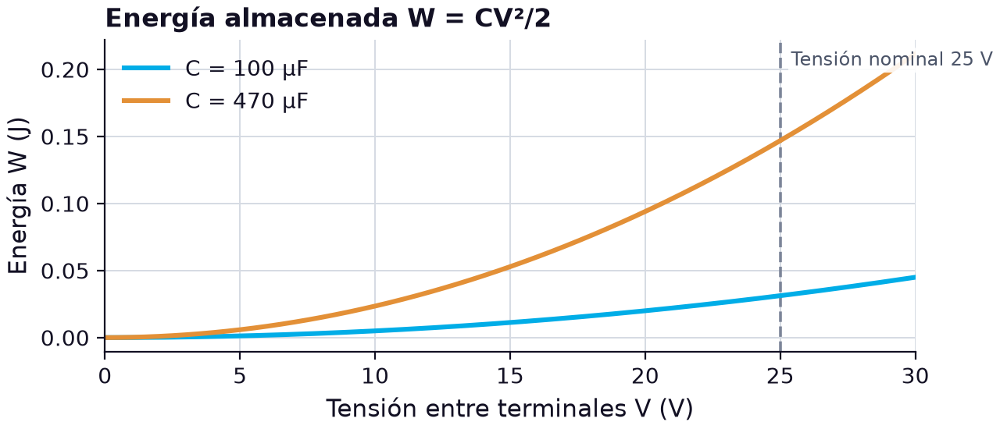
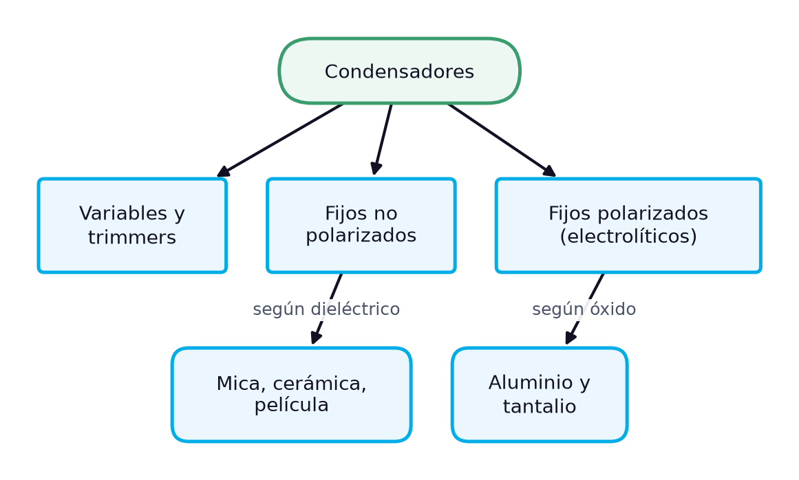

# El condensador: estructura, capacitancia, tipos e identificación de componentes comerciales

> **Módulos:** IEL04 — Circuitos Eléctricos I
> **Duración:** 240 minutos (sesión teórico-práctica)
> **Nivel:** Pregrado
> **Semana:** 1 de 14 (corte evaluativo 1) · **Resultado de aprendizaje del módulo:** [[IEL04-RA1]] · **Trabajo independiente:** 5 h/semana

---

## 1. Metadatos de la Sesión

### 1.1 Continuidad curricular

Esta es la sesión de apertura del módulo y del primer resultado de aprendizaje, dedicado a los elementos que almacenan energía. Parte de lo que el estudiante ya conoce de electrotecnia y electrónica básica —carga, tensión, corriente y el resistor— y presenta el primer elemento reactivo: el condensador. Aquí se construye el vocabulario, las magnitudes y los criterios de identificación que se usarán durante todo el semestre. La semana 2 aplica el mismo recorrido a la bobina, y la semana 3 reúne ambos elementos para calcular y medir asociaciones en serie, en paralelo y mixtas, y circuitos LC. Sin una identificación segura del condensador, esas mediciones posteriores no son confiables.

1. **→ Presente sesión (semana 1):** Condensadores: estructura, comportamiento interno, identificación y tipos
2. Semana 2: Bobinas o inductores: estructura, comportamiento interno, identificación y tipos

### 1.2 Prerrequisitos

- Definir carga eléctrica, diferencia de potencial y corriente, con sus unidades del SI (C, V, A).
- Aplicar la ley de Ohm a un resistor y calcular potencia en cd.
- Usar notación científica y de ingeniería con prefijos métricos (m, µ, n, p, k, M).
- Leer el código de colores y la tolerancia de un resistor.
- Operar un multímetro digital para medir tensión, corriente y resistencia.

---

## 2. Resultados de Aprendizaje

**RA IEL04-RA1:** Calcular un circuito capacitivo, inductivo y LC, sea en serie o paralelo.

**Criterios de evaluación:**
- **CE1** (cognitiva_conceptual): Identificar los tipos de capacitores e inductores.
- **CE2** (manipulacion_fisica): Realizar mediciones en un circuito capacitivo e inductivo.
- **CE3** (manipulacion_fisica): Realizar mediciones en un circuito LC.

**Unidades de competencia de la asignatura:**
- [[UC2]]: Coordinar actividades asociadas a sistemas eléctricos utilizando fuentes convencionales y no convencionales de energía.

Al finalizar la sesión, el estudiante estará en capacidad de lograr los siguientes resultados, que desarrollan el RA del módulo:

| # | Resultado de aprendizaje | Nivel (Taxonomía de Bloom) |
| --- | --- | --- |
| RA1 | **Explicar** la estructura interna de un condensador y el papel del dieléctrico en su capacitancia. (CE1) | Comprender |
| RA2 | **Calcular** la capacitancia, la carga y la energía almacenada de un condensador a partir de su geometría o de su tensión de trabajo. (CE1) | Aplicar |
| RA3 | **Identificar** el tipo, el valor nominal, la tolerancia y la tensión de trabajo de condensadores comerciales a partir de su marcado. (CE1) | Aplicar |
| RA4 | **Medir** la capacitancia de condensadores con un capacímetro y contrastarla con su intervalo de tolerancia, como base de las mediciones en circuitos capacitivos y LC. (CE2, CE3) | Evaluar |

---

## 3. Índice Temporizado (240 minutos)

| Bloque | Contenido | Duración |
| --- | --- | --- |
| 1 | El condensador como elemento que almacena energía en el campo eléctrico y su lugar en los circuitos | 20 min |
| 2 | Placas, dieléctrico, C = Q/V y capacitancia de placas paralelas | 35 min |
| 3 | Separación de cargas, rigidez dieléctrica, tensión nominal y energía W = CV²/2 | 35 min |
| 4 | Cerámicos, de película, de mica, electrolíticos de aluminio y tantalio, variables | 35 min |
| 5 | Lectura del valor, la tolerancia y la tensión en el cuerpo del condensador | 30 min |
| 6 | Faradio y sus submúltiplos, conversiones y símbolos normalizados | 25 min |
| 7 | Decodificar el marcado, calcular el intervalo de tolerancia y contrastarlo con la medición | 45 min |
| 8 | Síntesis, cierre actitudinal y bibliografía | 15 min |
|  | **Total** | **240 min** |

---

## 4. Desarrollo Teórico

### 4.1 Introducción Conceptual (Bloque 1)

Hasta este punto de la formación, el resistor ha sido prácticamente el único componente pasivo analizado: un elemento que convierte energía eléctrica en calor y cuya respuesta depende solo del valor instantáneo de la corriente. Los capacitores y los inductores son los otros dos componentes pasivos básicos, y con ellos aparece una propiedad nueva: la capacidad de **almacenar energía** y devolverla después al circuito [1]. Un capacitor, también llamado condensador, es un dispositivo que guarda carga eléctrica y, con ella, crea un campo eléctrico que a su vez almacena energía [1]. Esta diferencia no es un matiz académico: explica por qué un circuito con condensadores no responde de inmediato a un cambio de tensión, por qué un equipo desconectado puede seguir siendo peligroso y por qué los mismos componentes que filtran una fuente de alimentación sirven para corregir el factor de potencia de una instalación industrial.

En la gestión de sistemas eléctricos, el condensador aparece en escalas muy distintas: desde unos pocos picofaradios en una tarjeta electrónica de protección o medición, hasta bancos de condensadores de cientos de kilovoltamperios reactivos en una subestación. En todos los casos el principio físico es el mismo: dos superficies conductoras separadas por un material aislante, el **dieléctrico** [1], [2]. Lo que cambia es la geometría, el material aislante, la tensión que debe soportar y la forma en que el fabricante marca sus características. Por eso, antes de calcular circuitos capacitivos, el técnico necesita reconocer con seguridad qué condensador tiene en la mano y qué valores reales puede esperar de él.

*Figura 1. Cadena de funcionamiento del condensador: de la fuente al almacenamiento y la devolución de energía*

La figura resume la secuencia que se desarrollará en la sesión. Una fuente impone una diferencia de potencial entre las placas; los electrones se redistribuyen hasta que una placa queda con carga negativa y la otra con carga positiva de igual magnitud; entre ambas se establece un campo eléctrico dentro del dieléctrico, y en ese campo queda almacenada la energía. Si el circuito externo permanece abierto, el condensador conserva la carga; si se cierra un camino, la energía vuelve al circuito. Esa última rama del diagrama es la que justifica la advertencia que sigue.

> **Advertencia de seguridad:** Los capacitores pueden guardar carga durante mucho tiempo después de cortar la alimentación de un circuito [1]. Antes de manipular o medir un condensador, en especial uno electrolítico de valor alto o de una fuente de potencia, se descarga a través de una resistencia adecuada y se verifica con el voltímetro que la tensión entre terminales es nula.

La sesión recorre el tema en el orden en que se usa en el laboratorio: primero la estructura y la definición de capacitancia, luego el comportamiento interno (carga, campo, rigidez dieléctrica y energía), después los tipos comerciales según su dieléctrico, la lectura del marcado y la tolerancia, y las unidades y la simbología normalizada. Cierra con un caso aplicado: identificar y verificar con un capacímetro los condensadores de un kit de prácticas, que es la base de las mediciones en circuitos capacitivos y LC de las semanas siguientes.

### 4.2 Conceptos Clave

#### 4.2.1 Estructura del condensador y definición de capacitancia (Bloque 2)

En su forma más simple, un condensador está formado por dos placas conductoras paralelas separadas por un material aislante llamado **dieléctrico**, con un terminal unido a cada placa [1]. El símbolo esquemático reproduce esa estructura: dos trazos paralelos, uno de ellos curvo en los condensadores polarizados. Las placas no tienen por qué ser rectangulares ni planas: en los componentes comerciales son láminas metálicas enrolladas, capas depositadas sobre una cerámica o una lámina de aluminio con un óxido superficial, pero el modelo de placas paralelas sigue siendo válido para entender de qué depende el comportamiento del dispositivo.

Cuando se conecta una fuente de tensión entre los terminales, la fuente retira electrones de una placa y los deposita en la otra, de modo que ambas quedan con cargas de igual magnitud y signo opuesto. La cantidad de carga que el condensador acumula para una tensión dada es su **capacitancia**, la medida de su capacidad para almacenar carga, que se expresa en faradios (F) [2]. Un faradio es la capacitancia de un condensador que guarda un culombio de carga cuando entre sus placas hay un voltio [1]. La definición operativa es la relación entre carga y tensión:

$$
C = \frac{Q}{V}
$$

donde $C$ es la capacitancia en faradios (F), $Q$ la magnitud de la carga en cada placa en culombios (C) y $V$ la tensión entre las placas en voltios (V). La ecuación no dice que la capacitancia dependa de la tensión aplicada: en un condensador ideal, $C$ es una constante fijada por su construcción, y lo que cambia al variar $V$ es la carga. Por ejemplo, un condensador que guarda 50 µC con 10 V entre sus placas tiene $C = 50\ \mu\text{C} / 10\ \text{V} = 5\ \mu\text{F}$; si la tensión sube a 20 V, la carga pasa a 100 µC y la capacitancia sigue siendo 5 µF [1].

Tres características físicas determinan la capacitancia. La primera es el **área de las placas**: la capacitancia es directamente proporcional al área enfrentada, y si una placa se desplaza respecto a la otra solo cuenta el área traslapada, principio en el que se basan algunos condensadores variables [1]. La segunda es la **separación entre placas**: la capacitancia es inversamente proporcional a la distancia $d$, de modo que placas más cercanas dan más capacitancia [1]. La tercera es el **dieléctrico**: un material aislante entre las placas reduce la tensión para una carga dada y, por tanto, aumenta la capacitancia; su capacidad para establecer un campo eléctrico se mide con la constante dieléctrica o permitividad relativa $\varepsilon_r$, que vale 1 para el vacío y prácticamente 1 para el aire [1], [2]. Las tres dependencias se reúnen en la fórmula del condensador de placas paralelas:

$$
C = \frac{\varepsilon_r \, \varepsilon_0 \, A}{d}, \qquad \varepsilon_0 = 8.85 \times 10^{-12}\ \text{F/m}
$$

donde $C$ es la capacitancia en faradios (F), $\varepsilon_r$ la constante dieléctrica del material (adimensional), $\varepsilon_0$ la permitividad del vacío en faradios por metro (F/m), $A$ el área efectiva de una placa en metros cuadrados (m²) y $d$ la separación entre placas en metros (m) [1]. La fórmula supone placas grandes frente a su separación, de modo que el campo es uniforme y los efectos de borde son despreciables.

**Tabla 1.** Constantes dieléctricas típicas de materiales usados en condensadores [1]

| Material | Constante dieléctrica εr típica |
| --- | --- |
| Aire (vacío) | 1.0 |
| Teflón | 2.0 |
| Papel parafinado | 2.5 |
| Aceite | 4.0 |
| Mica | 5.0 |
| Vidrio | 7.5 |
| Cerámica | 1200 |

La tabla explica por qué hay tantos tipos de condensadores. Con placas de 0.01 m² separadas 1 mil (2.54 × 10⁻⁵ m) y mica ($\varepsilon_r = 5$), la capacitancia es $C = (5)(8.85 \times 10^{-12})(0.01) / (2.54 \times 10^{-5}) \approx 0.017\ \mu\text{F}$ [1]. Si se usa cerámica ($\varepsilon_r = 1200$) con la mitad del área (0.005 m²) y el triple de separación (7.62 × 10⁻⁵ m), resulta $C \approx 0.70\ \mu\text{F}$: unas cuarenta veces más capacitancia con menos material. Esa ventaja de la cerámica es la que permite fabricar condensadores de valores relativamente altos en tamaños muy pequeños.

> **Error frecuente:** Confundir la carga $Q$ (culombios) con la capacitancia $C$ (faradios). En los textos ambas se escriben con la letra C, una como unidad y otra como magnitud; conviene escribir siempre la unidad junto al número para no mezclarlas.

#### 4.2.2 Comportamiento interno: carga, campo eléctrico y energía almacenada (Bloque 3)

Cuando el condensador está cargado, la carga no atraviesa el dieléctrico: se queda acumulada en la superficie de cada placa, positiva en una y negativa en la otra. Lo que ocupa el espacio entre ambas es un **campo eléctrico**, y en él reside la energía almacenada [1]. En el modelo de placas paralelas el campo es prácticamente uniforme y su intensidad depende solo de la tensión aplicada y de la separación entre placas:

$$
\mathcal{E} = \frac{V}{d}
$$

donde $\mathcal{E}$ es la intensidad del campo eléctrico en voltios por metro (V/m), $V$ la tensión entre placas en voltios (V) y $d$ la separación entre placas en metros (m). Con 450 V aplicados a placas separadas 1.5 mm, por ejemplo, el campo vale $450 / (1.5 \times 10^{-3}) = 300\ \text{kV/m}$ [2]. Esta relación explica un compromiso de diseño: reducir $d$ aumenta la capacitancia, pero también el campo que el dieléctrico debe soportar para la misma tensión.

Todo dieléctrico tiene un límite. Existe un potencial que, aplicado al dieléctrico, rompe sus enlaces y hace que circule corriente; la intensidad de campo necesaria para establecer esa conducción es su **rigidez dieléctrica**, y la tensión correspondiente se llama tensión de ruptura [2]. Tras la ruptura, el condensador se comporta prácticamente como un conductor. Como referencia, un dieléctrico cerámico soporta del orden de 1000 V por mil (milésima de pulgada) de espesor: un condensador cerámico con 1 mil de separación resiste unos 1000 V, y con 2 mil, unos 2000 V [1]. Por eso cada condensador comercial indica una **tensión de trabajo**, la que puede aplicarse durante periodos largos sin riesgo de ruptura, y a veces una tensión pico que solo se admite durante intervalos muy cortos [2].

El dieléctrico real tampoco es un aislante perfecto. Una pequeña **corriente de fuga** lo atraviesa y, con el tiempo, descarga por completo un condensador desconectado [2]. En los condensadores de película o cerámicos esa fuga es despreciable; en los electrolíticos es apreciable y crece con la temperatura. En la práctica, la fuga se modela como una resistencia de valor muy alto en paralelo con la capacitancia ideal.

La energía que el campo guarda depende de la capacitancia y del cuadrado de la tensión [1]:

$$
W = \frac{1}{2} C V^{2}
$$

donde $W$ es la energía almacenada en julios (J), $C$ la capacitancia en faradios (F) y $V$ la tensión entre terminales en voltios (V). La dependencia cuadrática tiene consecuencias prácticas: duplicar la tensión cuadruplica la energía. Un electrolítico de 470 µF cargado a 25 V almacena $W = \tfrac{1}{2}(470 \times 10^{-6})(25)^2 \approx 0.147\ \text{J}$, mientras uno de 100 µF a la misma tensión guarda $0.031\ \text{J}$.

*Figura 2. Energía almacenada en función de la tensión para condensadores de 100 µF y 470 µF, con la tensión nominal de 25 V marcada*

La gráfica muestra las dos parábolas: a igual tensión, el condensador de mayor capacitancia almacena proporcionalmente más energía, y en ambos la energía crece con rapidez al acercarse a la tensión nominal. Superar esa tensión no aporta una ventaja útil: aumenta la energía acumulada y, a la vez, el riesgo de romper el dieléctrico.

> **Nota pedagógica:** Las 0.147 J del ejemplo parecen poca energía, pero liberadas en microsegundos a través de un destornillador o de los dedos producen chispa y quemaduras. Esta es la razón física de la advertencia de descargar los condensadores antes de manipularlos.

#### 4.2.3 Tipos de condensadores según su dieléctrico y construcción (Bloque 4)

Igual que los resistores, los condensadores se agrupan en dos grandes categorías: **fijos** y **variables** [2]. Dentro de los fijos, el criterio de clasificación más útil es el dieléctrico, porque de él dependen la constante dieléctrica, la rigidez dieléctrica, la fuga, la estabilidad con la temperatura y, en consecuencia, el intervalo de valores y de tensiones que puede ofrecer cada tecnología. Los tipos fijos más comunes son los de mica, cerámica, película plástica y electrolíticos, estos últimos de óxido de aluminio o de óxido de tantalio [1], [2]. El diagrama organiza esa clasificación.

*Figura 3. Clasificación de los condensadores según su construcción y su dieléctrico*

Los **condensadores de mica** se construyen apilando hojas de mica y láminas metálicas, o depositando plata sobre la mica; el área efectiva es la de una hoja multiplicada por el número de capas dieléctricas [1], [2]. La mica tiene una constante dieléctrica típica de 5, lo que limita los valores a un intervalo de 1 pF a 0.1 µF, pero ofrece tensiones de 100 V a 2500 V y coeficientes de temperatura bajos, de −20 a 100 ppm/°C [1]. Se usan donde importa la estabilidad del valor.

Los **condensadores cerámicos** aprovechan la constante dieléctrica muy alta de la cerámica (1200 es un valor típico) para lograr valores comparativamente altos en tamaños pequeños [1]. Se fabrican en forma de disco, en configuración multicapa con terminales radiales y en forma de chip sin terminales para montaje superficial, con valores de 1 pF a 2.2 µF y tensiones de hasta 6 kV [1]. Su punto débil es la estabilidad: algunas cerámicas varían mucho con la temperatura, aunque existe un tipo especial de disco con coeficiente de temperatura nulo [1].

En los **condensadores de película plástica**, una tira delgada de dieléctrico (policarbonato, poliéster, poliestireno, polipropileno o mylar) se intercala entre dos tiras metálicas que actúan como placas, y el conjunto se enrolla en espiral; así cabe un área de placas grande en un volumen reducido [1]. La mayoría tienen menos de 1 µF, aunque algunos llegan a 100 µF [1]. Son no polarizados, de baja fuga y buena estabilidad.

Los **condensadores electrolíticos** están polarizados: una placa es una lámina de aluminio (o un gránulo de tantalio sinterizado) y la otra un electrolito conductor, separadas por una capa delgadísima de óxido que actúa como dieléctrico [1]. Esa delgadez explica los valores altos, de 1 µF a más de 200 000 µF, y también las limitaciones: tensiones de ruptura relativamente bajas (350 V es un máximo característico) y fugas altas [1]. El terminal positivo va marcado, y la polaridad debe respetarse siempre: invertirla suele destruir el componente [1]. Los de tantalio, tubulares o en forma de gota, usan pentóxido de tantalio como dieléctrico y dióxido de manganeso como placa negativa [1].

> **Advertencia de seguridad:** Un condensador electrolítico conectado con la polaridad invertida puede explotar y provocar lesiones [1]. En el laboratorio se verifica la marca del terminal negativo (franja con signos menos en el aluminio) o del positivo (signo más en el tantalio) antes de energizar.

Los **condensadores variables** se usan cuando hay que ajustar la capacitancia, manual o automáticamente; en general son de menos de 300 pF, y los ajustables de tornillo ranurado para ajustes finos se llaman *trimmers* [1]. Muchos varían el área de placas traslapada, el mismo principio de la fórmula de placas paralelas. La tabla compara las tecnologías fijas con los datos anteriores.

**Tabla 2.** Comparación de los tipos de condensadores fijos [1]

| Tipo | Dieléctrico | Intervalo típico | Tensión | Polarizado |
| --- | --- | --- | --- | --- |
| Mica | Mica (εr ≈ 5) | 1 pF a 0.1 µF | 100 V a 2500 V | No |
| Cerámico | Cerámica (εr ≈ 1200) | 1 pF a 2.2 µF | hasta 6 kV | No |
| Película plástica | Poliéster, polipropileno, policarbonato | mayoría < 1 µF | según serie | No |
| Electrolítico de aluminio | Óxido de aluminio | 1 µF a > 200 000 µF | ≤ 350 V típico | Sí |
| Electrolítico de tantalio | Pentóxido de tantalio | valores medios en poco volumen | bajas | Sí |

La tabla muestra el compromiso central de la selección: la capacidad por unidad de volumen crece de la mica al electrolítico, mientras la tensión admisible, la estabilidad y la ausencia de polaridad van en sentido contrario. Por eso un circuito de filtrado de una fuente usa electrolíticos, y un circuito de temporización o de sintonía LC prefiere mica o película.

#### 4.2.4 Identificación: marcado, código numérico y tolerancia (Bloque 5)

Identificar un condensador es leer en su cuerpo tres datos: la capacitancia nominal, la tolerancia y la tensión de trabajo. Los fabricantes los indican con rotulación tipográfica (letras y números) o, en algunos tipos antiguos, con códigos de colores [1]. La rotulación tipográfica no está del todo normalizada entre fabricantes y tamaños, así que la identificación combina la lectura del marcado con el conocimiento del tipo de componente, que es lo que permite deducir las unidades cuando no aparecen escritas.

En los condensadores grandes, como los electrolíticos, el valor se imprime completo: «470 µF 25 V», con el signo menos sobre la franja del terminal negativo. En los pequeños, el espacio obliga a abreviar. Algunos condensadores no llevan la unidad, que queda implícita: un cerámico marcado **.001** o **.01** está en microfaradios, porque valores tan pequeños en picofaradios no se fabrican, mientras uno marcado **50** o **330** está en picofaradios, porque cerámicos de 50 µF o 330 µF normalmente no existen [1]. En otros casos se indica la unidad como pF o µF, y el microfaradio aparece a veces rotulado como MF o MFD [1].

El marcado más frecuente en cerámicos y de película es el **código de tres dígitos**: los dos primeros son las dos primeras cifras del valor y el tercero es el número de ceros que les siguen, con el resultado en picofaradios [1]. Así, **103** significa 10 seguido de tres ceros, 10 000 pF [1]. Expresado como ecuación:

$$
C_{n} = (10\,a + b) \times 10^{\,m}\ \text{pF}
$$

donde $C_n$ es la capacitancia nominal en picofaradios (pF), $a$ y $b$ son el primer y el segundo dígito del código (adimensionales) y $m$ es el tercer dígito, el exponente del multiplicador (adimensional). Para **104**, $C_n = 10 \times 10^4\ \text{pF} = 100\ 000\ \text{pF} = 0.1\ \mu\text{F}$; para **472**, $C_n = 47 \times 10^2\ \text{pF} = 4.7\ \text{nF}$. Un código con tercer dígito 0, como **220**, indica 22 pF: no se agrega ningún cero.

La **tolerancia** se marca por lo general como porcentaje, por ejemplo ±10 % [1], aunque en los componentes pequeños se usa una letra después del código numérico; las más comunes son J (±5 %), K (±10 %) y M (±20 %). La tolerancia define el intervalo dentro del cual debe estar el valor real de un condensador en buen estado:

$$
C_{\min} = C_{n}\,(1 - t), \qquad C_{\max} = C_{n}\,(1 + t)
$$

donde $C_{\min}$ y $C_{\max}$ son los límites inferior y superior de la capacitancia admisible en faradios (F) o en el submúltiplo que se esté usando, $C_n$ la capacitancia nominal en la misma unidad y $t$ la tolerancia expresada como fracción (adimensional; ±10 % equivale a $t = 0.10$). Un condensador **104K** tiene $C_n = 100\ \text{nF}$ y $t = 0.10$, de modo que su valor real debe estar entre 90 nF y 110 nF.

La **tensión nominal** aparece en algunos tipos con las siglas WV o WVDC (tensión de trabajo en cd) y se omite en otros; cuando falta, hay que obtenerla de la información del fabricante [1]. El **coeficiente de temperatura** se indica en partes por millón con una P o una N seguida de un número: N750 significa −750 ppm/°C, P30 significa +30 ppm/°C y NP0 indica coeficiente nulo, es decir, una capacitancia que no cambia con la temperatura [1]. Algunos condensadores llevan código de colores, básicamente el mismo de los resistores, con variaciones en la designación de la tolerancia y con el valor en picofaradios [1].

**Tabla 3.** Lectura de marcados frecuentes de condensadores

| Marcado | Valor nominal | Tolerancia | Otros datos |
| --- | --- | --- | --- |
| 103 | 10 000 pF = 10 nF | no indicada | cerámico o película |
| 104K 100V | 100 000 pF = 0.1 µF | ±10 % | 100 V de trabajo |
| 472J | 4700 pF = 4.7 nF | ±5 % | — |
| .01 | 0.01 µF = 10 nF | no indicada | unidad implícita µF |
| 330 (cerámico) | 330 pF | no indicada | unidad implícita pF |
| NP0 | — | — | coeficiente de temperatura nulo |
| 470 µF 25 WVDC | 470 µF | según fabricante | electrolítico, 25 V cd |

> **Error frecuente:** Leer «104» como 104 pF. El tercer dígito es un multiplicador, no una cifra del valor: 104 son 100 000 pF. La comprobación rápida es que un cerámico de 104 se usa como desacoplo de 0.1 µF, un valor muy común.

#### 4.2.5 Unidades, múltiplos, submúltiplos, simbología y nomenclatura (Bloque 6)

La unidad de capacitancia del Sistema Internacional es el **faradio** (F), definido como la capacitancia de un condensador que almacena un culombio cuando entre sus placas hay un voltio [1]. Es una unidad enorme para la electrónica y para la mayoría de las aplicaciones de potencia: los valores reales se expresan casi siempre con submúltiplos. La mayoría de los condensadores de uso común tienen valores en microfaradios y picofaradios; un microfaradio es una millonésima de faradio, $1\ \mu\text{F} = 1 \times 10^{-6}\ \text{F}$, y un picofaradio es una billonésima, $1\ \text{pF} = 1 \times 10^{-12}\ \text{F}$ [1]. Entre ambos se usa cada vez más el nanofaradio, $1\ \text{nF} = 1 \times 10^{-9}\ \text{F}$, que evita escribir cifras con muchos ceros.

Estos submúltiplos siguen la **notación de ingeniería**, en la que un número tiene de uno a tres dígitos a la izquierda del punto decimal y el exponente de la potencia de diez es múltiplo de tres; cada exponente tiene un prefijo métrico asociado [1]. Así, $0.0000047\ \text{F}$ se escribe $4.7 \times 10^{-6}\ \text{F} = 4.7\ \mu\text{F}$, y $0.000000022\ \text{F}$ se escribe $22 \times 10^{-9}\ \text{F} = 22\ \text{nF}$. Los prefijos relevantes para los condensadores son pico (p, $10^{-12}$), nano (n, $10^{-9}$), micro (µ, $10^{-6}$) y mili (m, $10^{-3}$) [1]; el último aparece en supercondensadores y en bancos de potencia.

**Tabla 4.** Submúltiplos del faradio y reglas de conversión [1]

| Unidad | Símbolo | Valor en F | Para pasar a la unidad inmediatamente menor |
| --- | --- | --- | --- |
| milifaradio | mF | 10⁻³ | × 1000 (a µF) |
| microfaradio | µF | 10⁻⁶ | × 1000 (a nF) |
| nanofaradio | nF | 10⁻⁹ | × 1000 (a pF) |
| picofaradio | pF | 10⁻¹² | — |

Las conversiones se reducen a mover el punto decimal: de faradios a microfaradios se recorre seis lugares a la derecha, de microfaradios a picofaradios otros seis, y en sentido inverso seis a la izquierda [1]. Con el nanofaradio como paso intermedio, cada salto entre unidades consecutivas es un factor 1000. Por ejemplo, 0.0015 µF equivale a 1.5 nF y a 1500 pF; 4700 pF equivalen a 4.7 nF y a 0.0047 µF. Esta habilidad es la que permite comparar el valor medido por un instrumento, que puede mostrar nF, con el valor marcado en el componente, que puede estar en pF o en µF.

La **simbología** del condensador reproduce su estructura: dos trazos paralelos que representan las placas, con un terminal a cada lado [1]. En los condensadores polarizados, una placa se dibuja recta y la otra curva, o se agrega un signo más; la placa recta es la positiva y la curva la negativa [1]. En algunos textos la línea curva representa la placa que suele conectarse al punto de menor potencial, incluso en condensadores no polarizados [2]. El condensador variable se representa con una flecha diagonal que atraviesa el símbolo [2].

**Tabla 5.** Símbolos y nomenclatura usados en planos y en el cuerpo de los condensadores

| Elemento | Representación o marca | Significado |
| --- | --- | --- |
| Condensador fijo | dos trazos paralelos | no polarizado |
| Condensador polarizado | trazo recto y trazo curvo, o signo + | placa recta positiva |
| Condensador variable | símbolo con flecha diagonal | capacitancia ajustable |
| Designador | C1, C2, C3… | referencia del componente en el plano |
| MF, MFD, uF | µF | microfaradio en rotulación abreviada |
| WV, WVDC | tensión de trabajo | tensión continua admisible |

En los planos y listas de materiales cada condensador se identifica con un **designador** formado por la letra C y un número correlativo, que remite a la lista de materiales donde figuran su valor, su tolerancia, su tensión y su tipo. En la rotulación abreviada conviene reconocer que MF o MFD significan microfaradio y no megafaradio [1], y que la letra u se usa a menudo en lugar de µ cuando el teclado o la impresora no tienen el carácter griego.

> **Error frecuente:** Confundir la «m» minúscula (mili, $10^{-3}$) con la «µ» (micro, $10^{-6}$) o con la «M» mayúscula (mega, $10^{6}$). En el laboratorio, un error de prefijo en la hoja de datos es un error de un factor mil en el cálculo, y conviene escribir siempre el símbolo completo de la unidad.

---

## 5. Caso de Estudio Aplicado: Identificación y verificación de los condensadores de un kit de laboratorio (Bloque 7)

### 5.1 Descripción del problema

Antes de la primera práctica de circuitos capacitivos, el técnico de laboratorio debe dejar listo un kit de cinco condensadores para cada grupo de trabajo. Los componentes provienen de un almacén donde conviven piezas nuevas y reutilizadas, y la experiencia muestra que un condensador no siempre conserva el valor que tiene marcado: los cerámicos pueden cambiar entre el 10 % y el 15 % durante su primer año, los electrolíticos tienden a cambiar de valor por el secado de su electrolito, y a veces el componente está mal rotulado [1]. La tarea consiste en identificar cada condensador por su marcado, calcular el intervalo que admite su tolerancia, medir su capacitancia real y decidir si entra en el kit.

Los cinco componentes son: C1, un cerámico multicapa marcado **223J**; C2, un condensador de película marcado **104K 100V**; C3, un cerámico de disco marcado **472K**; C4, un electrolítico de aluminio marcado **470 µF 25 V** con tolerancia de ±20 % según la hoja del fabricante; y C5, un electrolítico reutilizado marcado **100 µF 16 V**, también de ±20 %. Las lecturas que se usan más abajo son valores de ejemplo para ilustrar el procedimiento.

### 5.2 Procedimiento de medición

- Descargar cada condensador a través de una resistencia y verificar con el voltímetro que la tensión entre terminales es nula.
- Identificar tipo, polaridad, valor nominal, tolerancia y tensión de trabajo a partir del marcado.
- Conectar el condensador al medidor LCR o al multímetro en la función de capacitancia, respetando la polaridad en los electrolíticos.
- Anotar la lectura en la misma unidad del valor nominal, convirtiendo prefijos si hace falta.
- Comparar la lectura con el intervalo de tolerancia y registrar la desviación porcentual.

Para verificar el valor basta conectar el condensador a un medidor LCR, seleccionar la función y leer la pantalla; muchos multímetros digitales incluyen también la medición de capacitancia [1]. La mejor forma de probar un condensador es con un medidor diseñado para ello, que en los electrolíticos debe conectarse con la polaridad adecuada [2]. La desviación de la medición respecto al valor nominal se calcula como:

$$
e_{\%} = \frac{C_{m} - C_{n}}{C_{n}} \times 100
$$

donde $e_{\%}$ es la desviación relativa en porcentaje (%), $C_m$ la capacitancia medida y $C_n$ la capacitancia nominal, ambas en la misma unidad (pF, nF o µF). El componente se acepta si $C_m$ cae entre $C_{\min} = C_n(1-t)$ y $C_{\max} = C_n(1+t)$, o, lo que es equivalente, si $|e_{\%}|$ no supera la tolerancia.

### 5.3 Cálculos y resultados

Para C1, el código 223 da $C_n = 22 \times 10^3\ \text{pF} = 22\ \text{nF}$ y la letra J indica ±5 %, así que el intervalo es de $22 \times 0.95 = 20.9\ \text{nF}$ a $22 \times 1.05 = 23.1\ \text{nF}$. Con una lectura de 22.4 nF, $e_{\%} = (22.4 - 22)/22 \times 100 = +1.8\ \%$. Para C4, el intervalo es de $470 \times 0.8 = 376\ \mu\text{F}$ a $470 \times 1.2 = 564\ \mu\text{F}$; la lectura de 512 µF da $e_{\%} = +8.9\ \%$. Para C5, el intervalo es de 80 µF a 120 µF y la lectura de 71.3 µF da $e_{\%} = -28.7\ \%$. La tabla reúne los cinco casos.

**Tabla 6.** Identificación y verificación de los condensadores del kit (lecturas de ejemplo)

| Ref. | Marcado | Tipo | Cn | Tolerancia | Intervalo admisible | Cm | e (%) | Decisión |
| --- | --- | --- | --- | --- | --- | --- | --- | --- |
| C1 | 223J | Cerámico multicapa | 22 nF | ±5 % | 20.9 a 23.1 nF | 22.4 nF | +1.8 | Acepta |
| C2 | 104K 100V | Película | 100 nF | ±10 % | 90 a 110 nF | 97.8 nF | −2.2 | Acepta |
| C3 | 472K | Cerámico de disco | 4.7 nF | ±10 % | 4.23 a 5.17 nF | 4.52 nF | −3.8 | Acepta |
| C4 | 470 µF 25 V | Electrolítico | 470 µF | ±20 % | 376 a 564 µF | 512 µF | +8.9 | Acepta |
| C5 | 100 µF 16 V | Electrolítico reutilizado | 100 µF | ±20 % | 80 a 120 µF | 71.3 µF | −28.7 | Rechaza |

Cuatro componentes están dentro de su tolerancia. C5 queda por debajo del límite inferior, un síntoma típico de un electrolítico envejecido. Aunque los cambios de valor explican menos del 25 % de los condensadores defectuosos, verificar el valor descarta de inmediato esa causa [1]; y como casi el 40 % de los condensadores defectuosos presentan fugas excesivas, con los electrolíticos especialmente propensos [1], C5 debe retirarse sin más pruebas. Si solo se dispone de un ohmímetro, una lectura de resistencia baja entre terminales, de cero a unos cientos de ohmios, con el condensador descargado, indica un dieléctrico deteriorado [2].

### 5.4 Conclusiones para la práctica

El caso integra lo tratado en la sesión: el tipo se reconoce por la construcción y el marcado; el valor nominal se obtiene con el código de tres dígitos o con la rotulación completa; la tolerancia fija un intervalo que no es un adorno del catálogo, sino el criterio de aceptación; y la conversión entre pF, nF y µF evita errores de un factor mil al comparar la lectura con el marcado. También deja una advertencia práctica: C4, cargado a su tensión nominal de 25 V, almacena unos 0.147 J, así que la descarga previa no es opcional. Las mediciones de las próximas semanas en circuitos capacitivos, inductivos y LC dependerán de haber verificado primero cada componente del kit.

> **Nota pedagógica:** Registrar la desviación de cada componente, y no solo si pasa o no pasa, permite más adelante explicar por qué un cálculo teórico y una medición en el circuito no coinciden exactamente: parte de la diferencia viene de la tolerancia de los condensadores usados.

---

## 6. Síntesis (Bloque 8)

El condensador se entiende a partir de una sola idea física: dos conductores separados por un dieléctrico acumulan carga en proporción a la tensión, $Q = CV$, y guardan energía en el campo eléctrico que los separa, $W = \tfrac{1}{2}CV^2$. De esa estructura se derivan todas las demás propiedades estudiadas. El área, la separación y la constante dieléctrica fijan la capacitancia; la rigidez dieléctrica y el espesor fijan la tensión de trabajo; y la elección del dieléctrico explica por qué conviven tecnologías tan distintas, desde la mica estable de pocos picofaradios hasta el electrolítico polarizado de cientos de microfaradios. El caso del kit de laboratorio mostró que **identificar un condensador es un procedimiento, no una lectura rápida**: reconocer el tipo y la polaridad, decodificar el marcado, convertir las unidades, calcular el intervalo de tolerancia y contrastarlo con una medición. El criterio de aceptación es cuantitativo: un componente sirve si su capacitancia medida cae dentro de $C_n(1 \pm t)$. Este criterio es la base del resultado de aprendizaje: calcular y medir circuitos capacitivos, inductivos y LC exige, primero, confiar en los valores de los componentes. La semana siguiente aplica el mismo recorrido a la bobina.

### Componente Actitudinal

> *Verificar y descargar cada condensador antes de entregarlo al grupo es un acto de responsabilidad con los compañeros: un electrolítico cargado o mal identificado puede lastimar a alguien o arruinar las mediciones de todo el equipo en la práctica siguiente.*

---

## 7. Bibliografía (Formato IEEE)

[1] T. L. Floyd, Principios de circuitos eléctricos, 8.ª ed. México: Pearson Educación, 2007.

[2] R. L. Boylestad, Introducción al análisis de circuitos, 10.ª ed. México: Pearson Educación, 2004.
