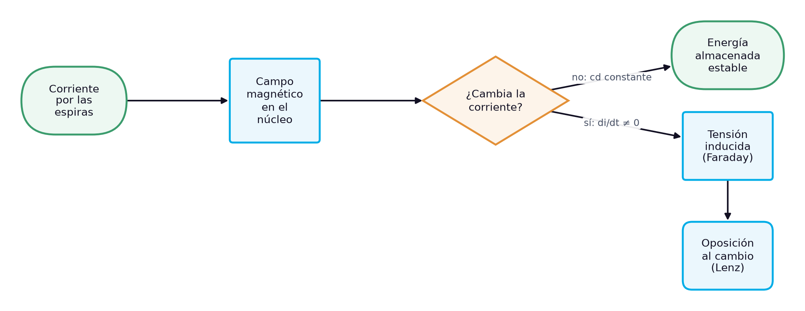
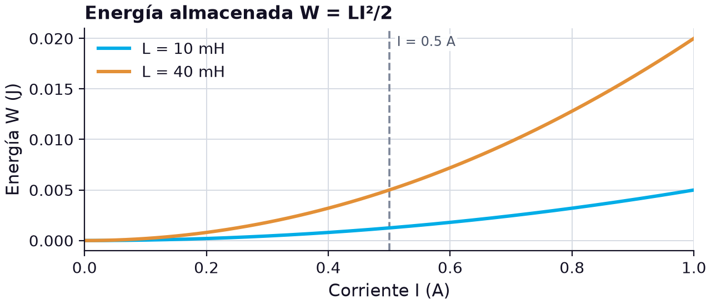
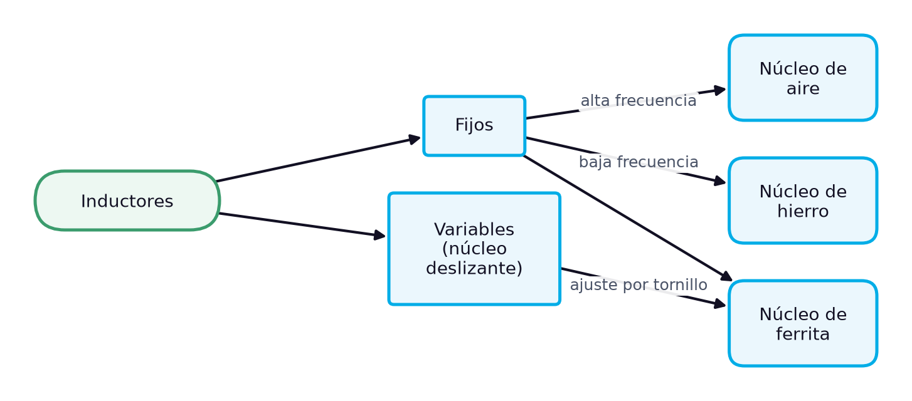

# La bobina: inductancia, inducción electromagnética, tipos de núcleo e identificación de inductores

> **Módulos:** IEL04 — Circuitos Eléctricos I
> **Duración:** 240 minutos (sesión teórico-práctica)
> **Nivel:** Pregrado
> **Semana:** 2 de 14 (corte evaluativo 1) · **Resultado de aprendizaje del módulo:** [[IEL04-RA1]] · **Trabajo independiente:** 5 h/semana

---

## 1. Metadatos de la Sesión

### 1.1 Continuidad curricular

La semana 1 presentó el condensador, el elemento que almacena energía en un campo eléctrico. Esta sesión estudia su contraparte, la bobina o inductor, que almacena energía en un campo magnético y se opone a los cambios de corriente, del mismo modo que el condensador se opone a los cambios de tensión. Se sigue deliberadamente el mismo recorrido —estructura, comportamiento interno, tipos, identificación, unidades y verificación en el laboratorio— para que la comparación entre ambos elementos sea explícita. Con los dos elementos identificados y verificados, la semana 3 los reúne para calcular y medir asociaciones en serie, en paralelo y mixtas, y circuitos LC.

1. Semana 1: Condensadores: estructura, comportamiento interno, identificación y tipos
2. **→ Presente sesión (semana 2):** Bobinas o inductores: estructura, comportamiento interno, identificación y tipos
3. Semana 3: Condensadores y bobinas en serie, en paralelo y mixto: cálculo y medición en circuitos L, C y LC

### 1.2 Prerrequisitos

- Explicar qué es un campo magnético alrededor de un conductor con corriente y su relación con el sentido de la corriente.
- Definir la capacitancia y calcular la energía almacenada en un condensador (semana 1).
- Leer el código de colores de un resistor y el código de tres dígitos de un condensador (semana 1).
- Convertir unidades con prefijos métricos (m, µ, n).
- Medir resistencia y continuidad con un multímetro digital.

---

## 2. Resultados de Aprendizaje

**RA IEL04-RA1:** Calcular un circuito capacitivo, inductivo y LC, sea en serie o paralelo.

**Criterios de evaluación:**
- **CE1** (cognitiva_conceptual): Identificar los tipos de capacitores e inductores.
- **CE2** (manipulacion_fisica): Realizar mediciones en un circuito capacitivo e inductivo.
- **CE3** (manipulacion_fisica): Realizar mediciones en un circuito LC.

**Unidades de competencia de la asignatura:**
- [[UC2]]: Coordinar actividades asociadas a sistemas eléctricos utilizando fuentes convencionales y no convencionales de energía.

Al finalizar la sesión, el estudiante estará en capacidad de lograr los siguientes resultados, que desarrollan el RA del módulo:

| # | Resultado de aprendizaje | Nivel (Taxonomía de Bloom) |
| --- | --- | --- |
| RA1 | **Explicar** cómo una bobina se opone a los cambios de corriente a partir de las leyes de Faraday y de Lenz. (CE1) | Comprender |
| RA2 | **Calcular** la inductancia de una bobina a partir de sus parámetros físicos, y la tensión inducida y la energía almacenada a partir de su corriente. (CE1) | Aplicar |
| RA3 | **Identificar** el tipo de núcleo, el valor nominal y la tolerancia de inductores comerciales a partir de su construcción y su marcado. (CE1) | Aplicar |
| RA4 | **Medir** la inductancia y la resistencia de devanado de bobinas y decidir si son aptas para las mediciones en circuitos inductivos y LC. (CE2, CE3) | Evaluar |

---

## 3. Índice Temporizado (240 minutos)

| Bloque | Contenido | Duración |
| --- | --- | --- |
| 1 | La bobina como elemento que se opone a los cambios de corriente y almacena energía magnética | 20 min |
| 2 | Espiras, núcleo, permeabilidad y L = N²µA/l | 35 min |
| 3 | Tensión inducida v = L di/dt, oposición al cambio, W = LI²/2 y modelo real con RW y CW | 35 min |
| 4 | Núcleo de aire, de hierro y de ferrita; toroidales, moldeados, de montaje superficial y variables | 35 min |
| 5 | Lectura del valor, la tolerancia y la corriente nominal en el cuerpo del inductor | 30 min |
| 6 | Henrio, mH y µH, conversiones y símbolos de núcleo de aire, hierro, ferrita y variable | 25 min |
| 7 | Decodificar el marcado, medir inductancia y resistencia de devanado, y detectar abiertos y cortos | 45 min |
| 8 | Síntesis, cierre actitudinal y bibliografía | 15 min |
|  | **Total** | **240 min** |

---

## 4. Desarrollo Teórico

### 4.1 Introducción Conceptual (Bloque 1)

La semana anterior mostró que el condensador guarda energía en un campo eléctrico y se opone a los cambios bruscos de tensión. La bobina completa el par de elementos reactivos: basta dar forma de espiral a un tramo de alambre para obtener un inductor, y los términos bobina e inductor se usan indistintamente [1]. Cuando circula corriente por las espiras, los campos magnéticos de cada vuelta se suman y forman un campo electromagnético intenso dentro y alrededor de la bobina, con un polo norte y un polo sur [1]. En ese campo queda almacenada energía, y de él surge la propiedad que define al inductor: la oposición a cualquier cambio de la corriente.

Esa oposición tiene consecuencias visibles en cualquier sistema eléctrico. La corriente por una bobina no puede cambiar instantáneamente: se necesita un tiempo, fijado por la inductancia y la resistencia del circuito, para que la corriente alcance su nuevo valor [2]. Por eso las bobinas se usan como filtros que suavizan la corriente de una fuente, como *chokes* que bloquean interferencias en líneas de potencia y, en su versión más grande, como devanados de motores, transformadores y reactores de las subestaciones. La misma propiedad explica un riesgo: al interrumpir de golpe la corriente de una bobina aparece una tensión inducida muy alta entre sus terminales [1].

*Figura 1. Cadena causal de la autoinducción: el cambio de corriente induce una tensión que se opone a ese cambio*

El diagrama resume el mecanismo que se desarrollará. La corriente crea un campo magnético; si la corriente cambia, el campo cambia y ese cambio induce una tensión entre los terminales de la bobina, cuyo sentido se opone precisamente al cambio que la produjo. Si la corriente es continua y constante, no hay tensión inducida: la bobina ideal se comporta como un cortocircuito y solo aparece la caída en la resistencia del alambre [1]. Esta dualidad con el condensador, que en cd constante se comporta como un circuito abierto, es la clave para entender los circuitos LC de la semana siguiente.

> **Advertencia de seguridad:** Al trabajar con inductores pueden desarrollarse tensiones inducidas altas cuando el campo magnético cambia con rapidez, por ejemplo al abrir el circuito o al cambiar la corriente abruptamente [1]. En el laboratorio no se desconecta una bobina con corriente tocando sus terminales, y se usan las puntas del instrumento con el circuito desenergizado.

La sesión recorre el tema con el mismo orden de la semana 1, para facilitar la comparación: estructura y definición de inductancia, comportamiento interno según las leyes de Faraday y de Lenz y energía almacenada, tipos de inductores según su núcleo, lectura del marcado y valores estándar, unidades y simbología, y un caso aplicado de verificación de las bobinas de un kit de prácticas con medidor LCR y ohmímetro.

### 4.2 Conceptos Clave

#### 4.2.1 Estructura de la bobina y definición de inductancia (Bloque 2)

Un inductor es un componente pasivo formado por un alambre enrollado alrededor de un **núcleo**, que exhibe la propiedad de inductancia [1]. El alambre suele ser de cobre esmaltado, de modo que las espiras quedan aisladas entre sí aunque se toquen, y el núcleo puede ser un material magnético (hierro, níquel, cobalto o sus aleaciones) o no magnético (aire, plástico, vidrio) [1]. Las formas más comunes son el solenoide, con el alambre enrollado sobre un cilindro, y el toroide, con el alambre enrollado sobre un anillo cerrado [2].

La **inductancia** $L$ es la medida de la capacidad de una bobina para establecer una tensión inducida cuando cambia su corriente, de forma que esa tensión actúe en sentido opuesto al cambio [1]. Su unidad es el henrio (H): una bobina tiene un henrio cuando una corriente que cambia a razón de un amperio por segundo induce un voltio entre sus terminales [1]. Al igual que la capacitancia, la inductancia es una propiedad de la construcción, no de la corriente que circula.

Cuatro parámetros físicos fijan su valor. La inductancia es directamente proporcional a la **permeabilidad** del núcleo, que indica la facilidad con que el material permite establecer un campo magnético; directamente proporcional al **cuadrado del número de vueltas**; directamente proporcional al **área de la sección transversal** del núcleo; e inversamente proporcional a su **longitud** [1]. Las cuatro dependencias se reúnen en una expresión que es una buena aproximación para solenoides y toroides [2]:

$$
L = \frac{N^{2}\,\mu\,A}{l}, \qquad \mu = \mu_r\,\mu_0, \qquad \mu_0 = 4\pi \times 10^{-7}\ \text{H/m}
$$

donde $L$ es la inductancia en henrios (H), $N$ el número de vueltas (adimensional), $\mu$ la permeabilidad del núcleo en henrios por metro (H/m), $\mu_r$ la permeabilidad relativa del material (adimensional), $\mu_0$ la permeabilidad del vacío en H/m, $A$ el área de la sección transversal del núcleo en metros cuadrados (m²) y $l$ la longitud media del núcleo en metros (m) [1], [2]. En los materiales ferromagnéticos, $\mu$ no es una constante: depende del nivel de magnetización, así que la ecuación da un valor aproximado [2].

La dependencia con $N^2$ es la más fuerte de todas: duplicar el número de vueltas cuadruplica la inductancia, porque cada vuelta adicional aumenta el campo y, a la vez, enlaza el campo de todas las demás. Los materiales ferromagnéticos tienen permeabilidades cientos o miles de veces mayores que la del vacío y ofrecen una trayectoria mucho mejor a las líneas de fuerza, mientras los no magnéticos tienen la misma permeabilidad que el vacío [1]. Por eso un núcleo magnético multiplica la inductancia por su permeabilidad relativa respecto a la misma bobina con núcleo de aire [2].

Dos ejemplos lo cuantifican. Una bobina de 100 vueltas con núcleo de aire, 4 mm de diámetro y 100 mm de longitud tiene $A = \pi (4 \times 10^{-3})^2/4 = 12.57 \times 10^{-6}\ \text{m}^2$ y $L = (100)^2 (4\pi \times 10^{-7})(12.57 \times 10^{-6}) / 0.1 \approx 1.58\ \mu\text{H}$; la misma bobina con un núcleo de hierro de $\mu_r = 2000$ tendría $L \approx 3.16\ \text{mH}$ [2]. Una bobina de 350 vueltas sobre un núcleo de 1.5 cm de longitud y 0.5 cm de diámetro, con $\mu = 0.25 \times 10^{-3}\ \text{H/m}$, tiene $A = 1.96 \times 10^{-5}\ \text{m}^2$ y $L = (350)^2 (0.25 \times 10^{-3})(1.96 \times 10^{-5}) / 0.015 \approx 40\ \text{mH}$ [1].

**Tabla 1.** Efecto del núcleo y del número de vueltas sobre la inductancia (ejemplos de [1] y [2])

| Bobina | N | Núcleo | μ (H/m) | A (m²) | l (m) | L |
| --- | --- | --- | --- | --- | --- | --- |
| Solenoide de aire | 100 | Aire (μr = 1) | 1.257 × 10⁻⁶ | 12.57 × 10⁻⁶ | 0.100 | 1.58 µH |
| Mismo solenoide | 100 | Hierro (μr = 2000) | 2.51 × 10⁻³ | 12.57 × 10⁻⁶ | 0.100 | 3.16 mH |
| Bobina con núcleo magnético | 350 | μ = 0.25 × 10⁻³ H/m | 0.25 × 10⁻³ | 1.96 × 10⁻⁵ | 0.015 | 40 mH |

La tabla muestra que el núcleo y el número de vueltas determinan el orden de magnitud: con aire y pocas vueltas se obtienen microhenrios, útiles en alta frecuencia; con núcleos magnéticos y muchas vueltas se alcanzan milihenrios o henrios, propios de filtros y aplicaciones de potencia. A diferencia del condensador, cuyo dieléctrico solo cambia la capacitancia en un factor fijo, el núcleo magnético hace que la inductancia dependa de la corriente cuando el material se acerca a la saturación.

> **Error frecuente:** Calcular el área con el diámetro en lugar del radio, o dejar las dimensiones en centímetros. En $A = \pi r^2$ hay que usar el radio, y todas las longitudes deben estar en metros antes de sustituir en la fórmula.

#### 4.2.2 Comportamiento interno: ley de Faraday, ley de Lenz y energía almacenada (Bloque 3)

El comportamiento de la bobina se apoya en dos leyes del electromagnetismo. La **ley de Faraday**, descubierta en 1831, establece que la tensión inducida en una bobina es directamente proporcional a la razón de cambio del campo magnético respecto a la bobina: al mover un imán a través de las espiras aparece una tensión, tanto mayor cuanto más rápido es el movimiento [1]. En forma de ecuación, la tensión inducida es el número de vueltas multiplicado por la razón de cambio del flujo magnético [1]. La **ley de Lenz** fija el sentido: un efecto inducido siempre se opone a la causa que lo produce [2].

En un inductor no hace falta un imán externo: la propia corriente crea el flujo. Cuando la corriente aumenta, el campo crece; cuando disminuye, el campo se reduce; y ese campo cambiante induce entre los terminales una tensión que se opone al cambio de corriente [1]. Esta **autoinducción** se expresa directamente en función de la corriente [1]:

$$
v_{ind} = L\,\frac{di}{dt}
$$

donde $v_{ind}$ es la tensión inducida en voltios (V), $L$ la inductancia en henrios (H) y $di/dt$ la razón de cambio de la corriente en amperios por segundo (A/s). Un inductor de 1 H cuya corriente cambia a razón de 2 A/s desarrolla 2 V entre sus terminales [1]. La ecuación es la dual de la del condensador, $i = C\,dv/dt$ [1]: en el condensador la corriente depende de cómo cambia la tensión; en la bobina, la tensión depende de cómo cambia la corriente. De ahí dos consecuencias prácticas. Con corriente continua constante, $di/dt = 0$ y no hay tensión inducida: la inductancia se comporta como un cortocircuito [1]. Y si la corriente se interrumpe muy rápido, $di/dt$ es enorme: una bobina de 10 mH que conduce 0.5 A y se abre en 10 µs genera del orden de $0.01 \times 0.5 / (10 \times 10^{-6}) = 500\ \text{V}$.

La energía que la corriente invierte en establecer el campo no se pierde: queda almacenada en el campo electromagnético y es proporcional a la inductancia y al cuadrado de la corriente [1]:

$$
W = \frac{1}{2} L I^{2}
$$

donde $W$ es la energía almacenada en julios (J), $L$ la inductancia en henrios (H) e $I$ la corriente en amperios (A) [1]. La bobina de 40 mH calculada en el concepto anterior, con 0.5 A, almacena $W = \tfrac{1}{2}(0.040)(0.5)^2 = 5\ \text{mJ}$; una de 10 mH con la misma corriente, 1.25 mJ. La gráfica compara ambas.

*Figura 2. Energía almacenada en función de la corriente para bobinas de 10 mH y 40 mH, con la corriente de 0.5 A marcada*

Como en el condensador, la dependencia es cuadrática: duplicar la corriente cuadruplica la energía. La diferencia está en qué magnitud manda: en el condensador, la tensión; en la bobina, la corriente. Esa energía es la que se libera en forma de chispa cuando se abre bruscamente un circuito inductivo.

Una bobina real no es solo inductancia. El alambre tiene resistencia por unidad de longitud y, con muchas vueltas, la **resistencia de devanado** $R_W$ puede ser significativa; aparece efectivamente en serie con la inductancia [1]. Su valor va desde unos pocos ohmios hasta unos cientos, y es mayor cuanto más largo y delgado es el alambre [2]. Además, las espiras vecinas forman pequeños condensadores cuya suma, la **capacitancia de devanado** $C_W$, actúa en paralelo con la bobina y se vuelve importante a altas frecuencias [1]. Para la mayoría de los análisis del curso basta el modelo de $L$ en serie con $R_W$, porque $R_W$ sí puede afectar la respuesta del circuito [2].

> **Hallazgo contraintuitivo:** A diferencia del condensador, que en la práctica puede tratarse como ideal, la bobina casi nunca es ideal: su resistencia de devanado se mide con un ohmímetro y debe incluirse en los cálculos cuando no es despreciable frente a las demás resistencias del circuito.

#### 4.2.3 Tipos de inductores según su núcleo y su construcción (Bloque 4)

Los inductores se fabrican en una gran diversidad de formas y tamaños, pero caen en dos categorías generales: **fijos** y **variables** [1]. Tanto unos como otros se clasifican además según el material del núcleo, y los tres tipos comunes son el núcleo de aire, el de hierro y el de ferrita, cada uno con su propio símbolo [1]. El diagrama organiza esa clasificación, que es la primera pregunta que se hace el técnico frente a una bobina desconocida: ¿de qué es el núcleo y se puede ajustar?

*Figura 3. Clasificación de los inductores según su ajuste y el material de su núcleo*

Las bobinas de **núcleo de aire** (o sobre un soporte no magnético) tienen la permeabilidad del vacío, así que con pocas vueltas dan valores pequeños, del orden de microhenrios; a cambio, su inductancia no depende de la corriente ni se satura, lo que las hace adecuadas para alta frecuencia. Los fabricantes las ofrecen con pocas espiras, de 1 a 32 vueltas, para aplicaciones de alta frecuencia [2]. Las de **núcleo de hierro** aprovechan una permeabilidad cientos o miles de veces mayor [1] para alcanzar milihenrios y henrios con tamaños razonables; son las de los filtros de fuentes de potencia y de las aplicaciones de baja frecuencia. Las de **núcleo de ferrita**, un material cerámico magnético, combinan una permeabilidad alta con pérdidas bajas a frecuencias elevadas, y son las más comunes en la electrónica actual.

Por su forma, se distinguen los solenoides, con el alambre enrollado sobre una barra, y las **bobinas toroidales**, enrolladas sobre un anillo cerrado que confina el campo magnético y reduce la interferencia con los componentes vecinos [2]. Los inductores fijos pequeños se encapsulan a menudo en un material aislante que protege el alambre fino; estos **inductores moldeados** tienen una apariencia similar a la de un resistor, incluso con bandas de colores, y es fácil confundirlos [1]. Los **inductores variables** suelen tener un ajuste de tornillo que desplaza un núcleo deslizante hacia dentro o hacia fuera de la bobina y cambia así la inductancia [1]; se llaman también de permeabilidad sintonizada [2].

A las bobinas que se usan para bloquear cambios de corriente se les llama a menudo **choke**, por su capacidad de resistir esos cambios [2]. La tabla reúne los tipos que el técnico encontrará con más frecuencia, con los intervalos típicos de valores y las aplicaciones que reporta [2]; sirve como «factor de reconocimiento» para asociar la forma de una bobina con su orden de magnitud.

**Tabla 2.** Tipos de inductores, valores típicos y aplicaciones [2]

| Tipo | Valores típicos | Aplicación típica |
| --- | --- | --- |
| Bobina de núcleo abierto | 3 mH a 40 mH | filtros pasa bajos, redes de distribución de frecuencias |
| Bobina toroidal | 1 mH a 30 mH | choke en líneas de ca, reducción de transitorios y EMI |
| Choke de modo común | 0.6 mH a 50 mH | filtros de línea de ca, fuentes conmutadas, cargadores |
| Choke de RF | 10 µH a 50 µH | radio, televisión, comunicaciones |
| Bobina ajustable de RF | 1 µH a 100 µH | osciladores y circuitos de RF |
| Inductor de montaje superficial | 0.01 µH a 100 µH | circuitos miniaturizados en PCB multicapa |

La tabla deja ver dos familias. Las bobinas de milihenrios, con núcleo magnético y a menudo toroidales, trabajan en los circuitos de potencia y de línea, donde manejan corrientes apreciables y filtran interferencias. Las de microhenrios, de aire, ferrita o montaje superficial, trabajan en circuitos de radiofrecuencia y en electrónica miniaturizada. En el laboratorio de circuitos, las bobinas de las prácticas suelen ser de la primera familia, de algunos milihenrios, porque con ellas los efectos inductivos se miden con facilidad a las frecuencias de un generador de funciones.

> **Error frecuente:** Tomar un inductor moldeado por un resistor. Si la lectura de sus bandas da un valor de resistencia que no coincide con lo que mide el ohmímetro (normalmente unos pocos ohmios), se trata de una bobina: el código de colores expresa entonces su inductancia.

#### 4.2.4 Identificación: marcado, valores estándar y tolerancia de inductores (Bloque 5)

Identificar una bobina exige los mismos tres datos que un condensador —valor nominal, tolerancia y un límite de trabajo—, pero el límite no es una tensión sino una **corriente nominal**: la corriente máxima que el devanado soporta sin sobrecalentarse y, en los núcleos magnéticos, sin que el núcleo se sature y la inductancia caiga. Las bobinas grandes llevan el valor impreso completo, por ejemplo «10 mH 0.5 A»; las pequeñas usan códigos, y la hoja de datos del fabricante completa lo que no cabe en el cuerpo: la resistencia de devanado en cd y la corriente nominal.

El punto de partida de la identificación son los **valores estándar**. Los inductores emplean los mismos multiplicadores numéricos que los resistores y los condensadores: los de mayor demanda usan la serie de los resistores más comunes, con tolerancias del 5 %, 10 % y 20 %, y también se encuentran los multiplicadores de la serie de 5 % y 10 % [2]. En la práctica aparecen valores como 0.10, 0.12, 0.15, 0.18, 0.22, 0.27, 0.33, 0.39, 0.47, 0.56, 0.68 y 0.82, multiplicados por la potencia de diez que corresponda: 1.0, 1.2, 1.5, 1.8, 2.2, 2.7… [2]. Saber que un valor medido de 4.62 mH corresponde a una bobina de 4.7 mH, y no a una de 4.5 mH, que no existe en la serie, es parte de la identificación.

Los inductores moldeados usan un **código de colores** con la misma estructura que el de los resistores: la primera banda es el primer dígito, la segunda el segundo dígito, la tercera el multiplicador (el número de ceros) y la cuarta la tolerancia [1]. La diferencia es la unidad: el resultado de un inductor se expresa en microhenrios. Los inductores de montaje superficial y muchos radiales usan un **código de tres dígitos**, también en microhenrios: los dos primeros son las cifras significativas y el tercero el número de ceros. Cuando el valor tiene decimales, la letra R marca la posición del punto: 4R7 significa 4.7 µH. El valor nominal se obtiene así:

$$
L_{n} = (10\,a + b) \times 10^{\,m}\ \mu\text{H}
$$

donde $L_n$ es la inductancia nominal en microhenrios (µH), $a$ y $b$ son el primer y el segundo dígito del código (adimensionales) y $m$ es el tercer dígito o la banda multiplicadora (adimensional). Para **101**, $L_n = 10 \times 10^1 = 100\ \mu\text{H}$; para **472**, $L_n = 47 \times 10^2 = 4700\ \mu\text{H} = 4.7\ \text{mH}$; para **103**, $L_n = 10\ \text{mH}$. Obsérvese que el mismo código 103 significa 10 nF en un condensador y 10 mH en una bobina: la unidad la decide el tipo de componente, no el número.

La **tolerancia** se indica con la cuarta banda de color (plata ±10 %, oro ±5 %, como en los resistores [1]) o con una letra tras el código, con el mismo significado que en los condensadores: J (±5 %), K (±10 %) y M (±20 %). El intervalo admisible se calcula igual que para el condensador:

$$
L_{\min} = L_{n}\,(1 - t), \qquad L_{\max} = L_{n}\,(1 + t)
$$

donde $L_{\min}$ y $L_{\max}$ son los límites de la inductancia admisible, $L_n$ la inductancia nominal, ambas en la misma unidad (µH, mH o H), y $t$ la tolerancia como fracción (adimensional). Una bobina **472K** tiene $L_n = 4.7\ \text{mH}$ y $t = 0.10$: su valor real debe estar entre 4.23 mH y 5.17 mH. La tabla reúne ejemplos de lectura.

**Tabla 3.** Lectura de marcados frecuentes de inductores

| Marcado | Valor nominal | Tolerancia | Observación |
| --- | --- | --- | --- |
| 4R7 | 4.7 µH | no indicada | R marca el punto decimal |
| 101 | 100 µH | no indicada | montaje superficial o radial |
| 102J | 1000 µH = 1 mH | ±5 % | — |
| 472K | 4700 µH = 4.7 mH | ±10 % | — |
| 103 | 10 000 µH = 10 mH | no indicada | mismo código que 10 nF en un condensador |
| marrón-negro-rojo-plata | 1000 µH = 1 mH | ±10 % | inductor moldeado con bandas |
| 10 mH 0.5 A | 10 mH | según fabricante | corriente nominal impresa |

> **Nota pedagógica:** Un buen hábito es comprobar que el valor leído pertenece a la serie estándar. Si la lectura del código da un valor que no existe en la serie (por ejemplo, 4.5 mH), lo más probable es que se haya leído mal una banda o un dígito.

#### 4.2.5 Unidades, múltiplos, submúltiplos, simbología y nomenclatura de la inductancia (Bloque 6)

La unidad de inductancia es el **henrio** (H), nombrado en honor de Joseph Henry: una bobina tiene un henrio cuando una corriente que cambia a razón de un amperio por segundo induce un voltio entre sus terminales [1], [2]. El henrio es una unidad grande, y en la práctica las unidades más comunes son el milihenrio (mH) y el microhenrio (µH) [1]. A diferencia del faradio, que casi nunca aparece sin prefijo, el henrio sí se usa directamente en bobinas de filtro, reactores y devanados de máquinas eléctricas, donde son habituales valores de 1 H a 10 H.

Las conversiones siguen la notación de ingeniería, con exponentes múltiplos de tres y un prefijo métrico asociado a cada uno [1]: $1\ \text{mH} = 10^{-3}\ \text{H}$, $1\ \mu\text{H} = 10^{-6}\ \text{H}$ y, en circuitos de muy alta frecuencia, $1\ \text{nH} = 10^{-9}\ \text{H}$. Entre unidades consecutivas el factor es 1000. Así, 0.0047 H equivalen a 4.7 mH y a 4700 µH; 220 µH equivalen a 0.22 mH. La conversión importa en el laboratorio porque el medidor LCR puede mostrar mH mientras el código de la bobina está en µH.

**Tabla 4.** Unidades de inductancia y conversiones

| Unidad | Símbolo | Valor en H | Equivalencia práctica | Uso típico |
| --- | --- | --- | --- | --- |
| henrio | H | 1 | 1000 mH | filtros de potencia, reactores |
| milihenrio | mH | 10⁻³ | 1000 µH | filtros de línea, bobinas de laboratorio |
| microhenrio | µH | 10⁻⁶ | 1000 nH | RF, montaje superficial |
| nanohenrio | nH | 10⁻⁹ | — | pistas y bobinas de muy alta frecuencia |

La **simbología** del inductor representa las espiras del devanado: una línea ondulada o una sucesión de semicírculos entre dos terminales [1]. El núcleo se indica con líneas paralelas al lado de las espiras: sin líneas, núcleo de aire; con líneas continuas, núcleo de hierro; con líneas discontinuas, núcleo de ferrita [1], [2]. El inductor variable se distingue por una flecha que atraviesa el símbolo o por una flecha junto al núcleo, que indica el núcleo deslizante de permeabilidad sintonizada [1], [2]. Como la función principal del inductor es introducir inductancia en una red, el símbolo no incluye la resistencia ni la capacitancia de devanado: cuando importan, se dibujan aparte en el circuito equivalente [2].

**Tabla 5.** Símbolos y nomenclatura de los inductores

| Elemento | Representación | Significado |
| --- | --- | --- |
| Inductor de núcleo de aire | espiras sin líneas adicionales | núcleo no magnético |
| Inductor de núcleo de hierro | espiras con dos líneas continuas | núcleo ferromagnético laminado |
| Inductor de núcleo de ferrita | espiras con líneas discontinuas | núcleo cerámico magnético |
| Inductor variable | símbolo con flecha | núcleo deslizante ajustable |
| Designador | L1, L2, L3… | referencia del componente en el plano |
| RW o DCR | resistencia de devanado | se dibuja en serie con L en el equivalente |

En los planos, cada bobina se identifica con la letra **L** y un número correlativo, del mismo modo que los condensadores usan la C. En las hojas de datos conviene reconocer tres abreviaturas: DCR (resistencia en cd del devanado, la $R_W$ del modelo), la corriente nominal y la frecuencia de autorresonancia, que es la frecuencia a la que la capacitancia de devanado resuena con la inductancia y la bobina deja de comportarse como tal.

La comparación con la semana anterior es directa. El condensador se mide en faradios con submúltiplos pequeños (pF, nF, µF) y almacena energía con la tensión; la bobina se mide en henrios con submúltiplos moderados (µH, mH) y almacena energía con la corriente. Tener presentes los órdenes de magnitud típicos de cada uno evita errores de lectura y de cálculo: una bobina de laboratorio de «10» casi seguro tiene 10 mH, no 10 H ni 10 µH.

> **Error frecuente:** Escribir «mH» cuando se quiere decir «µH», o al revés. Los textos convertidos desde PDF suelen perder la letra griega µ y mostrarla como «m»; ante la duda, el orden de magnitud y el tipo de bobina deciden cuál es la unidad correcta.

---

## 5. Caso de Estudio Aplicado: Identificación y verificación de las bobinas de un kit de laboratorio (Bloque 7)

### 5.1 Descripción del problema

Con los condensadores del kit ya verificados en la semana 1, el técnico de laboratorio debe preparar las bobinas que se usarán en las prácticas de circuitos inductivos y LC. El kit tiene cuatro inductores. Las causas principales de falla de un inductor son los cortos entre espiras y los circuitos abiertos en el devanado, provocados por corrientes excesivas, sobrecalentamiento o el paso del tiempo [2]. La tarea es identificar cada bobina por su marcado, medir su inductancia y su resistencia de devanado, y decidir si es apta.

Los componentes son: L1, un inductor radial marcado **102J**; L2, un inductor moldeado marcado **472K**; L3, una bobina con núcleo de ferrita marcada **103K**, cuya hoja de datos indica una resistencia de devanado de 25 Ω; y L4, una bobina toroidal reutilizada marcada **33 mH ±20 %**, con una resistencia de devanado de 18 Ω según su hoja de datos. Las lecturas que se usan más abajo son valores de ejemplo para ilustrar el procedimiento.

### 5.2 Procedimiento de medición

- Verificar que la bobina está desconectada de cualquier circuito energizado.
- Identificar tipo de núcleo, valor nominal y tolerancia a partir del marcado y convertir a mH.
- Medir la resistencia de devanado con el ohmímetro: una lectura infinita indica devanado abierto.
- Comprobar el aislamiento entre el devanado y el núcleo metálico: una lectura de cero ohmios indica un corto.
- Medir la inductancia con el medidor LCR y compararla con el intervalo de tolerancia.

El circuito abierto se detecta con facilidad con un ohmímetro, que indica una resistencia infinita [2]. El cortocircuito entre espiras es más difícil de detectar solo con el ohmímetro, porque la resistencia de una bobina en buen estado ya es pequeña y el corto de unas pocas espiras apenas la modifica; si se conoce la resistencia típica de la bobina, se puede comparar con la medida [2]. El corto entre el devanado y el núcleo se revisa colocando una punta en un terminal y la otra sobre el núcleo: como todo el alambre tiene cubierta aislante, una lectura de cero ohmios revela el corto [2]. La inductancia se verifica con un medidor LCR [2]. La desviación se calcula como en la semana 1:

$$
e_{\%} = \frac{L_{m} - L_{n}}{L_{n}} \times 100
$$

donde $e_{\%}$ es la desviación relativa en porcentaje (%), $L_m$ la inductancia medida y $L_n$ la inductancia nominal, ambas en la misma unidad (mH). La bobina se acepta si $|e_{\%}|$ no supera la tolerancia, su devanado tiene continuidad y está aislado del núcleo.

### 5.3 Cálculos y resultados

L1: el código 102 da $L_n = 10 \times 10^2\ \mu\text{H} = 1\ \text{mH}$, con J (±5 %); el intervalo es de 0.95 mH a 1.05 mH, y la lectura de 1.03 mH da $e_{\%} = +3.0\ \%$. L2: 472 son 4.7 mH, con K (±10 %); el intervalo va de 4.23 mH a 5.17 mH, y 4.62 mH da $e_{\%} = -1.7\ \%$. L3: 103 son 10 mH ±10 %; la lectura de 10.4 mH da $e_{\%} = +4.0\ \%$, y la resistencia de 24.6 Ω coincide con los 25 Ω de la hoja de datos. L4: el intervalo de ±20 % va de 26.4 mH a 39.6 mH, pero la lectura es de 21.5 mH, con $e_{\%} = -34.8\ \%$; además, su resistencia de devanado mide 12.1 Ω frente a los 18 Ω esperados.

**Tabla 6.** Identificación y verificación de las bobinas del kit (lecturas de ejemplo)

| Ref. | Marcado | Ln | Tolerancia | Intervalo admisible | Lm | e (%) | RW medida | Aislamiento al núcleo | Decisión |
| --- | --- | --- | --- | --- | --- | --- | --- | --- | --- |
| L1 | 102J | 1 mH | ±5 % | 0.95 a 1.05 mH | 1.03 mH | +3.0 | 3.2 Ω | no aplica | Acepta |
| L2 | 472K | 4.7 mH | ±10 % | 4.23 a 5.17 mH | 4.62 mH | −1.7 | 9.8 Ω | no aplica | Acepta |
| L3 | 103K | 10 mH | ±10 % | 9.0 a 11.0 mH | 10.4 mH | +4.0 | 24.6 Ω | correcto | Acepta |
| L4 | 33 mH ±20 % | 33 mH | ±20 % | 26.4 a 39.6 mH | 21.5 mH | −34.8 | 12.1 Ω | correcto | Rechaza |

L4 ilustra el caso difícil que describe la fuente: su resistencia bajó, pero no a cero, así que el ohmímetro por sí solo no habría sido concluyente. La combinación de las dos mediciones sí lo es. Como la inductancia depende del cuadrado del número de vueltas, una caída de la inductancia al 65 % de su valor equivale a perder cerca del 19 % de las espiras efectivas ($\sqrt{0.65} \approx 0.81$); la resistencia, que depende de la longitud de alambre, también cayó. Ambos indicadores apuntan a espiras en cortocircuito, probablemente por un sobrecalentamiento previo.

### 5.4 Conclusiones para la práctica

La verificación de una bobina necesita dos instrumentos, no uno: el medidor LCR para la inductancia y el ohmímetro para la continuidad, la resistencia de devanado y el aislamiento al núcleo. La resistencia de devanado medida se registra junto con la inductancia, porque en los circuitos inductivos y LC de las próximas semanas esa resistencia forma parte del modelo real $L$ en serie con $R_W$ y explica parte de las diferencias entre el cálculo y la medición. Con L1, L2 y L3 aceptadas, y los condensadores verificados la semana anterior, el kit queda listo para las asociaciones en serie, en paralelo y mixtas.

> **Nota pedagógica:** Conviene medir la resistencia de devanado de cada bobina nueva y anotarla en su bolsa o en el inventario: ese dato de referencia es el que permitirá detectar más adelante un corto entre espiras que el ohmímetro, por sí solo, no revela.

---

## 6. Síntesis (Bloque 8)

La bobina es el elemento dual del condensador. Donde el condensador acumula carga y se opone a los cambios de tensión, la bobina establece un campo magnético y se opone a los cambios de corriente, según las leyes de Faraday y de Lenz: $v = L\,di/dt$. Su inductancia, $L = N^2 \mu A / l$, la fijan la construcción y sobre todo el número de vueltas y el núcleo, y la energía que almacena, $W = \tfrac{1}{2}LI^2$, depende del cuadrado de la corriente. Esa misma física explica los tipos comerciales —aire para alta frecuencia, hierro y ferrita para alcanzar milihenrios— y el riesgo de las sobretensiones al abrir un circuito inductivo. El caso del kit mostró la diferencia práctica más importante con el condensador: **una bobina real casi nunca es ideal**, y su verificación exige medir tanto la inductancia como la resistencia de devanado, además de la continuidad y el aislamiento al núcleo. Un corto entre espiras reduce a la vez la inductancia y la resistencia, y solo la comparación con los valores de referencia lo revela. Con condensadores y bobinas identificados, medidos y registrados, queda la base del resultado de aprendizaje: calcular y medir asociaciones en serie, en paralelo y mixtas, y circuitos LC, tema de la semana 3.

### Componente Actitudinal

> *Registrar con cuidado la inductancia y la resistencia de devanado de cada bobina, y no solo si funciona, es un trabajo que beneficia a todo el equipo: esos datos permitirán a los compañeros de los próximos semestres detectar a tiempo una bobina deteriorada.*

---

## 7. Bibliografía (Formato IEEE)

[1] T. L. Floyd, Principios de circuitos eléctricos, 8.ª ed. México: Pearson Educación, 2007.

[2] R. L. Boylestad, Introducción al análisis de circuitos, 10.ª ed. México: Pearson Educación, 2004.
