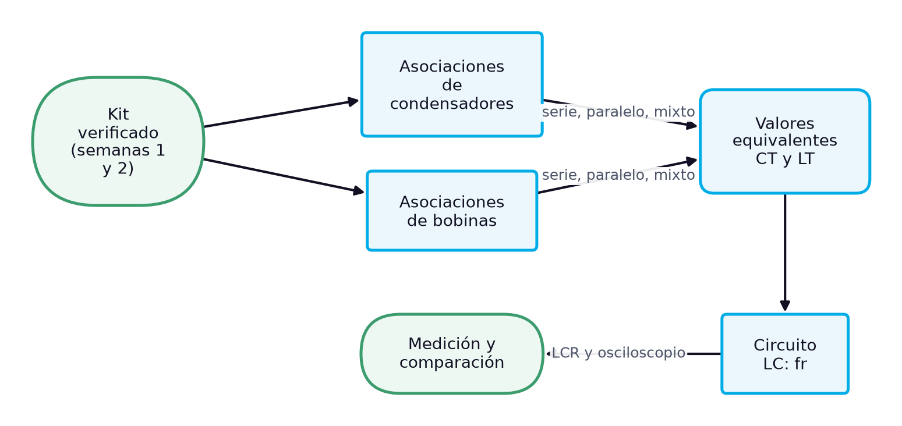
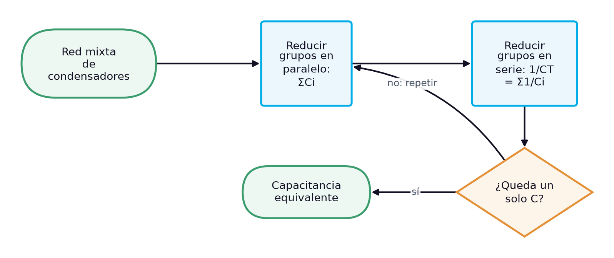
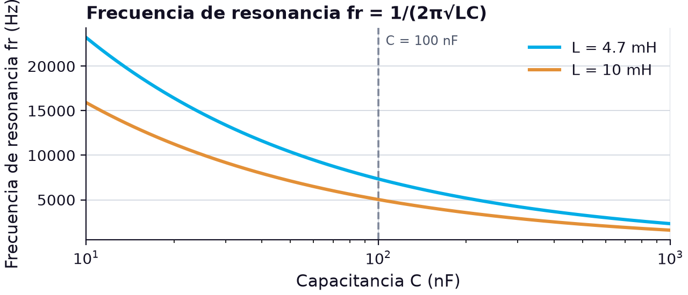

# Asociaciones de condensadores y bobinas en serie, en paralelo y mixtas: cálculo y medición en circuitos L, C y LC

> **Módulos:** IEL04 — Circuitos Eléctricos I
> **Duración:** 240 minutos (sesión teórico-práctica)
> **Nivel:** Pregrado
> **Semana:** 3 de 14 (corte evaluativo 1) · **Resultado de aprendizaje del módulo:** [[IEL04-RA1]] · **Trabajo independiente:** 5 h/semana

---

## 1. Metadatos de la Sesión

### 1.1 Continuidad curricular

Las semanas 1 y 2 presentaron por separado el condensador y la bobina: su estructura, su comportamiento, sus tipos y la forma de identificarlos y verificarlos con el medidor LCR y el ohmímetro. Esta sesión cierra el primer resultado de aprendizaje al combinarlos: calcula la capacitancia y la inductancia equivalentes de asociaciones en serie, en paralelo y mixtas, reparte tensiones en condensadores en serie y une ambos elementos en el circuito LC, cuyo parámetro característico es la frecuencia de resonancia. Con estas herramientas se llega al examen de la semana 5, y la semana 4 empieza el estudio de los circuitos RC, donde el condensador se combina con la resistencia.

1. Semana 2: Bobinas o inductores: estructura, comportamiento interno, identificación y tipos
2. **→ Presente sesión (semana 3):** Condensadores y bobinas en serie, en paralelo y mixto: cálculo y medición en circuitos L, C y LC
3. Semana 4: Circuito RC en serie: análisis y Ley de Voltajes de Kirchhoff

### 1.2 Prerrequisitos

- Calcular resistencias equivalentes en serie, en paralelo y mixtas.
- Identificar el valor nominal y la tolerancia de condensadores y bobinas a partir de su marcado (semanas 1 y 2).
- Aplicar Q = CV y la relación v = L di/dt (semanas 1 y 2).
- Convertir entre pF, nF, µF y entre µH, mH y H.
- Medir capacitancia e inductancia con un medidor LCR (semanas 1 y 2).

---

## 2. Resultados de Aprendizaje

**RA IEL04-RA1:** Calcular un circuito capacitivo, inductivo y LC, sea en serie o paralelo.

**Criterios de evaluación:**
- **CE1** (cognitiva_conceptual): Identificar los tipos de capacitores e inductores.
- **CE2** (manipulacion_fisica): Realizar mediciones en un circuito capacitivo e inductivo.
- **CE3** (manipulacion_fisica): Realizar mediciones en un circuito LC.

**Unidades de competencia de la asignatura:**
- [[UC2]]: Coordinar actividades asociadas a sistemas eléctricos utilizando fuentes convencionales y no convencionales de energía.

Al finalizar la sesión, el estudiante estará en capacidad de lograr los siguientes resultados, que desarrollan el RA del módulo:

| # | Resultado de aprendizaje | Nivel (Taxonomía de Bloom) |
| --- | --- | --- |
| RA1 | **Calcular** la capacitancia equivalente y la tensión de cada condensador en asociaciones en serie, en paralelo y mixtas. (CE1) | Aplicar |
| RA2 | **Calcular** la inductancia equivalente de bobinas en serie, en paralelo y mixtas, y comparar sus reglas con las de condensadores y resistores. (CE1) | Analizar |
| RA3 | **Medir** la capacitancia y la inductancia equivalentes de asociaciones montadas en el protoboard y contrastarlas con el cálculo. (CE2) | Evaluar |
| RA4 | **Calcular** y medir la frecuencia de resonancia de un circuito LC a partir de los valores de sus componentes. (CE3) | Evaluar |

---

## 3. Índice Temporizado (240 minutos)

| Bloque | Contenido | Duración |
| --- | --- | --- |
| 1 | Obtener valores no estándar, repartir tensiones y formar circuitos LC | 15 min |
| 2 | 1/CT = Σ 1/Ci, casos de dos y de n iguales, reparto de tensión Vx = (CT/Cx)VT | 35 min |
| 3 | CT = Σ Ci, tensión común y reducción paso a paso de redes mixtas | 30 min |
| 4 | LT = Σ Li, 1/LT = Σ 1/Li, analogía con resistores y condición de no acoplamiento | 35 min |
| 5 | Intercambio de energía entre L y C y fr = 1/(2π√LC) | 35 min |
| 6 | Tabla comparativa de reglas, magnitudes, unidades y símbolos de L, C y R | 25 min |
| 7 | Calcular con valores nominales y medidos, medir con LCR y osciloscopio, comparar | 50 min |
| 8 | Síntesis, cierre actitudinal y bibliografía | 15 min |
|  | **Total** | **240 min** |

---

## 4. Desarrollo Teórico

### 4.1 Introducción Conceptual (Bloque 1)

Rara vez un circuito real usa un solo condensador o una sola bobina con exactamente el valor que el cálculo pide. Los componentes se fabrican en series de valores estándar, y el valor necesario casi nunca coincide con uno de ellos; además, un condensador debe soportar la tensión de trabajo del circuito y una bobina su corriente. La respuesta práctica es **asociar** componentes: conectarlos en serie, en paralelo o en combinaciones mixtas para obtener el valor equivalente buscado, repartir una tensión alta entre varios condensadores o aumentar la capacidad de almacenamiento de un banco. Los bancos de condensadores para corrección del factor de potencia de una instalación, por ejemplo, no son más que muchos condensadores asociados en paralelo.

Las reglas de asociación no son arbitrarias: salen de la física de cada elemento. En paralelo, los condensadores comparten la tensión y sus áreas de placa se suman, por lo que la capacitancia total es la suma de las capacitancias individuales [1]. En serie, todos llevan la misma carga y la tensión se reparte, así que la capacitancia total es menor que la del condensador más pequeño [1]. Las bobinas se comportan al revés: se suman en serie, como los resistores, y en paralelo su inductancia total es menor que la más pequeña [1]. Entender por qué, y no solo memorizar las fórmulas, evita el error más frecuente del tema: aplicar a los condensadores las reglas de los resistores.

*Figura 1. Ruta de la sesión: de los componentes verificados al circuito LC medido*

El diagrama muestra la ruta de la sesión. Parte de los condensadores y bobinas que se identificaron y verificaron en las dos semanas anteriores, desarrolla las reglas de asociación para cada tipo de elemento, las reúne en una comparación con los resistores y llega al circuito LC, donde un condensador y una bobina intercambian energía a una frecuencia característica que depende solo de sus valores. Cierra con un caso en el laboratorio: montar asociaciones con los componentes del kit, predecir su valor equivalente, medirlo con el medidor LCR y medir la frecuencia de resonancia de un circuito LC con el osciloscopio.

> **Nota pedagógica:** Esta sesión completa el RA1 antes del examen de la semana 5. Conviene llegar a ella con los valores medidos de los componentes del kit a mano: el caso compara lo que predicen los valores nominales con lo que predicen los valores medidos.

### 4.2 Conceptos Clave

#### 4.2.1 Condensadores en serie y divisor capacitivo de tensión (Bloque 2)

Cuando se conectan condensadores en serie y se aplica una tensión al conjunto, la corriente de carga que sale de la fuente es la misma en todo el camino: no hay nodos donde pueda dividirse. En consecuencia, todos los condensadores acumulan **la misma carga** $Q$, igual a la carga total del conjunto [1]. Lo que se reparte es la tensión: la suma de las tensiones de cada condensador es igual a la tensión total aplicada. Con esas dos ideas se deduce la regla de asociación. Como $V = Q/C$ para cada condensador y $V_T = V_1 + V_2 + \dots + V_n$, se tiene $Q/C_T = Q/C_1 + Q/C_2 + \dots + Q/C_n$, y al dividir entre la carga común:

$$
\frac{1}{C_T} = \frac{1}{C_1} + \frac{1}{C_2} + \dots + \frac{1}{C_n}
$$

donde $C_T$ es la capacitancia total en faradios (F) y $C_1, C_2, \dots, C_n$ las capacitancias individuales en faradios (F), todas expresadas en la misma unidad antes de operar. El resultado tiene una consecuencia directa: **la capacitancia total en serie es siempre menor que la del condensador más pequeño** [1]. La razón física es que conectar condensadores en serie equivale a aumentar la separación efectiva entre las placas extremas, y la capacitancia es inversamente proporcional a esa separación.

Dos casos particulares simplifican el cálculo. Para **dos condensadores** en serie, la capacitancia total es el producto dividido entre la suma, $C_T = C_1 C_2 / (C_1 + C_2)$ [1]; con 100 pF y 330 pF resulta $C_T = (100)(330)/430 \approx 76.7\ \text{pF}$. Para **n condensadores iguales** de valor $C$, la capacitancia total es $C_T = C/n$ [1]: cuatro condensadores de 0.022 µF en serie dan $0.022/4 = 0.0055\ \mu\text{F}$, es decir, 5.5 nF.

La asociación en serie actúa además como un **divisor de tensión**. Como todos tienen la misma carga, $V_x C_x = V_T C_T$ para cualquier condensador $x$ de la cadena, y al despejar se obtiene la tensión de cada uno [1]:

$$
V_x = \left( \frac{C_T}{C_x} \right) V_T
$$

donde $V_x$ es la tensión en el condensador $x$ en voltios (V), $C_T$ la capacitancia total de la serie, $C_x$ la capacitancia de ese condensador (ambas en la misma unidad) y $V_T$ la tensión total aplicada en voltios (V). La tensión en cada condensador es inversamente proporcional a su capacitancia: **el condensador de mayor valor tiene la menor tensión, y el de menor valor, la mayor** [1]. Es exactamente lo contrario de un divisor resistivo, donde la resistencia mayor toma la mayor tensión. Con 0.1 µF, 0.47 µF y 0.22 µF en serie y 25 V aplicados, $1/C_T = 10 + 2.13 + 4.55 = 16.67\ \mu\text{F}^{-1}$, así que $C_T \approx 0.06\ \mu\text{F}$ y las tensiones son las de la tabla [1].

**Tabla 1.** Divisor capacitivo de tres condensadores en serie con 25 V aplicados (ejemplo de [1])

| Condensador | C (µF) | CT/Cx | Vx (V) |
| --- | --- | --- | --- |
| C1 | 0.10 | 0.600 | 15.0 |
| C2 | 0.47 | 0.128 | 3.19 |
| C3 | 0.22 | 0.273 | 6.82 |
| Total | CT = 0.06 | — | 25.0 |

La tabla confirma que las tres tensiones suman 25 V y que el condensador más pequeño, C1, soporta el 60 % de la tensión total. Esta es la trampa de diseño del divisor capacitivo: al poner en serie condensadores para soportar una tensión alta, el de menor valor se lleva la mayor parte y puede superar su tensión nominal aunque la suma de las tensiones nominales parezca suficiente. Además, las fugas de cada condensador, distintas entre sí, alteran ese reparto en cd a largo plazo, razón por la cual en los bancos de alta tensión se colocan resistencias de ecualización en paralelo.

> **Error frecuente:** Sumar directamente las capacitancias en serie, como si fueran resistencias. Una comprobación inmediata evita el error: el resultado de una serie debe ser menor que el menor de los condensadores; si sale mayor, se aplicó la regla equivocada.

#### 4.2.2 Condensadores en paralelo y asociaciones mixtas (Bloque 3)

En una conexión en **paralelo**, todos los condensadores quedan entre los mismos dos nodos y, por tanto, tienen la misma tensión. La corriente de carga que entrega la fuente se divide entre las ramas, cada condensador recibe su propia corriente de carga y puede guardar una carga distinta; por la ley de corrientes de Kirchhoff, la suma de esas corrientes es la corriente total, y la suma de las cargas guardadas es la carga total: $Q_T = Q_1 + Q_2 + \dots + Q_n$ [1]. Al sustituir $Q = CV$ en cada término y cancelar la tensión común se obtiene la regla [1]:

$$
C_T = C_1 + C_2 + C_3 + \dots + C_n
$$

donde $C_T$ es la capacitancia total en faradios (F) y $C_1, \dots, C_n$ las capacitancias de cada rama en faradios (F). La capacitancia total en paralelo es la suma de todas las capacitancias, porque conectar condensadores en paralelo equivale a aumentar el área total de placas [1]. El cálculo es análogo al de la resistencia total en serie [1]. Si los $n$ condensadores son iguales, $C_T = nC$: seis condensadores de 0.01 µF en paralelo dan 0.06 µF, y si se necesitan 0.05 µF y solo se dispone de condensadores de 0.01 µF, basta conectar cinco en paralelo [1].

La conexión en paralelo tiene dos ventajas prácticas. Permite construir valores grandes con componentes pequeños, que es el principio de los bancos de condensadores. Y no cambia la tensión de trabajo: el conjunto soporta la tensión nominal del condensador de menor tensión nominal, que es el que limita el banco. También conviene saber que las tolerancias no mejoran al asociar: si todos los condensadores están en el extremo alto de su tolerancia, el total también lo estará.

Una **asociación mixta** combina grupos en serie y grupos en paralelo. No hay una fórmula única: se reduce paso a paso, identificando primero los grupos que están claramente en serie o en paralelo, sustituyendo cada uno por su equivalente y repitiendo hasta llegar a un único condensador. El procedimiento es el mismo que para resistencias, con la diferencia de que las reglas de serie y paralelo están invertidas. El diagrama resume el algoritmo.

*Figura 2. Procedimiento de reducción de una asociación mixta de condensadores*

Un ejemplo aplica el diagrama. Se conectan en paralelo $C_1 = 0.1\ \mu\text{F}$ y $C_2 = 0.22\ \mu\text{F}$, y ese grupo queda en serie con $C_3 = 0.47\ \mu\text{F}$; el conjunto se alimenta con 12 V. Primer paso, el grupo en paralelo: $C_{12} = 0.1 + 0.22 = 0.32\ \mu\text{F}$. Segundo paso, la serie de $C_{12}$ con $C_3$: $C_T = (0.32)(0.47)/(0.32 + 0.47) \approx 0.190\ \mu\text{F}$. Para las tensiones se usa el divisor capacitivo sobre la serie: $V_{12} = (0.190/0.32)(12) \approx 7.14\ \text{V}$ y $V_3 = (0.190/0.47)(12) \approx 4.86\ \text{V}$, que suman 12 V. Por último, $C_1$ y $C_2$ tienen la misma tensión, 7.14 V, porque están en paralelo.

> **Nota pedagógica:** En una red mixta, la tensión se calcula de afuera hacia adentro: primero la capacitancia total, luego el reparto en la serie principal con el divisor capacitivo y, por último, la tensión común de cada grupo en paralelo.

#### 4.2.3 Bobinas en serie, en paralelo y mixtas (Bloque 4)

Las bobinas, igual que los resistores y los condensadores, pueden conectarse en serie o en paralelo: en serie se obtienen inductancias mayores y en paralelo, menores [2]. A diferencia de los condensadores, sus reglas son las mismas que las de los resistores. Cuando se conectan en **serie**, todas las bobinas llevan la misma corriente y, por tanto, el mismo $di/dt$; la tensión inducida total es la suma de las tensiones inducidas, $v_T = L_1\,di/dt + L_2\,di/dt + \dots$, y al factorizar $di/dt$ la inductancia total resulta la suma de las individuales [1]:

$$
L_T = L_1 + L_2 + L_3 + \dots + L_n
$$

donde $L_T$ es la inductancia total en henrios (H) y $L_1, \dots, L_n$ las inductancias individuales en henrios (H), en la misma unidad. El cálculo es análogo al de la resistencia total en serie y al de la capacitancia total en paralelo [1]. Con las bobinas de 1 mH, 4.7 mH y 10 mH del kit de la semana 2 en serie, $L_T = 15.7\ \text{mH}$. En una bobina real también se suman las resistencias de devanado, que quedan en serie: con 3.2 Ω, 9.8 Ω y 24.6 Ω, la resistencia del conjunto es de 37.6 Ω, un valor que ya no es despreciable en muchos circuitos.

En **paralelo**, las bobinas comparten la tensión y la corriente total se reparte entre ellas; la inductancia total es menor que la más pequeña, y el recíproco de la inductancia total es la suma de los recíprocos de las individuales [1]:

$$
\frac{1}{L_T} = \frac{1}{L_1} + \frac{1}{L_2} + \dots + \frac{1}{L_n}, \qquad L_T = \frac{L_1 L_2}{L_1 + L_2}\ \text{(dos bobinas)}
$$

donde $L_T$ es la inductancia total en henrios (H) y $L_1, \dots, L_n$ las inductancias en paralelo en henrios (H). El cálculo es análogo al de la resistencia total en paralelo y al de la capacitancia total en serie [1]. Con 10 mH, 5 mH y 2 mH en paralelo, $1/L_T = 0.1 + 0.2 + 0.5 = 0.8\ \text{mH}^{-1}$ y $L_T = 1.25\ \text{mH}$, menor que la bobina de 2 mH. Para las **asociaciones mixtas**, la inductancia total se determina igual que la resistencia total en circuitos resistivos [1]: se reducen los grupos simples uno a uno, con el mismo procedimiento que se vio para los condensadores, pero con las reglas intercambiadas.

**Tabla 2.** Reglas de asociación de bobinas con ejemplos numéricos

| Conexión | Regla | Ejemplo | LT |
| --- | --- | --- | --- |
| Serie | LT = L1 + L2 + … | 1 mH + 4.7 mH + 10 mH | 15.7 mH |
| Paralelo (dos) | LT = L1·L2/(L1 + L2) | 4.7 mH ∥ 10 mH | 3.20 mH |
| Paralelo (n) | 1/LT = Σ 1/Li | 10 mH ∥ 5 mH ∥ 2 mH | 1.25 mH |
| n iguales en serie | LT = n·L | 3 × 10 mH | 30 mH |
| n iguales en paralelo | LT = L/n | 2 × 10 mH | 5 mH |
| Mixta | reducir por grupos | (1 mH + 4.7 mH) ∥ 10 mH | 3.63 mH |

Todas estas reglas suponen una condición que en los condensadores no hace falta: que las bobinas **no estén acopladas magnéticamente**, es decir, que el campo de una no atraviese a las otras. Si dos bobinas están cerca y alineadas, aparece una inductancia mutua que se suma o se resta a la total según el sentido de los devanados, y el valor medido deja de coincidir con el cálculo. En el protoboard, las bobinas se montan separadas y con sus ejes perpendiculares; las toroidales, que confinan su campo, son las menos sensibles a este efecto.

> **Error frecuente:** Olvidar las resistencias de devanado al asociar bobinas. En serie se suman como resistencias en serie; en paralelo, cada rama conserva la suya, y la rama de menor resistencia toma más corriente en cd aunque tenga más inductancia.

#### 4.2.4 El circuito LC y su frecuencia de resonancia (Bloque 5)

Cuando un condensador y una bobina se conectan entre sí, aparece un comportamiento que ninguno de los dos tiene por separado. Si el condensador está cargado y se cierra el circuito, empieza a descargarse a través de la bobina; la corriente crece y la energía pasa del campo eléctrico del condensador al campo magnético de la bobina. Cuando el condensador se ha descargado, la bobina se opone a que la corriente desaparezca y la mantiene, cargando al condensador con la polaridad opuesta; el proceso se invierte y se repite. La energía almacenada se transfiere alternadamente entre el condensador y la bobina, en semiciclos sucesivos, conforme la corriente circula en un sentido y luego en el otro [1]. Por eso al circuito LC en paralelo se le llama a menudo **circuito tanque**: guarda energía en el campo magnético de la bobina y en el campo eléctrico del condensador [1].

En un circuito ideal, sin resistencia, la energía total se conserva, y el máximo de energía en el condensador es igual al máximo en la bobina: $\tfrac{1}{2}CV_{max}^2 = \tfrac{1}{2}LI_{max}^2$. De ahí se obtiene la corriente máxima de la oscilación, $I_{max} = V_{max}\sqrt{C/L}$. Con un condensador de 100 nF cargado a 10 V y una bobina de 10 mH, $I_{max} = 10\sqrt{10^{-7}/10^{-2}} \approx 31.6\ \text{mA}$. En un circuito real, la resistencia de devanado de la bobina disipa parte de la energía en cada ciclo, y la oscilación se amortigua hasta extinguirse.

El ritmo de ese intercambio es la **frecuencia de resonancia**, el parámetro característico del circuito LC. Para un circuito LC ideal, la misma fórmula vale tanto si los elementos están en serie como en paralelo [1]:

$$
f_r = \frac{1}{2\pi\sqrt{L\,C}}
$$

donde $f_r$ es la frecuencia de resonancia en hercios (Hz), $L$ la inductancia en henrios (H) y $C$ la capacitancia en faradios (F). A esa frecuencia, las oposiciones que presentan la bobina y el condensador a la corriente alterna son iguales en magnitud y se compensan. En el circuito en serie, a la frecuencia de resonancia las tensiones en el condensador y en la bobina son iguales en magnitud [1]; en el circuito en paralelo, la impedancia es máxima a la frecuencia de resonancia y disminuye a frecuencias más bajas y más altas [1]. El análisis completo de esas respuestas corresponde al RA4 (circuitos RLC); en esta sesión basta con calcular y medir $f_r$.

Con $L = 10\ \text{mH}$ y $C = 100\ \text{nF}$, $\sqrt{LC} = \sqrt{10^{-2} \times 10^{-7}} = 3.162 \times 10^{-5}\ \text{s}$ y $f_r = 1/(2\pi \times 3.162 \times 10^{-5}) \approx 5.03\ \text{kHz}$. La fórmula dice que $f_r$ depende de la raíz del producto $LC$: para reducir la frecuencia a la mitad hay que cuadruplicar la capacitancia (o la inductancia). La gráfica muestra esa dependencia para dos bobinas del kit.

*Figura 3. Frecuencia de resonancia de un circuito LC en función de la capacitancia, para bobinas de 4.7 mH y 10 mH*

Con el eje de capacitancia en escala logarítmica, las curvas muestran que la frecuencia cae rápido al principio y cada vez más despacio: cada década de capacitancia divide la frecuencia entre $\sqrt{10} \approx 3.16$. Con 100 nF, la bobina de 10 mH resuena cerca de 5.0 kHz y la de 4.7 mH, cerca de 7.3 kHz; con 10 nF, esas frecuencias suben a unos 15.9 kHz y 23.2 kHz. Todas están dentro del rango de cualquier generador de funciones y osciloscopio de laboratorio, lo que hace de estas combinaciones una buena elección para medir la resonancia en el caso de estudio.

> **Nota pedagógica:** La frecuencia de resonancia hereda la tolerancia de los componentes: si $L$ y $C$ tienen ±10 % cada uno, $f_r$ puede apartarse del valor nominal en torno a ±10 % en el peor caso, porque la raíz reduce a la mitad la variación relativa del producto $LC$.

#### 4.2.5 Parámetros, unidades y dualidad de los circuitos L y C (Bloque 6)

Las reglas de asociación de las tres magnitudes pasivas se recuerdan mejor como un sistema que como fórmulas sueltas. La inductancia total en serie se calcula como la resistencia total en serie y como la capacitancia total en paralelo; la inductancia total en paralelo, como la resistencia en paralelo y como la capacitancia en serie [1]. Dicho de otro modo: **las bobinas se asocian como resistores y los condensadores, al revés**. La razón está en qué magnitud es común en cada conexión. En serie, lo común es la corriente; la tensión en un resistor y en una bobina es proporcional a su parámetro ($V = IR$, $v = L\,di/dt$), así que los parámetros se suman. En un condensador, en cambio, la tensión es inversamente proporcional a la capacitancia ($V = Q/C$), y por eso en serie se suman los recíprocos.

Esta relación entre condensador y bobina es un ejemplo de **dualidad**: las ecuaciones de uno se obtienen de las del otro intercambiando tensión y corriente, y capacitancia e inductancia. Así, $i = C\,dv/dt$ es la dual de $v = L\,di/dt$ [1], la energía $\tfrac{1}{2}CV^2$ es la dual de $\tfrac{1}{2}LI^2$, y el comportamiento en cd también es dual: con tensión constante, el condensador cargado no deja pasar corriente y se comporta como un circuito abierto, mientras que la bobina, con corriente constante, no tiene tensión inducida y se comporta como un cortocircuito [1]. La tabla reúne los parámetros de los tres elementos, que el contenido procedimental del RA pide diferenciar con sus unidades, múltiplos, simbología y nomenclatura.

**Tabla 3.** Parámetros, unidades y reglas de asociación de resistores, condensadores y bobinas

| Característica | Resistor (R) | Condensador (C) | Bobina (L) |
| --- | --- | --- | --- |
| Unidad | ohmio (Ω) | faradio (F) | henrio (H) |
| Submúltiplos habituales | kΩ, MΩ | pF, nF, µF | µH, mH |
| Relación tensión-corriente | V = IR | i = C dv/dt | v = L di/dt |
| Energía | se disipa: P = I²R | se almacena: W = CV²/2 | se almacena: W = LI²/2 |
| En serie | RT = ΣRi | 1/CT = Σ1/Ci | LT = ΣLi |
| En paralelo | 1/RT = Σ1/Ri | CT = ΣCi | 1/LT = Σ1/Li |
| En serie, el total es | mayor que el mayor | menor que el menor | mayor que el mayor |
| Comportamiento en cd estable | resistencia | circuito abierto | cortocircuito (más RW) |
| Designador en planos | R1, R2… | C1, C2… | L1, L2… |
| Límite de trabajo | potencia (W) | tensión (V) | corriente (A) |

La tabla permite verificar cualquier cálculo con una pregunta rápida sobre el orden de magnitud. Si se asocian condensadores en serie, el resultado debe ser menor que el menor; si se asocian bobinas en serie, mayor que la mayor. También recuerda qué límite de trabajo revisar en cada caso: al asociar condensadores en serie hay que comprobar la tensión de cada uno con el divisor capacitivo; al asociar bobinas en paralelo, la corriente de cada rama, que depende tanto de la inductancia como de la resistencia de devanado. Por ejemplo, dos bobinas de 10 mH en paralelo que conducen 0.2 A en total se reparten 0.1 A cada una solo si sus resistencias de devanado son iguales; si una tiene 5 Ω y la otra 25 Ω, en cd la primera lleva cinco veces más corriente que la segunda y puede superar su corriente nominal.

En cuanto a la nomenclatura, las fórmulas usan subíndices coherentes: $C_T$ y $L_T$ para los valores totales o equivalentes, $C_x$ o $L_x$ para un elemento cualquiera de la asociación, $V_T$ para la tensión total aplicada y $f_r$ para la frecuencia de resonancia. En los planos del laboratorio conviene anotar junto a cada designador el valor medido, no solo el nominal, para poder comparar después cálculo y medición.

> **Nota pedagógica:** Una regla mnemotécnica útil: «la bobina se porta como el resistor; el condensador, al revés». Basta recordar las reglas de los resistores, que ya se dominan, y aplicarlas directamente a las bobinas o invertidas a los condensadores.

---

## 5. Caso de Estudio Aplicado: Montaje y medición de asociaciones L, C y de un circuito LC con el kit verificado (Bloque 7)

### 5.1 Descripción de la práctica

La práctica usa los componentes aceptados en las semanas 1 y 2, con los valores que se midieron entonces: C1 = 22.4 nF (223J), C2 = 97.8 nF (104K) y C3 = 4.52 nF (472K); L1 = 1.03 mH (102J), L2 = 4.62 mH (472K) y L3 = 10.4 mH (103K). El objetivo es triple: calcular el valor equivalente de cinco asociaciones con los valores nominales y con los medidos, medir cada asociación montada en el protoboard con el medidor LCR, y medir la frecuencia de resonancia de un circuito tanque formado por L3 y C2. Las lecturas del LCR y del osciloscopio que se usan más abajo son valores de ejemplo para ilustrar el procedimiento.

- Montaje A: C1 en serie con C3.
- Montaje B: C1 en paralelo con C2.
- Montaje C: L1 en serie con L2.
- Montaje D: L2 en paralelo con L3, con las bobinas separadas y los ejes perpendiculares.
- Montaje E: la serie L1 + L2 en paralelo con L3.

### 5.2 Cálculos de los valores equivalentes

Para el montaje A, con valores nominales, $C_T = (22)(4.7)/(22 + 4.7) \approx 3.87\ \text{nF}$; con los medidos, $C_T = (22.4)(4.52)/(26.92) \approx 3.76\ \text{nF}$. Para el B, la suma directa da 122 nF nominales y 120.2 nF con los medidos. Para el C, $L_T = 1.03 + 4.62 = 5.65\ \text{mH}$ con los medidos. Para el D, $L_T = (4.62)(10.4)/(15.02) \approx 3.20\ \text{mH}$. Para el E se reduce primero la serie, 5.65 mH, y luego el paralelo con L3: $L_T = (5.65)(10.4)/(16.05) \approx 3.66\ \text{mH}$. Estas reglas suponen bobinas sin acoplamiento mutuo [1], [2]. La diferencia entre la medición y la predicción con valores medidos se expresa como:

$$
e_{\%} = \frac{X_{med} - X_{calc}}{X_{calc}} \times 100
$$

donde $e_{\%}$ es la diferencia relativa en porcentaje (%), $X_{med}$ el valor equivalente medido con el LCR y $X_{calc}$ el valor calculado con los valores medidos de cada componente, ambos en la misma unidad (nF o mH).

**Tabla 4.** Valores equivalentes calculados y medidos de las asociaciones (lecturas de ejemplo)

| Montaje | Asociación | Calc. nominal | Calc. con medidos | Medido (LCR) | e (%) |
| --- | --- | --- | --- | --- | --- |
| A | C1 serie C3 | 3.87 nF | 3.76 nF | 3.78 nF | +0.5 |
| B | C1 ∥ C2 | 122 nF | 120.2 nF | 120.6 nF | +0.3 |
| C | L1 serie L2 | 5.70 mH | 5.65 mH | 5.68 mH | +0.5 |
| D | L2 ∥ L3 | 3.20 mH | 3.20 mH | 3.21 mH | +0.3 |
| E | (L1 + L2) ∥ L3 | 3.63 mH | 3.66 mH | 3.67 mH | +0.3 |

Los cinco montajes quedan a menos del 1 % de la predicción con valores medidos, mientras que la predicción con valores nominales se aparta hasta un 3 % en el montaje A. La lección es clara: la tolerancia de los componentes explica la mayor parte de la diferencia entre la teoría y la medición, y usar los valores medidos de la semana 1 y 2 cierra casi toda esa brecha. El resto se atribuye a las capacitancias parásitas del protoboard y de los cables, que suman algunos picofaradios a los montajes de condensadores pequeños.

### 5.3 Medición de la frecuencia de resonancia del circuito LC

Se forma un circuito tanque con L3 en paralelo con C2 y se alimenta desde el generador de funciones a través de una resistencia de 10 kΩ; el osciloscopio mide la tensión en el tanque. En un circuito resonante en paralelo, la impedancia es máxima a la frecuencia de resonancia y disminuye por encima y por debajo de ella [1], así que la tensión en el tanque es máxima en $f_r$. Se barre la frecuencia del generador y se anota aquella en la que la tensión llega a su máximo. La predicción con valores nominales es:

$$
f_r = \frac{1}{2\pi\sqrt{(10.4 \times 10^{-3})(97.8 \times 10^{-9})}} \approx 4.99\ \text{kHz}
$$

donde $f_r$ es la frecuencia de resonancia en hercios (Hz), calculada con la inductancia medida de L3 en henrios (10.4 mH) y la capacitancia medida de C2 en faradios (97.8 nF). Con los valores nominales (10 mH y 100 nF) se habría previsto 5.03 kHz. El osciloscopio muestra el máximo de tensión en 4.95 kHz, un 0.8 % por debajo de la predicción con valores medidos. La pequeña diferencia se explica por la capacitancia de los cables del osciloscopio, que se suma a C2, y por la resistencia de devanado de L3 (24.6 Ω), que desplaza ligeramente el máximo.

### 5.4 Conclusiones

La práctica cierra el RA1 con los tres criterios de evaluación: se identificaron los componentes, se midieron circuitos capacitivos e inductivos, y se midió un circuito LC. Deja dos criterios de trabajo para el resto del curso. Primero, siempre que sea posible se calcula con los valores medidos y no con los nominales. Segundo, toda diferencia entre cálculo y medición debe tener una explicación física concreta —tolerancia, capacitancias parásitas, resistencia de devanado, acoplamiento magnético— y no atribuirse sin más al «error del instrumento».

---

## 6. Síntesis (Bloque 8)

Las asociaciones de condensadores y bobinas se reducen a una sola regla física: en serie la magnitud común es la corriente (o la carga), y en paralelo es la tensión. De ella se derivan todas las fórmulas de la sesión. **Las bobinas se asocian como los resistores y los condensadores, al revés**: $L_T = \Sigma L_i$ y $C_T = \Sigma C_i$ se aplican en conexiones opuestas. En los condensadores en serie aparece además el divisor capacitivo, en el que el condensador más pequeño soporta la mayor tensión. Las redes mixtas se resuelven reduciendo grupos simples paso a paso, con la condición, en las bobinas, de que no estén acopladas magnéticamente. Al unir un condensador y una bobina, la energía oscila entre el campo eléctrico y el magnético a la frecuencia de resonancia, $f_r = 1/(2\pi\sqrt{LC})$, el parámetro que caracteriza al circuito LC. El caso de laboratorio mostró que calcular con los **valores medidos** de los componentes, y no con los nominales, reduce la diferencia entre la teoría y la medición a menos del 1 %, y que la diferencia restante tiene causas físicas concretas: capacitancias parásitas, resistencia de devanado y acoplamiento. Con esto se completa el RA1 —calcular circuitos capacitivos, inductivos y LC en serie o en paralelo— antes del examen de la semana 5.

### Componente Actitudinal

> *En un montaje compartido, anotar los valores medidos de cada componente y montar las bobinas separadas es trabajo que ahorra horas al equipo: una diferencia que nadie sabe explicar suele venir de un dato que alguien no registró.*

---

## 7. Bibliografía (Formato IEEE)

[1] T. L. Floyd, Principios de circuitos eléctricos, 8.ª ed. México: Pearson Educación, 2007.

[2] R. L. Boylestad, Introducción al análisis de circuitos, 10.ª ed. México: Pearson Educación, 2004.
