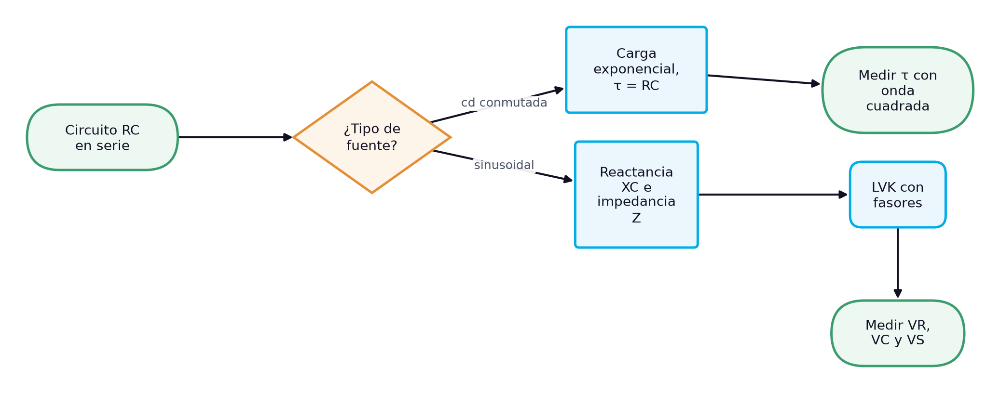
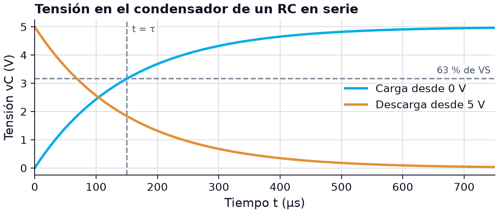
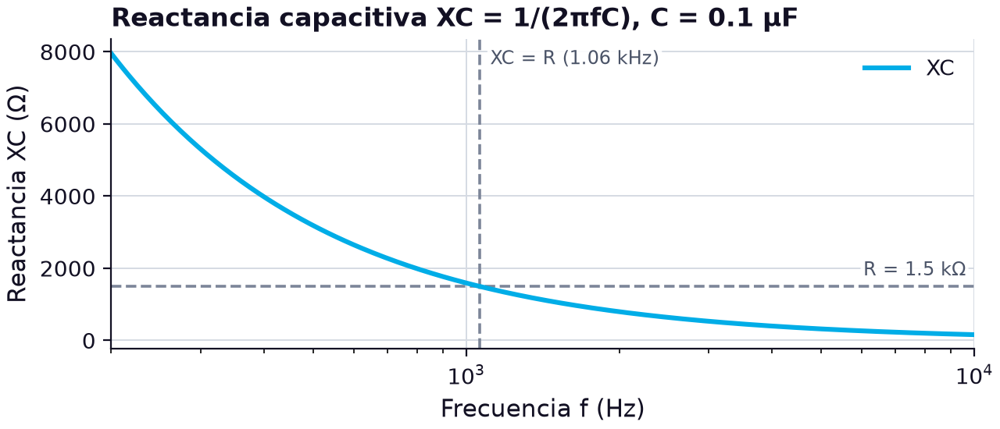

# El circuito RC en serie: carga del condensador, reactancia capacitiva, impedancia y ley de voltajes de Kirchhoff

> **Módulos:** IEL04 — Circuitos Eléctricos I
> **Duración:** 240 minutos (sesión teórico-práctica)
> **Nivel:** Pregrado
> **Semana:** 4 de 14 (corte evaluativo 1) · **Resultado de aprendizaje del módulo:** [[IEL04-RA2]] · **Trabajo independiente:** 5 h/semana

---

## 1. Metadatos de la Sesión

### 1.1 Continuidad curricular

Las semanas 1 a 3 estudiaron el condensador y la bobina por separado y en asociaciones, y cerraron el RA1 con el circuito LC. Esta sesión abre el RA2 al combinar el condensador con el resistor en serie, la configuración más usada de la electrónica y de los sistemas eléctricos: temporizadores, filtros, redes de protección y circuitos de disparo. Se estudia primero la respuesta en corriente continua (carga y constante de tiempo) y luego la respuesta sinusoidal (reactancia, impedancia y ángulo de fase), con la ley de voltajes de Kirchhoff aplicada a fasores. La semana 5 es de examen; al volver, la semana 6 trata el circuito RC en paralelo y la ley de corrientes de Kirchhoff.

1. Semana 3: Condensadores y bobinas en serie, en paralelo y mixto: cálculo y medición en circuitos L, C y LC
2. **→ Presente sesión (semana 4):** Circuito RC en serie: análisis y Ley de Voltajes de Kirchhoff
3. Semana 5: evaluación (semana de examen)

### 1.2 Prerrequisitos

- Aplicar la ley de Ohm y la ley de voltajes de Kirchhoff a circuitos resistivos en serie.
- Calcular capacitancias equivalentes y aplicar Q = CV (semanas 1 y 3).
- Leer el código de colores de resistores y el marcado de condensadores.
- Operar con funciones exponenciales, raíz cuadrada y tangente inversa en la calculadora.
- Describir una onda sinusoidal por su amplitud, su frecuencia y su valor eficaz.

---

## 2. Resultados de Aprendizaje

**RA IEL04-RA2:** Calcular un circuito resistivo, capacitivo y RC, sea en serie o paralelo.

**Criterios de evaluación:**
- **CE1** (cognitiva_conceptual): Identificar los tipos de resistores y capacitores.
- **CE2** (manipulacion_fisica): Realizar mediciones en un circuito resistivo y capacitivo.
- **CE3** (manipulacion_fisica): Realizar mediciones en un circuito RC.

**Unidades de competencia de la asignatura:**
- [[UC2]]: Coordinar actividades asociadas a sistemas eléctricos utilizando fuentes convencionales y no convencionales de energía.

Al finalizar la sesión, el estudiante estará en capacidad de lograr los siguientes resultados, que desarrollan el RA del módulo:

| # | Resultado de aprendizaje | Nivel (Taxonomía de Bloom) |
| --- | --- | --- |
| RA1 | **Identificar** los tipos de resistores y condensadores adecuados para un circuito RC a partir de su marcado y sus características. (CE1) | Aplicar |
| RA2 | **Calcular** la constante de tiempo y las tensiones de carga y descarga de un circuito RC en serie alimentado con cd. (CE3) | Aplicar |
| RA3 | **Calcular** la reactancia, la impedancia, el ángulo de fase y las tensiones de un circuito RC en serie en ca aplicando la ley de voltajes de Kirchhoff. (CE3) | Analizar |
| RA4 | **Medir** las tensiones en el resistor y en el condensador de un circuito RC en serie y verificar la ley de voltajes de Kirchhoff en forma fasorial. (CE2, CE3) | Evaluar |

---

## 3. Índice Temporizado (240 minutos)

| Bloque | Contenido | Duración |
| --- | --- | --- |
| 1 | El RC como bloque básico de temporización y filtrado; cd frente a ca | 20 min |
| 2 | Tipos de resistores, código de colores, potencia nominal y elección del condensador | 25 min |
| 3 | Constante de tiempo τ = RC, curvas exponenciales y régimen transitorio | 35 min |
| 4 | XC = 1/(2πfC), dependencia con la frecuencia y desfase de 90° | 30 min |
| 5 | Z = R − jXC, triángulo de impedancia, magnitud y ángulo | 35 min |
| 6 | Suma fasorial VS = VR + VC, diagrama fasorial y error de la suma aritmética | 35 min |
| 7 | Medir τ con onda cuadrada y VR, VC, VS con señal sinusoidal; comparar con el cálculo | 45 min |
| 8 | Síntesis, cierre actitudinal y bibliografía | 15 min |
|  | **Total** | **240 min** |

---

## 4. Desarrollo Teórico

### 4.1 Introducción Conceptual (Bloque 1)

Un resistor en serie con un condensador es probablemente el circuito más útil que se puede construir con dos componentes. El resistor limita la corriente con que el condensador se carga, y el condensador almacena esa carga; la combinación convierte una magnitud eléctrica en una magnitud de tiempo. Por eso el circuito RC en serie está detrás de temporizadores, retardos de encendido, redes de protección contra transitorios y filtros de señal. Visto en función de la frecuencia, el mismo circuito es un filtro: si la salida se toma en el resistor, deja pasar las frecuencias altas; si se toma en el condensador, las bajas [1].

El análisis tiene dos caras, según cómo se alimente el circuito. Con una fuente de **corriente continua** que se conecta en un instante dado, el condensador se carga de forma exponencial, a un ritmo que fija la **constante de tiempo** $\tau = RC$, el producto de la resistencia por la capacitancia [1]. Con una fuente **sinusoidal**, el condensador presenta una oposición que depende de la frecuencia, la reactancia capacitiva, y las tensiones del resistor y del condensador quedan desfasadas 90°. La ley de voltajes de Kirchhoff sigue valiendo en ambos casos, pero en ca las tensiones se suman como fasores, no como números.

*Figura 1. Dos caminos de análisis del circuito RC en serie según el tipo de fuente*

El diagrama organiza la sesión. Tras repasar cómo se identifican los resistores y condensadores que forman el circuito, se sigue primero la rama de cd, con las curvas de carga y descarga y la constante de tiempo, y luego la rama de ca, que pasa por la reactancia capacitiva, la impedancia con su ángulo de fase y la ley de voltajes de Kirchhoff con fasores. Cada rama termina en una medición de laboratorio: una onda cuadrada del generador permite ver la carga exponencial y medir $\tau$, y una onda sinusoidal permite medir las tensiones del resistor y del condensador y comprobar que no suman aritméticamente la tensión de la fuente.

> **Nota pedagógica:** El libro de cátedra de la UNLP llama circuito «GC» a su dual del RL, con conductancia y capacidad [3]; en esta asignatura se usa la denominación RC, la de Floyd y Boylestad.

### 4.2 Conceptos Clave

#### 4.2.1 Resistores y condensadores del circuito RC: tipos e identificación (Bloque 2)

El primer criterio de evaluación del RA2 pide identificar los tipos de resistores y condensadores, los dos componentes del circuito RC. Los condensadores se estudiaron a fondo en la semana 1; aquí se completa el cuadro con el resistor y se discute qué conviene elegir para cada uno cuando van a formar un circuito RC. Los resistores fijos se fabrican con varias tecnologías: composición de carbón, película de carbón, película metálica y devanado de alambre; en los de película se deposita de manera uniforme una capa resistiva de carbón o de cromo-níquel [1]. Los *chip* resistores son resistores fijos para tecnología de montaje superficial (SMT), cuya ventaja es su tamaño muy pequeño para ensambles compactos [1]. Los resistores devanados se usan como resistores de potencia [1].

Los resistores fijos con tolerancias del 5 % o del 10 % se identifican con **cuatro bandas de color**, situadas siempre cerca de un extremo [1]. Se lee empezando por la banda más cercana a un extremo; si no está claro, por el extremo que no empieza con una banda oro o plata [1]. La primera banda es el primer dígito, la segunda el segundo dígito, la tercera el multiplicador (el número de ceros después del segundo dígito) y la cuarta la tolerancia, por lo general oro o plata [1]. Para valores menores de 10 Ω, la tercera banda es oro (multiplicador 0.1) o plata (0.01): rojo, violeta, oro y plata representa 2.7 Ω con ±10 % [1]. Los resistores de montaje superficial usan en cambio un código tipográfico de tres dígitos, con el mismo significado que en los condensadores [1].

**Tabla 1.** Código de colores para resistores de cuatro bandas [1]

| Color | Dígito | Multiplicador | Tolerancia |
| --- | --- | --- | --- |
| Negro | 0 | ×1 | — |
| Marrón | 1 | ×10 | — |
| Rojo | 2 | ×100 | — |
| Naranja | 3 | ×1000 | — |
| Amarillo | 4 | ×10⁴ | — |
| Verde | 5 | ×10⁵ | — |
| Azul | 6 | ×10⁶ | — |
| Violeta | 7 | ×10⁷ | — |
| Gris | 8 | ×10⁸ | — |
| Blanco | 9 | ×10⁹ | — |
| Oro | — | ×0.1 | ±5 % |
| Plata | — | ×0.01 | ±10 % |

La tolerancia define el intervalo del valor real, igual que en los condensadores: un resistor de 100 Ω con ±5 % puede valer entre 95 Ω y 105 Ω [1]. Por ejemplo, el resistor que se usará en el caso de estudio lleva marrón, verde, rojo y oro: 1, 5 y dos ceros, es decir, 1500 Ω = 1.5 kΩ con ±5 %, entre 1425 Ω y 1575 Ω. El condensador que lo acompaña es el de película marcado 104K de la semana 1: 0.1 µF con ±10 %.

Al elegir los componentes de un circuito RC importan más cosas que el valor. En el **resistor**, la potencia nominal debe superar la potencia que disipará, $P = I^2 R$; en un RC de señal, con corrientes de algunos miliamperios, bastan resistores de película de 1/4 W, y la película metálica ofrece mejor tolerancia y menor ruido que el carbón. En el **condensador**, la tensión nominal debe superar la tensión máxima del circuito; para temporización y filtros de señal se prefieren los de película o cerámicos estables, porque la constante de tiempo depende directamente de $C$, y un electrolítico, con tolerancias de ±20 % y fugas altas, introduciría errores grandes. Si el electrolítico es inevitable por el valor, hay que respetar su polaridad y tener en cuenta su fuga.

Los parámetros del circuito RC se escriben siempre con su unidad y con prefijos coherentes, porque en el producto $RC$ se mezclan órdenes de magnitud muy distintos: kiloohmios con microfaradios dan milisegundos, y megaohmios con microfaradios, segundos. Con 1.5 kΩ y 0.1 µF, $RC = (1.5 \times 10^3)(0.1 \times 10^{-6}) = 150\ \mu\text{s}$; con 1 MΩ y 10 µF, 10 s. Convertir todo a unidades base antes de multiplicar evita el error más frecuente de este tema.

> **Error frecuente:** Leer el código de colores desde el extremo equivocado. En un resistor de ±5 %, la banda oro de tolerancia siempre queda al final; si la lectura empieza por el oro, se obtiene un valor que no existe en la serie estándar.

#### 4.2.2 Carga y descarga del condensador en un circuito RC en serie con cd (Bloque 3)

Considérese un resistor $R$ en serie con un condensador $C$ descargado, conectados a una fuente de cd $V_S$ mediante un interruptor. En el instante en que se cierra el interruptor, el condensador no tiene carga y su tensión es cero; toda la tensión de la fuente cae en el resistor, y la corriente inicial es $V_S/R$. A medida que el condensador acumula carga, su tensión crece, la tensión en el resistor disminuye y, con ella, la corriente. El proceso se frena a sí mismo: cuanto más cargado está el condensador, más lentamente se sigue cargando. Por eso la carga no es lineal, sino que sigue una **curva exponencial**: creciente durante la carga y decreciente durante la descarga [1].

La ley de voltajes de Kirchhoff se cumple en cada instante: $V_S = v_R(t) + v_C(t)$. Al sustituir $v_R = iR$ e $i = C\,dv_C/dt$ se obtiene una ecuación diferencial de primer orden, cuya solución, para un condensador que parte descargado, es:

$$
v_C(t) = V_S\left(1 - e^{-t/\tau}\right), \qquad i(t) = \frac{V_S}{R}\,e^{-t/\tau}, \qquad \tau = R\,C
$$

donde $v_C(t)$ es la tensión en el condensador en voltios (V), $i(t)$ la corriente del circuito en amperios (A), $V_S$ la tensión de la fuente en voltios (V), $R$ la resistencia en ohmios (Ω), $C$ la capacitancia en faradios (F), $t$ el tiempo desde el cierre del interruptor en segundos (s) y $\tau$ la constante de tiempo en segundos (s). La **constante de tiempo RC** es el intervalo fijo, igual al producto de la resistencia por la capacitancia, que determina la respuesta en el tiempo del circuito RC en serie [1]. El producto de ohmios por faradios da segundos: con 1.5 kΩ y 0.1 µF, $\tau = 150\ \mu\text{s}$.

La constante de tiempo tiene una interpretación directa. En cada intervalo de una constante de tiempo, la tensión cambia aproximadamente un 63 % de la diferencia que falta hasta el valor final: un condensador descargado alcanza el 63 % de su tensión final en una constante de tiempo, y uno que se descarga cae al 37 % de su valor inicial en el mismo intervalo [1]. Tras cinco constantes de tiempo el cambio supera el 99 %, y ese intervalo, llamado **tiempo transitorio**, se acepta en general como el tiempo necesario para cargar o descargar por completo el condensador [1]. Con $V_S = 5\ \text{V}$ y $\tau = 150\ \mu\text{s}$: $v_C(150\ \mu\text{s}) = 5(1 - e^{-1}) \approx 3.16\ \text{V}$, y a los 750 µs el condensador está prácticamente cargado, con 4.97 V.

Si el condensador cargado a $V_0$ se descarga a través del mismo resistor, su tensión decae como $v_C(t) = V_0\,e^{-t/\tau}$, y la corriente cambia de sentido. El libro de cátedra de la UNLP desarrolla este régimen transitorio a partir de la ecuación diferencial y muestra que el cociente entre la característica de la parte reactiva y la de la parte no reactiva tiene dimensión de tiempo: es la constante de tiempo [3]. La gráfica compara la carga desde 0 V y la descarga desde 5 V con los valores del ejemplo.

*Figura 2. Carga y descarga del condensador en un circuito RC en serie con VS = 5 V, R = 1.5 kΩ y C = 0.1 µF (τ = 150 µs)*

La gráfica muestra la simetría entre ambos procesos: en $t = \tau$ la curva de carga ha subido al 63 % de 5 V, 3.16 V, y la de descarga ha bajado al 37 %, 1.84 V; las dos curvas se cruzan cerca de $t = 0.69\tau$, cuando ambas valen la mitad de $V_S$. A partir de $5\tau$, es decir, 750 µs, ninguna de las dos cambia de manera apreciable. En el laboratorio, este comportamiento se observa con una onda cuadrada cuyo semiperiodo sea mayor que cinco constantes de tiempo.

> **Hallazgo contraintuitivo:** La constante de tiempo no depende de la tensión de la fuente: con 5 V o con 50 V el condensador tarda lo mismo en llegar al 63 % de su valor final. Lo único que cambia es el valor final.

#### 4.2.3 Reactancia capacitiva y respuesta sinusoidal del condensador (Bloque 4)

Cuando la fuente es sinusoidal, el condensador nunca termina de cargarse: la tensión de la fuente cambia sin cesar y el condensador se carga y se descarga continuamente, alternando la polaridad. Su corriente, según $i = C\,dv/dt$, es proporcional a la rapidez con que cambia su tensión, y esa rapidez es máxima en los cruces por cero de la onda seno y nula en sus picos. Por eso la corriente es máxima cuando la tensión es cero, y cero cuando la tensión es máxima: en un condensador, **la corriente siempre adelanta 90° a la tensión** [1].

La oposición del condensador a la corriente sinusoidal, expresada en ohmios, se llama **reactancia capacitiva** y se simboliza $X_C$ [1]. Para deducirla se parte de $i = C\,dv/dt$: la rapidez de cambio de la tensión está directamente relacionada con la frecuencia, de modo que una onda de mayor frecuencia tiene una pendiente más pronunciada en los cruces por cero y produce una corriente mayor para la misma amplitud de tensión [1]. Una capacitancia mayor también exige más corriente para el mismo cambio de tensión. Ambas dependencias dan una reactancia inversamente proporcional a la frecuencia y a la capacitancia:

$$
X_C = \frac{1}{2\pi f C}
$$

donde $X_C$ es la reactancia capacitiva en ohmios (Ω), $f$ la frecuencia de la señal en hercios (Hz) y $C$ la capacitancia en faradios (F). El factor $2\pi$ aparece porque la derivada de la onda seno se escribe con la frecuencia angular $\omega = 2\pi f$. Para el condensador de 0.1 µF del ejemplo, a 1 kHz, $X_C = 1/(2\pi \times 1000 \times 0.1 \times 10^{-6}) \approx 1592\ \Omega$; a 100 Hz, la reactancia sube a 15.9 kΩ, y a 10 kHz baja a 159 Ω. Con la reactancia, la ley de Ohm vale en magnitudes eficaces: $V_C = I X_C$.

Los dos extremos de la fórmula enlazan con lo ya estudiado. Cuando $f \to 0$, la reactancia tiende a infinito: en cd, una vez cargado, el condensador bloquea la corriente y se comporta como un circuito abierto. Cuando la frecuencia es muy alta, la reactancia tiende a cero y el condensador se comporta casi como un cortocircuito. Entre ambos extremos, la reactancia cambia en proporción inversa a la frecuencia, como muestra la gráfica.

*Figura 3. Reactancia capacitiva de un condensador de 0.1 µF en función de la frecuencia, comparada con la resistencia de 1.5 kΩ del circuito*

La línea horizontal marca la resistencia de 1.5 kΩ con la que el condensador formará el circuito RC. Por debajo de unos 1.06 kHz la reactancia supera a la resistencia y el condensador domina el comportamiento del circuito; por encima, domina el resistor. La frecuencia en la que ambas oposiciones son iguales, $f = 1/(2\pi R C)$, será clave en la próxima unidad, porque allí el ángulo de fase del circuito vale exactamente −45°. A 1 kHz, la frecuencia elegida para el caso de estudio, la reactancia (1592 Ω) y la resistencia son parecidas, y ninguno de los dos elementos oculta al otro en las mediciones.

Conviene distinguir la reactancia de la resistencia, aunque ambas se midan en ohmios. La resistencia disipa energía en forma de calor; la reactancia no disipa: el condensador toma energía durante un cuarto de ciclo y la devuelve en el siguiente. Por eso la reactancia no puede medirse con el ohmímetro, que aplica cd, sino que se calcula a partir de $f$ y $C$, o se obtiene del cociente entre las tensiones y la corriente eficaces medidas con señal sinusoidal.

> **Error frecuente:** Usar la frecuencia en kilohercios y la capacitancia en microfaradios sin convertirlas. En $X_C = 1/(2\pi f C)$, $f$ va en hercios y $C$ en faradios; con otras unidades el resultado sale errado en un factor de mil o de un millón.

#### 4.2.4 Impedancia y ángulo de fase del circuito RC en serie (Bloque 5)

En un circuito puramente resistivo, la oposición total a la corriente es la resistencia; en uno puramente capacitivo, la reactancia capacitiva. En el circuito RC en serie intervienen ambas, y su efecto combinado se llama **impedancia**, simbolizada $Z$ [1]. La impedancia no es la suma aritmética de $R$ y $X_C$, porque sus efectos están desfasados 90°: la tensión en el condensador se retrasa 90° respecto a la corriente, y por tanto respecto a la tensión en el resistor [1]. Para sumarlas se usan números complejos: la reactancia capacitiva se escribe $-jX_C$, un fasor a −90° de la resistencia, y la impedancia total es la suma fasorial de ambas [1]:

$$
\mathbf{Z} = R - jX_C = \sqrt{R^{2} + X_C^{2}}\ \angle -\tan^{-1}\!\left(\frac{X_C}{R}\right)
$$

donde $\mathbf{Z}$ es la impedancia fasorial en ohmios (Ω), $R$ la resistencia en ohmios (Ω), $X_C$ la reactancia capacitiva en ohmios (Ω) y $j$ la unidad imaginaria, que indica un desfase de +90° (y $-j$, de −90°). La primera forma es la rectangular y la segunda la polar, con magnitud y ángulo [1]. Si se reubican los fasores $R$ y $-jX_C$, forman un triángulo rectángulo, el **triángulo de impedancia**: los catetos son $R$ y $X_C$, la hipotenusa es $Z$, y el ángulo $\theta$ entre $R$ y $Z$ es el ángulo de fase del circuito, la diferencia de fase entre la tensión aplicada y la corriente [1].

La magnitud se obtiene por el teorema de Pitágoras y el ángulo con la tangente inversa [1]:

$$
Z = \sqrt{R^{2} + X_C^{2}}, \qquad \theta = -\tan^{-1}\!\left(\frac{X_C}{R}\right)
$$

donde $Z$ es la magnitud de la impedancia en ohmios (Ω) y $\theta$ el ángulo de fase en grados (°). El signo negativo indica que la tensión de la fuente se retrasa respecto a la corriente, o, lo que es lo mismo, que la corriente adelanta a la tensión. Con $R = 56\ \Omega$ y $X_C = 100\ \Omega$, $\mathbf{Z} = 56 - j100\ \Omega = 115\ \angle -60.8^\circ\ \Omega$ [1]. Con el circuito del caso de estudio, $R = 1.5\ \text{k}\Omega$ y $X_C = 1592\ \Omega$ a 1 kHz: $Z = \sqrt{1500^2 + 1592^2} \approx 2187\ \Omega$ y $\theta = -\tan^{-1}(1592/1500) \approx -46.7^\circ$.

Como $X_C$ depende de la frecuencia, la impedancia y el ángulo de fase también dependen de ella. A frecuencias bajas domina la reactancia: $Z$ es grande y $\theta$ se acerca a −90°, un circuito casi capacitivo. A frecuencias altas domina la resistencia: $Z$ tiende a $R$ y $\theta$ a 0°, un circuito casi resistivo. En la frecuencia en la que $X_C = R$, el ángulo vale exactamente −45° y $Z = R\sqrt{2}$. La tabla lo muestra para $R = 1.5\ \text{k}\Omega$ y $C = 0.1\ \mu\text{F}$.

**Tabla 2.** Impedancia y ángulo de fase de un RC en serie (R = 1.5 kΩ, C = 0.1 µF) en función de la frecuencia

| f (Hz) | XC (Ω) | Z (Ω) | θ (°) | Comportamiento |
| --- | --- | --- | --- | --- |
| 200 | 7958 | 8098 | −79.3 | casi capacitivo |
| 500 | 3183 | 3519 | −64.8 | predomina C |
| 1000 | 1592 | 2187 | −46.7 | equilibrado |
| 1061 | 1500 | 2121 | −45.0 | XC = R |
| 2000 | 796 | 1698 | −27.9 | predomina R |
| 10 000 | 159 | 1508 | −6.1 | casi resistivo |

La tabla confirma que el ángulo recorre todo el intervalo de 0° a −90° según la relación entre $X_C$ y $R$, y que la magnitud de la impedancia nunca baja de $R$: el condensador solo puede añadir oposición al circuito. Este comportamiento es la base de los filtros RC y de las redes de adelanto y retraso de fase, que se estudian más adelante en el curso.

> **Error frecuente:** Calcular la impedancia como $R + X_C$. Con los valores del caso daría 3092 Ω, un 41 % más que el valor correcto de 2187 Ω. La suma aritmética solo sería válida si ambas oposiciones estuvieran en fase, y en el circuito RC nunca lo están.

#### 4.2.5 Ley de voltajes de Kirchhoff en el circuito RC en serie (Bloque 6)

La ley de voltajes de Kirchhoff establece que la suma de las caídas de tensión alrededor de una trayectoria cerrada es igual a la tensión aplicada [1]. En el circuito RC en serie con cd se cumple en cada instante, $v_R + v_C = V_S$ [1]. Con una fuente sinusoidal también se cumple, pero con una condición que cambia el cálculo: como $V_R$ y $V_C$ no están en fase, deben sumarse como **cantidades fasoriales**, con $V_C$ retrasada 90° respecto a $V_R$ [1]. La corriente es la misma en todo el circuito en serie, así que se toma como referencia a 0°; la tensión en el resistor está en fase con ella, y la del condensador, 90° atrás.

$$
\mathbf{V}_S = \mathbf{V}_R + \mathbf{V}_C = V_R - jV_C, \qquad V_S = \sqrt{V_R^{2} + V_C^{2}}, \qquad \theta = -\tan^{-1}\!\left(\frac{V_C}{V_R}\right)
$$

donde $\mathbf{V}_S$, $\mathbf{V}_R$ y $\mathbf{V}_C$ son los fasores de la tensión de la fuente, del resistor y del condensador en voltios (V), $V_S$, $V_R$ y $V_C$ sus magnitudes eficaces en voltios (V) y $\theta$ el ángulo de la tensión de la fuente respecto a la corriente en grados (°). Las tres tensiones forman un triángulo rectángulo semejante al de impedancia, porque cada una es la corriente multiplicada por su oposición correspondiente: $V_R = IR$, $V_C = IX_C$ y $V_S = IZ$, de acuerdo con la ley de Ohm en forma fasorial, $\mathbf{V} = \mathbf{I}\mathbf{Z}$ [1].

El procedimiento de análisis de un RC en serie queda así: calcular $X_C$ a la frecuencia de trabajo; obtener $Z$ y $\theta$; calcular la corriente $I = V_S / Z$; calcular $V_R = IR$ y $V_C = IX_C$; y verificar con la LVK fasorial. Con el circuito del caso ($R = 1.5\ \text{k}\Omega$, $C = 0.1\ \mu\text{F}$) alimentado con 5 V eficaces a 1 kHz: $Z = 2187\ \Omega$, $I = 5 / 2187 \approx 2.29\ \text{mA}$, $V_R = (2.29 \times 10^{-3})(1500) \approx 3.43\ \text{V}$ y $V_C = (2.29 \times 10^{-3})(1592) \approx 3.64\ \text{V}$. La verificación da $\sqrt{3.43^2 + 3.64^2} \approx 5.00\ \text{V}$, y el ángulo, $-\tan^{-1}(3.64/3.43) \approx -46.7^\circ$, coincide con el de la impedancia.

**Tabla 3.** Tensiones de un RC en serie (R = 1.5 kΩ, C = 0.1 µF, VS = 5 V eficaces) a dos frecuencias

| Magnitud | f = 1 kHz | f = 2 kHz |
| --- | --- | --- |
| XC (Ω) | 1592 | 796 |
| Z (Ω) | 2187 | 1698 |
| I (mA) | 2.29 | 2.94 |
| VR (V) | 3.43 ∠ 0° | 4.42 ∠ 0° |
| VC (V) | 3.64 ∠ −90° | 2.34 ∠ −90° |
| VR + VC aritmética (V) | 7.07 | 6.76 |
| √(VR² + VC²) (V) | 5.00 | 5.00 |
| θ (°) | −46.7 | −27.9 |

La tabla contiene el hallazgo central de la sesión. Si se miden por separado las tensiones del resistor y del condensador con un voltímetro, su suma aritmética da 7.07 V, bastante más que los 5 V de la fuente. No es un error de medición ni una violación de la ley de Kirchhoff: el voltímetro mide magnitudes eficaces y no ve el desfase de 90° entre ambas tensiones, que alcanzan su máximo en instantes distintos. La suma correcta es la fasorial, y da exactamente la tensión de la fuente. Al duplicar la frecuencia, la reactancia se reduce a la mitad, la tensión se desplaza del condensador al resistor y el ángulo se acerca a cero, pero la suma fasorial sigue siendo 5 V.

El diagrama fasorial que se dibuja en el laboratorio sigue estas convenciones: la corriente sobre el eje horizontal como referencia; $V_R$ sobre el mismo eje, porque está en fase con ella; $V_C$ hacia abajo, a −90°; y $V_S$ como la hipotenusa que cierra el triángulo. La longitud de cada fasor es su valor eficaz y el ángulo entre $V_S$ y el eje horizontal es $\theta$.

> **Error frecuente:** Concluir que el circuito «no cumple Kirchhoff» porque las lecturas del voltímetro no suman la tensión de la fuente. En ca, la ley de voltajes se verifica con la suma fasorial: se elevan al cuadrado las tensiones del resistor y del condensador, se suman y se extrae la raíz.

---

## 5. Caso de Estudio Aplicado: Medición de un circuito RC en serie en el laboratorio: constante de tiempo y verificación de la LVK (Bloque 7)

### 5.1 Descripción del montaje

Se monta en el protoboard un circuito RC en serie con un resistor de película marcado marrón-verde-rojo-oro (1.5 kΩ ±5 %) y el condensador de película C2 del kit de la semana 1, marcado 104K, cuyo valor medido fue 97.8 nF. El condensador se conecta del lado de tierra, de modo que el canal 2 del osciloscopio mide directamente $v_C$ y el canal 1 mide la tensión de la fuente; la tensión del resistor se obtiene con la función de resta del osciloscopio (CH1 − CH2), porque las dos puntas comparten la misma tierra y no pueden conectarse en los extremos del resistor. Antes de montar, el ohmímetro da 1492 Ω para el resistor. Las lecturas del osciloscopio y del multímetro que se usan más abajo son valores de ejemplo para ilustrar el procedimiento.

### 5.2 Parte 1: constante de tiempo con onda cuadrada

Para ver la carga y la descarga completas, el semiperiodo de la onda cuadrada debe durar más de cinco constantes de tiempo, el tiempo transitorio [1]. Con $\tau$ cerca de 150 µs, cinco constantes son 750 µs, así que se elige una onda cuadrada de 0 V a 5 V y 500 Hz (semiperiodo de 1 ms). El mismo método de aplicar una onda cuadrada y medir la respuesta exponencial se usa para determinar la constante de tiempo de un circuito con un elemento de valor desconocido [1]. El valor esperado con los componentes medidos es:

$$
\tau = R\,C = (1492\ \Omega)(97.8 \times 10^{-9}\ \text{F}) \approx 145.9\ \mu\text{s}
$$

donde $\tau$ es la constante de tiempo en segundos (s), $R$ la resistencia medida en ohmios (Ω) y $C$ la capacitancia medida en faradios (F). Con los valores nominales se habría esperado 150 µs. En el osciloscopio, con los cursores de tiempo, se mide el intervalo entre el flanco de subida de la onda cuadrada y el instante en que $v_C$ alcanza el 63 % de 5 V, es decir, 3.16 V: la lectura es de 147 µs, un 0.8 % por encima del valor calculado.

### 5.3 Parte 2: tensiones con señal sinusoidal y ley de voltajes de Kirchhoff

El generador se ajusta a una onda sinusoidal de 1 kHz y 5.00 V eficaces, verificada primero con el osciloscopio, como recomienda la práctica de localización de fallas [1]. Con los valores medidos, $X_C = 1/(2\pi \times 1000 \times 97.8 \times 10^{-9}) \approx 1627\ \Omega$, $Z = \sqrt{1492^2 + 1627^2} \approx 2208\ \Omega$, $I = 5 / 2208 \approx 2.26\ \text{mA}$, $V_R \approx 3.38\ \text{V}$, $V_C \approx 3.69\ \text{V}$ y $\theta = -\tan^{-1}(1627/1492) \approx -47.5^\circ$. Con el multímetro de verdadero valor eficaz se miden $V_R$ (flotante, entre los extremos del resistor) y $V_C$. El desfase se mide en el osciloscopio como el retardo $\Delta t$ entre la tensión de la fuente y la del resistor, que está en fase con la corriente, y se convierte a grados con $\theta = 360^\circ \times \Delta t / T$.

**Tabla 4.** Valores calculados y medidos del circuito RC en serie (lecturas de ejemplo)

| Magnitud | Calculado con valores medidos | Medido | Instrumento | Diferencia |
| --- | --- | --- | --- | --- |
| τ | 145.9 µs | 147 µs | osciloscopio (cursores) | +0.8 % |
| VR | 3.38 V | 3.36 V | multímetro verdadero valor eficaz | −0.6 % |
| VC | 3.69 V | 3.70 V | multímetro verdadero valor eficaz | +0.3 % |
| VR + VC (aritmética) | 7.07 V | 7.06 V | — | — |
| √(VR² + VC²) | 5.00 V | 5.00 V | — | 0.0 % |
| Δt entre VS y VR | 132 µs | 130 µs | osciloscopio | −1.5 % |
| θ | −47.5° | −46.8° | calculado de Δt | 0.7° |

### 5.4 Análisis de resultados

Las mediciones confirman las dos caras del circuito. En cd, la constante de tiempo medida coincide con el producto $RC$ de los valores medidos con una diferencia menor del 1 %, que se explica por la resolución de los cursores y por la resistencia interna del generador (típicamente 50 Ω), que se suma a $R$. En ca, las tensiones individuales suman aritméticamente 7.06 V, pero su suma fasorial reproduce los 5.00 V de la fuente, y el desfase medido, −46.8°, confirma que la corriente adelanta a la tensión de la fuente casi el ángulo calculado. La ley de voltajes de Kirchhoff se cumple, siempre que se aplique a fasores.

La práctica cubre los criterios del RA2 que dependen del laboratorio: identificar el resistor y el condensador por su marcado y verificarlos antes del montaje, medir tensiones en un circuito resistivo y capacitivo, y medir un circuito RC. También deja un procedimiento reutilizable en la semana 6, cuando el mismo resistor y el mismo condensador se conecten en paralelo y la magnitud que se reparta sea la corriente.

> **Advertencia de seguridad:** No se debe conectar la tierra de las dos puntas del osciloscopio en puntos distintos del circuito: ambas están unidas a la tierra del instrumento y a la del generador, y conectarlas en los extremos del resistor lo cortocircuita. La tensión flotante del resistor se mide con la resta de canales o con el multímetro.

---

## 6. Síntesis (Bloque 8)

El circuito RC en serie se entiende a partir de dos preguntas: cómo se alimenta y qué magnitud comparten sus elementos. Como están en serie, comparten la corriente, y la ley de voltajes de Kirchhoff reparte la tensión de la fuente entre el resistor y el condensador. Con **cd conmutada**, ese reparto cambia en el tiempo: el condensador se carga exponencialmente, alcanza el 63 % de la tensión final en una constante de tiempo $\tau = RC$ y se considera cargado tras $5\tau$. Con **ca sinusoidal**, el reparto es permanente pero desfasado: el condensador opone una reactancia $X_C = 1/(2\pi f C)$ que cae con la frecuencia, la impedancia es la suma fasorial $Z = \sqrt{R^2 + X_C^2}$ y el ángulo de fase recorre de −90° a 0° según domine el condensador o el resistor. El caso de laboratorio convirtió esa teoría en un criterio verificable: la constante de tiempo medida con onda cuadrada coincide con el producto $RC$ de los valores medidos, y las tensiones del resistor y del condensador suman aritméticamente más que la fuente, pero su **suma fasorial** la reproduce exactamente. Esa comprobación es la esencia del RA2 en el circuito en serie. La semana 6, tras el examen, aplica el mismo análisis al circuito RC en paralelo, donde lo común es la tensión y lo que se suma fasorialmente es la corriente.

### Componente Actitudinal

> *Llegar puntual y con los valores medidos del kit permite al equipo completar las dos partes de la práctica; y discutir en grupo por qué las tensiones «no suman» evita que alguien corrija a mano unos datos que en realidad eran correctos.*

---

## 7. Bibliografía (Formato IEEE)

[1] T. L. Floyd, Principios de circuitos eléctricos, 8.ª ed. México: Pearson Educación, 2007.

[2] R. L. Boylestad, Introducción al análisis de circuitos, 10.ª ed. México: Pearson Educación, 2004.

[3] M. F. P. Deorsola y P. Morcelle del Valle, Circuitos eléctricos. Parte 1, 1.ª ed. La Plata: Editorial de la Universidad de La Plata, 2017.
