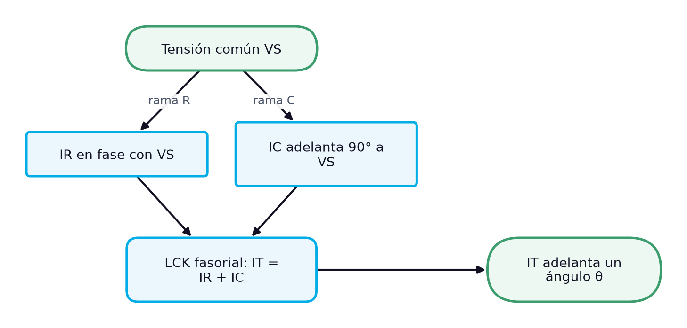
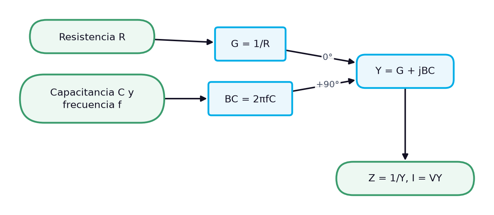
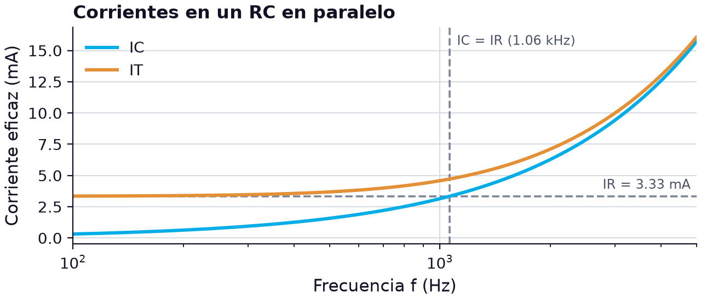

# El circuito RC en paralelo: admitancia, reparto de corrientes y ley de corrientes de Kirchhoff

> **Módulos:** IEL04 — Circuitos Eléctricos I
> **Duración:** 240 minutos (sesión teórico-práctica)
> **Nivel:** Pregrado
> **Semana:** 6 de 14 (corte evaluativo 2) · **Resultado de aprendizaje del módulo:** [[IEL04-RA2]] · **Trabajo independiente:** 5 h/semana

---

## 1. Metadatos de la Sesión

### 1.1 Continuidad curricular

La semana 4 analizó el circuito RC en serie, donde el resistor y el condensador comparten la corriente y la ley de voltajes de Kirchhoff suma fasorialmente sus tensiones. Tras el examen de la semana 5, esta sesión estudia la configuración dual: el resistor y el condensador en paralelo, que comparten la tensión y se reparten la corriente. Aparecen la conductancia, la susceptancia y la admitancia, que simplifican el cálculo en paralelo, y la ley de corrientes de Kirchhoff aplicada a fasores. Se usan los mismos componentes del caso de la semana 4 para comparar directamente ambos circuitos. La semana 7 cierra el RA2 con el cálculo y la medición de parámetros en circuitos RC en serie y en paralelo.

1. Semana 5: evaluación (semana de examen)
2. **→ Presente sesión (semana 6):** Circuito RC en paralelo: análisis y Ley de Corrientes de Kirchhoff
3. Semana 7: Cálculo y medición de parámetros en circuitos RC serie y paralelo: unidades, simbología y nomenclatura

### 1.2 Prerrequisitos

- Calcular la reactancia capacitiva, la impedancia y el ángulo de fase de un RC en serie (semana 4).
- Aplicar la ley de corrientes de Kirchhoff y el divisor de corriente en circuitos resistivos en paralelo.
- Sumar fasores en forma rectangular y convertirlos a forma polar.
- Identificar resistores por su código de colores y condensadores por su marcado (semanas 1 y 4).
- Medir corriente alterna con un multímetro de verdadero valor eficaz.

---

## 2. Resultados de Aprendizaje

**RA IEL04-RA2:** Calcular un circuito resistivo, capacitivo y RC, sea en serie o paralelo.

**Criterios de evaluación:**
- **CE1** (cognitiva_conceptual): Identificar los tipos de resistores y capacitores.
- **CE2** (manipulacion_fisica): Realizar mediciones en un circuito resistivo y capacitivo.
- **CE3** (manipulacion_fisica): Realizar mediciones en un circuito RC.

**Unidades de competencia de la asignatura:**
- [[UC2]]: Coordinar actividades asociadas a sistemas eléctricos utilizando fuentes convencionales y no convencionales de energía.

Al finalizar la sesión, el estudiante estará en capacidad de lograr los siguientes resultados, que desarrollan el RA del módulo:

| # | Resultado de aprendizaje | Nivel (Taxonomía de Bloom) |
| --- | --- | --- |
| RA1 | **Identificar** el resistor y el condensador de un RC en paralelo y verificar sus valores antes del montaje. (CE1) | Aplicar |
| RA2 | **Calcular** la impedancia, la admitancia y el ángulo de fase de un circuito RC en paralelo a una frecuencia dada. (CE3) | Aplicar |
| RA3 | **Analizar** el reparto de corrientes de un circuito RC en paralelo aplicando la ley de corrientes de Kirchhoff con fasores. (CE3) | Analizar |
| RA4 | **Medir** las corrientes de rama y la corriente total de un RC en paralelo y verificar la ley de corrientes de Kirchhoff. (CE2, CE3) | Evaluar |

---

## 3. Índice Temporizado (240 minutos)

| Bloque | Contenido | Duración |
| --- | --- | --- |
| 1 | Qué cambia al conectar R y C en paralelo: tensión común y corrientes que se reparten | 20 min |
| 2 | Z = R·XC/√(R² + XC²), ángulo de fase y variación con la frecuencia | 35 min |
| 3 | G = 1/R, BC = 1/XC, Y = G + jBC y conversión a impedancia | 35 min |
| 4 | IT = IR + jIC, suma fasorial de corrientes y adelanto de la corriente total | 35 min |
| 5 | Resistencias de descarga, constante de tiempo y seguridad en fuentes y bancos | 25 min |
| 6 | Magnitud común, ley de Kirchhoff, fórmulas y comportamiento en frecuencia | 25 min |
| 7 | Medir IR, IC e IT a 1 kHz con los componentes de la semana 4 y comparar con el cálculo | 45 min |
| 8 | Síntesis, cierre actitudinal y bibliografía | 20 min |
|  | **Total** | **240 min** |

---

## 4. Desarrollo Teórico

### 4.1 Introducción Conceptual (Bloque 1)

En la semana 4, el resistor y el condensador estaban en serie: compartían la corriente y se repartían la tensión de la fuente. Basta cambiar la conexión para que la situación se invierta. En un circuito RC en **paralelo**, la tensión aplicada aparece a la vez en la rama resistiva y en la capacitiva, de modo que la tensión de la fuente, la del resistor y la del condensador están en fase y tienen la misma magnitud [1]. Lo que se reparte ahora es la corriente: en el nodo de unión, la corriente total se divide en dos corrientes de rama, una por el resistor y otra por el condensador [1].

Esta configuración es tan frecuente como la serie. Un condensador en paralelo con una carga resistiva es el filtro básico de una fuente de alimentación; los bancos de condensadores que corrigen el factor de potencia se conectan en paralelo con los motores de una planta; y todo condensador real se comporta como una capacitancia ideal en paralelo con la resistencia de fuga de su dieléctrico. Entender cómo se reparte la corriente entre una rama resistiva y una capacitiva es, por tanto, entender una buena parte de los circuitos que el técnico encontrará en su trabajo.

*Figura 1. Relaciones de fase en el circuito RC en paralelo: la tensión común da lugar a dos corrientes desfasadas que se suman fasorialmente*

El diagrama resume el razonamiento de la sesión. La corriente por el resistor está en fase con la tensión; la corriente por el condensador adelanta 90° a la tensión, y por tanto a la corriente resistiva [1]. Según la ley de corrientes de Kirchhoff, la corriente total es la suma fasorial de las dos corrientes de rama [1], y queda adelantada a la tensión un ángulo intermedio entre 0° y 90°. Es la misma idea de la semana 4 con los papeles cambiados: allí se sumaban fasorialmente tensiones, aquí corrientes.

Para calcular circuitos en paralelo con comodidad se introducen tres magnitudes nuevas —conductancia, susceptancia y admitancia—, que son las recíprocas de la resistencia, la reactancia y la impedancia. Con ellas, las fórmulas del paralelo se escriben con la misma estructura que las del serie. La sesión desarrolla primero la impedancia del paralelo, luego la admitancia, la ley de corrientes de Kirchhoff y la descarga de un condensador a través de un resistor en paralelo, compara ambos circuitos y termina con la medición de las corrientes en el laboratorio, con el mismo resistor y el mismo condensador de la semana 4.

> **Nota pedagógica:** Al usar los mismos componentes de la semana 4 (1.5 kΩ y el condensador de 97.8 nF), cualquier diferencia entre los resultados de ambas sesiones se debe solo a la forma de conexión, lo que hace la comparación mucho más instructiva.

### 4.2 Conceptos Clave

#### 4.2.1 Impedancia y ángulo de fase del circuito RC en paralelo (Bloque 2)

La impedancia total de un resistor y un condensador en paralelo se obtiene con la misma regla que dos resistencias en paralelo, el producto dividido entre la suma, pero con fasores. Si $\mathbf{Z}_R = R \angle 0^\circ$ y $\mathbf{Z}_C = X_C \angle -90^\circ$, entonces $\mathbf{Z} = (R \angle 0^\circ)(X_C \angle -90^\circ) / (R - jX_C)$. El numerador vale $R X_C \angle -90^\circ$ y el denominador, en forma polar, $\sqrt{R^2 + X_C^2} \angle -\tan^{-1}(X_C/R)$. Al dividir magnitudes y restar ángulos se llega a la expresión de la impedancia del RC en paralelo [1]:

$$
Z = \frac{R\,X_C}{\sqrt{R^{2} + X_C^{2}}}, \qquad \theta = -\tan^{-1}\!\left(\frac{R}{X_C}\right)
$$

donde $Z$ es la magnitud de la impedancia en ohmios (Ω), $R$ la resistencia en ohmios (Ω), $X_C$ la reactancia capacitiva en ohmios (Ω) y $\theta$ el ángulo de fase de la impedancia en grados (°). Obsérvese la diferencia con el circuito en serie: allí el ángulo era $-\tan^{-1}(X_C/R)$; en paralelo, el cociente se invierte y queda $R/X_C$. La razón es que en paralelo domina la rama que menos se opone: si $X_C$ es mucho menor que $R$, casi toda la corriente pasa por el condensador y el circuito se comporta como capacitivo.

Dos ejemplos de Floyd fijan los órdenes de magnitud. Con $R = 100\ \Omega$ y $X_C = 50\ \Omega$ en paralelo, $Z = (100)(50)/\sqrt{100^2 + 50^2} \approx 44.7\ \Omega$ y $\theta \approx -63.4^\circ$; con $R = 1\ \text{k}\Omega$ y $X_C = 2\ \text{k}\Omega$, $Z \approx 894\ \Omega$ y $\theta \approx -26.6^\circ$ [1]. En ambos casos la impedancia es menor que la menor de las dos oposiciones, igual que la resistencia equivalente de dos resistores en paralelo es menor que el menor de ellos.

La dependencia con la frecuencia es la contraria a la del circuito en serie. A frecuencias bajas, la reactancia es muy grande, la rama capacitiva casi no conduce y la impedancia se acerca a $R$, con un ángulo cercano a 0°: el circuito es casi resistivo. A frecuencias altas, la reactancia se hace pequeña, el condensador «cortocircuita» al resistor y la impedancia tiende a $X_C$, con un ángulo que se acerca a −90°. En la frecuencia en la que $X_C = R$, el ángulo vale −45° y $Z = R/\sqrt{2}$. La tabla lo muestra con los componentes del caso de la semana 4, $R = 1.5\ \text{k}\Omega$ y $C = 0.1\ \mu\text{F}$.

**Tabla 1.** Impedancia y ángulo de fase de un RC en paralelo (R = 1.5 kΩ, C = 0.1 µF) en función de la frecuencia

| f (Hz) | XC (Ω) | Z (Ω) | θ (°) | Comportamiento |
| --- | --- | --- | --- | --- |
| 200 | 7958 | 1474 | −10.7 | casi resistivo |
| 500 | 3183 | 1357 | −25.2 | predomina R |
| 1000 | 1592 | 1092 | −43.3 | equilibrado |
| 1061 | 1500 | 1061 | −45.0 | XC = R |
| 2000 | 796 | 703 | −62.1 | predomina C |
| 10 000 | 159 | 158 | −83.9 | casi capacitivo |

Si se compara esta tabla con la de la semana 4, a cada frecuencia los ángulos del serie y del paralelo son complementarios: a 1 kHz, −46.7° en serie y −43.3° en paralelo, que suman −90°. Y la magnitud se comporta al revés: en serie la impedancia nunca baja de $R$, mientras que en paralelo nunca la supera. Esa diferencia decide qué conexión conviene en cada aplicación: un filtro que debe dejar pasar la cd y derivar a tierra las frecuencias altas usa el condensador en paralelo con la carga. En cambio, un circuito que debe bloquear la cd y dejar pasar la señal coloca el condensador en serie.

> **Error frecuente:** Aplicar a la impedancia en paralelo la fórmula del producto sobre la suma con números reales, $R X_C / (R + X_C)$. Con los valores del caso a 1 kHz daría 772 Ω en lugar de 1092 Ω: la suma del denominador debe ser fasorial, $\sqrt{R^2 + X_C^2}$.

#### 4.2.2 Conductancia, susceptancia capacitiva y admitancia (Bloque 3)

En los circuitos en paralelo, las oposiciones se combinan con recíprocos, y las fórmulas se vuelven engorrosas. La solución es trabajar directamente con los recíprocos. La **conductancia** $G$ es el recíproco de la resistencia; la **susceptancia capacitiva** $B_C$ es el recíproco de la reactancia capacitiva; y la **admitancia** $Y$ es el recíproco de la impedancia [1]. Las tres se miden en siemens (S), el recíproco del ohmio [1]. Como fasores, la conductancia está a 0° y la susceptancia capacitiva a +90°, porque invertir un fasor a −90° da uno a +90°: $\mathbf{B}_C = 1/(X_C \angle -90^\circ) = B_C \angle 90^\circ = +jB_C$ [1].

$$
G = \frac{1}{R}, \qquad B_C = \frac{1}{X_C} = 2\pi f C, \qquad \mathbf{Y} = G + jB_C = \sqrt{G^{2} + B_C^{2}}\ \angle \tan^{-1}\!\left(\frac{B_C}{G}\right)
$$

donde $G$ es la conductancia en siemens (S), $R$ la resistencia en ohmios (Ω), $B_C$ la susceptancia capacitiva en siemens (S), $X_C$ la reactancia capacitiva en ohmios (Ω), $f$ la frecuencia en hercios (Hz), $C$ la capacitancia en faradios (F) e $\mathbf{Y}$ la admitancia total en siemens (S). En un circuito RC en paralelo, la admitancia total es simplemente la suma fasorial de la conductancia y la susceptancia capacitiva [1]: la misma estructura que la impedancia de un circuito en serie, $\mathbf{Z} = R - jX_C$. Esa es la ventaja de las magnitudes recíprocas: **en paralelo se suman admitancias, igual que en serie se suman impedancias**.

Una vez obtenida la admitancia, la impedancia es su recíproca, $\mathbf{Z} = 1/\mathbf{Y}$, y la ley de Ohm puede escribirse directamente con admitancias: $\mathbf{I} = \mathbf{V}\mathbf{Y}$, $\mathbf{V} = \mathbf{I}/\mathbf{Y}$ e $\mathbf{Y} = \mathbf{I}/\mathbf{V}$ [1]. El diagrama muestra el procedimiento de cálculo completo.

*Figura 2. Procedimiento de cálculo de un circuito RC en paralelo con admitancias*

Un ejemplo de Floyd aplica el procedimiento: con $R = 330\ \Omega$, $G = 3.03\ \text{mS}$; con la reactancia del condensador a la frecuencia dada, $B_C = 1.38\ \text{mS}$; la admitancia total es $\mathbf{Y} = 3.33 \angle 24.5^\circ\ \text{mS}$ y la impedancia, $\mathbf{Z} = 1/\mathbf{Y} = 300 \angle -24.5^\circ\ \Omega$ [1]. Con los componentes del caso a 1 kHz: $G = 1/1500 = 0.667\ \text{mS}$, $B_C = 2\pi(1000)(0.1 \times 10^{-6}) = 0.628\ \text{mS}$, $Y = \sqrt{0.667^2 + 0.628^2} \approx 0.916\ \text{mS}$ con un ángulo de $\tan^{-1}(0.628/0.667) \approx 43.3^\circ$, y $Z = 1/(0.916 \times 10^{-3}) \approx 1092\ \Omega \angle -43.3^\circ$, el mismo resultado que dio la fórmula de la impedancia en paralelo.

La susceptancia capacitiva tiene una ventaja práctica: $B_C = 2\pi f C$ es **directamente proporcional** a la frecuencia y a la capacitancia, sin fracciones. Duplicar la frecuencia duplica la susceptancia y, con ella, la corriente de la rama capacitiva. El signo del ángulo de la admitancia es positivo, lo que indica que la corriente total adelanta a la tensión; el de la impedancia, negativo, dice lo mismo desde el punto de vista de la tensión. Ambos describen el mismo circuito capacitivo.

Las admitancias también simplifican los circuitos con más de dos ramas. Si en paralelo con el resistor y el condensador se conecta un segundo condensador, su susceptancia se suma a la del primero; si se conecta un segundo resistor, su conductancia se suma a la del primero. Por ejemplo, con dos resistores de 1.5 kΩ y el mismo condensador a 1 kHz, $G = 1.333\ \text{mS}$, $B_C = 0.628\ \text{mS}$ y $Y = \sqrt{1.333^2 + 0.628^2} \approx 1.474\ \text{mS}$: la impedancia baja a unos 678 Ω y el ángulo a 25.2°, porque la parte resistiva pesa ahora el doble. Con impedancias habría que encadenar varias divisiones de producto sobre suma.

> **Error frecuente:** Olvidar invertir el resultado final: la admitancia de 0.916 mS no es la impedancia. Un resultado de «0.916 Ω» para un circuito con un resistor de 1.5 kΩ es una señal clara de que falta el paso $Z = 1/Y$.

#### 4.2.3 Ley de corrientes de Kirchhoff en el circuito RC en paralelo (Bloque 4)

La ley de corrientes de Kirchhoff establece que la suma de las corrientes que entran en un nodo es igual a la suma de las que salen. En el circuito RC en paralelo, la corriente total que entrega la fuente se divide en el nodo en la corriente del resistor y la del condensador. Como la tensión es común, cada corriente de rama se obtiene con la ley de Ohm aplicada a su rama: $I_R = V_S/R = V_S G$ e $I_C = V_S/X_C = V_S B_C$. La corriente del resistor está en fase con la tensión, y la del condensador adelanta 90° a la tensión y, por tanto, a la corriente resistiva [1]. Por la ley de corrientes de Kirchhoff, la corriente total es la **suma fasorial** de las dos corrientes de rama [1]:

$$
\mathbf{I}_T = \mathbf{I}_R + \mathbf{I}_C = I_R + jI_C, \qquad I_T = \sqrt{I_R^{2} + I_C^{2}}, \qquad \theta = \tan^{-1}\!\left(\frac{I_C}{I_R}\right)
$$

donde $\mathbf{I}_T$, $\mathbf{I}_R$ e $\mathbf{I}_C$ son los fasores de la corriente total, la del resistor y la del condensador en amperios (A), $I_T$, $I_R$ e $I_C$ sus magnitudes eficaces en amperios (A), y $\theta$ el ángulo en grados (°) con que la corriente total adelanta a la tensión aplicada. El triángulo de corrientes es semejante al de admitancias, porque cada corriente es la tensión común multiplicada por la admitancia correspondiente.

En un ejemplo de Floyd, una fuente de 10 V a 1.5 kHz alimenta un resistor de 2.2 kΩ en paralelo con un condensador cuya reactancia es de 4.82 kΩ; la admitancia total resulta $500 \angle 24.5^\circ\ \mu\text{S}$ y la corriente total $\mathbf{I}_T = (10 \angle 0^\circ\ \text{V})(500 \angle 24.5^\circ\ \mu\text{S}) = 5.00 \angle 24.5^\circ\ \text{mA}$, que adelanta 24.5° a la tensión aplicada [1]. Con los componentes del caso ($R = 1.5\ \text{k}\Omega$, $C = 0.1\ \mu\text{F}$) y 5 V eficaces a 1 kHz: $I_R = 5/1500 \approx 3.33\ \text{mA}$, $I_C = 5 \times 0.628 \times 10^{-3} \approx 3.14\ \text{mA}$, $I_T = \sqrt{3.33^2 + 3.14^2} \approx 4.58\ \text{mA}$ y $\theta = \tan^{-1}(3.14/3.33) \approx 43.3^\circ$. La suma aritmética de las corrientes de rama daría 6.47 mA, un 41 % más que la corriente real, por la misma razón que en la semana 4 no sumaban las tensiones: las dos corrientes alcanzan su máximo en instantes distintos.

La corriente del resistor no depende de la frecuencia; la del condensador crece en proporción a ella, porque $B_C = 2\pi f C$. Por eso, al subir la frecuencia, la corriente total aumenta y el ángulo se acerca a 90°. La gráfica muestra la corriente del condensador y la total para una tensión de 5 V; la del resistor, constante, aparece como línea horizontal.

*Figura 3. Corrientes de rama y corriente total de un RC en paralelo (R = 1.5 kΩ, C = 0.1 µF, VS = 5 V eficaces) en función de la frecuencia*

La gráfica muestra que por debajo de 1.06 kHz domina la corriente resistiva y la corriente total apenas supera los 3.33 mA de la rama del resistor; en 1.06 kHz ambas corrientes de rama son iguales y el ángulo vale 45°; por encima, la rama capacitiva toma el control y la corriente total crece casi en proporción a la frecuencia. A 5 kHz, la rama del condensador lleva unos 15.7 mA, casi cinco veces la del resistor. Esta es la razón por la que un condensador en paralelo con una carga «deriva» las componentes de alta frecuencia: les ofrece un camino mucho más fácil que el de la carga.

> **Error frecuente:** Medir las dos corrientes de rama con el multímetro, sumarlas y concluir que el amperímetro de la fuente «mide mal». En ca, la ley de corrientes de Kirchhoff se verifica con la suma fasorial: $\sqrt{I_R^2 + I_C^2}$.

#### 4.2.4 Descarga de un condensador a través de un resistor en paralelo (Bloque 5)

El circuito RC en paralelo también tiene una respuesta en el tiempo, y es la que más importa para la seguridad. Si un condensador cargado a una tensión $V_0$ queda conectado solo a un resistor en paralelo —porque la fuente se desconectó o dejó de suministrar energía—, el condensador se descarga a través de ese resistor. Como la tensión es común a ambos, la corriente de descarga es $v_C/R$, y la tensión decae exponencialmente con la misma constante de tiempo de la semana 4, $\tau = RC$. La única diferencia con el circuito en serie es que aquí no hay fuente en la trayectoria: el condensador es la fuente.

$$
v_C(t) = V_0\,e^{-t/(RC)}, \qquad t_{seg} = R\,C\,\ln\!\left(\frac{V_0}{V_{seg}}\right)
$$

donde $v_C(t)$ es la tensión en el condensador en voltios (V), $V_0$ la tensión inicial en voltios (V), $R$ la resistencia en paralelo en ohmios (Ω), $C$ la capacitancia en faradios (F), $t$ el tiempo desde que se interrumpe la alimentación en segundos (s), y $t_{seg}$ el tiempo necesario para que la tensión baje hasta un valor seguro $V_{seg}$ en voltios (V). La segunda expresión se obtiene despejando $t$ de la primera cuando $v_C = V_{seg}$.

La aplicación más común es el **filtro de una fuente de alimentación**. El rectificador solo admite corriente en una dirección para cargar el condensador; este no puede descargarse de vuelta por el rectificador, sino solo una pequeña cantidad a través de la resistencia, relativamente alta, de la carga conectada en paralelo [1]. La pequeña oscilación de la tensión que produce esa carga y descarga se llama **tensión de fluctuación** (rizado), y una buena fuente de cd tiene muy poca [1]. La constante de tiempo de descarga del condensador del filtro depende de su capacitancia y de la resistencia de la carga [1]: cuanto mayor es $RC$ frente al intervalo entre picos de la tensión rectificada, menor es el rizado. Con 470 µF y una carga de 1 kΩ, $\tau = 0.47\ \text{s}$, unas 56 veces el semiperiodo de 8.33 ms de una red de 60 Hz, así que entre picos la tensión apenas cae.

Esa misma propiedad es un peligro cuando se apaga el equipo: sin carga conectada, nada descarga al condensador, que puede conservar su tensión durante mucho tiempo. Por eso los fabricantes colocan una **resistencia de descarga** (*bleeder*) en paralelo con los condensadores de filtro y de los bancos de potencia. Su valor es un compromiso: debe ser lo bastante baja para descargar el condensador en un tiempo razonable y lo bastante alta para no desperdiciar potencia durante la operación normal.

Un ejemplo numérico lo cuantifica. Un condensador de 470 µF cargado a 170 V, el pico de una red de 120 V eficaces, con una resistencia de descarga de 100 kΩ, tiene $\tau = (100 \times 10^3)(470 \times 10^{-6}) = 47\ \text{s}$. Para bajar a 50 V hacen falta $t_{seg} = 47 \ln(170/50) \approx 57.5\ \text{s}$, y para descargarse prácticamente por completo, unas cinco constantes de tiempo, casi cuatro minutos. Durante la operación, la resistencia disipa $P = V^2/R = 170^2/(100 \times 10^3) \approx 0.29\ \text{W}$, así que debe ser, como mínimo, de 1/2 W. Con 10 kΩ la descarga sería diez veces más rápida, pero la potencia disipada sería de 2.9 W.

La misma idea explica un fenómeno que se observa en el laboratorio: un condensador real, desconectado, pierde carga poco a poco a través de su propia resistencia de fuga, que actúa como una resistencia en paralelo de valor muy alto. En los de película esa descarga tarda horas; en los electrolíticos, bastante menos. Nunca debe confiarse en esa descarga natural antes de manipular un condensador de potencia.

> **Advertencia de seguridad:** Antes de intervenir una fuente o un banco de condensadores, se mide la tensión en sus terminales aunque el equipo lleve varios minutos apagado: la resistencia de descarga puede estar abierta, y entonces el condensador conserva casi toda su carga.

#### 4.2.5 Comparación entre los circuitos RC en serie y en paralelo (Bloque 6)

Con las semanas 4 y 6 completas, conviene reunir en un solo cuadro lo que distingue a los dos circuitos RC. La diferencia de fondo es la magnitud común. En serie, la corriente es la misma en ambos elementos, se toma como referencia a 0° y se reparten las tensiones; en paralelo, la tensión es la misma, se toma como referencia y se reparten las corrientes. A partir de ahí, todo lo demás se corresponde: la ley de voltajes de Kirchhoff en serie tiene su dual en la ley de corrientes en paralelo, la impedancia en serie tiene su dual en la admitancia en paralelo, y los triángulos de tensiones y de corrientes son semejantes a los de impedancia y de admitancia. La tabla lo resume con los componentes de ambos casos a 1 kHz.

**Tabla 2.** Comparación de los circuitos RC en serie y en paralelo (R = 1.5 kΩ, C = 0.1 µF, 5 V eficaces a 1 kHz)

| Característica | RC en serie (semana 4) | RC en paralelo (semana 6) |
| --- | --- | --- |
| Magnitud común | corriente | tensión |
| Referencia del diagrama fasorial | I a 0° | V a 0° |
| Ley de Kirchhoff que se aplica | LVK: VS = VR − jVC | LCK: IT = IR + jIC |
| Suma natural | Z = R − jXC | Y = G + jBC |
| Magnitud | Z = √(R² + XC²) | Z = R·XC/√(R² + XC²) |
| Ángulo de la impedancia | −tan⁻¹(XC/R) | −tan⁻¹(R/XC) |
| Z a 1 kHz | 2187 Ω | 1092 Ω |
| θ a 1 kHz | −46.7° | −43.3° |
| Corriente de la fuente a 1 kHz | 2.29 mA | 4.58 mA |
| Z frente a R | siempre mayor que R | siempre menor que R |
| A frecuencias bajas | casi capacitivo | casi resistivo |
| A frecuencias altas | casi resistivo | casi capacitivo |

La tabla revela dos comportamientos opuestos. Con los mismos componentes, el circuito en paralelo toma el doble de corriente de la fuente que el circuito en serie, porque su impedancia es la mitad; y la evolución con la frecuencia es inversa: el serie pasa de capacitivo a resistivo al subir la frecuencia, y el paralelo, de resistivo a capacitivo. Los ángulos de ambos circuitos, a la misma frecuencia, son complementarios. Nada de esto es casual: es la consecuencia directa de que en serie se sumen oposiciones y en paralelo se sumen facilidades de paso.

Todo circuito RC en paralelo puede sustituirse, a una frecuencia dada, por un **circuito equivalente en serie** que tome la misma corriente con el mismo ángulo [1]. Basta escribir la impedancia del paralelo en forma rectangular: la parte real es la resistencia equivalente en serie y la parte imaginaria, la reactancia equivalente. Con $\mathbf{Z} = 1092 \angle -43.3^\circ\ \Omega$, $R_{eq} = 1092 \cos 43.3^\circ \approx 795\ \Omega$ y $X_{eq} = 1092 \sin 43.3^\circ \approx 749\ \Omega$. El paralelo de 1.5 kΩ y 1592 Ω se comporta, a 1 kHz, como 795 Ω en serie con 749 Ω capacitivos. La equivalencia vale solo a esa frecuencia: a 2 kHz, los valores equivalentes serían otros.

En cuanto a los parámetros, unidades y nomenclatura que pide el procedimental del RA, la sesión suma tres magnitudes nuevas a las de la semana 4. Resistencia, reactancia e impedancia se miden en ohmios (Ω) y se escriben $R$, $X_C$ y $Z$; conductancia, susceptancia y admitancia se miden en siemens (S) y se escriben $G$, $B_C$ e $Y$. En circuitos de señal son habituales los kiloohmios y los milisiemens, que son recíprocos: 1.5 kΩ equivalen a 0.667 mS. Las negritas o los fasores con ángulo ($\mathbf{Z}$, $\mathbf{Y}$, $\mathbf{I}$) indican magnitud y fase; las cursivas simples ($Z$, $Y$, $I$), solo la magnitud.

> **Nota pedagógica:** Una forma rápida de elegir el método: si el circuito está en serie, se suman impedancias; si está en paralelo, se suman admitancias. En ambos casos, el último paso es volver a la magnitud que se pide con la ley de Ohm.

---

## 5. Caso de Estudio Aplicado: Medición de un circuito RC en paralelo y verificación de la ley de corrientes de Kirchhoff (Bloque 7)

### 5.1 Descripción del montaje

Se reutilizan los componentes del caso de la semana 4: el resistor de 1.5 kΩ ±5 %, que el ohmímetro midió en 1492 Ω, y el condensador de película C2, 104K, medido en 97.8 nF. Antes del montaje se verifican de nuevo con el ohmímetro y el medidor LCR, lo que cubre la identificación del criterio CE1. Ahora se conectan en paralelo y se alimentan con el generador de funciones a 1 kHz y 5.00 V eficaces, comprobados con el osciloscopio. Para medir las corrientes se abre cada rama y se intercala el multímetro de verdadero valor eficaz como amperímetro; para ver la fase de la corriente total se coloca en el retorno de la fuente un resistor sensor de 10 Ω, cuya tensión, proporcional a la corriente, se observa en el canal 2 del osciloscopio mientras el canal 1 muestra la tensión aplicada. Las lecturas que se usan más abajo son valores de ejemplo para ilustrar el procedimiento.

### 5.2 Cálculo previo con los valores medidos

Con los componentes medidos, $X_C = 1/(2\pi \times 1000 \times 97.8 \times 10^{-9}) \approx 1627\ \Omega$. Por la ley de Ohm en cada rama, $I_R = 5.00/1492 \approx 3.35\ \text{mA}$ e $I_C = 5.00/1627 \approx 3.07\ \text{mA}$. La corriente total, por la ley de corrientes de Kirchhoff en forma fasorial [1], es:

$$
I_T = \sqrt{I_R^{2} + I_C^{2}} = \sqrt{(3.35)^2 + (3.07)^2}\ \text{mA} \approx 4.55\ \text{mA}, \qquad \theta = \tan^{-1}\!\left(\frac{3.07}{3.35}\right) \approx 42.5^\circ
$$

donde $I_T$ es la corriente total eficaz en miliamperios (mA), $I_R$ e $I_C$ las corrientes eficaces de la rama resistiva y de la capacitiva en miliamperios (mA), y $\theta$ el ángulo en grados (°) con que la corriente total adelanta a la tensión. La impedancia del conjunto es $Z = 5.00/4.55 \approx 1100\ \Omega$. En el osciloscopio, un adelanto de 42.5° a 1 kHz corresponde a $\Delta t = (42.5/360)(1000\ \mu\text{s}) \approx 118\ \mu\text{s}$. El resistor sensor de 10 Ω añade menos del 1 % a la impedancia total, un efecto despreciable.

### 5.3 Resultados

**Tabla 3.** Valores calculados y medidos del circuito RC en paralelo a 1 kHz (lecturas de ejemplo)

| Magnitud | Calculado con valores medidos | Medido | Instrumento | Diferencia |
| --- | --- | --- | --- | --- |
| VS | 5.00 V | 5.00 V | osciloscopio y multímetro | — |
| IR | 3.35 mA | 3.34 mA | multímetro en la rama R | −0.3 % |
| IC | 3.07 mA | 3.09 mA | multímetro en la rama C | +0.7 % |
| IR + IC (aritmética) | 6.42 mA | 6.43 mA | — | — |
| √(IR² + IC²) | 4.55 mA | 4.55 mA | calculado de las lecturas | 0.0 % |
| IT | 4.55 mA | 4.56 mA | multímetro en la fuente | +0.2 % |
| Δt entre VS e IT | 118 µs | 117 µs | osciloscopio, resistor sensor | −0.8 % |
| θ | 42.5° | 42.1° | calculado de Δt | 0.4° |

La tabla reproduce, con corrientes, lo que la semana 4 mostró con tensiones. Las dos corrientes de rama suman aritméticamente 6.43 mA, pero el amperímetro de la fuente marca 4.56 mA; la suma fasorial de las lecturas de rama da 4.55 mA, a menos del 0.3 % de la medición directa. El adelanto medido de la corriente total, 42.1°, coincide con el ángulo calculado dentro de la resolución del osciloscopio. La ley de corrientes de Kirchhoff se cumple en ca siempre que se aplique a fasores.

### 5.4 Comparación con el circuito en serie y conclusiones

Con los mismos componentes y la misma fuente, el circuito en serie de la semana 4 tomaba 2.26 mA con la corriente adelantada 47.5°; el paralelo toma 4.56 mA con 42.1° de adelanto. La corriente se duplicó porque la impedancia se redujo a la mitad, y los ángulos son prácticamente complementarios, como predice la teoría. Las pequeñas diferencias entre cálculo y medición tienen causas concretas: la resistencia interna del amperímetro, que se suma a cada rama mientras se mide; la tolerancia de lectura del multímetro a 1 kHz; y la resistencia interna del generador, que reduce ligeramente la tensión aplicada cuando la corriente aumenta.

Con esta práctica se completan las mediciones del RA2 en ambas conexiones: se identificaron y verificaron el resistor y el condensador, se midieron circuitos resistivos y capacitivos, y se midió un circuito RC en serie y en paralelo. La semana 7 integra ambos en ejercicios de cálculo y medición de parámetros.

> **Advertencia de seguridad:** El multímetro se conecta como amperímetro solo con la fuente apagada, abriendo la rama y con las puntas en los bornes de corriente. Si después se mide tensión sin regresar la punta al borne de voltios, el amperímetro cortocircuita la fuente y puede fundir su fusible.

---

## 6. Síntesis (Bloque 8)

El circuito RC en paralelo es el dual del circuito en serie: la tensión es común, las corrientes se reparten y la ley de corrientes de Kirchhoff exige sumarlas como fasores, $I_T = \sqrt{I_R^2 + I_C^2}$. Las magnitudes recíprocas —conductancia, susceptancia y admitancia, en siemens— permiten escribir el paralelo con la misma estructura que el serie: **en paralelo se suman admitancias, igual que en serie se suman impedancias**. De ahí salen sus rasgos opuestos al circuito en serie: la impedancia siempre es menor que $R$, el circuito pasa de resistivo a capacitivo al subir la frecuencia, y la rama capacitiva, cuya corriente crece con $B_C = 2\pi f C$, termina derivando las frecuencias altas. En el tiempo, el mismo paralelo describe la descarga de un condensador a través de su carga o de una resistencia de descarga, con constante $\tau = RC$. El caso de laboratorio cerró el ciclo iniciado en la semana 4: con los mismos componentes, el paralelo tomó el doble de corriente con un ángulo complementario, y la suma fasorial de las corrientes de rama reprodujo la corriente medida en la fuente con una diferencia menor del 0.3 %. Con ambas conexiones analizadas y medidas, el RA2 —calcular circuitos resistivos, capacitivos y RC en serie o en paralelo— queda listo para integrarse en la semana 7.

### Componente Actitudinal

> *Instalar y verificar la resistencia de descarga de una fuente, o medir la tensión de un banco antes de tocarlo, es un acto de responsabilidad con los compañeros: quien intervenga el equipo después confía en que ese condensador ya no guarda energía.*

---

## 7. Bibliografía (Formato IEEE)

[1] T. L. Floyd, Principios de circuitos eléctricos, 8.ª ed. México: Pearson Educación, 2007.

[2] R. L. Boylestad, Introducción al análisis de circuitos, 10.ª ed. México: Pearson Educación, 2004.

[3] M. F. P. Deorsola y P. Morcelle del Valle, Circuitos eléctricos. Parte 1, 1.ª ed. La Plata: Editorial de la Universidad de La Plata, 2017.
