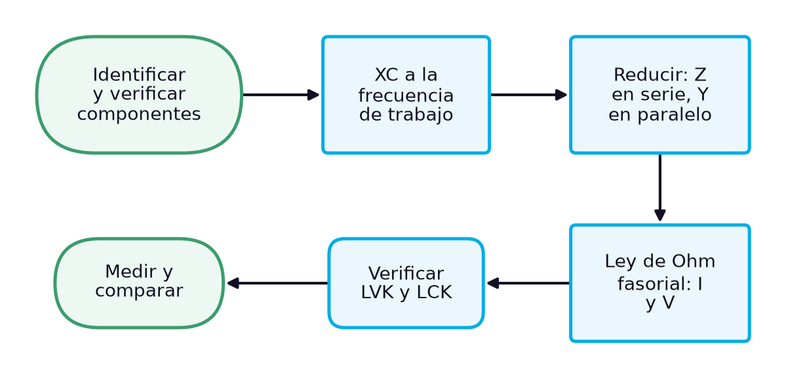
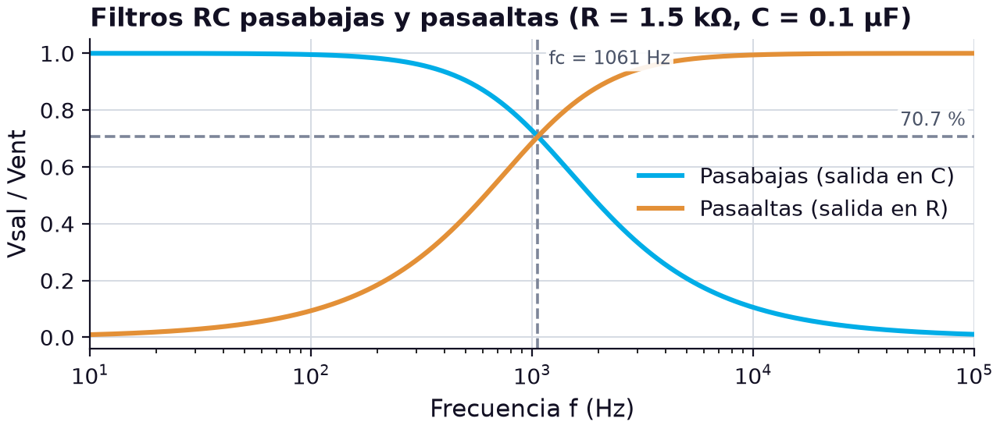

# Cálculo y medición de parámetros en circuitos RC en serie, en paralelo y mixtos: método, filtros, instrumentos y nomenclatura

> **Módulos:** IEL04 — Circuitos Eléctricos I
> **Duración:** 240 minutos (sesión teórico-práctica)
> **Nivel:** Pregrado
> **Semana:** 7 de 14 (corte evaluativo 2) · **Resultado de aprendizaje del módulo:** [[IEL04-RA2]] · **Trabajo independiente:** 5 h/semana

---

## 1. Metadatos de la Sesión

### 1.1 Continuidad curricular

Las semanas 4 y 6 analizaron por separado el circuito RC en serie, con la ley de voltajes de Kirchhoff, y el circuito RC en paralelo, con la ley de corrientes. Esta sesión cierra el RA2 integrando ambos: propone un método único para calcular cualquier circuito RC, lo aplica a circuitos mixtos, presenta el uso más común del RC —el filtro con su frecuencia de corte—, analiza cómo los instrumentos afectan las mediciones y ordena las unidades, la simbología y la nomenclatura del tema. La semana 8 inicia el RA3 con los circuitos RL, donde el mismo método se aplica cambiando el condensador por la bobina.

1. Semana 6: Circuito RC en paralelo: análisis y Ley de Corrientes de Kirchhoff
2. **→ Presente sesión (semana 7):** Cálculo y medición de parámetros en circuitos RC serie y paralelo: unidades, simbología y nomenclatura
3. Semana 8: Circuitos RL en serie y en paralelo: tipos e identificación de resistores e inductores, análisis con las leyes de voltajes y corrientes de Kirchhoff

### 1.2 Prerrequisitos

- Calcular impedancia, ángulo de fase y tensiones de un RC en serie aplicando la LVK fasorial (semana 4).
- Calcular admitancia y corrientes de un RC en paralelo aplicando la LCK fasorial (semana 6).
- Convertir fasores entre forma rectangular y polar, y operar con ellos.
- Identificar y verificar resistores y condensadores con ohmímetro y medidor LCR.
- Usar el osciloscopio para medir amplitudes y desfases, y el multímetro de verdadero valor eficaz.

---

## 2. Resultados de Aprendizaje

**RA IEL04-RA2:** Calcular un circuito resistivo, capacitivo y RC, sea en serie o paralelo.

**Criterios de evaluación:**
- **CE1** (cognitiva_conceptual): Identificar los tipos de resistores y capacitores.
- **CE2** (manipulacion_fisica): Realizar mediciones en un circuito resistivo y capacitivo.
- **CE3** (manipulacion_fisica): Realizar mediciones en un circuito RC.

**Unidades de competencia de la asignatura:**
- [[UC2]]: Coordinar actividades asociadas a sistemas eléctricos utilizando fuentes convencionales y no convencionales de energía.

Al finalizar la sesión, el estudiante estará en capacidad de lograr los siguientes resultados, que desarrollan el RA del módulo:

| # | Resultado de aprendizaje | Nivel (Taxonomía de Bloom) |
| --- | --- | --- |
| RA1 | **Identificar** los componentes y la topología de un circuito RC y elegir el método de cálculo adecuado para cada parte. (CE1) | Analizar |
| RA2 | **Calcular** impedancias, corrientes y tensiones de circuitos RC en serie, en paralelo y mixtos con fasores. (CE3) | Aplicar |
| RA3 | **Calcular** la frecuencia de corte de un filtro RC y predecir la tensión de salida a una frecuencia dada. (CE3) | Aplicar |
| RA4 | **Medir** tensiones y corrientes en un circuito RC mixto, evaluar el efecto de los instrumentos y justificar las diferencias con el cálculo. (CE2, CE3) | Evaluar |

---

## 3. Índice Temporizado (240 minutos)

| Bloque | Contenido | Duración |
| --- | --- | --- |
| 1 | Integrar lo visto en serie y en paralelo en un procedimiento de cálculo y medición | 20 min |
| 2 | Pasos del análisis fasorial: reactancias, reducción, ley de Ohm y verificación con Kirchhoff | 30 min |
| 3 | Reducción de un resistor en serie con un paralelo RC y reparto de tensiones y corrientes | 35 min |
| 4 | Filtros pasabajas y pasaaltas, fc = 1/(2πRC) y el 70.7 % | 35 min |
| 5 | Resistencia interna del generador, carga de la punta del osciloscopio, ancho de banda del multímetro | 30 min |
| 6 | Cuadro de magnitudes, unidades, prefijos, símbolos y notación fasorial | 25 min |
| 7 | Resistor en serie con un paralelo RC a 1 kHz: predecir, medir y justificar las diferencias | 50 min |
| 8 | Síntesis, cierre actitudinal y bibliografía | 15 min |
|  | **Total** | **240 min** |

---

## 4. Desarrollo Teórico

### 4.1 Introducción Conceptual (Bloque 1)

Las dos sesiones anteriores del RA2 trataron cada conexión por separado, y es natural que el estudiante termine con dos listas de fórmulas: una para el circuito en serie y otra para el paralelo. Pero los circuitos reales rara vez son puramente de un tipo. El filtro de entrada de un equipo, la red de compensación de un amplificador o el circuito de disparo de un tiristor combinan resistores y condensadores en serie y en paralelo a la vez. Lo que el técnico necesita no es memorizar más fórmulas, sino un **método** que funcione para cualquier combinación y que, además, le permita comprobar en el laboratorio si el circuito se comporta como debe.

Ese método existe y ya se ha usado sin nombrarlo: calcular las reactancias a la frecuencia de trabajo, reducir el circuito sumando impedancias en serie y admitancias en paralelo, aplicar la ley de Ohm en forma fasorial para obtener corrientes y tensiones, y verificar el resultado con las leyes de Kirchhoff. La medición cierra el ciclo. Una forma directa de comprobar el cálculo es medir la tensión de la fuente y la corriente total y dividirlas: en un ejemplo de Floyd, 10 V y 6.71 mA a 5 kHz dan una impedancia total de 1.49 kΩ para un circuito RC serie-paralelo [1]. El diagrama ordena el procedimiento completo.

*Figura 1. Procedimiento general de cálculo y medición de un circuito RC*

La sesión recorre ese procedimiento de principio a fin. Primero lo formaliza como una secuencia de pasos con sus ecuaciones; luego lo aplica a un circuito mixto, el caso que no se había tratado; después presenta la aplicación más común del circuito RC, el filtro, cuyo parámetro característico es la frecuencia de corte; analiza cómo el generador, el osciloscopio y el multímetro alteran lo que se mide; y ordena en un cuadro las magnitudes, unidades y símbolos del tema. El caso final pide predecir, medir y justificar las diferencias en un circuito RC mixto montado con los componentes ya conocidos de las semanas 4 y 6.

> **Nota pedagógica:** Esta sesión es también una preparación para el RA3: en la semana 8, el mismo diagrama sirve para los circuitos RL, cambiando solo el cálculo de la reactancia y el signo del ángulo.

### 4.2 Conceptos Clave

#### 4.2.1 Método general de cálculo con impedancias y admitancias (Bloque 2)

El análisis de un circuito RC en corriente alterna sinusoidal se apoya en una idea: a una frecuencia fija, cada elemento puede representarse por un número complejo, su impedancia, y con esos números se aplican las mismas leyes que en los circuitos resistivos de cd. La ley de Ohm se escribe en forma fasorial en tres versiones equivalentes, $\mathbf{V} = \mathbf{I}\mathbf{Z}$, $\mathbf{I} = \mathbf{V}/\mathbf{Z}$ y $\mathbf{Z} = \mathbf{V}/\mathbf{I}$, y, para circuitos en paralelo, con la admitancia: $\mathbf{I} = \mathbf{V}\mathbf{Y}$ [1]. Como estos cálculos son multiplicaciones y divisiones, conviene hacerlos en forma polar; las sumas y restas, en cambio, se hacen en forma rectangular [1].

$$
\mathbf{Z} = R + jX = Z\angle\theta, \qquad Z = \sqrt{R^{2} + X^{2}},\ \ \theta = \tan^{-1}\!\left(\frac{X}{R}\right), \qquad R = Z\cos\theta,\ \ X = Z\sin\theta
$$

donde $\mathbf{Z}$ es una impedancia fasorial en ohmios (Ω), $R$ su parte real (resistiva) en ohmios, $X$ su parte imaginaria (reactiva) en ohmios, negativa para un condensador ($X = -X_C$), $Z$ su magnitud en ohmios y $\theta$ su ángulo en grados (°). Las dos primeras relaciones convierten de forma rectangular a polar; las dos últimas, de polar a rectangular. Toda la dificultad del análisis está en elegir en cada paso la forma adecuada: rectangular para sumar, polar para multiplicar o dividir.

Con estas herramientas, el método general tiene seis pasos. Primero, identificar los componentes y medir sus valores reales, porque el cálculo con valores medidos es el que se comparará con el laboratorio. Segundo, calcular cada reactancia capacitiva a la frecuencia de trabajo, $X_C = 1/(2\pi f C)$. Tercero, reducir el circuito: sumar impedancias de los elementos en serie y admitancias de los elementos en paralelo, hasta obtener la impedancia total. Cuarto, aplicar la ley de Ohm para obtener la corriente total. Quinto, volver hacia atrás por el circuito, calculando la tensión de cada grupo en serie y la corriente de cada rama en paralelo. Sexto, verificar que las tensiones cumplen la LVK y las corrientes la LCK en forma fasorial. La tabla aplica el método al circuito en serie de la semana 4 como ejemplo de referencia.

**Tabla 1.** Método general aplicado al RC en serie de la semana 4 (1.5 kΩ, 0.1 µF, 5 V eficaces a 1 kHz)

| Paso | Operación | Forma | Resultado |
| --- | --- | --- | --- |
| 1 | Identificar y medir componentes | — | R = 1.5 kΩ, C = 0.1 µF |
| 2 | XC = 1/(2πfC) | magnitud | 1592 Ω |
| 3 | Z = R − jXC | rectangular → polar | 2187 ∠ −46.7° Ω |
| 4 | I = V/Z | polar | 2.29 ∠ 46.7° mA |
| 5 | VR = IR, VC = IXC | polar | 3.43 ∠ 46.7° V; 3.64 ∠ −43.3° V |
| 6 | VR + VC = VS | rectangular | 5.00 ∠ 0° V |

La tabla toma como referencia la tensión de la fuente, a 0°, en lugar de la corriente, como se hizo en la semana 4; por eso la corriente aparece adelantada 46.7°, $V_R$ con el mismo ángulo que la corriente y $V_C$ 90° atrás, en −43.3°. Cambiar la referencia gira todo el diagrama fasorial, pero no altera ni las magnitudes ni las diferencias de fase entre las magnitudes. En el paso 6, sumar los dos fasores en forma rectangular, $(2.35 + j2.50) + (2.65 - j2.50)$, devuelve exactamente $5.00 + j0$ V: la verificación confirma que no hubo errores de cálculo.

El método es el mismo para el paralelo: en el paso 3 se suman admitancias, $\mathbf{Y} = G + jB_C$, y en el paso 5 se calculan las corrientes de rama con la tensión común. En los circuitos mixtos se combinan ambos, como muestra la siguiente unidad. Lo importante es que el orden de los pasos no cambia y que el último, la verificación con Kirchhoff, nunca se omite: es la única forma de detectar un error de signo en un ángulo antes de ir al laboratorio.

> **Error frecuente:** Sumar fasores en forma polar sumando magnitudes y ángulos por separado. En forma polar solo se multiplican (magnitudes multiplicadas, ángulos sumados) o se dividen; para sumar hay que pasar a forma rectangular.

#### 4.2.2 Circuitos RC mixtos (serie-paralelo) (Bloque 3)

Un circuito RC mixto combina grupos en serie y grupos en paralelo. El caso más frecuente, y el que se montará en el laboratorio, es un resistor $R_1$ en serie con un grupo formado por un resistor $R_2$ en paralelo con un condensador $C$. Es, por ejemplo, el modelo de un condensador con fuga alimentado a través de una resistencia limitadora, o de la red de entrada de muchos instrumentos. Floyd dedica una sección completa al análisis de circuitos RC en serie-paralelo, con el mismo enfoque: combinar primero las partes en paralelo y luego las en serie [1]. No hace falta una fórmula nueva: basta aplicar el método general y cuidar en qué forma se escribe cada fasor.

El primer paso es reducir el grupo en paralelo. Su admitancia es $\mathbf{Y}_p = G_2 + jB_C$, y su impedancia, $\mathbf{Z}_p = 1/\mathbf{Y}_p$, se pasa a forma rectangular para poder sumarla con $R_1$. El resultado es un **equivalente en serie** del paralelo, una resistencia y una reactancia que, a esa frecuencia, se comportan igual que el grupo original [1]. Después, la impedancia total es la suma de $R_1$ con ese equivalente:

$$
\mathbf{Z}_T = R_1 + \mathbf{Z}_p = R_1 + \frac{1}{G_2 + jB_C}
$$

donde $\mathbf{Z}_T$ es la impedancia total en ohmios (Ω), $R_1$ la resistencia en serie en ohmios, $\mathbf{Z}_p$ la impedancia del grupo en paralelo en ohmios, $G_2 = 1/R_2$ la conductancia del resistor en paralelo en siemens (S) y $B_C = 2\pi f C$ la susceptancia del condensador en siemens. Con $R_1 = 1\ \text{k}\Omega$, $R_2 = 1.5\ \text{k}\Omega$ y $C = 0.1\ \mu\text{F}$ a 1 kHz: $G_2 = 0.667\ \text{mS}$, $B_C = 0.628\ \text{mS}$, $\mathbf{Y}_p = 0.916 \angle 43.3^\circ\ \text{mS}$ y $\mathbf{Z}_p = 1092 \angle -43.3^\circ\ \Omega = 795 - j749\ \Omega$. Por tanto $\mathbf{Z}_T = 1795 - j749\ \Omega = 1945 \angle -22.6^\circ\ \Omega$.

El segundo paso vuelve hacia atrás con la ley de Ohm. Con 5 V eficaces a 0°, la corriente total es $\mathbf{I} = \mathbf{V}_S/\mathbf{Z}_T = 2.57 \angle 22.6^\circ\ \text{mA}$. Esa corriente atraviesa $R_1$, cuya tensión está en fase con ella: $\mathbf{V}_{R1} = 2.57 \angle 22.6^\circ\ \text{V}$. La tensión del grupo en paralelo es $\mathbf{V}_p = \mathbf{I}\mathbf{Z}_p = (2.57 \angle 22.6^\circ)(1.092 \angle -43.3^\circ) \approx 2.81 \angle -20.7^\circ\ \text{V}$. Con esa tensión común se calculan las corrientes de las ramas: $I_{R2} = 2.81/1500 \approx 1.87\ \text{mA}$, en fase con $\mathbf{V}_p$, e $I_C = 2.81 \times 0.628 \times 10^{-3} \approx 1.76\ \text{mA}$, 90° adelantada respecto a $\mathbf{V}_p$.

**Tabla 2.** Resultados del circuito mixto R1 + (R2 ∥ C) con valores nominales (5 V eficaces a 1 kHz)

| Magnitud | Valor | Ángulo (ref. VS) | Comprobación |
| --- | --- | --- | --- |
| ZT | 1945 Ω | −22.6° | 1795 − j749 Ω |
| I | 2.57 mA | +22.6° | VS/ZT |
| VR1 | 2.57 V | +22.6° | en fase con I |
| Vp | 2.81 V | −20.7° | común a R2 y C |
| IR2 | 1.87 mA | −20.7° | en fase con Vp |
| IC | 1.76 mA | +69.3° | 90° delante de Vp |
| √(IR2² + IC²) | 2.57 mA | — | LCK: igual a I |
| VR1 + Vp (fasorial) | 5.00 V | 0° | LVK: igual a VS |

Las dos últimas filas son la verificación: la suma fasorial de las corrientes de rama devuelve la corriente total (LCK) y la suma fasorial de la tensión en $R_1$ y la del paralelo devuelve la tensión de la fuente (LVK). La tabla también muestra que en un circuito mixto conviven los dos comportamientos estudiados: en la parte serie se reparten tensiones que no suman aritméticamente (2.57 V + 2.81 V = 5.38 V > 5 V), y en la parte paralela, corrientes que tampoco lo hacen (1.87 mA + 1.76 mA = 3.63 mA > 2.57 mA). El ángulo total, −22.6°, es menor que el del paralelo solo porque $R_1$ añade resistencia sin añadir reactancia. Si la frecuencia subiera, el condensador tomaría más corriente del paralelo, la tensión $V_p$ bajaría y una fracción mayor de la tensión de la fuente caería en $R_1$.

> **Error frecuente:** Sumar $R_1$ directamente a la magnitud de $\mathbf{Z}_p$ (1000 + 1092 = 2092 Ω). La suma solo es correcta con la parte real del paralelo: $\mathbf{Z}_p$ debe convertirse primero a forma rectangular.

#### 4.2.3 El circuito RC como filtro: frecuencia de corte y ancho de banda (Bloque 4)

La aplicación más extendida del circuito RC en serie es el **filtro**: un circuito que deja pasar unas frecuencias y atenúa otras. El mismo RC en serie funciona de dos maneras según dónde se tome la salida. Si la salida se toma en el condensador, las frecuencias bajas pasan casi íntegras, porque la reactancia es grande y el condensador se queda con casi toda la tensión, mientras que las altas se atenúan: es un filtro **pasabajas**. Si la salida se toma en el resistor, ocurre lo contrario: las frecuencias bajas quedan bloqueadas y las altas pasan desde la entrada hasta la salida, y el circuito es un filtro **pasaaltas** [1]. En este último, la salida crece con la frecuencia y luego se nivela, acercándose a la tensión de entrada [1].

La frontera entre las frecuencias que pasan y las que se atenúan se define por convención. La frecuencia a la que la reactancia capacitiva es igual a la resistencia, en un filtro RC pasabajas o pasaaltas, se llama **frecuencia de corte** $f_c$ [1]. Al imponer $1/(2\pi f_c C) = R$ y despejar se obtiene [1]:

$$
f_c = \frac{1}{2\pi R C}, \qquad \frac{V_{sal}}{V_{ent}}\bigg|_{pasabajas} = \frac{1}{\sqrt{1 + (f/f_c)^{2}}}, \qquad \frac{V_{sal}}{V_{ent}}\bigg|_{pasaaltas} = \frac{f/f_c}{\sqrt{1 + (f/f_c)^{2}}}
$$

donde $f_c$ es la frecuencia de corte en hercios (Hz), $R$ la resistencia en ohmios (Ω), $C$ la capacitancia en faradios (F), $f$ la frecuencia de la señal en hercios, y $V_{sal}/V_{ent}$ la relación entre las magnitudes eficaces de salida y de entrada (adimensional). Las dos relaciones se deducen del divisor de tensión fasorial: en el pasabajas, $V_{sal}/V_{ent} = X_C/Z$, y en el pasaaltas, $R/Z$, con $Z = \sqrt{R^2 + X_C^2}$; al dividir numerador y denominador entre $R$ y usar $X_C/R = f_c/f$ se llega a las expresiones de arriba. En $f = f_c$ ambas valen $1/\sqrt{2} \approx 0.707$: a la frecuencia de corte la salida es el 70.7 % de su valor máximo [1].

Con los componentes de las semanas 4 y 6, $R = 1.5\ \text{k}\Omega$ y $C = 0.1\ \mu\text{F}$, $f_c = 1/(2\pi \times 1500 \times 0.1 \times 10^{-6}) \approx 1061\ \text{Hz}$, la misma frecuencia en la que se vio que $X_C = R$ y el ángulo vale 45°. La gráfica muestra la respuesta de ambos filtros entre 10 Hz y 100 kHz.

*Figura 2. Respuesta en frecuencia de un filtro RC pasabajas (salida en C) y pasaaltas (salida en R) con fc = 1061 Hz*

La gráfica muestra que las dos curvas se cruzan en la frecuencia de corte, a 0.707, y son simétricas respecto a ella en escala logarítmica. Una década por debajo de $f_c$ (106 Hz), el pasabajas entrega el 99.5 % de la entrada y el pasaaltas solo el 9.95 %; una década por encima (10.6 kHz), los papeles se invierten. El intervalo de frecuencias que un filtro deja pasar se llama **ancho de banda** [1]: para el pasabajas va de 0 Hz a $f_c$, y por encima de $f_c$ se considera que el filtro rechaza la señal [1].

En la práctica, esta es la herramienta con la que un técnico dimensiona un filtro: para eliminar el ruido de alta frecuencia de la señal de un sensor que cambia como mucho a 10 Hz, basta elegir $f_c$ algo por encima, por ejemplo 20 Hz, y calcular $RC = 1/(2\pi \times 20) \approx 8\ \text{ms}$, lo que se logra con 82 kΩ y 0.1 µF. En el laboratorio, $f_c$ se mide barriendo la frecuencia del generador hasta que la salida cae al 70.7 % de su valor en baja frecuencia.

> **Error frecuente:** Confundir la frecuencia de corte con la frecuencia a la que la salida es cero. En $f_c$ la salida todavía es el 70.7 % de la entrada: el filtro RC no corta de golpe, atenúa gradualmente.

#### 4.2.4 Instrumentos de medición y sus efectos en circuitos RC (Bloque 5)

Todo instrumento que se conecta a un circuito se convierte, durante la medición, en parte del circuito. Como todos los instrumentos tienden a afectar el circuito que se mide por el **efecto de carga**, la mayoría de las puntas de osciloscopio incorporan una resistencia en serie alta para reducirlo al mínimo [1]. En circuitos resistivos de cd, el efecto de carga se reduce a comparar la resistencia de entrada del voltímetro con la del circuito. En circuitos RC aparece un elemento nuevo: los instrumentos también tienen capacitancia de entrada, y su efecto crece con la frecuencia, igual que la de cualquier condensador.

La **punta de osciloscopio** es el caso típico. Las puntas con una resistencia en serie diez veces mayor que la resistencia de entrada del osciloscopio se llaman puntas ×10, y las que no la tienen, ×1; el osciloscopio ajusta su calibración al tipo de punta, y en la mayoría de las mediciones se recomienda la ×10, reservando la ×1 para señales muy pequeñas [1]. La punta ×10 debe compensarse antes de usarla con la onda cuadrada calibrada que ofrece casi todo osciloscopio [1]. Visto desde el circuito, la entrada del osciloscopio equivale a una resistencia de alrededor de 1 MΩ (10 MΩ con punta ×10) en paralelo con una capacitancia de decenas de picofaradios, a la que la punta ×1 y su cable añaden bastante más. Esa capacitancia forma, con el circuito, un RC en paralelo no deseado, cuya reactancia es:

$$
X_{Cp} = \frac{1}{2\pi f C_p}
$$

donde $X_{Cp}$ es la reactancia de la capacitancia de entrada del instrumento en ohmios (Ω), $f$ la frecuencia de la señal en hercios (Hz) y $C_p$ la capacitancia total de entrada de la punta, el cable y el osciloscopio en faradios (F). Con $C_p = 100\ \text{pF}$, a 1 kHz la reactancia es de 1.59 MΩ, más de mil veces los 1.5 kΩ del circuito del caso: el efecto es despreciable. A 100 kHz baja a 15.9 kΩ, apenas diez veces la resistencia del circuito, y la medición ya se ve afectada. La regla práctica es que la impedancia de entrada del instrumento, a la frecuencia de trabajo, sea al menos cien veces mayor que la impedancia del punto que se mide.

El **generador de funciones** también forma parte del circuito: tiene una resistencia interna, típicamente de 50 Ω, en serie con su salida. Si el circuito tiene una impedancia de unos 2 kΩ, la caída en esa resistencia es del orden del 2 %, y la tensión en los bornes del generador depende de la carga. Por eso la tensión aplicada se mide siempre en los bornes del circuito, con el circuito conectado, y no se toma el valor que indica el dial del generador. El **multímetro digital**, por su parte, tiene un ancho de banda limitado en ca: muchos modelos solo miden con exactitud hasta unos cientos de hercios o pocos kilohercios, y solo los de verdadero valor eficaz leen correctamente formas de onda no sinusoidales. Como amperímetro, además, introduce una pequeña resistencia en serie que modifica la corriente de la rama. La tabla resume estos efectos.

**Tabla 3.** Efectos de los instrumentos en las mediciones de circuitos RC

| Instrumento | Parámetro interno | Efecto sobre la medición | Cómo reducirlo |
| --- | --- | --- | --- |
| Generador de funciones | resistencia de salida (≈50 Ω) | la tensión aplicada baja al conectar la carga | medir VS en los bornes del circuito |
| Osciloscopio con punta ×1 | ≈1 MΩ ∥ capacitancia alta | carga capacitiva a frecuencias altas | usar punta ×10 compensada |
| Osciloscopio con punta ×10 | ≈10 MΩ ∥ pocos pF | efecto mínimo | compensarla con la onda cuadrada de referencia |
| Multímetro como voltímetro ca | ancho de banda limitado | lectura baja a frecuencias altas | verificar la especificación; usar el osciloscopio |
| Multímetro como amperímetro | resistencia en serie | reduce ligeramente la corriente de la rama | preferir un resistor sensor pequeño |
| Puntas con tierra común | tierras unidas al chasis | cortocircuita elementos flotantes | medir con resta de canales |

> **Nota pedagógica:** Antes de atribuir una diferencia entre cálculo y medición al «error del instrumento», conviene estimarla: si la reactancia de entrada del osciloscopio es mil veces mayor que la impedancia medida, el instrumento no explica una diferencia del 5 %; hay que buscar la causa en otro lado.

#### 4.2.5 Parámetros, unidades, simbología y nomenclatura de los circuitos RC (Bloque 6)

El contenido procedimental del RA2 pide diferenciar los parámetros del circuito RC identificando unidades de medida, múltiplos y submúltiplos, simbología y nomenclatura. A lo largo de las semanas 4, 6 y 7 han aparecido once magnitudes distintas, y en un informe de laboratorio es fácil confundirlas. La clave para ordenarlas es agruparlas en tres familias. La primera son las **oposiciones**, que se miden en ohmios: resistencia $R$, reactancia capacitiva $X_C$ e impedancia $Z$. La segunda son sus **recíprocas**, que se miden en siemens: conductancia $G$, susceptancia capacitiva $B_C$ y admitancia $Y$ [1]. La tercera son las **magnitudes de tiempo y frecuencia**: la constante de tiempo $\tau$, en segundos, y las frecuencias $f$ y $f_c$, en hercios, a las que se suma el ángulo de fase $\theta$, en grados.

**Tabla 4.** Parámetros de los circuitos RC: símbolo, unidad, submúltiplos habituales y fórmula

| Parámetro | Símbolo | Unidad | Submúltiplos habituales | Fórmula o definición |
| --- | --- | --- | --- | --- |
| Resistencia | R | ohmio (Ω) | kΩ, MΩ | V/I en el resistor |
| Capacitancia | C | faradio (F) | pF, nF, µF | Q/V |
| Reactancia capacitiva | XC | ohmio (Ω) | kΩ | 1/(2πfC) |
| Impedancia | Z, Z∠θ | ohmio (Ω) | kΩ | R − jXC (serie) |
| Conductancia | G | siemens (S) | mS, µS | 1/R |
| Susceptancia capacitiva | BC | siemens (S) | mS, µS | 2πfC |
| Admitancia | Y, Y∠θ | siemens (S) | mS, µS | G + jBC (paralelo) |
| Constante de tiempo | τ | segundo (s) | ms, µs | RC |
| Frecuencia de corte | fc | hercio (Hz) | kHz | 1/(2πRC) |
| Ángulo de fase | θ | grado (°) | — | tan⁻¹ de la relación reactiva/resistiva |
| Tensión y corriente eficaces | V, I | voltio (V), amperio (A) | mV, mA | magnitud del fasor |

Tres observaciones evitan los errores más comunes al leer la tabla. La constante de tiempo y la frecuencia de corte dependen del mismo producto $RC$: $f_c = 1/(2\pi\tau)$, así que un circuito con $\tau = 150\ \mu\text{s}$ tiene $f_c \approx 1061\ \text{Hz}$, y medir una permite calcular la otra. Los ohmios y los siemens son recíprocos, de modo que los kiloohmios se corresponden con los milisiemens: 1.5 kΩ son 0.667 mS. Y el producto de kiloohmios por microfaradios da milisegundos, lo que permite estimar $\tau$ de memoria antes de usar la calculadora.

En cuanto a la **notación**, se ha usado la convención de Floyd: las letras rectas en negrita representan fasores, con magnitud y ángulo ($\mathbf{V}$, $\mathbf{I}$, $\mathbf{Z}$, $\mathbf{Y}$), y las letras cursivas simples solo su magnitud ($V$, $I$, $Z$, $Y$) [1]. La letra $j$ indica un giro de +90° en el plano complejo; así, $-jX_C$ indica que la reactancia capacitiva está a −90° de la resistencia, y $+jB_C$, que la susceptancia está a +90° de la conductancia [1]. Los subíndices identifican el elemento o el grupo: $V_R$ y $V_C$ para las tensiones en el resistor y el condensador; $I_T$ o $I_{tot}$ para la corriente total; $Z_p$ para la impedancia de un grupo en paralelo; y $V_S$ para la tensión de la fuente.

En la **simbología** de los planos, el resistor se dibuja como un rectángulo o una línea en zigzag con el designador R1, R2…, y el condensador con dos trazos paralelos y el designador C1, C2…, con una placa curva si es polarizado. La fuente sinusoidal se representa con un círculo que contiene una onda seno, junto a su valor eficaz y su frecuencia; la fuente de onda cuadrada, con un pulso. En los informes conviene anotar junto a cada designador tanto el valor nominal como el medido, y expresar siempre las tensiones y corrientes de ca como valores eficaces, indicándolo, salvo que se especifique que son valores pico o pico a pico.

> **Error frecuente:** Mezclar valores eficaces con valores pico a pico en un mismo cálculo. El osciloscopio suele mostrar amplitudes pico a pico y el multímetro valores eficaces; en una onda seno, el valor pico a pico es $2\sqrt{2} \approx 2.83$ veces el eficaz.

---

## 5. Caso de Estudio Aplicado: Cálculo y medición de un circuito RC mixto en el laboratorio (Bloque 7)

### 5.1 Descripción del circuito y de los componentes

El circuito es el de la unidad sobre circuitos mixtos: un resistor $R_1$ en serie con el paralelo de $R_2$ y $C$, alimentado con 5.00 V eficaces a 1 kHz. Se usan componentes ya conocidos: $R_2$ es el resistor de 1.5 kΩ de las semanas 4 y 6, medido en 1492 Ω; $C$ es el condensador de película C2 del kit, medido en 97.8 nF; y $R_1$ es un resistor nuevo marcado marrón-negro-rojo-oro, es decir, 1 kΩ ±5 %, que el ohmímetro mide en 996 Ω, dentro de su tolerancia. La identificación y la verificación de los tres componentes cubren el criterio CE1. Las lecturas del multímetro y del osciloscopio que se usan más abajo son valores de ejemplo para ilustrar el procedimiento.

### 5.2 Predicción con los valores medidos

Siguiendo el método general: $G_2 = 1/1492 = 0.670\ \text{mS}$ y $B_C = 2\pi(1000)(97.8 \times 10^{-9}) = 0.615\ \text{mS}$, de modo que $\mathbf{Y}_p = 0.909 \angle 42.5^\circ\ \text{mS}$ y $\mathbf{Z}_p = 1100 \angle -42.5^\circ\ \Omega = 811 - j743\ \Omega$. La impedancia total es:

$$
\mathbf{Z}_T = 996 + (811 - j743) = 1807 - j743\ \Omega = 1954 \angle -22.4^\circ\ \Omega
$$

donde $\mathbf{Z}_T$ es la impedancia total en ohmios (Ω), obtenida sumando en forma rectangular la resistencia $R_1$ y el equivalente en serie del paralelo, y expresada después en forma polar. Con la ley de Ohm fasorial [1]: $I = 5.00/1954 \approx 2.56\ \text{mA}$, adelantada 22.4° a la tensión de la fuente; $V_{R1} = (2.56)(0.996) \approx 2.55\ \text{V}$; $V_p = (2.56)(1.100) \approx 2.81\ \text{V}$; $I_{R2} = 2.81/1492 \approx 1.89\ \text{mA}$; e $I_C = 2.81 \times 0.615 \approx 1.73\ \text{mA}$. La verificación con Kirchhoff cierra: $\sqrt{1.89^2 + 1.73^2} \approx 2.56\ \text{mA}$, y la suma fasorial de 2.55 V a 0° y 2.81 V a −42.5° (tomando la corriente como referencia) da 5.00 V. Para el osciloscopio, un adelanto de 22.4° a 1 kHz equivale a $\Delta t = (22.4/360)(1000\ \mu\text{s}) \approx 62\ \mu\text{s}$.

### 5.3 Mediciones y comparación

La tensión de la fuente se ajusta a 5.00 V eficaces medidos en los bornes del circuito, con el circuito conectado, para eliminar el efecto de la resistencia interna del generador. Las tensiones $V_{R1}$ y $V_p$ se miden con el multímetro de verdadero valor eficaz, cuya exactitud a 1 kHz se verificó en su hoja de datos; las corrientes de rama se miden intercalando el multímetro como amperímetro; y el desfase de la corriente total se mide con un resistor sensor de 10 Ω y la punta ×10 compensada.

**Tabla 5.** Circuito RC mixto R1 + (R2 ∥ C) a 1 kHz: predicción con valores medidos y mediciones (lecturas de ejemplo)

| Magnitud | Predicción | Medido | Diferencia | Causa probable de la diferencia |
| --- | --- | --- | --- | --- |
| I | 2.56 mA | 2.55 mA | −0.4 % | resistencia del amperímetro |
| VR1 | 2.55 V | 2.54 V | −0.4 % | resolución del multímetro |
| Vp | 2.81 V | 2.82 V | +0.4 % | tolerancia de lectura en ca |
| IR2 | 1.89 mA | 1.88 mA | −0.5 % | resistencia del amperímetro |
| IC | 1.73 mA | 1.73 mA | 0.0 % | — |
| Δt (I respecto a VS) | 62 µs | 61 µs | −1.6 % | resolución de los cursores |
| θ | 22.4° | 22.0° | 0.4° | resolución de los cursores |

### 5.4 Conclusiones

Todas las magnitudes medidas quedan a menos del 2 % de la predicción, y cada diferencia tiene una causa física identificable, coherente con la unidad sobre instrumentos. El caso muestra, además, lo que distingue a un circuito mixto: en la parte serie, $V_{R1} + V_p = 5.36\ \text{V}$ aritméticos frente a 5.00 V de la fuente; en la parte paralela, $I_{R2} + I_C = 3.61\ \text{mA}$ aritméticos frente a 2.55 mA totales. Ambas leyes de Kirchhoff se cumplen solo en forma fasorial. Con este caso se completan los tres criterios del RA2: se identificaron y verificaron resistores y condensadores, se midieron circuitos resistivos y capacitivos, y se midió un circuito RC con las dos leyes de Kirchhoff. El mismo procedimiento se reutilizará con bobinas a partir de la semana 8.

Conviene comparar también con la predicción hecha con valores nominales en la unidad sobre circuitos mixtos: allí la corriente total era de 2.57 mA y el ángulo de 22.6°, frente a 2.56 mA y 22.4° con los valores medidos. En este circuito la diferencia es pequeña porque los componentes están cerca de su valor nominal; con un condensador de ±20 % en el extremo de su tolerancia, el ángulo podría cambiar varios grados, y solo la predicción con valores medidos permitiría separar el efecto de los componentes del efecto de los instrumentos.

> **Nota pedagógica:** La columna «Causa probable» es la parte más valiosa de un informe de laboratorio: obliga a comparar el tamaño de cada efecto con el tamaño de la diferencia observada, en lugar de atribuirlo todo a un genérico «error experimental».

---

## 6. Síntesis (Bloque 8)

La sesión convirtió dos listas de fórmulas en un solo método. Cualquier circuito RC, en serie, en paralelo o mixto, se resuelve con los mismos pasos: verificar los componentes, calcular $X_C = 1/(2\pi f C)$, **sumar impedancias en serie y admitancias en paralelo**, aplicar la ley de Ohm fasorial y volver hacia atrás por el circuito, y verificar siempre con las leyes de Kirchhoff en forma fasorial. La elección de la forma —rectangular para sumar, polar para multiplicar y dividir— es la única destreza nueva que exige. El mismo producto $RC$ que fija la constante de tiempo fija también la frecuencia de corte de un filtro, $f_c = 1/(2\pi RC)$, donde la salida cae al 70.7 % y que separa las frecuencias que el circuito deja pasar de las que atenúa. El caso del circuito mixto mostró que, con componentes verificados y una predicción hecha con sus valores medidos, la diferencia entre el cálculo y la medición queda por debajo del 2 %, y que cada diferencia puede atribuirse a una causa concreta: la resistencia interna del generador, la del amperímetro, la capacitancia de las puntas o la resolución de los cursores. Con esto se completa el RA2: calcular y medir circuitos resistivos, capacitivos y RC en serie o en paralelo, con sus unidades y su nomenclatura. La semana 8 aplica el mismo método a los circuitos RL.

### Componente Actitudinal

> *Un informe que justifica cada diferencia con una causa medible es un acto de honestidad profesional: quien lo lea, en el laboratorio o en una empresa, puede confiar en los datos sin tener que repetir las mediciones del equipo.*

---

## 7. Bibliografía (Formato IEEE)

[1] T. L. Floyd, Principios de circuitos eléctricos, 8.ª ed. México: Pearson Educación, 2007.

[2] R. L. Boylestad, Introducción al análisis de circuitos, 10.ª ed. México: Pearson Educación, 2004.

[3] M. F. P. Deorsola y P. Morcelle del Valle, Circuitos eléctricos. Parte 1, 1.ª ed. La Plata: Editorial de la Universidad de La Plata, 2017.
