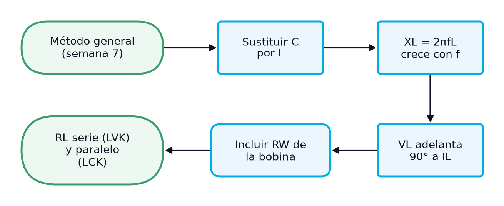
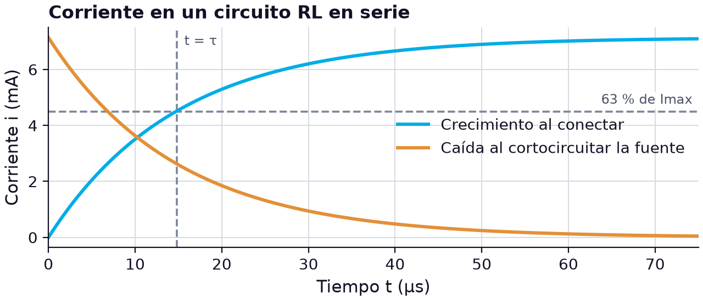
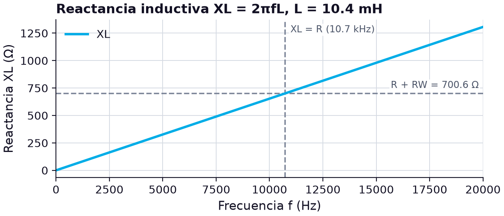

# Circuitos RL en serie y en paralelo: reactancia inductiva, impedancia y leyes de Kirchhoff con la bobina real

> **Módulos:** IEL04 — Circuitos Eléctricos I
> **Duración:** 240 minutos (sesión teórico-práctica)
> **Nivel:** Pregrado
> **Semana:** 8 de 14 (corte evaluativo 2) · **Resultado de aprendizaje del módulo:** [[IEL04-RA3]] · **Trabajo independiente:** 5 h/semana

---

## 1. Metadatos de la Sesión

### 1.1 Continuidad curricular

Las semanas 4 a 7 desarrollaron el RA2 con los circuitos RC y cerraron con un método general de cálculo y medición. Esta sesión abre el RA3 sustituyendo el condensador por la bobina de la semana 2: el método es el mismo, pero la reactancia inductiva crece con la frecuencia, la tensión de la bobina adelanta a su corriente y la resistencia de devanado, que ya se midió en el kit, deja de ser despreciable. Se tratan en una sola sesión el circuito RL en serie, con la ley de voltajes de Kirchhoff, y el circuito RL en paralelo, con la ley de corrientes. La semana 9 completa el RA3 con el cálculo y la medición de parámetros según el conexionado, antes del examen de la semana 10.

1. Semana 7: Cálculo y medición de parámetros en circuitos RC serie y paralelo: unidades, simbología y nomenclatura
2. **→ Presente sesión (semana 8):** Circuitos RL en serie y en paralelo: análisis con las leyes de voltajes y corrientes de Kirchhoff
3. Semana 9: Cálculo y medición de parámetros en circuitos RL serie y paralelo según el tipo de conexionado

### 1.2 Prerrequisitos

- Explicar la inductancia, la ley de Faraday y la resistencia de devanado de una bobina (semana 2).
- Aplicar el método general de análisis fasorial de circuitos RC (semana 7).
- Calcular impedancias en serie y admitancias en paralelo en forma rectangular y polar.
- Identificar resistores por su código de colores e inductores por su marcado (semanas 2 y 4).
- Medir amplitudes y desfases con el osciloscopio y la resta de canales.

---

## 2. Resultados de Aprendizaje

**RA IEL04-RA3:** Calcular un circuito resistivo, inductivo y RL, sea en serie o paralelo.

**Criterios de evaluación:**
- **CE1** (cognitiva_conceptual): Identificar los tipos de resistores e inductores.
- **CE2** (manipulacion_fisica): Realizar mediciones en un circuito resistivo e inductivo.
- **CE3** (manipulacion_fisica): Realizar mediciones en un circuito RL.

**Unidades de competencia de la asignatura:**
- [[UC2]]: Coordinar actividades asociadas a sistemas eléctricos utilizando fuentes convencionales y no convencionales de energía.

Al finalizar la sesión, el estudiante estará en capacidad de lograr los siguientes resultados, que desarrollan el RA del módulo:

| # | Resultado de aprendizaje | Nivel (Taxonomía de Bloom) |
| --- | --- | --- |
| RA1 | **Identificar** el resistor y el inductor de un circuito RL y medir la resistencia de devanado que debe incluirse en el cálculo. (CE1) | Aplicar |
| RA2 | **Calcular** la constante de tiempo y la reactancia inductiva de un circuito RL y explicar su dependencia con la frecuencia. (CE3) | Comprender |
| RA3 | **Analizar** un circuito RL en serie y uno en paralelo aplicando las leyes de voltajes y de corrientes de Kirchhoff con fasores. (CE3) | Analizar |
| RA4 | **Medir** tensiones y corrientes en circuitos RL en serie y en paralelo y evaluar el efecto de la resistencia de devanado en los resultados. (CE2, CE3) | Evaluar |

---

## 3. Índice Temporizado (240 minutos)

| Bloque | Contenido | Duración |
| --- | --- | --- |
| 1 | Qué cambia al sustituir el condensador por la bobina: reactancia creciente y tensión adelantada | 20 min |
| 2 | Tipos de resistores e inductores, resistencia de devanado y elección de componentes | 25 min |
| 3 | Crecimiento y caída exponencial de la corriente y τ = L/R | 30 min |
| 4 | XL = 2πfL, tensión adelantada 90° y dependencia con la frecuencia | 30 min |
| 5 | Z = R + jXL, ángulo de fase y suma fasorial VS = VR + VL | 40 min |
| 6 | Y = G − jBL, corrientes de rama y suma fasorial IT = IR + IL | 40 min |
| 7 | La bobina de 10.4 mH con un resistor de 680 Ω a 10 kHz: efecto de la resistencia de devanado | 40 min |
| 8 | Síntesis, cierre actitudinal y bibliografía | 15 min |
|  | **Total** | **240 min** |

---

## 4. Desarrollo Teórico

### 4.1 Introducción Conceptual (Bloque 1)

Si en cualquiera de los circuitos RC de las semanas anteriores se sustituye el condensador por una bobina, se obtiene un circuito RL. A primera vista es un cambio menor: el método de análisis de la semana 7 sigue valiendo paso a paso. Pero el comportamiento del circuito cambia de forma profunda, porque la bobina es el elemento dual del condensador. Donde el condensador se oponía a los cambios de tensión, la bobina se opone a los cambios de corriente; donde la reactancia capacitiva disminuía con la frecuencia, la inductiva aumenta; y donde la corriente del condensador adelantaba a su tensión, en la bobina es la tensión la que adelanta a la corriente.

Los circuitos RL están en todas partes en los sistemas eléctricos, porque casi toda carga industrial es inductiva: un motor, un transformador o una bobina de contactor se modelan, en primera aproximación, como una resistencia en serie con una inductancia. En la electrónica, los circuitos RL se usan como filtros, como limitadores de la corriente de arranque y como elementos de temporización. En corriente continua, el circuito RL en serie responde con una corriente que crece y decae de forma exponencial, con una constante de tiempo igual a la inductancia dividida entre la resistencia [1].

*Figura 1. Qué cambia al pasar de los circuitos RC a los circuitos RL*

El diagrama marca los cuatro cambios que la sesión desarrolla. Los tres primeros son consecuencia directa de la física de la bobina: la reactancia inductiva, su crecimiento con la frecuencia y el adelanto de la tensión. El cuarto es práctico y no tenía equivalente en los circuitos RC: una bobina real tiene una resistencia de devanado que puede ser comparable a las resistencias del circuito y que, si se ignora, produce diferencias apreciables entre el cálculo y la medición. La sesión trata el circuito en serie y el circuito en paralelo, con sus leyes de Kirchhoff, y termina midiendo ambos con la bobina de 10 mH del kit, cuya resistencia de devanado ya se conoce.

> **Nota pedagógica:** El RA3 dispone solo de dos semanas antes del examen de la semana 10. Por eso esta sesión reúne serie y paralelo, apoyándose en todo lo que ya se construyó con los circuitos RC: conviene tener a mano las tablas comparativas de las semanas 6 y 7.

### 4.2 Conceptos Clave

#### 4.2.1 Resistores e inductores del circuito RL: identificación y modelo real de la bobina (Bloque 2)

El primer criterio del RA3 pide identificar los tipos de resistores e inductores. Los resistores se estudiaron en la semana 4: fijos de película de carbón, de película metálica, de composición, bobinados de potencia y *chip* de montaje superficial, identificados por su código de colores o su código de tres dígitos [1]. Los inductores se estudiaron en la semana 2: fijos o variables, con núcleo de aire, de hierro o de ferrita, en forma de solenoide o de toroide [1], [2]. Lo nuevo en esta sesión es cómo se combinan en un circuito RL y qué dato adicional hay que obtener de la bobina antes de calcular.

Ese dato es la **resistencia de devanado**. Los inductores, igual que los condensadores, no son ideales: todo inductor tiene asociada una resistencia, la de las vueltas de alambre, y una capacitancia parásita entre las vueltas [2]. Para la mayoría de las aplicaciones, la capacitancia parásita puede ignorarse y el modelo práctico de la bobina es su inductancia $L$ en serie con la resistencia $R_l$ [2]. Mientras el condensador puede tratarse casi siempre como ideal con buena precisión, en el inductor $R_l$ a menudo debe incluirse en el análisis y puede tener un efecto pronunciado en la respuesta del sistema; su valor va desde unos pocos ohmios hasta unos cuantos cientos [2]. Cuanto más largo o más delgado es el alambre, mayor es esa resistencia [2].

Para decidir si la resistencia de devanado importa en un circuito concreto, basta compararla con la reactancia inductiva a la frecuencia de trabajo. El cociente entre ambas se conoce como **factor de calidad** de la bobina, $Q = X_L/R_W$, y se tratará en detalle con la resonancia en el RA4. Aquí sirve como criterio rápido: si $Q$ es mayor que 10, la bobina puede tratarse como casi ideal; si es menor, la resistencia de devanado debe entrar en el cálculo. Para la bobina L3 del kit, con 10.4 mH y 24.6 Ω, a 10 kHz $X_L \approx 654\ \Omega$ y $Q \approx 27$; a 1 kHz, $X_L \approx 65\ \Omega$ y $Q \approx 2.7$. La misma bobina es casi ideal a 10 kHz y claramente resistiva a 1 kHz.

**Tabla 1.** Componentes del kit disponibles para los circuitos RL y su identificación

| Ref. | Tipo | Marcado | Valor nominal | Valor medido | RW medida | Q a 10 kHz |
| --- | --- | --- | --- | --- | --- | --- |
| R | resistor de película | azul-gris-marrón-oro | 680 Ω ±5 % | 676 Ω | — | — |
| L1 | inductor radial | 102J | 1 mH ±5 % | 1.03 mH | 3.2 Ω | 20 |
| L2 | inductor moldeado | 472K | 4.7 mH ±10 % | 4.62 mH | 9.8 Ω | 30 |
| L3 | bobina con núcleo de ferrita | 103K | 10 mH ±10 % | 10.4 mH | 24.6 Ω | 27 |

La tabla reúne los valores medidos en la semana 2 y un resistor nuevo de 680 Ω, cuyo código de colores se lee como 6, 8 y un cero, con ±5 %. Para las prácticas se elige L3, porque su inductancia es la mayor y los efectos inductivos se observan con claridad a frecuencias de algunos kilohercios, y el resistor de 680 Ω, porque a 10 kHz su valor es parecido a la reactancia de L3, de modo que ninguno de los dos elementos oculta al otro. En la elección también importa la corriente nominal de la bobina: en circuitos de señal con algunos miliamperios no es un problema, pero en aplicaciones de potencia una corriente excesiva satura el núcleo y reduce la inductancia.

Antes de cada montaje se repiten las verificaciones de la semana 2: continuidad del devanado con el ohmímetro, resistencia de devanado y, si es posible, inductancia con el medidor LCR [2]. Además, la bobina se coloca lejos de otras bobinas y de piezas metálicas, para evitar acoplamientos que alteren su inductancia.

> **Error frecuente:** Medir la resistencia de devanado con el ohmímetro y restarla de la resistencia del circuito, o ignorarla por completo. En el modelo práctico, $R_W$ se suma a las resistencias que estén en serie con la bobina, y en un circuito en paralelo forma parte de la rama inductiva.

#### 4.2.2 Respuesta del circuito RL en serie con cd: constante de tiempo L/R (Bloque 3)

Cuando se conecta una fuente de cd $V_S$ a un resistor en serie con una bobina, la corriente no puede saltar de cero a su valor final: la bobina se opone al cambio. En el primer instante, toda la tensión de la fuente aparece como tensión inducida en la bobina y la corriente es nula; a medida que la corriente crece, la tensión en el resistor aumenta y la de la bobina disminuye, hasta que la corriente se estabiliza en $V_S/R$ y la bobina, con corriente constante, ya no tiene tensión inducida. Cuando por un inductor circula una corriente continua constante, no hay tensión inducida; solo queda la caída en la resistencia de devanado, y la inductancia se comporta como un cortocircuito [1]. Es exactamente el comportamiento dual de la carga del condensador de la semana 4.

Al plantear la ley de voltajes de Kirchhoff, $V_S = iR + L\,di/dt$, se obtiene una ecuación diferencial de primer orden de la misma forma que la del RC. Su solución, para una corriente inicial nula, es:

$$
i(t) = \frac{V_S}{R}\left(1 - e^{-t/\tau}\right), \qquad v_L(t) = V_S\,e^{-t/\tau}, \qquad \tau = \frac{L}{R}
$$

donde $i(t)$ es la corriente del circuito en amperios (A), $v_L(t)$ la tensión en la bobina en voltios (V), $V_S$ la tensión de la fuente en voltios, $R$ la resistencia total del lazo en ohmios (Ω), incluida la de devanado, $L$ la inductancia en henrios (H), $t$ el tiempo en segundos (s) y $\tau$ la constante de tiempo en segundos. La constante de tiempo de un circuito RL en serie es la inductancia dividida entre la resistencia [1], y el libro de cátedra de la UNLP llega al mismo resultado al resolver la ecuación del circuito por separación de variables: el cociente entre la característica de la parte reactiva y la de la parte no reactiva tiene dimensión de tiempo [3]. Como en el RC, en cada constante de tiempo la corriente cambia un 63 % de lo que le falta, y tras cinco constantes el transitorio ha terminado [1].

Con la bobina L3 del kit (10.4 mH) y el resistor de 676 Ω, la resistencia total del lazo es $676 + 24.6 = 700.6\ \Omega$, y $\tau = 10.4 \times 10^{-3}/700.6 \approx 14.8\ \mu\text{s}$. Con 5 V, la corriente final es $5/700.6 \approx 7.14\ \text{mA}$; en $t = \tau$ la corriente vale el 63 %, unos 4.50 mA, y a los 74 µs el circuito está en régimen permanente. Las constantes de tiempo de los circuitos RL de laboratorio son mucho más cortas que las de los RC, porque los henrios son una unidad grande y las inductancias prácticas se miden en milihenrios.

*Figura 2. Crecimiento y caída de la corriente en un RL en serie con VS = 5 V, L = 10.4 mH y R = 700.6 Ω (τ = 14.8 µs)*

La gráfica es idéntica en forma a la de carga y descarga del condensador, con la corriente en lugar de la tensión. La curva de caída supone que la fuente se sustituye por un camino de baja resistencia, como hace la salida de un generador de onda cuadrada cuando vuelve a cero [1]. Si en lugar de eso el circuito se abre bruscamente, la corriente no tiene por dónde seguir circulando, $di/dt$ se hace enorme y aparece la sobretensión inducida estudiada en la semana 2. Por eso en los circuitos de relés y contactores se coloca un diodo o una red RC en paralelo con la bobina, para ofrecer a la corriente un camino de descarga.

> **Hallazgo contraintuitivo:** Aumentar la resistencia de un circuito RL acorta su constante de tiempo, al contrario que en el RC, donde la alarga. En el RL, una resistencia mayor reduce la corriente final y la bobina la alcanza antes.

#### 4.2.3 Reactancia inductiva y respuesta sinusoidal de la bobina (Bloque 4)

Con una fuente sinusoidal, la corriente de la bobina cambia continuamente, y con ella la tensión inducida. Según $v = L\,di/dt$, la tensión es proporcional a la rapidez de cambio de la corriente: máxima cuando la corriente cruza por cero, que es cuando cambia más deprisa, y nula en los picos de la corriente, donde por un instante la corriente no cambia y $v = L(0) = 0$ [1]. El resultado es que **en un inductor, la tensión adelanta 90° a la corriente** [1], la relación inversa a la del condensador. Idealmente, el ángulo entre la corriente y la tensión en el inductor siempre es de 90° [1].

La oposición de la bobina a la corriente sinusoidal se llama **reactancia inductiva**, se mide en ohmios [1] y se simboliza $X_L$. Es directamente proporcional a la frecuencia y a la inductancia [1]: a mayor frecuencia, la corriente cambia más rápido para la misma amplitud y la tensión inducida que se opone es mayor; a mayor inductancia, mayor es la tensión inducida por el mismo cambio. De $v = L\,di/dt$ aplicada a una corriente sinusoidal se obtiene:

$$
X_L = 2\pi f L
$$

donde $X_L$ es la reactancia inductiva en ohmios (Ω), $f$ la frecuencia en hercios (Hz) y $L$ la inductancia en henrios (H). Con la bobina L3 del kit, de 10.4 mH, a 1 kHz, $X_L = 2\pi(1000)(0.0104) \approx 65.3\ \Omega$; a 10 kHz, 653 Ω; y a 20 kHz, 1307 Ω. Con la reactancia, la ley de Ohm vale en magnitudes eficaces, $V_L = I X_L$, y en forma fasorial la reactancia inductiva se escribe $+jX_L$, a +90° de la resistencia, con el signo contrario al de la reactancia capacitiva.

Los extremos de la fórmula confirman lo ya visto. Con $f = 0$, en cd, la reactancia es nula y la bobina ideal es un cortocircuito; solo queda su resistencia de devanado [1]. A frecuencias muy altas, la reactancia se hace enorme y la bobina bloquea la corriente, que es la función de un *choke* de radiofrecuencia. Entre ambos extremos la reactancia crece en línea recta con la frecuencia, como muestra la gráfica, en la que se compara con la resistencia total del lazo del caso de estudio.

*Figura 3. Reactancia inductiva de la bobina L3 (10.4 mH) en función de la frecuencia, comparada con la resistencia total de 700.6 Ω*

La recta cruza la resistencia total en unos 10.7 kHz: por debajo de esa frecuencia domina el resistor, y por encima, la bobina. Por eso el caso de estudio trabaja a 10 kHz, donde $X_L \approx 653\ \Omega$ y ambas oposiciones son comparables. Si se hiciera a 1 kHz, como con los circuitos RC, la reactancia de 65 Ω sería apenas el 10 % de la resistencia y los efectos inductivos quedarían ocultos.

Como en el condensador, la reactancia no disipa energía: en un inductor ideal la potencia real es cero, y la única energía que se pierde en forma de calor es la de su resistencia de devanado [1]. La relación entre la potencia reactiva y la potencia real de una bobina es su **factor de calidad** $Q$ [1], que, al circular por ambas la misma corriente, coincide con el cociente $X_L/R_W$ usado en la unidad anterior. Como $X_L$ crece con la frecuencia y $R_W$ no, el factor de calidad de una bobina también crece con la frecuencia, hasta que la capacitancia de devanado empieza a pesar.

> **Error frecuente:** Aplicar a la bobina la fórmula del condensador invertida, $X_L = 1/(2\pi f L)$. La reactancia inductiva es directamente proporcional a la frecuencia; comprobar que a mayor frecuencia se obtiene mayor reactancia detecta el error de inmediato.

#### 4.2.4 Circuito RL en serie y ley de voltajes de Kirchhoff (Bloque 5)

En un circuito RL en serie, la corriente es común a ambos elementos y se toma como referencia. La tensión en el resistor está en fase con ella y la tensión en la bobina la adelanta 90°. Visto desde la fuente, la corriente y la tensión del resistor quedan retrasadas respecto a la tensión aplicada, mientras que la tensión de la bobina queda adelantada respecto a ella [1]. Las relaciones de fase son las opuestas a las del circuito RC [1]. La impedancia es la suma fasorial de la resistencia y la reactancia inductiva, esta vez con signo positivo:

$$
\mathbf{Z} = R + jX_L = \sqrt{R^{2} + X_L^{2}}\ \angle \tan^{-1}\!\left(\frac{X_L}{R}\right)
$$

donde $\mathbf{Z}$ es la impedancia fasorial en ohmios (Ω), $R$ la resistencia total en serie en ohmios, incluida la de devanado si no es despreciable, y $X_L$ la reactancia inductiva en ohmios. El ángulo de fase es positivo: la tensión de la fuente adelanta a la corriente, o, lo que es lo mismo, **la corriente se retrasa**. Las amplitudes y las relaciones de fase dependen de los valores relativos de la resistencia y la reactancia inductiva; en un circuito puramente inductivo, el ángulo es de 90° con la corriente retrasada [1].

La ley de voltajes de Kirchhoff se aplica, como en el RC, sumando fasores. Con la corriente como referencia, $\mathbf{V}_R = V_R \angle 0^\circ$ y $\mathbf{V}_L = V_L \angle 90^\circ$, así que:

$$
\mathbf{V}_S = V_R + jV_L, \qquad V_S = \sqrt{V_R^{2} + V_L^{2}}, \qquad \theta = \tan^{-1}\!\left(\frac{V_L}{V_R}\right)
$$

donde $V_S$, $V_R$ y $V_L$ son las tensiones eficaces de la fuente, del resistor y de la bobina en voltios (V), y $\theta$ el ángulo de adelanto de la tensión de la fuente respecto a la corriente en grados (°). Con valores nominales, $R = 680\ \Omega$ y $L = 10\ \text{mH}$ a 10 kHz: $X_L = 628\ \Omega$, $Z = \sqrt{680^2 + 628^2} \approx 926\ \Omega$ y $\theta \approx 42.7^\circ$. Con 5 V eficaces, $I = 5/926 \approx 5.40\ \text{mA}$, $V_R \approx 3.67\ \text{V}$ y $V_L \approx 3.39\ \text{V}$. La suma aritmética de las tensiones sería 7.06 V, pero la fasorial, $\sqrt{3.67^2 + 3.39^2}$, devuelve los 5.00 V de la fuente.

**Tabla 2.** Impedancia y ángulo de fase de un RL en serie ideal (R = 680 Ω, L = 10 mH) en función de la frecuencia

| f (Hz) | XL (Ω) | Z (Ω) | θ (°) | Comportamiento |
| --- | --- | --- | --- | --- |
| 1000 | 62.8 | 683 | 5.3 | casi resistivo |
| 5000 | 314 | 749 | 24.8 | predomina R |
| 10 000 | 628 | 926 | 42.7 | equilibrado |
| 10 823 | 680 | 962 | 45.0 | XL = R |
| 20 000 | 1257 | 1429 | 61.6 | predomina L |

La tabla es la imagen especular de la del RC en serie: allí el circuito era capacitivo a baja frecuencia y resistivo a alta; aquí es resistivo a baja frecuencia e inductivo a alta, y el ángulo pasa de 0° a +90°. Si la salida se toma en el resistor, el circuito RL en serie es un filtro pasabajas, y si se toma en la bobina, un pasaaltas, con frecuencia de corte $f_c = R/(2\pi L)$, en la que $X_L = R$.

Con una bobina real, la tensión medida entre los terminales de la bobina incluye la caída en su resistencia de devanado, así que no está exactamente a 90° de la corriente, sino un poco menos. En ese caso, la suma $\sqrt{V_R^2 + V_{bobina}^2}$ ya no reproduce con exactitud la tensión de la fuente, y hay que sumar los fasores con su ángulo real. El caso de estudio cuantifica ese efecto con la bobina del kit.

> **Error frecuente:** Usar el signo del circuito RC y escribir $\mathbf{Z} = R - jX_L$. En la bobina la reactancia es positiva y la corriente se retrasa; un ángulo de impedancia negativo en un circuito RL indica un error de signo.

#### 4.2.5 Circuito RL en paralelo y ley de corrientes de Kirchhoff (Bloque 6)

En el circuito RL en paralelo, la tensión de la fuente es común al resistor y a la bobina, y se toma como referencia. La corriente del resistor está en fase con la tensión y la de la bobina se retrasa 90°. Como en el RC en paralelo, conviene trabajar con recíprocos: la conductancia $G = 1/R$ y la **susceptancia inductiva** $B_L = 1/X_L$. Al invertir un fasor a +90° se obtiene uno a −90°, así que la susceptancia inductiva lleva signo negativo, al revés que la capacitiva, y la admitancia total es:

$$
\mathbf{Y} = G - jB_L = \sqrt{G^{2} + B_L^{2}}\ \angle -\tan^{-1}\!\left(\frac{B_L}{G}\right), \qquad B_L = \frac{1}{2\pi f L}
$$

donde $\mathbf{Y}$ es la admitancia fasorial en siemens (S), $G$ la conductancia en siemens, $B_L$ la susceptancia inductiva en siemens, $f$ la frecuencia en hercios (Hz) y $L$ la inductancia en henrios (H). La susceptancia inductiva es inversamente proporcional a la frecuencia: a frecuencias bajas es grande y la rama de la bobina conduce mucha corriente.

La ley de corrientes de Kirchhoff se aplica en el nodo donde la corriente total se divide entre las ramas, sumando fasores: $\mathbf{I}_T = I_R - jI_L$, con $I_R = V_S/R$ e $I_L = V_S/X_L$. La magnitud de la corriente total y su ángulo son:

$$
I_T = \sqrt{I_R^{2} + I_L^{2}}, \qquad \theta = -\tan^{-1}\!\left(\frac{I_L}{I_R}\right)
$$

donde $I_T$, $I_R$ e $I_L$ son las corrientes eficaces total, del resistor y de la bobina en amperios (A), y $\theta$ el ángulo de la corriente total respecto a la tensión en grados (°); el signo negativo indica que la corriente total se retrasa. Con valores nominales, $R = 680\ \Omega$ y $L = 10\ \text{mH}$ a 10 kHz, con 5 V eficaces: $I_R = 7.35\ \text{mA}$, $X_L = 628\ \Omega$, $I_L = 7.96\ \text{mA}$, $I_T = \sqrt{7.35^2 + 7.96^2} \approx 10.8\ \text{mA}$ y $\theta \approx -47.3^\circ$. En admitancias, $G = 1.47\ \text{mS}$, $B_L = 1.59\ \text{mS}$, $Y \approx 2.17\ \text{mS}$ y $Z = 1/Y \approx 462\ \Omega$. La suma aritmética de las corrientes de rama daría 15.3 mA, un 41 % más que la corriente real.

**Tabla 3.** Corrientes de un RL en paralelo ideal (R = 680 Ω, L = 10 mH, VS = 5 V eficaces) en función de la frecuencia

| f (Hz) | XL (Ω) | IR (mA) | IL (mA) | IT (mA) | θ (°) |
| --- | --- | --- | --- | --- | --- |
| 1000 | 62.8 | 7.35 | 79.6 | 79.9 | −84.7 |
| 5000 | 314 | 7.35 | 15.9 | 17.5 | −65.2 |
| 10 000 | 628 | 7.35 | 7.96 | 10.8 | −47.3 |
| 20 000 | 1257 | 7.35 | 3.98 | 8.36 | −28.4 |

La tabla muestra el comportamiento opuesto al del RC en paralelo. A frecuencias bajas, la bobina es casi un cortocircuito, su rama toma casi toda la corriente y el circuito es inductivo; a frecuencias altas, la rama inductiva se cierra y el circuito tiende a resistivo. En cd, la corriente de la bobina solo estaría limitada por su resistencia de devanado: con 24.6 Ω y 5 V, serían más de 200 mA, suficiente para sobrecargar un generador de señales.

Este circuito es también el modelo más simple de una instalación industrial: la parte resistiva representa la potencia útil de las cargas y la rama inductiva, la corriente de magnetización de motores y transformadores. Esa corriente inductiva, retrasada 90°, no realiza trabajo útil pero circula por los conductores y los calienta. Si se conectara en paralelo una rama capacitiva, cuya corriente adelanta 90°, ambas corrientes reactivas se compensarían en parte: es el principio de la corrección del factor de potencia, que se retomará con los circuitos RLC.

> **Advertencia de seguridad:** Nunca se conecta un RL en paralelo directamente a una fuente de cd o de muy baja frecuencia sin una resistencia en serie que limite la corriente: la bobina se comporta como un cortocircuito y puede dañar la fuente, el generador o la propia bobina por sobrecalentamiento.

---

## 5. Caso de Estudio Aplicado: Medición de circuitos RL en serie y en paralelo con la bobina del kit (Bloque 7)

### 5.1 Montaje y componentes

Se usan la bobina L3 del kit, con 10.4 mH y 24.6 Ω de resistencia de devanado medidos en la semana 2, y el resistor de 680 Ω, medido en 676 Ω. Ambos se verifican antes del montaje con el ohmímetro y el medidor LCR [2], lo que cubre el criterio CE1. El generador se ajusta a una onda sinusoidal de 10 kHz y 5.00 V eficaces, medidos en los bornes del circuito. A 10 kHz muchos multímetros ya no miden con exactitud en ca, así que todas las tensiones se miden con el osciloscopio y las corrientes, con resistores sensores de 1 Ω, cuya influencia en el circuito es despreciable. Las lecturas que se usan más abajo son valores de ejemplo para ilustrar el procedimiento.

### 5.2 Parte 1: circuito RL en serie

Con $X_L = 2\pi(10\ 000)(0.0104) \approx 653.5\ \Omega$ y la resistencia total $676 + 24.6 = 700.6\ \Omega$, la impedancia es $\mathbf{Z} = 700.6 + j653.5 \approx 958 \angle 43.0^\circ\ \Omega$ y la corriente $I = 5/958 \approx 5.22\ \text{mA}$. La tensión en el resistor es $V_R = (5.22)(0.676) \approx 3.53\ \text{V}$. La tensión que se mide entre los terminales de la bobina no es solo $I X_L$: incluye la caída en su resistencia de devanado, $\mathbf{V}_{bob} = \mathbf{I}(R_W + jX_L)$, con magnitud $(5.22)(0.654) \approx 3.41\ \text{V}$ y un ángulo de $\tan^{-1}(653.5/24.6) \approx 87.8^\circ$ respecto a la corriente, no 90°. La ley de voltajes de Kirchhoff debe escribirse con ese ángulo real:

$$
\mathbf{V}_S = V_R\angle 0^\circ + V_{bob}\angle \varphi_b, \qquad \varphi_b = \tan^{-1}\!\left(\frac{X_L}{R_W}\right)
$$

donde $\mathbf{V}_S$ es el fasor de la tensión de la fuente en voltios (V), $V_R$ la tensión eficaz en el resistor en voltios, $V_{bob}$ la tensión eficaz medida entre los terminales de la bobina en voltios, y $\varphi_b$ el ángulo de la impedancia de la bobina real en grados (°), calculado con su reactancia $X_L$ y su resistencia de devanado $R_W$ en ohmios. Sumando en forma rectangular, $3.53 + (0.13 + j3.41) = 3.66 + j3.41\ \text{V}$, cuya magnitud es 5.00 V. Si se ignorara la resistencia de devanado y se usara $\sqrt{V_R^2 + V_{bob}^2}$, el resultado sería 4.91 V, un 1.8 % por debajo.

### 5.3 Parte 2: circuito RL en paralelo

Con los mismos componentes en paralelo y la misma tensión: $I_R = 5/676 \approx 7.40\ \text{mA}$ e $I_{bob} = 5/654 \approx 7.65\ \text{mA}$, retrasada 87.8° respecto a la tensión. En forma rectangular, $\mathbf{I}_{bob} = 0.29 - j7.64\ \text{mA}$, y la corriente total es $\mathbf{I}_T = 7.69 - j7.64\ \text{mA} \approx 10.8 \angle -44.8^\circ\ \text{mA}$. La fórmula ideal, $\sqrt{I_R^2 + I_L^2}$, daría 10.6 mA.

**Tabla 4.** Circuitos RL en serie y en paralelo a 10 kHz con la bobina L3: cálculo con bobina real, cálculo ideal y medición (lecturas de ejemplo)

| Magnitud | Cálculo con RW | Cálculo ideal (sin RW) | Medido | Diferencia con el cálculo con RW |
| --- | --- | --- | --- | --- |
| Serie: I | 5.22 mA | 5.32 mA | 5.21 mA | −0.2 % |
| Serie: VR | 3.53 V | 3.60 V | 3.52 V | −0.3 % |
| Serie: Vbob | 3.41 V | 3.48 V | 3.42 V | +0.3 % |
| Serie: θ | 43.0° | 44.0° | 43.2° | 0.2° |
| Paralelo: IR | 7.40 mA | 7.40 mA | 7.38 mA | −0.3 % |
| Paralelo: Ibob | 7.65 mA | 7.65 mA | 7.66 mA | +0.1 % |
| Paralelo: IT | 10.8 mA | 10.6 mA | 10.8 mA | 0.0 % |
| Paralelo: θ | −44.8° | −46.0° | −44.9° | 0.1° |

La columna del cálculo ideal permite ver dónde pesa la resistencia de devanado. En el circuito en serie, $R_W$ se suma a la resistencia del resistor y reduce la corriente, así que el cálculo ideal sobrestima todas las magnitudes en torno a un 2 %. En el paralelo, en cambio, las corrientes de rama casi no cambian, pero la de la bobina deja de estar a 90° exactos, y ese pequeño giro aumenta la corriente total y reduce su ángulo.

### 5.4 Conclusiones

Las mediciones coinciden con el cálculo que incluye la resistencia de devanado con diferencias menores del 0.5 %, y se apartan más del cálculo ideal, sobre todo en los ángulos. A 10 kHz la bobina tiene un factor de calidad cercano a 27 y el efecto de $R_W$ es de un 1 % a 2 %; a 1 kHz, con $Q \approx 2.7$, el mismo cálculo ideal fallaría por mucho. La práctica cubre los criterios del RA3 que dependen del laboratorio: se identificaron y verificaron el resistor y el inductor, se midieron circuitos resistivos e inductivos, y se midió un circuito RL en serie y en paralelo aplicando las dos leyes de Kirchhoff con fasores.

> **Nota pedagógica:** Cuando un circuito RL «casi» cumple la ley de voltajes de Kirchhoff con la fórmula del triángulo rectángulo pero sobra o falta un 1 % o 2 %, lo primero que hay que revisar es si se incluyó la resistencia de devanado de la bobina.

---

## 6. Síntesis (Bloque 8)

El circuito RL se analiza con el mismo método que el RC, pero la bobina invierte casi todo. Su reactancia, $X_L = 2\pi f L$, crece con la frecuencia; su tensión adelanta 90° a su corriente; en serie, la impedancia $\mathbf{Z} = R + jX_L$ tiene ángulo positivo y la corriente se retrasa; y en paralelo, la admitancia $\mathbf{Y} = G - jB_L$ hace que la rama inductiva domine a frecuencias bajas, hasta comportarse como un cortocircuito en cd. En el tiempo, la corriente crece y decae exponencialmente con $\tau = L/R$, una constante que se acorta, y no se alarga, al aumentar la resistencia. Las leyes de Kirchhoff se cumplen en ambas conexiones solo si tensiones y corrientes se suman como fasores. La diferencia práctica más importante con los circuitos RC es la **resistencia de devanado**. El caso de laboratorio mostró que, con la bobina del kit a 10 kHz, incluirla en el cálculo lleva la diferencia entre cálculo y medición por debajo del 0.5 %, mientras que ignorarla produce errores de 1 % a 2 % y desplaza los ángulos. El factor de calidad $Q = X_L/R_W$ indica cuándo puede despreciarse. La semana 9 completa el RA3 con el cálculo y la medición de parámetros de circuitos RL según su conexionado.

### Componente Actitudinal

> *Advertir al compañero antes de conectar una bobina en paralelo a baja frecuencia, o de abrir un circuito inductivo con corriente, es parte del trabajo en equipo responsable: en los circuitos RL, un descuido de conexión se paga con un generador dañado o una chispa en la mano.*

---

## 7. Bibliografía (Formato IEEE)

[1] T. L. Floyd, Principios de circuitos eléctricos, 8.ª ed. México: Pearson Educación, 2007.

[2] R. L. Boylestad, Introducción al análisis de circuitos, 10.ª ed. México: Pearson Educación, 2004.

[3] M. F. P. Deorsola y P. Morcelle del Valle, Circuitos eléctricos. Parte 1, 1.ª ed. La Plata: Editorial de la Universidad de La Plata, 2017.
