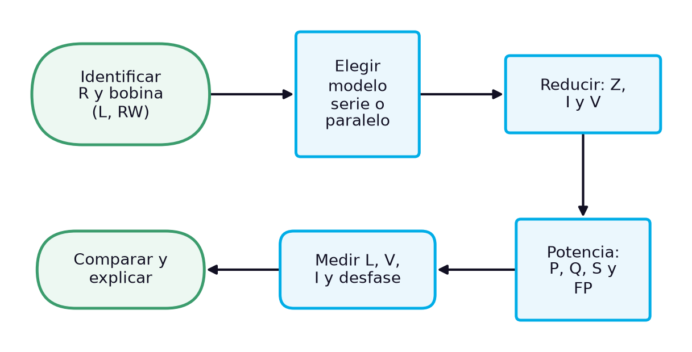
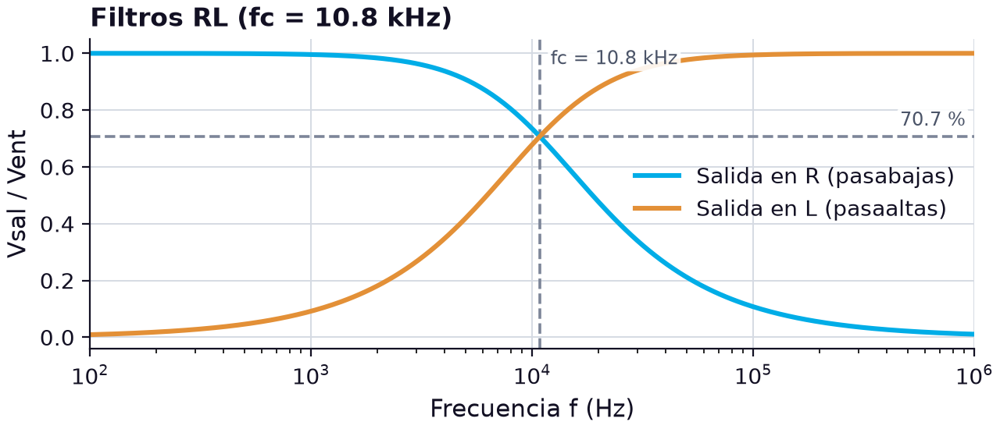
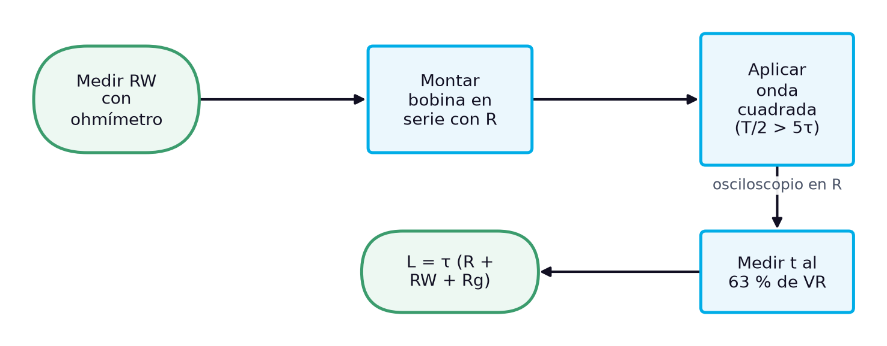

# Cálculo y medición de parámetros en circuitos RL según el conexionado: equivalentes serie-paralelo, circuitos mixtos, potencia y medición de inductancia

> **Módulos:** IEL04 — Circuitos Eléctricos I
> **Duración:** 240 minutos (sesión teórico-práctica)
> **Nivel:** Pregrado
> **Semana:** 9 de 14 (corte evaluativo 2) · **Resultado de aprendizaje del módulo:** [[IEL04-RA3]] · **Trabajo independiente:** 5 h/semana

---

## 1. Metadatos de la Sesión

### 1.1 Continuidad curricular

La semana 8 presentó los circuitos RL en serie y en paralelo, con sus leyes de Kirchhoff y el papel de la resistencia de devanado. Esta sesión cierra el RA3 profundizando en el cálculo según el tipo de conexionado: cómo convertir una bobina real entre sus modelos en serie y en paralelo, cómo resolver circuitos RL mixtos, cómo se comporta el RL como filtro, cómo se reparte la potencia entre resistencia e inductancia —el origen del factor de potencia en las instalaciones— y cómo medir una inductancia desconocida con instrumentos básicos. La semana 10 es de examen; la semana 11 abre el RA4 con los circuitos RLC.

1. Semana 8: Circuitos RL en serie y en paralelo: análisis con las leyes de voltajes y corrientes de Kirchhoff
2. **→ Presente sesión (semana 9):** Cálculo y medición de parámetros en circuitos RL serie y paralelo según el tipo de conexionado
3. Semana 10: evaluación (semana de examen)

### 1.2 Prerrequisitos

- Calcular impedancia, ángulo de fase, tensiones y corrientes de circuitos RL en serie y en paralelo (semana 8).
- Aplicar el método general de análisis fasorial con impedancias y admitancias (semana 7).
- Calcular la constante de tiempo τ = L/R de un circuito RL en serie.
- Calcular potencia en cd como P = VI = I²R.
- Usar el osciloscopio con cursores de tiempo y de tensión.

---

## 2. Resultados de Aprendizaje

**RA IEL04-RA3:** Calcular un circuito resistivo, inductivo y RL, sea en serie o paralelo.

**Criterios de evaluación:**
- **CE1** (cognitiva_conceptual): Identificar los tipos de resistores e inductores.
- **CE2** (manipulacion_fisica): Realizar mediciones en un circuito resistivo e inductivo.
- **CE3** (manipulacion_fisica): Realizar mediciones en un circuito RL.

**Unidades de competencia de la asignatura:**
- [[UC2]]: Coordinar actividades asociadas a sistemas eléctricos utilizando fuentes convencionales y no convencionales de energía.

Al finalizar la sesión, el estudiante estará en capacidad de lograr los siguientes resultados, que desarrollan el RA del módulo:

| # | Resultado de aprendizaje | Nivel (Taxonomía de Bloom) |
| --- | --- | --- |
| RA1 | **Identificar** los componentes de un circuito RL y representar la bobina real con su modelo en serie o en paralelo según el conexionado. (CE1) | Aplicar |
| RA2 | **Calcular** impedancias, corrientes y tensiones de circuitos RL mixtos y la frecuencia de corte de un filtro RL. (CE3) | Aplicar |
| RA3 | **Calcular** la potencia activa, reactiva y aparente y el factor de potencia de un circuito RL. (CE3) | Analizar |
| RA4 | **Medir** una inductancia desconocida por su constante de tiempo y por su impedancia, y evaluar la concordancia entre ambos métodos. (CE2, CE3) | Evaluar |

---

## 3. Índice Temporizado (240 minutos)

| Bloque | Contenido | Duración |
| --- | --- | --- |
| 1 | Qué parámetros de un circuito RL se calculan y cuáles se miden, según el conexionado | 15 min |
| 2 | Equivalencia entre RW + jXL y un paralelo Rp ∥ jXLp, y su uso según el conexionado | 30 min |
| 3 | Resistor en serie con un paralelo RL: reducción, reparto de tensiones y corrientes | 35 min |
| 4 | Filtros pasabajas y pasaaltas RL y fc = R/(2πL) | 30 min |
| 5 | Potencia activa, reactiva y aparente, triángulo de potencia y FP = cos θ | 35 min |
| 6 | Onda cuadrada, cinco constantes de tiempo y cálculo de L = τR | 30 min |
| 7 | Medir L por τ y por impedancia, y comprobar un circuito RL mixto con su potencia | 50 min |
| 8 | Síntesis, cierre actitudinal y bibliografía | 15 min |
|  | **Total** | **240 min** |

---

## 4. Desarrollo Teórico

### 4.1 Introducción Conceptual (Bloque 1)

En la semana 8 se resolvieron los dos circuitos RL básicos y se comprobó en el laboratorio que la resistencia de devanado de la bobina no puede ignorarse. Queda por responder una pregunta práctica que el técnico se hace con frecuencia: **qué parámetros de un circuito RL conviene calcular y cuáles conviene medir, y cómo depende eso del conexionado**. En la industria, la mayoría de las cargas son inductivas, y lo que interesa de ellas no es solo la corriente, sino cuánta de la potencia que toman se convierte en trabajo útil y cuánta va y vuelve entre la red y el campo magnético. En el taller, además, es habitual encontrar bobinas sin marcado cuya inductancia hay que determinar con los instrumentos disponibles.

Para responder, la sesión amplía las herramientas de la semana 8 en cuatro direcciones. Primero, la bobina real puede describirse con un modelo en serie o con un modelo en paralelo, y elegir el adecuado según el conexionado simplifica el cálculo. Segundo, los circuitos mixtos combinan partes en serie y en paralelo. Tercero, el RL se comporta como filtro, con una frecuencia de corte análoga a la del RC. Y cuarto, la potencia en un circuito RL se reparte entre la resistencia, que la disipa, y la inductancia, que la almacena y la devuelve; los valores relativos de resistencia y reactancia determinan cuánta energía se convierte en calor [1]. El diagrama ordena el procedimiento completo.

*Figura 1. Procedimiento de cálculo y medición de parámetros en un circuito RL*

El diagrama es el método general de la semana 7 con dos pasos nuevos: la elección del modelo de la bobina, que en los condensadores no hacía falta porque se tratan como ideales, y el cálculo de la potencia, que en los circuitos de señal pasa desapercibido pero en los sistemas eléctricos es el dato que se factura. El caso final aplica el procedimiento a una bobina sin marcado: se mide su inductancia por dos métodos independientes, la constante de tiempo y la impedancia, y se usa en un circuito RL mixto cuyo factor de potencia se calcula y se verifica.

> **Nota pedagógica:** Esta es la última sesión antes del examen de la semana 10, que evalúa los RA2 y RA3. Los ejercicios de cálculo de las unidades sirven como preparación: conviene resolverlos antes de leer la solución y comparar.

### 4.2 Conceptos Clave

#### 4.2.1 Modelo serie y modelo paralelo de la bobina real (Bloque 2)

La semana 8 representó la bobina real como su inductancia en serie con la resistencia de devanado, $R_W + jX_L$. Es el modelo natural, porque la resistencia está distribuida a lo largo del mismo alambre que forma las espiras. Pero cuando la bobina forma parte de un circuito en paralelo, ese modelo obliga a sumar admitancias de ramas que no son puramente reactivas, y el cálculo se complica. La alternativa es sustituir la bobina real por un **equivalente en paralelo**: una resistencia $R_p$ en paralelo con una reactancia $X_{Lp}$ que, a la frecuencia de trabajo, toma exactamente la misma corriente con el mismo ángulo. Floyd usa esta sustitución, por ejemplo, para analizar un circuito tanque con bobina real, representando la resistencia de devanado como una resistencia equivalente en paralelo [1].

La conversión se obtiene igualando las admitancias de ambos modelos. La admitancia del modelo serie es $1/(R_W + jX_L) = (R_W - jX_L)/(R_W^2 + X_L^2)$; su parte real es la conductancia del paralelo, $1/R_p$, y su parte imaginaria, la susceptancia $1/X_{Lp}$. Expresando el resultado en función del factor de calidad de la bobina, $Q = X_L/R_W$ —la razón entre la potencia reactiva de la bobina y la potencia real en su resistencia de devanado [1]—, las fórmulas quedan:

$$
R_p = R_W\,(1 + Q^{2}), \qquad X_{Lp} = X_L\,\frac{1 + Q^{2}}{Q^{2}}, \qquad Q = \frac{X_L}{R_W}
$$

donde $R_p$ es la resistencia equivalente en paralelo en ohmios (Ω), $X_{Lp}$ la reactancia equivalente en paralelo en ohmios, $R_W$ la resistencia de devanado en ohmios, $X_L$ la reactancia inductiva en ohmios y $Q$ el factor de calidad de la bobina (adimensional). Dos consecuencias saltan a la vista. Si $Q$ es grande, $X_{Lp} \approx X_L$ y $R_p$ es mucho mayor que $R_W$: una resistencia de devanado pequeña en serie equivale a una resistencia muy grande en paralelo. Y como $Q$ depende de la frecuencia, **el equivalente en paralelo solo vale a una frecuencia**: al cambiarla, cambian $R_p$ y $X_{Lp}$.

Para la bobina L3 del kit, con 10.4 mH y 24.6 Ω, a 10 kHz $X_L = 653.5\ \Omega$ y $Q = 26.6$; entonces $R_p = 24.6(1 + 26.6^2) \approx 17.4\ \text{k}\Omega$ y $X_{Lp} \approx 654\ \Omega$, prácticamente igual a $X_L$. A 1 kHz, en cambio, $Q = 2.66$, $R_p \approx 198\ \Omega$ y $X_{Lp} \approx 74.6\ \Omega$, un 14 % mayor que $X_L$: a baja frecuencia, el equivalente en paralelo de la bobina se aparta mucho de una inductancia pura. La tabla muestra la evolución.

**Tabla 1.** Equivalente en paralelo de la bobina L3 (L = 10.4 mH, RW = 24.6 Ω) a distintas frecuencias

| f (Hz) | XL (Ω) | Q | Rp (Ω) | XLp (Ω) | XLp/XL |
| --- | --- | --- | --- | --- | --- |
| 1000 | 65.3 | 2.66 | 198 | 74.6 | 1.14 |
| 5000 | 327 | 13.3 | 4364 | 329 | 1.006 |
| 10 000 | 653 | 26.6 | 17 390 | 654 | 1.001 |
| 20 000 | 1307 | 53.1 | 69 470 | 1307 | 1.000 |

La regla práctica que deja la tabla es la misma de la semana 8, ahora con fundamento: con $Q > 10$ los dos modelos dan casi la misma reactancia, y la bobina puede tratarse como una inductancia ideal más una resistencia grande en paralelo, casi siempre despreciable frente al resto del circuito. Con $Q < 10$ hay que elegir el modelo con cuidado: en un circuito en serie se usa el modelo serie, que suma $R_W$ directamente a las demás resistencias; en un circuito en paralelo, el modelo paralelo, que suma $1/R_p$ directamente a las demás conductancias. Así cada cálculo se reduce a sumas del mismo tipo.

> **Error frecuente:** Colocar la resistencia de devanado medida con el ohmímetro directamente en paralelo con la inductancia. El ohmímetro mide $R_W$, el modelo serie; en paralelo hay que usar $R_p = R_W(1 + Q^2)$, que puede ser cientos de veces mayor.

#### 4.2.2 Circuitos RL mixtos (serie-paralelo) (Bloque 3)

Un circuito RL mixto combina, igual que en la semana 7, un grupo en serie con un grupo en paralelo. El caso típico es un resistor $R_1$ en serie con el paralelo de un resistor $R_2$ y una bobina $L$: es el modelo de un motor, cuya rama resistiva representa la potencia mecánica y cuya rama inductiva representa la magnetización, alimentado a través de la resistencia de los conductores. El procedimiento no cambia: se reduce primero el paralelo con admitancias, se convierte a forma rectangular para sumarlo con $R_1$ y se vuelve hacia atrás con la ley de Ohm fasorial.

$$
\mathbf{Z}_T = R_1 + \frac{1}{G_2 - jB_L}, \qquad G_2 = \frac{1}{R_2}, \qquad B_L = \frac{1}{2\pi f L}
$$

donde $\mathbf{Z}_T$ es la impedancia total en ohmios (Ω), $R_1$ la resistencia en serie en ohmios, $G_2$ la conductancia del resistor en paralelo en siemens (S), $B_L$ la susceptancia inductiva en siemens, $f$ la frecuencia en hercios (Hz) y $L$ la inductancia en henrios (H). El signo negativo de la susceptancia es el que distingue este circuito de su análogo RC. Si la resistencia de devanado no fuera despreciable, se incluiría con el modelo paralelo de la unidad anterior, sumando $1/R_p$ a $G_2$.

Un ejemplo con valores nominales: $R_1 = 470\ \Omega$, $R_2 = 680\ \Omega$ y $L = 10\ \text{mH}$, a 10 kHz y con 5 V eficaces. Primero, $G_2 = 1.471\ \text{mS}$ y $B_L = 1/(628.3) = 1.592\ \text{mS}$, de modo que $\mathbf{Y}_p = 2.167 \angle -47.3^\circ\ \text{mS}$ y $\mathbf{Z}_p = 461.5 \angle 47.3^\circ\ \Omega = 313.3 + j338.9\ \Omega$. Segundo, $\mathbf{Z}_T = 783.3 + j338.9\ \Omega = 853.5 \angle 23.4^\circ\ \Omega$. Tercero, $\mathbf{I} = 5/853.5 = 5.86 \angle -23.4^\circ\ \text{mA}$, retrasada respecto a la fuente. Cuarto, $V_{R1} = (5.86)(0.470) = 2.75\ \text{V}$ y $V_p = (5.86)(0.4615) = 2.70\ \text{V}$, esta última a +23.9° de la tensión de la fuente. Quinto, las corrientes de rama: $I_{R2} = 2.70/680 = 3.98\ \text{mA}$ e $I_L = 2.70/628.3 = 4.30\ \text{mA}$.

**Tabla 2.** Circuito RL mixto R1 + (R2 ∥ L) con valores nominales (5 V eficaces a 10 kHz)

| Magnitud | Valor | Ángulo (ref. VS) | Comprobación |
| --- | --- | --- | --- |
| ZT | 853.5 Ω | +23.4° | 783.3 + j338.9 Ω |
| I | 5.86 mA | −23.4° | VS/ZT |
| VR1 | 2.75 V | −23.4° | en fase con I |
| Vp | 2.70 V | +23.9° | común a R2 y L |
| IR2 | 3.98 mA | +23.9° | en fase con Vp |
| IL | 4.30 mA | −66.1° | 90° detrás de Vp |
| √(IR2² + IL²) | 5.86 mA | — | LCK: igual a I |
| VR1 + Vp (fasorial) | 5.00 V | 0° | LVK: igual a VS |

La verificación con ambas leyes de Kirchhoff cierra el cálculo: la suma fasorial de las corrientes de rama devuelve los 5.86 mA de la corriente total, y la de las tensiones, los 5.00 V de la fuente, mientras que sus sumas aritméticas darían 8.28 mA y 5.45 V. Comparado con el mixto RC de la semana 7, todos los ángulos cambian de signo: aquí la corriente total se retrasa y la tensión del paralelo se adelanta a la de la fuente. El ángulo total, 23.4°, es la mitad del de la rama inductiva porque $R_1$ añade resistencia sin reactancia; ese ángulo determina el factor de potencia del conjunto, como se verá más adelante.

El comportamiento con la frecuencia también se invierte respecto al RC. Si la frecuencia sube a 20 kHz, la reactancia de la bobina se duplica a 1257 Ω, su susceptancia baja a 0.796 mS y la rama inductiva conduce menos: el paralelo pasa a $598 \angle 28.4^\circ\ \Omega$, la impedancia total a $1036 \angle 16.0^\circ\ \Omega$ y la corriente baja a 4.83 mA. A frecuencias altas el circuito se vuelve más resistivo y a frecuencias bajas más inductivo, porque la bobina tiende a cortocircuitar a $R_2$. En el límite de cd, la impedancia se reduciría a $R_1$ más la resistencia de devanado, y la corriente quedaría limitada casi solo por $R_1$: una razón práctica para que ese resistor exista en el circuito.

> **Error frecuente:** Tomar la tensión del paralelo como la tensión de la fuente menos $V_{R1}$ en aritmética: $5 - 2.75 = 2.25\ \text{V}$ en lugar de 2.70 V. En ca la resta, igual que la suma, debe hacerse con fasores.

#### 4.2.3 El circuito RL como filtro: frecuencia de corte (Bloque 4)

Igual que el RC, el circuito RL en serie funciona como filtro según dónde se tome la salida, pero con los papeles intercambiados. Si la salida se toma en el **resistor**, a frecuencias bajas la bobina casi no se opone y casi toda la tensión llega a la salida; a frecuencias altas, la reactancia de la bobina crece, se queda con la mayor parte de la tensión y la salida cae: es un filtro **pasabajas**. Si la salida se toma en la **bobina**, ocurre lo contrario y el circuito es un **pasaaltas**. En el RC, el pasabajas tenía la salida en el condensador; en el RL, en el resistor. La regla que los unifica es que la salida del pasabajas se toma en el elemento que se queda con la mayor parte de la tensión a frecuencias bajas: el condensador en el RC y el resistor en el RL.

La frecuencia de corte se define de la misma forma: es la frecuencia en la que la reactancia es igual a la resistencia, y en ella la salida vale el 70.7 % de su valor máximo [1]. Al imponer $2\pi f_c L = R$ se obtiene:

$$
f_c = \frac{R}{2\pi L}, \qquad \frac{V_{sal}}{V_{ent}}\bigg|_{salida\ en\ R} = \frac{1}{\sqrt{1 + (f/f_c)^{2}}}, \qquad \frac{V_{sal}}{V_{ent}}\bigg|_{salida\ en\ L} = \frac{f/f_c}{\sqrt{1 + (f/f_c)^{2}}}
$$

donde $f_c$ es la frecuencia de corte en hercios (Hz), $R$ la resistencia total del lazo en ohmios (Ω), $L$ la inductancia en henrios (H), $f$ la frecuencia de la señal en hercios, y $V_{sal}/V_{ent}$ la relación de magnitudes eficaces (adimensional). Obsérvese que en el RL la resistencia está en el numerador: aumentar $R$ sube la frecuencia de corte, mientras que en el RC la bajaba. Con $R = 680\ \Omega$ y $L = 10\ \text{mH}$, $f_c = 680/(2\pi \times 0.01) \approx 10.8\ \text{kHz}$, la frecuencia en la que la semana 8 encontró $X_L = R$ y un ángulo de 45°.

*Figura 2. Respuesta en frecuencia de un circuito RL en serie (R = 680 Ω, L = 10 mH) con salida en el resistor (pasabajas) y en la bobina (pasaaltas)*

Las curvas tienen exactamente la forma de las del RC de la semana 7, porque la ecuación en función de $f/f_c$ es la misma; lo que cambia es qué elemento entrega cada salida y cómo se calcula $f_c$. La bobina real introduce, sin embargo, un matiz que el modelo ideal no muestra: en el pasaaltas, la tensión en los terminales de la bobina incluye la caída en su resistencia de devanado, así que a frecuencias muy bajas la salida no llega a cero, sino a $R_W/(R + R_W)$. Con la bobina L3 del kit y 680 Ω, ese piso es de $24.6/704.6 \approx 3.5\ \%$ de la entrada.

En la práctica, los filtros RL se prefieren a los RC en aplicaciones de potencia: una bobina en serie con la carga, un *choke*, deja pasar la corriente continua o de 60 Hz casi sin pérdidas y se opone a los armónicos y a las perturbaciones de alta frecuencia, mientras que un resistor en serie disiparía una potencia inaceptable. En los circuitos de señal, en cambio, dominan los filtros RC, porque los condensadores son más pequeños, más baratos y más cercanos al ideal que las bobinas.

> **Error frecuente:** Usar para el RL la fórmula del RC, $f_c = 1/(2\pi R L)$. La comprobación de unidades lo detecta: ohmios divididos entre henrios dan hercios (1/s), mientras que el producto $RL$ no da una frecuencia.

#### 4.2.4 Potencia en circuitos RL y factor de potencia (Bloque 5)

En un circuito de ca puramente resistivo, la resistencia disipa en forma de calor toda la energía que entrega la fuente. En uno puramente inductivo, el inductor guarda la energía en su campo magnético durante una parte del ciclo y la devuelve a la fuente durante otra, sin conversión neta en calor. Cuando hay resistencia e inductancia, una parte de la energía se almacena y se devuelve alternadamente, y otra se disipa; los valores relativos de resistencia y reactancia determinan cuánta energía se convierte en calor [1]. Para describir ese reparto se usan tres potencias distintas.

La **potencia real** o activa, $P$, es la que disipa la resistencia, en vatios (W). La **potencia reactiva**, $Q$, es la que la bobina toma y devuelve en cada ciclo, en voltamperios reactivos (VAR); no representa una pérdida de energía por conversión en calor, pero existe porque en cada instante el inductor está tomando energía de la fuente o devolviéndosela [1]. La **potencia aparente**, $S$, es el producto de la tensión y la corriente eficaces, en voltamperios (VA), y es la resultante de las otras dos en el **triángulo de potencia** [1]. El coseno del ángulo de fase es el **factor de potencia** [1]:

$$
P = I^{2}R = VI\cos\theta, \qquad Q = I^{2}X_L = VI\sin\theta, \qquad S = VI = \sqrt{P^{2} + Q^{2}}, \qquad FP = \cos\theta = \frac{P}{S}
$$

donde $P$ es la potencia real en vatios (W), $Q$ la potencia reactiva en voltamperios reactivos (VAR), $S$ la potencia aparente en voltamperios (VA), $V$ e $I$ la tensión y la corriente eficaces en voltios (V) y amperios (A), $R$ la resistencia y $X_L$ la reactancia inductiva en ohmios (Ω), $\theta$ el ángulo de fase entre la tensión aplicada y la corriente, y $FP$ el factor de potencia (adimensional). A medida que el ángulo de fase aumenta, el factor de potencia disminuye y el circuito es cada vez más reactivo: un factor de potencia menor indica menos potencia real y más potencia reactiva [1].

En el ejemplo de Floyd, un RL en serie con $R = 1.0\ \text{k}\Omega$ y $X_L = 2\ \text{k}\Omega$ alimentado con 10 V tiene $\mathbf{Z} = 2.24 \angle 63.4^\circ\ \text{k}\Omega$, $I = 4.46\ \text{mA}$ y $FP = \cos 63.4^\circ = 0.448$; su potencia real es $P = (10)(4.46)(0.448) \approx 20\ \text{mW}$ [1], la reactiva $Q = (4.46 \times 10^{-3})^2(2000) \approx 39.8\ \text{mVAR}$ y la aparente $S = (10)(4.46) = 44.6\ \text{mVA}$. La tabla aplica las mismas fórmulas al circuito mixto de la unidad anterior, calculando la potencia de cada elemento y comprobando que la suma coincide con la del conjunto.

**Tabla 3.** Potencias del circuito RL mixto R1 + (R2 ∥ L) con 5 V eficaces a 10 kHz

| Elemento | Corriente (mA) | Fórmula | Potencia |
| --- | --- | --- | --- |
| R1 = 470 Ω | 5.86 | P = I²R1 | 16.1 mW |
| R2 = 680 Ω | 3.98 | P = I²R2 | 10.8 mW |
| L (XL = 628 Ω) | 4.30 | Q = I²XL | 11.6 mVAR |
| Total real | — | P1 + P2 | 26.9 mW |
| Total aparente | 5.86 | S = VI | 29.3 mVA |
| Comprobación | — | √(P² + Q²) | 29.3 mVA |
| Factor de potencia | — | cos 23.4° = P/S | 0.918 |

La tabla muestra que la potencia real total es la suma de las potencias de los resistores, la reactiva es la de la bobina, y ambas se combinan en el triángulo para dar la potencia aparente que entrega la fuente. En las instalaciones eléctricas este reparto tiene consecuencias económicas: los conductores, los transformadores y los generadores deben dimensionarse para la potencia aparente, porque por ellos circula toda la corriente, aunque solo la potencia real produzca trabajo útil. Por eso un factor de potencia bajo obliga a sobredimensionar la instalación, y las empresas de energía suelen penalizarlo. Su corrección, añadiendo condensadores en paralelo con las cargas inductivas, se estudiará con los circuitos RLC.

> **Error frecuente:** Calcular la potencia real como $VI$, sin el factor de potencia. En un circuito RL el producto de la tensión y la corriente eficaces es la potencia aparente, en VA, y siempre es mayor que la potencia real, salvo que el circuito sea puramente resistivo.

#### 4.2.5 Medición de inductancia con la constante de tiempo (Bloque 6)

No siempre se dispone de un medidor LCR, y no todas las bobinas llevan marcado. Floyd describe un método que solo requiere un generador de ondas cuadradas, un osciloscopio, un ohmímetro y un resistor de valor conocido: se coloca la bobina en serie con el resistor, se mide la constante de tiempo del circuito y, conociendo la constante de tiempo y la resistencia, se calcula la inductancia [1]. El método aprovecha que en un RL en serie $\tau = L/R$, así que $L = \tau R$.

El procedimiento consiste en aplicar al circuito una onda cuadrada y observar la tensión en el resistor: cada vez que la onda sube, la bobina adquiere energía y la corriente crece exponencialmente; cada vez que vuelve a cero, la bobina pierde energía y la corriente decae [1]. La frecuencia se ajusta para que la bobina tenga tiempo de adquirir energía por completo durante cada pulso, de modo que el osciloscopio muestre una curva de crecimiento completa [1]; el tiempo para que la tensión en el resistor llegue prácticamente a su valor final es de cinco constantes de tiempo [1]. Hay un detalle esencial: la resistencia de devanado de la bobina no puede ignorarse sin más; debe medirse con el ohmímetro, y el resistor en serie se elige mucho mayor que ella y que la resistencia de salida del generador, para que su influencia sea pequeña [1]. El diagrama resume los pasos.

*Figura 3. Procedimiento para medir una inductancia desconocida por su constante de tiempo*

La constante de tiempo se lee con los cursores del osciloscopio como el intervalo entre el flanco de subida de la onda cuadrada y el instante en que la tensión del resistor alcanza el 63 % de su valor final. Si es más cómodo medir el instante en que llega al 50 %, se usa $\tau = t_{50}/\ln 2 \approx t_{50}/0.693$. La inductancia se calcula con toda la resistencia del lazo:

$$
L = \tau\,(R + R_W + R_g)
$$

donde $L$ es la inductancia en henrios (H), $\tau$ la constante de tiempo medida en segundos (s), $R$ la resistencia del resistor en serie, $R_W$ la resistencia de devanado medida con el ohmímetro y $R_g$ la resistencia de salida del generador, típicamente de 50 Ω, todas en ohmios (Ω). Por ejemplo, con un resistor de 10 kΩ, una resistencia de devanado de 85 Ω como la de la bobina de la aplicación de Floyd [1] y 50 Ω del generador, la resistencia total es de 10 135 Ω; si la constante de tiempo medida es de 0.99 µs, $L = (0.99 \times 10^{-6})(10\ 135) \approx 10.0\ \text{mH}$. Si se hubiera ignorado la resistencia del generador y la de devanado, el resultado habría sido 9.9 mH, un 1.3 % menos.

La elección del resistor es un compromiso. Un resistor muy grande hace despreciables $R_W$ y $R_g$, pero reduce la constante de tiempo hasta valores difíciles de leer con precisión: con 10 kΩ y 10 mH, $\tau$ es de apenas 1 µs. Un resistor pequeño alarga $\tau$ y facilita la lectura, pero hace que las resistencias parásitas pesen más. Un buen punto de partida es un resistor entre diez y cincuenta veces la resistencia de devanado, con la frecuencia de la onda cuadrada tal que su semiperiodo dure unas diez constantes de tiempo.

> **Nota pedagógica:** El mismo montaje sirve para medir capacitancias sustituyendo la bobina por el condensador: entonces $C = \tau/R$. Es una alternativa útil cuando el multímetro no tiene función de capacímetro.

---

## 5. Caso de Estudio Aplicado: Identificación de una bobina sin marcado y medición de un circuito RL mixto (Bloque 7)

### 5.1 El problema

En el almacén del laboratorio aparece una bobina toroidal sin ningún marcado y hay que saber si sirve para las prácticas. Se pide determinar su inductancia por dos métodos independientes, identificar a qué valor estándar corresponde y usarla después en un circuito RL mixto, del que se calcularán y medirán corrientes, tensiones, ángulo y factor de potencia. Se dispone de un generador de funciones, un osciloscopio, un multímetro y resistores de 1 kΩ, 470 Ω y 680 Ω, que el ohmímetro mide en 996 Ω, 468 Ω y 676 Ω. La resistencia de devanado de la bobina, medida con el ohmímetro, es de 12.3 Ω. Las lecturas del osciloscopio que se usan más abajo son valores de ejemplo para ilustrar el procedimiento.

### 5.2 Método 1: constante de tiempo

Se monta la bobina en serie con el resistor de 996 Ω y se aplica una onda cuadrada de 0 V a 5 V y 10 kHz, cuyo semiperiodo de 50 µs resulta ser más de diez constantes de tiempo. En el osciloscopio, con la punta sobre el resistor, la tensión alcanza el 63 % de su valor final 3.12 µs después de cada flanco de subida. Con toda la resistencia del lazo, $996 + 12.3 + 50 = 1058.3\ \Omega$, la inductancia es $L = (3.12 \times 10^{-6})(1058.3) \approx 3.30\ \text{mH}$.

### 5.3 Método 2: impedancia con señal sinusoidal

Con el mismo montaje, el generador se cambia a una onda sinusoidal de 10 kHz y 5.00 V eficaces en los bornes del circuito. La corriente se obtiene de la tensión en el resistor, $I = 4.84/996 \approx 4.86\ \text{mA}$, y la tensión en la bobina, medida con la resta de canales, es de 1.01 V. La magnitud de la impedancia de la bobina es $Z_{bob} = 1.01/4.86 \times 10^{3} \approx 207.8\ \Omega$, y como incluye la resistencia de devanado, la reactancia y la inductancia son:

$$
X_L = \sqrt{Z_{bob}^{2} - R_W^{2}} = \sqrt{207.8^{2} - 12.3^{2}} \approx 207.4\ \Omega, \qquad L = \frac{X_L}{2\pi f} = \frac{207.4}{2\pi(10\ 000)} \approx 3.30\ \text{mH}
$$

donde $X_L$ es la reactancia inductiva en ohmios (Ω), $Z_{bob}$ la magnitud de la impedancia medida de la bobina en ohmios, $R_W$ su resistencia de devanado en ohmios, $L$ la inductancia en henrios (H) y $f$ la frecuencia en hercios (Hz). Los dos métodos coinciden en 3.30 mH, que corresponde al valor estándar de 3.3 mH de la serie de multiplicadores de los inductores [2]. A 10 kHz la bobina tiene $Q = 207.4/12.3 \approx 17$, suficiente para tratarla como casi ideal, aunque en el cálculo se incluye $R_W$.

### 5.4 Circuito RL mixto con la bobina identificada

Se monta $R_1 = 468\ \Omega$ en serie con el paralelo de $R_2 = 676\ \Omega$ y la bobina, con 5.00 V eficaces a 10 kHz. La admitancia de la bobina real es $1/(12.3 + j207.3) = 0.285 - j4.807\ \text{mS}$; sumada a $G_2 = 1.479\ \text{mS}$ da $\mathbf{Y}_p = 1.765 - j4.807\ \text{mS}$, y $\mathbf{Z}_p = 195.3 \angle 69.9^\circ = 67.3 + j183.3\ \Omega$. Entonces $\mathbf{Z}_T = 535.3 + j183.3\ \Omega = 565.8 \angle 18.9^\circ\ \Omega$, $I = 8.84\ \text{mA}$, $V_{R1} = 4.14\ \text{V}$, $V_p = 1.73\ \text{V}$, $I_{R2} = 2.55\ \text{mA}$ e $I_{bob} = 8.31\ \text{mA}$. La potencia real es $P = VI\cos\theta \approx 41.8\ \text{mW}$, la reactiva $Q = I_{bob}^2 X_L \approx 14.3\ \text{mVAR}$, la aparente $S = 44.2\ \text{mVA}$ y el factor de potencia 0.946.

**Tabla 4.** Bobina sin marcado y circuito RL mixto a 10 kHz: cálculo con valores medidos y medición (lecturas de ejemplo)

| Magnitud | Calculado | Medido | Diferencia |
| --- | --- | --- | --- |
| L por constante de tiempo | — | 3.30 mH | — |
| L por impedancia | — | 3.30 mH | 0.0 % entre métodos |
| Mixto: I | 8.84 mA | 8.82 mA | −0.2 % |
| Mixto: VR1 | 4.14 V | 4.13 V | −0.2 % |
| Mixto: Vp | 1.73 V | 1.73 V | 0.0 % |
| Mixto: IR2 | 2.55 mA | 2.55 mA | 0.0 % |
| Mixto: Ibob | 8.31 mA | 8.30 mA | −0.1 % |
| Mixto: θ | 18.9° | 19.1° | 0.2° |
| Mixto: FP = cos θ | 0.946 | 0.945 | −0.1 % |

### 5.5 Conclusiones

Dos métodos independientes, uno en el dominio del tiempo y otro en el de la frecuencia, dieron la misma inductancia, y eso da confianza en el resultado sin necesidad de un medidor LCR. La bobina quedó identificada como un inductor de 3.3 mH y, montada en el circuito mixto, se comportó como predice el cálculo, con diferencias menores del 0.5 %. El factor de potencia medido, 0.945, confirma el reparto de potencias: la mayor parte de la potencia que entrega la fuente se disipa en los resistores y una fracción circula como potencia reactiva por la bobina. Con esta práctica se completan los criterios del RA3 que dependen del laboratorio.

> **Nota pedagógica:** Medir la misma magnitud por dos caminos distintos es una de las mejores prácticas del laboratorio: si los resultados coinciden, ambos quedan validados; si no, la discrepancia señala un error de montaje, de lectura o de modelo antes de que contamine el resto de las mediciones.

---

## 6. Síntesis (Bloque 8)

Calcular un circuito RL según su conexionado empieza por elegir cómo representar la bobina real. En serie conviene su modelo natural, $R_W + jX_L$; en paralelo, su equivalente $R_p = R_W(1 + Q^2)$ en paralelo con $X_{Lp}$, válido solo a la frecuencia de cálculo. Con el modelo adecuado, los circuitos mixtos se resuelven con el mismo método de la semana 7, con los ángulos de signo opuesto a los del RC: la corriente se retrasa y el circuito se vuelve más inductivo al bajar la frecuencia. Como filtro, el RL tiene su frecuencia de corte en $f_c = R/(2\pi L)$, con la salida del pasabajas en el resistor. Y en términos de energía, **la potencia real se disipa en las resistencias, la reactiva va y vuelve en la bobina y la aparente las combina**; el factor de potencia, $\cos\theta$, mide qué fracción de lo que entrega la fuente se convierte en trabajo. El caso mostró que una bobina sin marcado puede identificarse con instrumentos básicos, midiendo su constante de tiempo y su impedancia, y que ambos métodos coinciden cuando se incluyen todas las resistencias del lazo. Con eso se completa el RA3 —calcular y medir circuitos resistivos, inductivos y RL en serie o en paralelo— antes del examen de la semana 10.

### Componente Actitudinal

> *Rotular la bobina identificada con su valor medido y devolverla al almacén en su lugar es un gesto pequeño de responsabilidad con el equipo: evita que el próximo grupo repita las mismas mediciones o, peor, use un componente equivocado.*

---

## 7. Bibliografía (Formato IEEE)

[1] T. L. Floyd, Principios de circuitos eléctricos, 8.ª ed. México: Pearson Educación, 2007.

[2] R. L. Boylestad, Introducción al análisis de circuitos, 10.ª ed. México: Pearson Educación, 2004.

[3] M. F. P. Deorsola y P. Morcelle del Valle, Circuitos eléctricos. Parte 1, 1.ª ed. La Plata: Editorial de la Universidad de La Plata, 2017.
