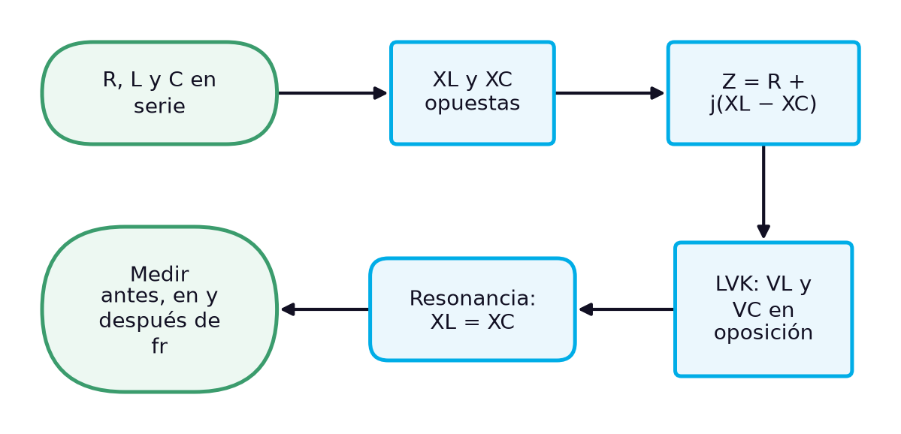
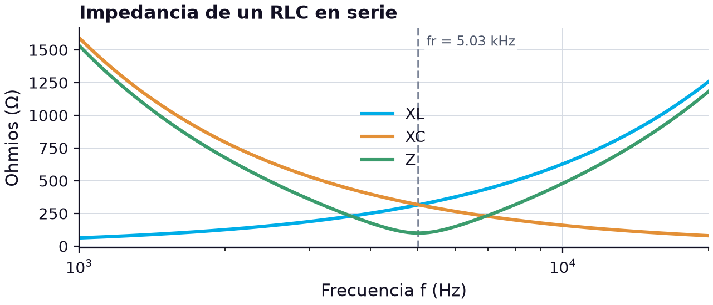
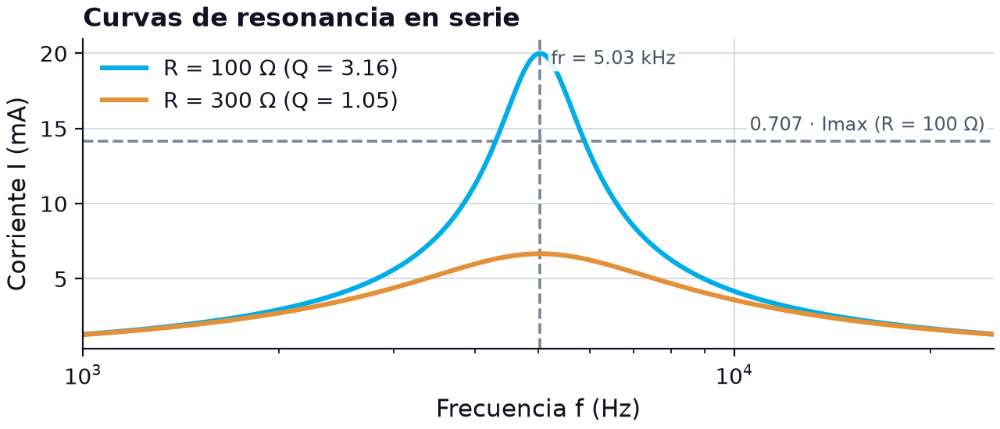

# El circuito RLC en serie: reactancias opuestas, ley de voltajes de Kirchhoff y resonancia en serie

> **Módulos:** IEL04 — Circuitos Eléctricos I
> **Duración:** 240 minutos (sesión teórico-práctica)
> **Nivel:** Pregrado
> **Semana:** 11 de 14 (corte evaluativo 3) · **Resultado de aprendizaje del módulo:** [[IEL04-RA4]] · **Trabajo independiente:** 5 h/semana

---

## 1. Metadatos de la Sesión

### 1.1 Continuidad curricular

Las semanas 4 a 9 analizaron por separado los circuitos RC y RL, y la semana 3 presentó el circuito LC y su frecuencia de resonancia. Tras el examen de la semana 10, esta sesión abre el RA4 reuniendo los tres elementos en serie: la reactancia inductiva y la capacitiva se oponen, la reactancia total es su diferencia y, a la frecuencia de resonancia, se anulan. La ley de voltajes de Kirchhoff sigue valiendo con fasores, pero aparece un hecho nuevo: las tensiones en la bobina y en el condensador pueden superar la de la fuente. La semana 12 trata el circuito RLC en paralelo y la ley de corrientes de Kirchhoff, y la semana 13 cierra el curso con el cálculo y la medición de parámetros de circuitos RLC.

1. Semana 10: evaluación (semana de examen)
2. **→ Presente sesión (semana 11):** Circuito RLC en serie: análisis y Ley de Voltajes de Kirchhoff
3. Semana 12: Circuito RLC en paralelo: análisis y Ley de Corrientes de Kirchhoff

### 1.2 Prerrequisitos

- Calcular la reactancia capacitiva y la inductiva a una frecuencia dada (semanas 4 y 8).
- Aplicar la ley de voltajes de Kirchhoff con fasores en circuitos RC y RL en serie (semanas 4 y 8).
- Calcular la frecuencia de resonancia de un circuito LC (semana 3).
- Calcular potencia activa, reactiva y aparente y factor de potencia (semana 9).
- Incluir la resistencia de devanado de la bobina en el cálculo (semanas 8 y 9).

---

## 2. Resultados de Aprendizaje

**RA IEL04-RA4:** Calcular un circuito resistivo, inductivo, capacitivo y RLC, sea en serie o paralelo.

**Criterios de evaluación:**
- **CE1** (cognitiva_conceptual): Identificar los tipos de resistores, inductores y capacitores.
- **CE2** (manipulacion_fisica): Realizar mediciones en un circuito resistivo, inductivo y capacitivo.
- **CE3** (manipulacion_fisica): Realizar mediciones en un circuito RLC.

**Unidades de competencia de la asignatura:**
- [[UC2]]: Coordinar actividades asociadas a sistemas eléctricos utilizando fuentes convencionales y no convencionales de energía.

Al finalizar la sesión, el estudiante estará en capacidad de lograr los siguientes resultados, que desarrollan el RA del módulo:

| # | Resultado de aprendizaje | Nivel (Taxonomía de Bloom) |
| --- | --- | --- |
| RA1 | **Identificar** el resistor, la bobina y el condensador de un circuito RLC y verificar sus valores, incluida la resistencia de devanado. (CE1) | Aplicar |
| RA2 | **Calcular** la impedancia, el ángulo de fase y el carácter inductivo o capacitivo de un circuito RLC en serie a una frecuencia dada. (CE3) | Aplicar |
| RA3 | **Analizar** las tensiones de un circuito RLC en serie con la ley de voltajes de Kirchhoff y explicar la resonancia en serie. (CE3) | Analizar |
| RA4 | **Medir** las tensiones en el resistor, la bobina y el condensador de un RLC en serie a varias frecuencias y verificar la resonancia. (CE2, CE3) | Evaluar |

---

## 3. Índice Temporizado (240 minutos)

| Bloque | Contenido | Duración |
| --- | --- | --- |
| 1 | Del RC y el RL al RLC: reactancias de efectos opuestos y la resonancia | 20 min |
| 2 | Identificación y verificación de los tres componentes y elección de valores | 20 min |
| 3 | Z = R + j(XL − XC), reactancia total y carácter inductivo o capacitivo | 35 min |
| 4 | VS = VR + j(VL − VC): tensiones reactivas en oposición y mayores que la fuente | 35 min |
| 5 | fr, Z = R, curva de corriente, Q = XL/R y ancho de banda | 40 min |
| 6 | Potencias reactivas que se compensan, FP unitario en resonancia | 25 min |
| 7 | Con el kit: 100 Ω, bobina de 10.4 mH y condensador de 97.8 nF a 3 kHz, fr y 8 kHz | 50 min |
| 8 | Síntesis, cierre actitudinal y bibliografía | 15 min |
|  | **Total** | **240 min** |

---

## 4. Desarrollo Teórico

### 4.1 Introducción Conceptual (Bloque 1)

Hasta la semana 9, cada circuito de corriente alterna tuvo un solo elemento reactivo: un condensador que adelantaba la corriente o una bobina que la retrasaba. Al conectar en serie un resistor, una bobina y un condensador aparece algo que ninguno de esos circuitos tenía: dos reactancias de **efectos opuestos**. La reactancia inductiva hace que la corriente se retrase respecto a la tensión aplicada; la capacitiva, que se adelante. Por eso tienden a contrarrestarse, y la reactancia total del circuito en serie es menor que cualquiera de las dos por separado [1]. Cuando son iguales, se anulan y la reactancia total es cero [1].

Esa cancelación tiene consecuencias que se usan en toda la ingeniería eléctrica. En un receptor de radio, un circuito RLC en serie selecciona una emisora entre muchas porque a una sola frecuencia su impedancia es mínima. En una instalación industrial, los condensadores compensan la potencia reactiva de las cargas inductivas. Y en un sistema de potencia, la misma cancelación puede causar sobretensiones peligrosas si una red resuena con una armónica. El circuito RLC en serie es el modelo más sencillo de todos esos fenómenos, y su análisis reúne todo lo construido en el curso.

*Figura 1. Del análisis del circuito RLC en serie a su medición*

El diagrama resume el recorrido. Primero se identifican y verifican los tres componentes; después se construye la impedancia con la reactancia total, $X_L - X_C$, cuyo signo dice si el circuito es predominantemente inductivo o capacitivo [1]; se aplica la ley de voltajes de Kirchhoff, donde las tensiones de la bobina y del condensador, desfasadas 180° entre sí, se restan; y se llega a la resonancia en serie, en la que la impedancia es mínima y la corriente máxima. La sesión termina con la potencia del circuito y con un caso en el laboratorio: medir el mismo RLC a una frecuencia por debajo de la resonancia, en la resonancia y por encima de ella.

> **Nota pedagógica:** El caso de estudio usa la misma bobina de 10.4 mH y el mismo condensador de 97.8 nF con los que en la semana 3 se midió la resonancia de un circuito tanque en 4.95 kHz. Conviene tener a mano ese resultado para compararlo con el de esta sesión.

### 4.2 Conceptos Clave

#### 4.2.1 Resistores, inductores y condensadores del circuito RLC (Bloque 2)

El primer criterio del RA4 pide identificar los tipos de resistores, inductores y condensadores, es decir, los tres componentes que el curso ha estudiado por separado. En el circuito RLC los tres trabajan juntos, y la elección de cada uno afecta al comportamiento del conjunto de una manera que no ocurría antes: el resistor ya no solo limita la corriente, sino que fija cuán aguda es la resonancia; la bobina aporta, además de su inductancia, una resistencia de devanado que se suma a la del resistor; y el condensador debe soportar una tensión que, cerca de la resonancia, puede ser mayor que la de la fuente.

Los **resistores** se identifican por su código de colores de cuatro bandas o por su código de tres dígitos, y los de película metálica ofrecen la mejor tolerancia para trabajos de medición [1]. Los **inductores** se clasifican por su núcleo —aire, hierro o ferrita— y pueden ser fijos o variables [1]; en todos ellos la resistencia de las vueltas de alambre debe medirse, porque en muchos casos tiene un efecto pronunciado en la respuesta del circuito, sobre todo en la resonancia [2]. Los **condensadores** se clasifican por su dieléctrico —mica, cerámica, película plástica o electrolítico— y se identifican por su rotulación, con el valor, la tolerancia y la tensión de trabajo [1]. Para un circuito resonante se prefieren condensadores de película o cerámicos estables, porque la frecuencia de resonancia depende directamente de la capacitancia y un electrolítico, polarizado y con fuga alta, no sirve con corriente alterna.

**Tabla 1.** Tipos de componentes del circuito RLC, qué se identifica en cada uno y con qué se verifica

| Componente | Tipos principales | Qué se lee en el cuerpo | Qué se verifica | Parámetro crítico en el RLC |
| --- | --- | --- | --- | --- |
| Resistor | película de carbón, película metálica, bobinado, chip | código de colores o de tres dígitos | resistencia con ohmímetro | fija la corriente en resonancia y la agudeza |
| Inductor | núcleo de aire, de hierro, de ferrita; fijo o variable | valor en µH o mH, código de colores | inductancia con LCR, RW con ohmímetro | L fija fr; RW se suma a R |
| Condensador | mica, cerámico, película, electrolítico | valor, tolerancia, tensión de trabajo | capacitancia con LCR o capacímetro | C fija fr; su tensión nominal |

Para el caso de esta sesión se reutilizan dos componentes ya verificados y se agrega uno nuevo. La bobina es L3, de ferrita, marcada 103K, con 10.4 mH y 24.6 Ω de resistencia de devanado medidos en la semana 2; el condensador es C2, de película, marcado 104K, con 97.8 nF medidos en la semana 1; y el resistor es uno nuevo marcado marrón-negro-marrón-oro, es decir, 1, 0 y un cero: 100 Ω ±5 %, que el ohmímetro mide en 99.5 Ω. La resistencia total del lazo en serie es, por tanto, $99.5 + 24.6 = 124.1\ \Omega$.

La elección de un resistor de solo 100 Ω no es casual. Con la bobina y el condensador del kit, la reactancia de cada uno en la resonancia es de unos 326 Ω; con una resistencia total de 124 Ω, esa reactancia es 2.6 veces mayor que la resistencia y la resonancia se aprecia con claridad. Si se usara el resistor de 680 Ω de las semanas anteriores, la resistencia dominaría y la resonancia sería tan ancha que apenas se notaría. El precio de un resistor pequeño es una corriente mayor en la resonancia; por eso el caso trabaja con solo 2 V eficaces, que dan una corriente máxima de unos 16 mA, dentro de lo que entrega un generador de funciones.

La tensión de trabajo del condensador también se comprueba antes de montar. Como se verá en la ley de voltajes de Kirchhoff, en la resonancia la tensión del condensador puede superar varias veces la de la fuente: con 2 V aplicados llegará a unos 5.3 V, muy por debajo de los 100 V del condensador de película, pero en circuitos de potencia esta comprobación no es un trámite.

> **Advertencia de seguridad:** En un circuito RLC en serie cerca de la resonancia, la tensión en el condensador y en la bobina puede ser mucho mayor que la de la fuente. Antes de energizar se verifica la tensión nominal del condensador contra la tensión máxima esperada, no contra la de la fuente.

#### 4.2.2 Impedancia del circuito RLC en serie (Bloque 3)

En un circuito RLC en serie, la misma corriente atraviesa los tres elementos. Con la corriente como referencia, la tensión del resistor está en fase con ella, la de la bobina la adelanta 90° y la del condensador la retrasa 90°. Las dos reactancias apuntan, por tanto, en sentidos opuestos del eje imaginario: la inductiva es $+jX_L$ y la capacitiva $-jX_C$. Su suma es la **reactancia total**, cuya magnitud es el valor absoluto de la diferencia, $X_{tot} = |X_L - X_C|$ [1]. La impedancia total se escribe en forma rectangular y en forma polar como [1]:

$$
\mathbf{Z} = R + jX_L - jX_C = \sqrt{R^{2} + (X_L - X_C)^{2}}\ \angle \tan^{-1}\!\left(\frac{X_L - X_C}{R}\right)
$$

donde $\mathbf{Z}$ es la impedancia fasorial en ohmios (Ω), $R$ la resistencia total del lazo en ohmios, incluida la de devanado de la bobina, $X_L = 2\pi f L$ la reactancia inductiva y $X_C = 1/(2\pi f C)$ la capacitiva, ambas en ohmios. El signo de $X_L - X_C$ decide el carácter del circuito: cuando $X_L > X_C$, es predominantemente inductivo, la corriente se retrasa y el ángulo es positivo; cuando $X_C > X_L$, es predominantemente capacitivo, la corriente se adelanta y el ángulo es negativo [1]. Cuando $X_L = X_C$, la reactancia total es cero, la impedancia se reduce a $R$ y el ángulo es 0°: es la resonancia en serie.

Como $X_L$ crece con la frecuencia y $X_C$ disminuye, **el carácter del circuito cambia con la frecuencia**: por debajo de la resonancia domina el condensador y por encima, la bobina. Con valores nominales, $R = 100\ \Omega$, $L = 10\ \text{mH}$ y $C = 0.1\ \mu\text{F}$: a 2 kHz, $X_L = 125.7\ \Omega$ y $X_C = 795.8\ \Omega$, así que $\mathbf{Z} = 100 - j670.1\ \Omega = 677.5 \angle -81.5^\circ\ \Omega$, un circuito fuertemente capacitivo; a 10 kHz, $X_L = 628.3\ \Omega$ y $X_C = 159.2\ \Omega$, y $\mathbf{Z} = 100 + j469.1\ \Omega = 479.6 \angle 78.0^\circ\ \Omega$, fuertemente inductivo. Entre ambas, en $f_r = 1/(2\pi\sqrt{LC}) \approx 5.03\ \text{kHz}$, las reactancias valen 316 Ω cada una y la impedancia es de solo 100 Ω. La gráfica muestra las tres magnitudes.

*Figura 2. Reactancias XL y XC y magnitud de la impedancia de un RLC en serie (R = 100 Ω, L = 10 mH, C = 0.1 µF) en función de la frecuencia*

La gráfica muestra por qué la resonancia es un punto especial: la curva de impedancia tiene forma de V, con su mínimo exactamente donde se cruzan las curvas de $X_L$ y $X_C$. A la izquierda, la impedancia sigue de cerca a $X_C$; a la derecha, a $X_L$. En el mínimo, la impedancia no es cero sino $R$: la resistencia es lo único que limita la corriente en la resonancia. Cuanto menor es $R$, más profunda y estrecha es la V, y más selectivo es el circuito.

En la práctica, la resistencia $R$ de la fórmula no es solo la del resistor. Incluye la resistencia de devanado de la bobina y, si el generador se conecta directamente, su resistencia de salida. Con los componentes del caso, $R = 99.5 + 24.6 = 124.1\ \Omega$ sin contar el generador: la bobina aporta el 20 % de la resistencia del lazo, y olvidar ese aporte subestima la impedancia en la resonancia en la misma proporción.

> **Error frecuente:** Sumar las magnitudes de las reactancias, $X_L + X_C$, como si ambas fueran del mismo tipo. En serie, las reactancias inductiva y capacitiva se restan, porque sus fasores apuntan en sentidos opuestos.

#### 4.2.3 Ley de voltajes de Kirchhoff en el circuito RLC en serie (Bloque 4)

La ley de voltajes de Kirchhoff para el RLC en serie se construye igual que para el RC y el RL: la suma fasorial de las tres caídas de tensión es igual a la tensión aplicada. Con la corriente común como referencia, la tensión del resistor está a 0°, la de la bobina a +90° y la del condensador a −90°. Las dos tensiones reactivas están, por tanto, **desfasadas 180° entre sí**: en cada instante, cuando una es positiva la otra es negativa, y en la suma fasorial se restan. Es la misma razón por la que se restaban las reactancias.

$$
\mathbf{V}_S = V_R + j(V_L - V_C), \qquad V_S = \sqrt{V_R^{2} + (V_L - V_C)^{2}}, \qquad \theta = \tan^{-1}\!\left(\frac{V_L - V_C}{V_R}\right)
$$

donde $\mathbf{V}_S$ es el fasor de la tensión de la fuente en voltios (V), $V_R = IR$, $V_L = IX_L$ y $V_C = IX_C$ las tensiones eficaces en el resistor, la bobina y el condensador en voltios, $I$ la corriente eficaz en amperios (A) y $\theta$ el ángulo de la tensión de la fuente respecto a la corriente en grados (°). La tensión reactiva neta, $V_L - V_C$, es la que forma el cateto vertical del triángulo de tensiones: positiva si el circuito es inductivo y negativa si es capacitivo.

La consecuencia más llamativa de la resta es que **las tensiones en la bobina y en el condensador pueden ser mayores que la tensión de la fuente**. No viola ninguna ley: cada una es grande, pero como están en oposición, su efecto neto es pequeño. Con los valores nominales de la unidad anterior y 2 V eficaces a 4 kHz: $Z = 177.4\ \Omega$, $I = 2/177.4 \approx 11.3\ \text{mA}$, $V_R = 1.13\ \text{V}$, $V_L = I(251.3) \approx 2.83\ \text{V}$ y $V_C = I(397.9) \approx 4.49\ \text{V}$. El condensador soporta más del doble de la tensión de la fuente. La LVK se verifica: $\sqrt{1.13^2 + (2.83 - 4.49)^2} \approx 2.00\ \text{V}$, con un ángulo de −55.7°, capacitivo.

**Tabla 2.** Tensiones de un RLC en serie (R = 100 Ω, L = 10 mH, C = 0.1 µF, VS = 2 V eficaces) a varias frecuencias

| f (Hz) | Z (Ω) | I (mA) | VR (V) | VL (V) | VC (V) | √(VR² + (VL − VC)²) (V) | Carácter |
| --- | --- | --- | --- | --- | --- | --- | --- |
| 2000 | 677.5 | 2.95 | 0.30 | 0.37 | 2.35 | 2.00 | capacitivo |
| 4000 | 177.4 | 11.3 | 1.13 | 2.83 | 4.49 | 2.00 | capacitivo |
| 5033 (fr) | 100.0 | 20.0 | 2.00 | 6.32 | 6.32 | 2.00 | resistivo |
| 10 000 | 479.6 | 4.17 | 0.42 | 2.62 | 0.66 | 2.00 | inductivo |

La fila de la resonancia es la más reveladora. Las tensiones en la bobina y en el condensador son exactamente iguales en magnitud, pero desfasadas 180°, de modo que se cancelan [1]; toda la tensión de la fuente queda en el resistor, $V_R = V_S = 2\ \text{V}$, mientras que la bobina y el condensador tienen cada uno 6.32 V, más del triple de la fuente. Si se midieran por separado con un voltímetro y se sumaran aritméticamente, las tres tensiones darían 14.6 V con una fuente de 2 V. La suma fasorial, en cambio, reproduce los 2 V en todas las frecuencias de la tabla.

La medición tiene un matiz práctico que ya se vio en la semana 8: la tensión que se mide entre los terminales de una bobina real incluye la caída en su resistencia de devanado, así que no está exactamente a 90° de la corriente ni se cancela del todo con la del condensador. En la resonancia, la suma de las tensiones de la bobina real y el condensador deja un pequeño residuo en fase con la corriente, igual a $I R_W$. El caso de estudio lo cuantifica.

> **Advertencia de seguridad:** Un circuito RLC en serie alimentado a su frecuencia de resonancia puede desarrollar en el condensador y en la bobina tensiones muchas veces mayores que la de la fuente. En circuitos de potencia esto ha destruido condensadores y aislamientos; en el laboratorio, obliga a elegir el rango del instrumento pensando en esas tensiones, no en la de la fuente.

#### 4.2.4 Resonancia en serie: corriente máxima, factor de calidad y ancho de banda (Bloque 5)

La **resonancia** es la condición que se establece al aplicar a una red RLC una frecuencia particular, la frecuencia de resonancia, a la que la transferencia de potencia al circuito es máxima; por encima y por debajo de ella, la transferencia cae a niveles considerablemente menores [2]. En el circuito en serie, la resonancia ocurre cuando $X_L = X_C$. Igualando $2\pi f L = 1/(2\pi f C)$ y despejando se obtiene la misma frecuencia del circuito LC de la semana 3, y con ella las propiedades del circuito en ese punto:

$$
f_r = \frac{1}{2\pi\sqrt{LC}}, \qquad Z_r = R, \qquad I_{max} = \frac{V_S}{R}, \qquad Q = \frac{X_L}{R}, \qquad AB = \frac{f_r}{Q}
$$

donde $f_r$ es la frecuencia de resonancia en hercios (Hz), $L$ la inductancia en henrios (H), $C$ la capacitancia en faradios (F), $Z_r$ la impedancia en la resonancia en ohmios (Ω), $R$ la resistencia total del lazo en ohmios, $I_{max}$ la corriente eficaz máxima en amperios (A), $V_S$ la tensión eficaz de la fuente en voltios (V), $Q$ el factor de calidad del circuito (adimensional), con $X_L$ evaluada en $f_r$, y $AB$ el ancho de banda en hercios. El **factor de calidad** indica de inmediato la agudeza del pico de la curva de resonancia: cuanto mayor es $Q$, más agudo es el pico y más rápido cae a ambos lados de la frecuencia de resonancia [2]. Un $Q$ alto produce un ancho de banda pequeño y un $Q$ bajo, uno grande [1].

El **ancho de banda** es el intervalo entre las dos frecuencias de corte, también llamadas de media potencia, en las que la corriente cae al 0.707 de su valor de pico [2]. Tomando la salida en el resistor, el circuito resonante en serie es un filtro pasabanda, con su salida máxima en la frecuencia de resonancia, llamada entonces frecuencia central [1]. El factor de calidad tiene otra lectura práctica: en la resonancia, la tensión en el condensador y en la bobina es $Q$ veces la tensión de la fuente, porque $V_C = I_{max} X_C = (V_S/R) X_L = Q V_S$.

Con $L = 10\ \text{mH}$, $C = 0.1\ \mu\text{F}$ y $V_S = 2\ \text{V}$: $f_r = 5.03\ \text{kHz}$ y $X_L = 316\ \Omega$. Con $R = 100\ \Omega$, $I_{max} = 20\ \text{mA}$, $Q = 3.16$, $AB = 5033/3.16 \approx 1.59\ \text{kHz}$ y $V_C = 3.16 \times 2 = 6.32\ \text{V}$, el valor de la tabla de la unidad anterior. Con $R = 300\ \Omega$, la resonancia ocurre en la misma frecuencia, pero $I_{max} = 6.67\ \text{mA}$, $Q = 1.05$ y el ancho de banda se amplía a 4.8 kHz. La gráfica compara las dos curvas de corriente.

*Figura 3. Corriente de un RLC en serie (L = 10 mH, C = 0.1 µF, VS = 2 V eficaces) en función de la frecuencia para R = 100 Ω y R = 300 Ω*

Las dos curvas tienen el máximo en la misma frecuencia, porque $f_r$ solo depende de $L$ y $C$; la resistencia decide la altura y la anchura del pico. Con 100 Ω, la corriente cae por debajo de 14.1 mA (el 70.7 % de 20 mA) fuera de una banda de unos 1.6 kHz alrededor de la resonancia; con 300 Ω, la curva es baja y ancha, casi sin selectividad. Esta es la razón práctica para mantener pequeñas todas las resistencias del lazo, incluida la de devanado, cuando se busca un circuito selectivo, y para no olvidarlas en el cálculo: con los componentes del caso, $R = 124.1\ \Omega$ y $Q$ baja de 3.2 a 2.6.

> **Error frecuente:** Creer que en la resonancia la corriente es infinita porque la reactancia total es cero. La corriente la limita la resistencia total del lazo: resistor, devanado de la bobina y salida del generador. En un circuito con $R$ muy pequeña, esa corriente puede ser muy grande, y también la tensión en el condensador.

#### 4.2.5 Potencia y factor de potencia en el circuito RLC en serie (Bloque 6)

En la semana 9 se vio que en un circuito RL la potencia real se disipa en la resistencia, la reactiva va y vuelve en la bobina, y la aparente las combina en el triángulo de potencia. En el RLC aparece un segundo almacén de energía, el condensador, y su potencia reactiva tiene signo opuesto al de la bobina: en los instantes en que la bobina toma energía de la red, el condensador la devuelve, y viceversa. Por eso las potencias reactivas de ambos elementos **se compensan**, y la fuente solo tiene que suministrar la diferencia.

$$
P = I^{2}R, \qquad Q = Q_L - Q_C = I^{2}(X_L - X_C), \qquad S = V_S I = \sqrt{P^{2} + Q^{2}}, \qquad FP = \cos\theta = \frac{P}{S}
$$

donde $P$ es la potencia real en vatios (W), $Q_L = I^2 X_L$ y $Q_C = I^2 X_C$ las potencias reactivas de la bobina y del condensador en voltamperios reactivos (VAR), $Q$ la potencia reactiva neta que entrega la fuente en VAR, $S$ la potencia aparente en voltamperios (VA), $I$ y $V_S$ la corriente y la tensión eficaces en amperios (A) y voltios (V), y $FP$ el factor de potencia (adimensional). Si $Q$ es positiva, el circuito es inductivo y el factor de potencia está en atraso; si es negativa, es capacitivo y el factor de potencia está en adelanto. Como en el RL, un factor de potencia menor indica menos potencia real y más potencia reactiva [1].

La tabla aplica las fórmulas al circuito nominal de las unidades anteriores ($R = 100\ \Omega$, $L = 10\ \text{mH}$, $C = 0.1\ \mu\text{F}$, $V_S = 2\ \text{V}$) a tres frecuencias.

**Tabla 3.** Potencias de un RLC en serie (R = 100 Ω, L = 10 mH, C = 0.1 µF, VS = 2 V eficaces)

| Magnitud | 4 kHz | 5.03 kHz (fr) | 10 kHz |
| --- | --- | --- | --- |
| I (mA) | 11.3 | 20.0 | 4.17 |
| P = I²R (mW) | 12.7 | 40.0 | 1.74 |
| QL = I²XL (mVAR) | 31.9 | 126.5 | 10.9 |
| QC = I²XC (mVAR) | 50.5 | 126.5 | 2.77 |
| Q = QL − QC (mVAR) | −18.6 | 0 | 8.16 |
| S = VS·I (mVA) | 22.5 | 40.0 | 8.34 |
| FP = P/S | 0.564 en adelanto | 1.000 | 0.208 en atraso |

La columna de la resonancia resume lo más importante de la sesión en términos de energía. La bobina y el condensador intercambian cada uno 126.5 mVAR, más de tres veces la potencia real del circuito, pero ese intercambio ocurre entre ellos: la fuente no aporta potencia reactiva, entrega solo los 40 mW que disipa la resistencia, y el factor de potencia es exactamente 1. Es el mismo intercambio de energía entre el campo magnético y el eléctrico que la semana 3 describió en el circuito tanque [1]. Fuera de la resonancia, la compensación es parcial: a 4 kHz domina el condensador y el factor de potencia es 0.564 en adelanto; a 10 kHz domina la bobina y es solo 0.208 en atraso.

Esta compensación es la base de la **corrección del factor de potencia** en las instalaciones eléctricas. Una planta con muchos motores tiene una carga predominantemente inductiva, con potencia reactiva positiva; agregando condensadores con la potencia reactiva adecuada, la potencia reactiva neta que toma la red disminuye, la corriente de línea baja y el factor de potencia se acerca a 1, sin cambiar la potencia útil de los motores. En la práctica, esos condensadores se conectan en paralelo con las cargas, configuración que se estudia la próxima semana; pero el principio es el que muestra esta tabla: potencias reactivas de signo opuesto que se restan.

> **Hallazgo contraintuitivo:** Un factor de potencia igual a 1 no significa que la bobina y el condensador estén inactivos. En la resonancia manejan más potencia reactiva que en cualquier otra frecuencia; simplemente se la intercambian entre ellos sin pasar por la fuente.

---

## 5. Caso de Estudio Aplicado: Medición de un circuito RLC en serie antes, en y después de la resonancia (Bloque 7)

### 5.1 Montaje y predicción

Se monta en serie el resistor de 100 Ω (medido 99.5 Ω), la bobina L3 (10.4 mH y 24.6 Ω de resistencia de devanado) y el condensador C2 (97.8 nF), con el condensador del lado de tierra. El generador entrega una onda sinusoidal ajustada a 2.00 V eficaces en los bornes del circuito, lo que elimina el efecto de su resistencia interna. Las tensiones se miden con el osciloscopio: la del condensador directamente, y las del resistor y la bobina con la resta de canales. La resistencia total del lazo es $R = 99.5 + 24.6 = 124.1\ \Omega$, y la frecuencia de resonancia prevista con los valores medidos es:

$$
f_r = \frac{1}{2\pi\sqrt{(10.4 \times 10^{-3})(97.8 \times 10^{-9})}} \approx 4.99\ \text{kHz}, \qquad Q = \frac{X_L}{R} = \frac{326.1}{124.1} \approx 2.63
$$

donde $f_r$ es la frecuencia de resonancia en hercios (Hz), calculada con la inductancia medida en henrios y la capacitancia medida en faradios, y $Q$ el factor de calidad del circuito (adimensional), con la reactancia de la bobina en la resonancia, 326.1 Ω, y la resistencia total del lazo, ambas en ohmios. Se mide a tres frecuencias: 3 kHz, por debajo de la resonancia; la frecuencia de resonancia, localizada barriendo el generador hasta que la tensión del resistor —proporcional a la corriente— es máxima; y 8 kHz, por encima. Las lecturas que se usan más abajo son valores de ejemplo para ilustrar el procedimiento.

### 5.2 Resultados

**Tabla 4.** RLC en serie con los componentes del kit (VS = 2.00 V eficaces): cálculo con valores medidos y medición (lecturas de ejemplo)

| Magnitud | 3 kHz calc. | 3 kHz med. | fr calc. (4.99 kHz) | fr med. (4.97 kHz) | 8 kHz calc. | 8 kHz med. |
| --- | --- | --- | --- | --- | --- | --- |
| Z (Ω) | 368 ∠ −70.3° | — | 124.1 ∠ 0° | — | 343 ∠ 68.8° | — |
| I (mA) | 5.43 | 5.43 | 16.1 | 16.0 | 5.84 | 5.83 |
| VR (V) | 0.54 | 0.54 | 1.60 | 1.59 | 0.58 | 0.58 |
| Vbob (V) | 1.07 | 1.08 | 5.27 | 5.25 | 3.06 | 3.04 |
| VC (V) | 2.95 | 2.95 | 5.26 | 5.24 | 1.19 | 1.19 |
| Carácter | capacitivo | — | resistivo | — | inductivo | — |

La resonancia medida, 4.97 kHz, está un 0.4 % por debajo de la calculada, y coincide con los 4.95 kHz que dio el circuito tanque de la semana 3 con los mismos componentes: la pequeña diferencia se explica por la capacitancia de las puntas y del cableado, que se suma a C2. En la resonancia, la tensión del condensador, 5.24 V, es 2.62 veces la de la fuente, prácticamente el factor de calidad calculado, y la de la bobina es casi igual. A 3 kHz el condensador tiene casi el triple de tensión que la bobina y el circuito es capacitivo; a 8 kHz ocurre lo contrario.

### 5.3 Verificación de la ley de voltajes de Kirchhoff en la resonancia

En la resonancia, las tensiones reactivas de la bobina y del condensador se cancelan, pero la de la bobina real incluye su caída resistiva, $I R_W = (16.1 \times 10^{-3})(24.6) \approx 0.40\ \text{V}$, en fase con la corriente. La ley de voltajes de Kirchhoff queda entonces como $V_S = V_R + I R_W = 1.60 + 0.40 = 2.00\ \text{V}$: toda la tensión de la fuente se reparte entre las dos resistencias del lazo. Si se ignorara la resistencia de devanado, se esperaría $V_R = 2.00\ \text{V}$ en la resonancia y se mediría 1.59 V, una diferencia del 20 % que no es un error de medición sino del modelo.

En las otras dos frecuencias la verificación es la de la unidad sobre la LVK, con el ángulo real de la bobina. A 3 kHz, por ejemplo, la suma fasorial de $V_R$, $V_{bob}$ y $V_C$ con sus ángulos devuelve 2.00 V, mientras que su suma aritmética sería 4.56 V. Con esto, la práctica cubre los criterios del RA4 que dependen del laboratorio en la conexión en serie: identificar y verificar los tres componentes, medir en un circuito resistivo, inductivo y capacitivo, y medir un circuito RLC.

> **Nota pedagógica:** La forma más sencilla de localizar la resonancia en el laboratorio no es buscar que $V_L$ y $V_C$ sean iguales, sino buscar el máximo de la tensión en el resistor, que es proporcional a la corriente, o el instante en que la tensión del resistor y la de la fuente quedan en fase en el osciloscopio.

---

## 6. Síntesis (Bloque 8)

El circuito RLC en serie reúne todo lo construido en el curso y añade una idea nueva: **las reactancias inductiva y capacitiva se oponen**. La impedancia es $\mathbf{Z} = R + j(X_L - X_C)$, y el signo de $X_L - X_C$ decide si el circuito es capacitivo, por debajo de la resonancia, o inductivo, por encima. La ley de voltajes de Kirchhoff se cumple con fasores, pero las tensiones de la bobina y del condensador, desfasadas 180°, se restan, y cada una puede superar la de la fuente. En la resonancia, $f_r = 1/(2\pi\sqrt{LC})$, ambas se cancelan: la impedancia se reduce a $R$, la corriente es máxima, el factor de potencia es 1 y las tensiones reactivas valen $Q$ veces la de la fuente. El factor de calidad $Q = X_L/R$ fija la agudeza del pico y el ancho de banda, $f_r/Q$. El caso con los componentes del kit confirmó la resonancia en 4.97 kHz, coherente con el circuito tanque de la semana 3, y mostró la tensión del condensador multiplicada por 2.6. También dejó una lección de modelado: en la resonancia, la resistencia de devanado de la bobina toma el 20 % de la tensión de la fuente, y solo incluyéndola se cumple la LVK. La semana 12 aplica el mismo análisis al circuito RLC en paralelo.

### Componente Actitudinal

> *Revisar en equipo la tensión nominal del condensador antes de buscar la resonancia es responsabilidad compartida: en un RLC en serie, la tensión que aparece en sus bornes no la decide la fuente, sino el factor de calidad del circuito.*

---

## 7. Bibliografía (Formato IEEE)

[1] T. L. Floyd, Principios de circuitos eléctricos, 8.ª ed. México: Pearson Educación, 2007.

[2] R. L. Boylestad, Introducción al análisis de circuitos, 10.ª ed. México: Pearson Educación, 2004.

[3] M. F. P. Deorsola y P. Morcelle del Valle, Circuitos eléctricos. Parte 1, 1.ª ed. La Plata: Editorial de la Universidad de La Plata, 2017.
