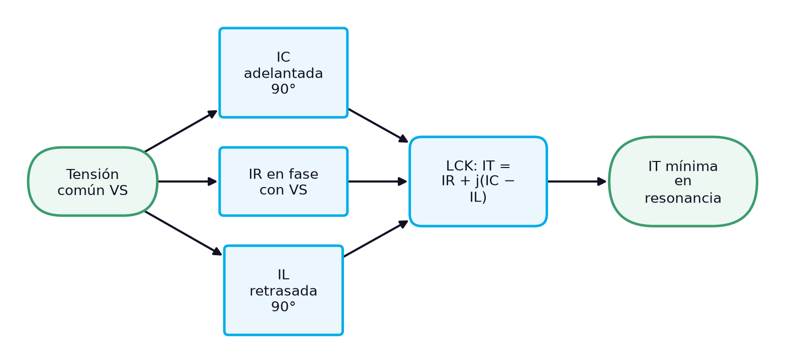
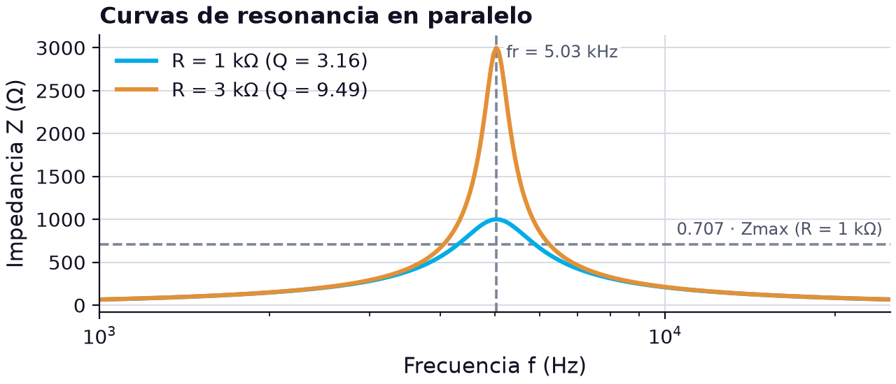
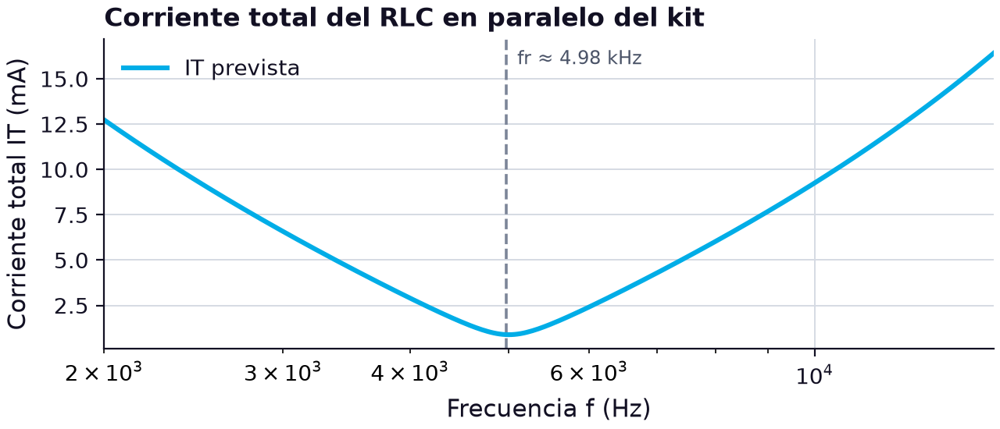

# El circuito RLC en paralelo: susceptancias opuestas, ley de corrientes de Kirchhoff, circuito tanque y corrección del factor de potencia

> **Módulos:** IEL04 — Circuitos Eléctricos I
> **Duración:** 240 minutos (sesión teórico-práctica)
> **Nivel:** Pregrado
> **Semana:** 12 de 14 (corte evaluativo 3) · **Resultado de aprendizaje del módulo:** [[IEL04-RA4]] · **Trabajo independiente:** 5 h/semana

---

## 1. Metadatos de la Sesión

### 1.1 Continuidad curricular

La semana 11 abrió el RA4 con el circuito RLC en serie: reactancias que se restan, tensiones reactivas mayores que la de la fuente y una resonancia con impedancia mínima. Esta sesión estudia la configuración dual, los tres elementos en paralelo: las susceptancias capacitiva e inductiva se oponen, las corrientes de la bobina y del condensador se restan en la ley de corrientes de Kirchhoff y pueden superar la corriente de la fuente, y la resonancia en paralelo presenta una impedancia máxima. Se retoma el circuito tanque de la semana 3, ahora con la bobina real, y se aplica todo a la corrección del factor de potencia. La semana 13 cierra el curso con el cálculo y la medición de parámetros de circuitos RLC en serie y en paralelo.

1. Semana 11: Circuito RLC en serie: análisis y Ley de Voltajes de Kirchhoff
2. **→ Presente sesión (semana 12):** Circuito RLC en paralelo: análisis y Ley de Corrientes de Kirchhoff
3. Semana 13: Cálculo y medición de parámetros en circuitos RLC serie y paralelo: unidades, simbología y nomenclatura

### 1.2 Prerrequisitos

- Calcular admitancias y aplicar la ley de corrientes de Kirchhoff en circuitos RC y RL en paralelo (semanas 6 y 8).
- Analizar un circuito RLC en serie y su resonancia (semana 11).
- Convertir una bobina real a su modelo en paralelo con R_p = R_W(1 + Q²) (semana 9).
- Calcular potencia activa, reactiva y aparente y factor de potencia (semanas 9 y 11).
- Medir corrientes con resistores sensores y el osciloscopio.

---

## 2. Resultados de Aprendizaje

**RA IEL04-RA4:** Calcular un circuito resistivo, inductivo, capacitivo y RLC, sea en serie o paralelo.

**Criterios de evaluación:**
- **CE1** (cognitiva_conceptual): Identificar los tipos de resistores, inductores y capacitores.
- **CE2** (manipulacion_fisica): Realizar mediciones en un circuito resistivo, inductivo y capacitivo.
- **CE3** (manipulacion_fisica): Realizar mediciones en un circuito RLC.

**Unidades de competencia de la asignatura:**
- [[UC2]]: Coordinar actividades asociadas a sistemas eléctricos utilizando fuentes convencionales y no convencionales de energía.

Al finalizar la sesión, el estudiante estará en capacidad de lograr los siguientes resultados, que desarrollan el RA del módulo:

| # | Resultado de aprendizaje | Nivel (Taxonomía de Bloom) |
| --- | --- | --- |
| RA1 | **Identificar** y verificar el resistor, la bobina y el condensador de un circuito RLC en paralelo antes del montaje. (CE1) | Aplicar |
| RA2 | **Calcular** la admitancia, la impedancia y el carácter de un circuito RLC en paralelo a una frecuencia dada. (CE3) | Aplicar |
| RA3 | **Analizar** las corrientes de un circuito RLC en paralelo con la ley de corrientes de Kirchhoff y explicar la resonancia en paralelo y el circuito tanque real. (CE3) | Analizar |
| RA4 | **Medir** las corrientes de rama y la corriente total de un RLC en paralelo a varias frecuencias y verificar la resonancia. (CE2, CE3) | Evaluar |

---

## 3. Índice Temporizado (240 minutos)

| Bloque | Contenido | Duración |
| --- | --- | --- |
| 1 | Del RLC en serie al RLC en paralelo: tensión común y corrientes reactivas opuestas | 20 min |
| 2 | Y = G + j(BC − BL), carácter inductivo o capacitivo según la frecuencia | 30 min |
| 3 | IT = IR + j(IC − IL): corrientes reactivas en oposición y mayores que la total | 35 min |
| 4 | fr, Z = R, Q = R/XL, ancho de banda y curva de impedancia | 35 min |
| 5 | Equivalente RLC en paralelo, Rp(eq) = RW(Q² + 1) y desplazamiento de la resonancia | 30 min |
| 6 | Compensar la corriente reactiva de una carga inductiva y dimensionar el condensador | 30 min |
| 7 | Con el kit: 4.7 kΩ, bobina de 10.4 mH y condensador de 97.8 nF a 3 kHz, fr y 8 kHz | 45 min |
| 8 | Síntesis, cierre actitudinal y bibliografía | 15 min |
|  | **Total** | **240 min** |

---

## 4. Desarrollo Teórico

### 4.1 Introducción Conceptual (Bloque 1)

En la semana 11, el resistor, la bobina y el condensador compartían la corriente, y sus tensiones reactivas, opuestas, se restaban. Si los mismos tres elementos se conectan en paralelo, todo se invierte: la tensión es común a las tres ramas y lo que se reparte es la corriente. La corriente de la bobina se retrasa 90° respecto a la tensión y la del condensador se adelanta 90°, de modo que ambas quedan desfasadas 180° y se restan en el nodo. Es la versión en paralelo de la cancelación de reactancias, y su consecuencia más visible es sorprendente: las corrientes de rama pueden ser mucho mayores que la corriente que entrega la fuente.

El circuito RLC en paralelo aparece en tres contextos que el técnico en sistemas eléctricos encuentra a menudo. Es el **circuito tanque** de los osciladores y de los sintonizadores, que guarda energía en el campo magnético de la bobina y en el campo eléctrico del condensador y la transfiere de uno a otro en cada semiciclo [1]. Es el modelo de una **carga industrial con condensadores de compensación**, en la que un condensador en paralelo con una carga inductiva aumenta su factor de potencia [1]. Y es el modelo de un **filtro de armónicos** sintonizado. En los tres casos lo que interesa es la resonancia en paralelo, en la que la impedancia del circuito es máxima.

*Figura 1. Relaciones de fase en el circuito RLC en paralelo: de la tensión común a la corriente total*

El diagrama resume el razonamiento de la sesión. La tensión común da lugar a tres corrientes de rama con fases distintas; la ley de corrientes de Kirchhoff las suma como fasores, y las corrientes de la bobina y del condensador se restan. Cuando son iguales, en la resonancia, se cancelan y la fuente solo entrega la corriente del resistor: la corriente total es mínima y la impedancia máxima. La sesión desarrolla la admitancia del circuito, la ley de corrientes de Kirchhoff, la resonancia en paralelo, el circuito tanque con la bobina real —cuya resistencia de devanado cambia el resultado— y la corrección del factor de potencia, y termina midiendo el circuito en el laboratorio con los componentes del kit.

> **Nota pedagógica:** Conviene tener a la vista la tabla de la semana 11 al estudiar esta sesión: casi cada resultado del RLC en paralelo es el del RLC en serie con tensión y corriente, impedancia y admitancia, y mínimo y máximo intercambiados.

### 4.2 Conceptos Clave

#### 4.2.1 Admitancia e impedancia del circuito RLC en paralelo (Bloque 2)

En paralelo, como se vio en las semanas 6 y 8, conviene trabajar con admitancias: se suman directamente, igual que las impedancias en serie. Cada rama aporta la suya. El resistor, una conductancia $G = 1/R$ a 0°; el condensador, una susceptancia capacitiva $B_C = 2\pi f C$ a +90°; y la bobina, una susceptancia inductiva $B_L = 1/(2\pi f L)$ a −90°. Las dos susceptancias apuntan en sentidos opuestos del eje imaginario y se restan, igual que en serie se restaban las reactancias. La admitancia total y la impedancia, su recíproca, son:

$$
\mathbf{Y} = G + j(B_C - B_L) = \sqrt{G^{2} + (B_C - B_L)^{2}}\ \angle \tan^{-1}\!\left(\frac{B_C - B_L}{G}\right), \qquad \mathbf{Z} = \frac{1}{\mathbf{Y}}
$$

donde $\mathbf{Y}$ es la admitancia total en siemens (S), $G$ la conductancia del resistor en siemens, $B_C$ y $B_L$ las susceptancias capacitiva e inductiva en siemens, y $\mathbf{Z}$ la impedancia total en ohmios (Ω). Floyd llega a la misma estructura a partir de las impedancias de cada rama, y señala que, como en serie, la inductancia y la capacitancia tienen efectos opuestos sobre el ángulo de fase [1]. El carácter del circuito se lee en el signo de $B_C - B_L$, pero con el criterio inverso al del serie: cuando $B_L > B_C$, la bobina conduce más corriente que el condensador y el circuito es **inductivo**; cuando $B_C > B_L$, es **capacitivo**.

Como $B_L$ disminuye con la frecuencia y $B_C$ aumenta, el carácter se invierte respecto al RLC en serie: **por debajo de la resonancia el circuito en paralelo es inductivo y por encima es capacitivo**. La razón física es sencilla: a frecuencias bajas la bobina es casi un cortocircuito y domina, y a frecuencias altas el que se comporta casi como un cortocircuito es el condensador. La tabla lo muestra con $R = 1\ \text{k}\Omega$, $L = 10\ \text{mH}$ y $C = 0.1\ \mu\text{F}$.

**Tabla 1.** Admitancia e impedancia de un RLC en paralelo ideal (R = 1 kΩ, L = 10 mH, C = 0.1 µF) a varias frecuencias

| f (Hz) | G (mS) | BC (mS) | BL (mS) | Y (mS) | Z (Ω) | Ángulo de Z (°) | Carácter |
| --- | --- | --- | --- | --- | --- | --- | --- |
| 2000 | 1.00 | 1.26 | 7.96 | 6.78 | 147.6 | +81.5 | inductivo |
| 4000 | 1.00 | 2.51 | 3.98 | 1.78 | 563.5 | +55.7 | inductivo |
| 5033 (fr) | 1.00 | 3.16 | 3.16 | 1.00 | 1000 | 0.0 | resistivo |
| 6000 | 1.00 | 3.77 | 2.65 | 1.50 | 666.9 | −48.2 | capacitivo |
| 10 000 | 1.00 | 6.28 | 1.59 | 4.80 | 208.5 | −78.0 | capacitivo |

La tabla muestra que la impedancia del paralelo alcanza su **máximo** en la resonancia, donde las susceptancias se cancelan y la admitancia se reduce a $G$: la impedancia es simplemente $R$, 1 kΩ. Lejos de la resonancia, una de las dos ramas reactivas deriva casi toda la corriente y la impedancia cae a unos cientos de ohmios. Es exactamente lo contrario del circuito en serie, cuya impedancia era mínima en la resonancia. Los ángulos de la tabla también son los opuestos a los del serie de la semana 11 a las mismas frecuencias, y sus magnitudes coinciden, porque con estos valores numéricos $R$ del paralelo y $1/R$ del serie juegan papeles equivalentes.

Si el circuito lleva una bobina real, su resistencia de devanado no está en paralelo sino en serie con la inductancia, dentro de la misma rama. Para usar las fórmulas de esta unidad hay que convertirla a su modelo en paralelo, como se hizo en la semana 9; la unidad sobre el circuito tanque real desarrolla ese paso.

> **Error frecuente:** Aplicar al paralelo el criterio del serie y concluir que por debajo de la resonancia el circuito es capacitivo. En paralelo manda la rama que más corriente conduce, y a frecuencias bajas esa rama es la bobina.

#### 4.2.2 Ley de corrientes de Kirchhoff en el circuito RLC en paralelo (Bloque 3)

La ley de corrientes de Kirchhoff se aplica en el nodo donde la corriente de la fuente se divide entre las tres ramas. Con la tensión común como referencia, cada corriente de rama es la tensión multiplicada por la admitancia de su rama: $I_R = V_S G$, en fase con la tensión; $I_C = V_S B_C$, adelantada 90°; e $I_L = V_S B_L$, retrasada 90°. Las corrientes de la bobina y del condensador están desfasadas 180° entre sí y se restan, así que la corriente total es:

$$
\mathbf{I}_T = I_R + j(I_C - I_L), \qquad I_T = \sqrt{I_R^{2} + (I_C - I_L)^{2}}, \qquad \theta = \tan^{-1}\!\left(\frac{I_C - I_L}{I_R}\right)
$$

donde $\mathbf{I}_T$ es el fasor de la corriente total en amperios (A), $I_R$, $I_C$ e $I_L$ las corrientes eficaces del resistor, el condensador y la bobina en amperios, y $\theta$ el ángulo de la corriente total respecto a la tensión en grados (°): positivo si la corriente adelanta (circuito capacitivo) y negativo si se retrasa (inductivo). La corriente reactiva neta, $I_C - I_L$, forma el cateto vertical del triángulo de corrientes.

La consecuencia es la dual de la del RLC en serie: **las corrientes de la bobina y del condensador pueden ser mayores que la corriente total que entrega la fuente**. Con $R = 1\ \text{k}\Omega$, $L = 10\ \text{mH}$, $C = 0.1\ \mu\text{F}$ y 2 V eficaces, a 4 kHz: $I_R = 2.00\ \text{mA}$, $I_C = 2 \times 2.513 = 5.03\ \text{mA}$ e $I_L = 2 \times 3.979 = 7.96\ \text{mA}$. La corriente total es $\sqrt{2.00^2 + (5.03 - 7.96)^2} \approx 3.55\ \text{mA}$, retrasada 55.7°: la bobina conduce más del doble de la corriente de la fuente. La suma aritmética de las tres corrientes daría 15.0 mA; la fasorial, los 3.55 mA reales.

**Tabla 2.** Corrientes de un RLC en paralelo ideal (R = 1 kΩ, L = 10 mH, C = 0.1 µF, VS = 2 V eficaces)

| f (Hz) | IR (mA) | IL (mA) | IC (mA) | IT (mA) | θ (°) | Carácter |
| --- | --- | --- | --- | --- | --- | --- |
| 2000 | 2.00 | 15.92 | 2.51 | 13.56 | −81.5 | inductivo |
| 4000 | 2.00 | 7.96 | 5.03 | 3.55 | −55.7 | inductivo |
| 5033 (fr) | 2.00 | 6.32 | 6.32 | 2.00 | 0.0 | resistivo |
| 10 000 | 2.00 | 3.18 | 12.57 | 9.59 | +78.0 | capacitivo |

En la resonancia, las corrientes de la bobina y del condensador son iguales, 6.32 mA cada una, y se cancelan por completo: la fuente solo entrega los 2.00 mA del resistor, que es la **corriente mínima** del circuito. Las corrientes reactivas son $Q$ veces la corriente total, con $Q = R/X_L = 1000/316.2 = 3.16$. Esa corriente de 6.32 mA no pasa por la fuente: circula entre la bobina y el condensador, que es la imagen en corriente del intercambio de energía del circuito tanque. En la semana 11 era la tensión de los elementos reactivos la que valía $Q$ veces la de la fuente; aquí es su corriente.

Las columnas de la tabla también muestran por qué el carácter del circuito cambia con la frecuencia. La corriente del resistor es constante; la de la bobina cae a medida que sube la frecuencia; la del condensador crece. Por debajo de la resonancia gana la bobina, la corriente total se retrasa y el circuito es inductivo; por encima gana el condensador y la corriente total se adelanta. En ambos extremos la corriente total crece mucho, porque una de las ramas reactivas se acerca a un cortocircuito.

> **Advertencia de seguridad:** En un circuito tanque de potencia, la corriente que circula entre la bobina y el condensador en la resonancia puede ser muchas veces la de la línea. Los conductores, las conexiones y los propios componentes deben dimensionarse para esa corriente interna, no para la que marca el amperímetro de la fuente.

#### 4.2.3 Resonancia en paralelo: impedancia máxima y corriente mínima (Bloque 4)

La resonancia en paralelo ocurre cuando las susceptancias capacitiva e inductiva son iguales, $B_C = B_L$, lo que equivale a $X_L = X_C$. Para un circuito ideal, sin resistencia en la bobina, la frecuencia se determina con la misma fórmula del circuito resonante en serie [1]. Al circuito LC resonante en paralelo se le llama **circuito tanque**, porque guarda energía en el campo magnético de la bobina y en el campo eléctrico del condensador, y la transfiere de uno a otro en semiciclos alternos [1]. Idealmente, la impedancia de un circuito resonante en paralelo es infinita; en la práctica, es máxima en la frecuencia de resonancia y disminuye a frecuencias más bajas y más altas [1].

$$
f_r = \frac{1}{2\pi\sqrt{LC}}, \qquad Z_r = R, \qquad I_{T,min} = \frac{V_S}{R}, \qquad Q = \frac{R}{X_L}, \qquad AB = \frac{f_r}{Q}
$$

donde $f_r$ es la frecuencia de resonancia en hercios (Hz), $L$ la inductancia en henrios (H), $C$ la capacitancia en faradios (F), $Z_r$ la impedancia en la resonancia en ohmios (Ω), $R$ la resistencia en paralelo en ohmios, $I_{T,min}$ la corriente total mínima en amperios (A), $V_S$ la tensión eficaz de la fuente en voltios (V), $Q$ el factor de calidad del circuito en paralelo (adimensional), con $X_L$ evaluada en $f_r$, y $AB$ el ancho de banda en hercios. Obsérvese que el factor de calidad del paralelo es $R/X_L$, el inverso del serie: en paralelo, una resistencia **grande** hace el circuito más selectivo, porque deriva poca corriente y deja que la bobina y el condensador dominen.

Con $L = 10\ \text{mH}$ y $C = 0.1\ \mu\text{F}$, $f_r = 5.03\ \text{kHz}$ y $X_L = 316\ \Omega$. Con $R = 1\ \text{k}\Omega$, la impedancia máxima es 1 kΩ, $Q = 3.16$ y el ancho de banda de 1.59 kHz; con $R = 3\ \text{k}\Omega$, la impedancia máxima sube a 3 kΩ, $Q = 9.49$ y el ancho de banda se estrecha a unos 530 Hz. El ancho de banda se mide entre las dos frecuencias en las que la impedancia, y con ella la tensión en el tanque para una corriente constante, cae al 70.7 % de su máximo. La gráfica compara ambas curvas.

*Figura 2. Impedancia de un RLC en paralelo (L = 10 mH, C = 0.1 µF) en función de la frecuencia para R = 1 kΩ y R = 3 kΩ*

La gráfica es la imagen invertida de las curvas de corriente de la semana 11: allí la corriente tenía un pico en la resonancia; aquí es la impedancia la que lo tiene, y la corriente total presenta un valle. Por eso un circuito tanque conectado entre la salida de un amplificador y tierra deja pasar a su frecuencia de resonancia y cortocircuita las demás: es un **filtro que rechaza** todas las frecuencias menos una. Y, a la inversa, un tanque en serie con una línea bloquea precisamente su frecuencia de resonancia, que es el principio de los filtros de rechazo de banda.

Hay que tener en cuenta que la resistencia $R$ de estas fórmulas es toda la resistencia en paralelo con el tanque, incluida la resistencia de entrada de cualquier instrumento o carga que se le conecte. Un osciloscopio de 1 MΩ apenas influye, pero una carga de unos pocos kilohmios reduce el factor de calidad y ensancha la resonancia, del mismo modo que lo hace la resistencia de devanado de la bobina real, que se trata en la siguiente unidad.

> **Error frecuente:** Usar para el paralelo el factor de calidad del serie, $Q = X_L/R$. Con $R = 1\ \text{k}\Omega$ daría 0.32 en lugar de 3.16. La comprobación rápida es física: en paralelo, un resistor muy grande casi no interviene y el circuito se acerca al tanque ideal, de $Q$ muy alto.

#### 4.2.4 El circuito tanque con bobina real (Bloque 5)

El circuito tanque ideal supone una bobina sin resistencia. Un tratamiento práctico de los circuitos resonantes en paralelo debe incluir la resistencia de la bobina [1], y el resultado cambia de forma apreciable: la resistencia de devanado está **en serie** con la inductancia, dentro de la rama de la bobina, así que el circuito ya no es un RLC en paralelo puro. La solución es la que se usó en la semana 9: convertir la bobina real a su equivalente en paralelo. El factor de calidad del circuito tanque en resonancia es simplemente el factor $Q$ de la bobina, y la inductancia y la resistencia equivalentes en paralelo son [1]:

$$
Q = \frac{X_L}{R_W}, \qquad L_{eq} = L\left(\frac{Q^{2} + 1}{Q^{2}}\right), \qquad R_{p(eq)} = R_W\,(Q^{2} + 1)
$$

donde $Q$ es el factor de calidad de la bobina (adimensional), $X_L$ su reactancia a la frecuencia de resonancia en ohmios (Ω), $R_W$ su resistencia de devanado en ohmios, $L_{eq}$ la inductancia equivalente en paralelo en henrios (H), $L$ la inductancia real en henrios, y $R_{p(eq)}$ la resistencia equivalente en paralelo en ohmios. Para $Q \geq 10$, $L_{eq} \approx L$ [1]. En el equivalente, $R_{p(eq)}$ queda en paralelo con una bobina ideal y un condensador, que en la resonancia actúan como un tanque ideal de impedancia infinita; por consiguiente, la impedancia total del tanque no ideal en la resonancia es simplemente la resistencia equivalente en paralelo [1].

La resistencia de devanado tiene además un efecto sobre la propia frecuencia de resonancia. Si se define la resonancia como la frecuencia en la que la corriente total queda en fase con la tensión, la condición exacta es $f_r = \sqrt{1 - R_W^2 C/L}\,/\,(2\pi\sqrt{LC})$, un poco por debajo del valor ideal. Con $Q \geq 10$ la diferencia es despreciable y se puede usar la fórmula aproximada $f_r \approx 1/(2\pi\sqrt{LC})$ [1]; con $Q$ bajo, el desplazamiento es apreciable. La tabla lo cuantifica para la bobina L3 del kit (10.4 mH) con el condensador C2 (97.8 nF), cuya resonancia ideal es de 4990 Hz, y para dos bobinas hipotéticas de la misma inductancia con más resistencia de devanado.

**Tabla 3.** Efecto de la resistencia de devanado en un tanque con L = 10.4 mH y C = 97.8 nF (resonancia ideal: 4990 Hz, XL = 326.1 Ω)

| RW (Ω) | Q = XL/RW | Rp(eq) = RW(Q² + 1) (Ω) | fr con corriente en fase (Hz) | Desplazamiento |
| --- | --- | --- | --- | --- |
| 24.6 (L3 del kit) | 13.3 | 4349 | 4976 | −0.3 % |
| 50 | 6.52 | 2176 | 4931 | −1.2 % |
| 100 | 3.26 | 1163 | 4750 | −4.8 % |

La tabla muestra dos efectos. El primero es que una resistencia de devanado pequeña equivale a una resistencia en paralelo grande: los 24.6 Ω de L3 se comportan, en la resonancia, como 4.35 kΩ en paralelo con el tanque, y esa resistencia fija la impedancia máxima y la corriente mínima. El segundo es que el desplazamiento de la frecuencia de resonancia solo importa con factores de calidad bajos; con L3, un 0.3 %, menor que la tolerancia de los componentes.

Si además se conecta un resistor $R$ en paralelo con el tanque, como en el caso de estudio, la resistencia total en paralelo es la combinación de $R$ con $R_{p(eq)}$, tal como Floyd hace al analizar un tanque con un resistor de carga [1]. Con $R = 4.7\ \text{k}\Omega$: $R_{p,tot} = (4349)(4700)/(4349 + 4700) \approx 2259\ \Omega$. El factor de calidad del conjunto baja a $2259/326.1 \approx 6.9$ y el ancho de banda es de unos $4990/6.9 \approx 720\ \text{Hz}$: la carga y la bobina real, juntas, ensanchan la resonancia.

> **Error frecuente:** Suponer que la impedancia máxima de un tanque real es infinita, o igual a la resistencia del resistor externo. Es la combinación en paralelo de ese resistor con $R_W(Q^2 + 1)$, y con bobinas de $Q$ bajo puede ser mucho menor que el resistor externo.

#### 4.2.5 Corrección del factor de potencia con un condensador en paralelo (Bloque 6)

La aplicación más importante del RLC en paralelo en los sistemas eléctricos es la **corrección del factor de potencia**. Una carga industrial típica —motores, transformadores, balastos— es predominantemente inductiva: toma de la red una corriente con una componente resistiva, que produce trabajo, y una componente inductiva retrasada 90°, que solo magnetiza. El factor de potencia de una carga inductiva aumenta al agregar un condensador en paralelo: el condensador compensa el retraso de fase de la corriente total creando una componente capacitiva de corriente desfasada 180° respecto a la inductiva, y ese efecto de cancelación reduce tanto el ángulo de fase como la corriente total [1].

El condensador no cambia la potencia real de la carga, porque no disipa energía; solo reduce la potencia reactiva que la red debe suministrar. Si la carga toma una potencia real $P$ con un ángulo $\theta_1$ y se quiere llevar el ángulo a $\theta_2$, la potencia reactiva que debe aportar el condensador es la diferencia entre la potencia reactiva inicial y la final, y de ella se obtiene la capacitancia necesaria:

$$
Q_C = P\,(\tan\theta_1 - \tan\theta_2), \qquad C = \frac{Q_C}{2\pi f V^{2}}
$$

donde $Q_C$ es la potencia reactiva del condensador en voltamperios reactivos (VAR), $P$ la potencia real de la carga en vatios (W), $\theta_1$ y $\theta_2$ los ángulos de fase antes y después de la corrección, con $\cos\theta$ igual al factor de potencia, $C$ la capacitancia en faradios (F), $f$ la frecuencia de la red en hercios (Hz) y $V$ la tensión eficaz de la red en voltios (V). La segunda expresión sale de $Q_C = V^2/X_C = V^2 \, 2\pi f C$.

Un ejemplo con números de una instalación pequeña: una carga de 1.2 kW alimentada a 120 V y 60 Hz, con factor de potencia 0.70 en atraso, se quiere llevar a 0.95. El ángulo inicial es $\cos^{-1}0.70 = 45.6^\circ$, con $\tan\theta_1 = 1.020$; el final, $\cos^{-1}0.95 = 18.2^\circ$, con $\tan\theta_2 = 0.329$. Entonces $Q_C = 1200(1.020 - 0.329) \approx 830\ \text{VAR}$ y $C = 830/(2\pi \times 60 \times 120^2) \approx 153\ \mu\text{F}$. La tabla compara la situación antes y después.

**Tabla 4.** Corrección del factor de potencia de una carga de 1.2 kW a 120 V y 60 Hz

| Magnitud | Sin condensador | Con 153 µF en paralelo | Cambio |
| --- | --- | --- | --- |
| Potencia real P | 1200 W | 1200 W | sin cambio |
| Potencia reactiva Q | 1224 VAR | 394 VAR | −68 % |
| Potencia aparente S | 1714 VA | 1263 VA | −26 % |
| Factor de potencia | 0.70 en atraso | 0.95 en atraso | mejora |
| Corriente de línea | 14.3 A | 10.5 A | −26 % |
| Corriente del condensador | — | 6.9 A | — |

La tabla muestra el beneficio concreto: la carga sigue recibiendo sus 1.2 kW, pero la corriente de línea baja de 14.3 A a 10.5 A. Con menos corriente, los conductores, los interruptores y el transformador que alimenta la instalación trabajan más descargados, las pérdidas por efecto Joule en los conductores bajan en proporción al cuadrado de la corriente —un 46 % en este caso— y la empresa de energía deja de facturar el exceso de energía reactiva. Obsérvese que el condensador conduce 6.9 A, una corriente considerable que circula entre él y la carga sin pasar por la red: es el mismo intercambio de energía del circuito tanque.

No se corrige hasta un factor de potencia exactamente 1, por dos razones. La primera es económica: los últimos puntos de mejora requieren mucha capacitancia para un beneficio pequeño. La segunda es técnica: si la carga disminuye, un banco dimensionado para el factor 1 dejaría la instalación capacitiva, y el conjunto de la inductancia de la red y los condensadores podría acercarse a una resonancia en paralelo con alguna armónica de la corriente, con sobretensiones peligrosas.

> **Advertencia de seguridad:** Los bancos de condensadores de corrección conservan su carga tras desconectarlos. Se instalan siempre con resistencias de descarga y se verifica la ausencia de tensión antes de intervenirlos, como se vio en la semana 6.

---

## 5. Caso de Estudio Aplicado: Medición de un circuito RLC en paralelo antes, en y después de la resonancia (Bloque 7)

### 5.1 Montaje y predicción

Se conectan en paralelo tres ramas: un resistor marcado amarillo-violeta-rojo-oro, es decir, 4.7 kΩ ±5 %, que el ohmímetro mide en 4.70 kΩ; la bobina L3 del kit, con 10.4 mH y 24.6 Ω de resistencia de devanado; y el condensador C2, de 97.8 nF. Los tres se verifican antes del montaje con el ohmímetro y el medidor LCR, lo que cubre el criterio CE1. El generador aplica 2.00 V eficaces medidos en los bornes del circuito. La corriente total se mide con un resistor sensor de 10 Ω en el retorno de la fuente, y las corrientes de rama con un sensor de 1 Ω que se intercala en cada rama por turno. Las lecturas que se usan más abajo son valores de ejemplo para ilustrar el procedimiento.

Con la bobina real, la corriente total se calcula sumando las admitancias de las tres ramas en forma rectangular. La de la bobina es $1/(R_W + jX_L) = (R_W - jX_L)/(R_W^2 + X_L^2)$, así que la corriente total a cada frecuencia es:

$$
I_T = V_S\sqrt{\left(\frac{1}{R} + \frac{R_W}{R_W^{2} + X_L^{2}}\right)^{2} + \left(2\pi f C - \frac{X_L}{R_W^{2} + X_L^{2}}\right)^{2}}
$$

donde $I_T$ es la corriente total eficaz en amperios (A), $V_S$ la tensión eficaz aplicada en voltios (V), $R$ la resistencia del resistor en ohmios (Ω), $R_W$ la resistencia de devanado en ohmios, $X_L = 2\pi f L$ la reactancia de la bobina en ohmios, $f$ la frecuencia en hercios (Hz) y $C$ la capacitancia en faradios (F). En la resonancia, la unidad sobre el tanque real predice una impedancia de 2259 Ω y una corriente mínima de $2.00/2259 \approx 0.885\ \text{mA}$, a unos 4976 Hz. La gráfica muestra la corriente total prevista entre 2 kHz y 15 kHz.

*Figura 3. Corriente total prevista del RLC en paralelo con la bobina real (R = 4.7 kΩ, L = 10.4 mH, RW = 24.6 Ω, C = 97.8 nF, VS = 2 V)*

### 5.2 Resultados

**Tabla 5.** RLC en paralelo del kit con VS = 2.00 V eficaces: cálculo con la bobina real y medición (lecturas de ejemplo)

| Magnitud | 3 kHz calc. | 3 kHz med. | fr calc. (4.98 kHz) | fr med. (4.96 kHz) | 8 kHz calc. | 8 kHz med. |
| --- | --- | --- | --- | --- | --- | --- |
| IR (mA) | 0.43 | 0.43 | 0.43 | 0.43 | 0.43 | 0.43 |
| Ibob (mA) | 10.12 | 10.1 | 6.13 | 6.10 | 3.82 | 3.81 |
| IC (mA) | 3.69 | 3.70 | 6.12 | 6.08 | 9.83 | 9.82 |
| IT (mA) | 6.58 | 6.57 | 0.885 | 0.89 | 6.05 | 6.04 |
| Ángulo de IT (°) | −75.2 | — | ≈ 0 | — | +84.3 | — |
| Carácter | inductivo | — | resistivo | — | capacitivo | — |

La corriente mínima se encuentra a 4.96 kHz, a menos del 0.5 % de la prevista, y vale 0.89 mA: la fuente entrega apenas una séptima parte de la corriente que circula por la bobina o por el condensador, unos 6.1 mA cada una. Es la corriente de circulación del tanque, que no pasa por la fuente. La suma aritmética de las tres corrientes de rama en la resonancia sería 12.6 mA; la suma fasorial, con el ángulo real de la bobina, reproduce los 0.89 mA medidos. A 3 kHz domina la bobina y el circuito es inductivo; a 8 kHz domina el condensador y es capacitivo, justo al revés que el RLC en serie de la semana 11 con los mismos componentes.

La comparación con el modelo ideal es instructiva. Sin la resistencia de devanado, la impedancia en la resonancia sería la del resistor, 4.7 kΩ, y la corriente mínima 0.43 mA, la mitad de la medida. La bobina real, con su resistencia equivalente en paralelo de 4.35 kΩ, duplica la corriente mínima y reduce a la mitad el factor de calidad. Con esta práctica se completan las mediciones del RA4 en ambas conexiones.

> **Nota pedagógica:** En un RLC en paralelo, la resonancia se localiza buscando el mínimo de la corriente de la fuente, o el instante en que la tensión del resistor sensor queda en fase con la tensión aplicada. Buscar que las corrientes de la bobina y del condensador sean iguales es menos preciso con una bobina real.

---

## 6. Síntesis (Bloque 8)

El circuito RLC en paralelo es el dual del circuito en serie. La tensión es común, las susceptancias capacitiva e inductiva se oponen y la admitancia es $\mathbf{Y} = G + j(B_C - B_L)$: por debajo de la resonancia domina la bobina y el circuito es inductivo; por encima, el condensador y el circuito es capacitivo. La ley de corrientes de Kirchhoff se cumple con fasores, y las corrientes de la bobina y del condensador, desfasadas 180°, se restan, de modo que cada una puede superar a la corriente total. En la resonancia se cancelan: **la impedancia es máxima, la corriente de la fuente es mínima** y entre la bobina y el condensador circula una corriente $Q$ veces mayor, con $Q = R/X_L$. Con una bobina real, su resistencia de devanado equivale a $R_W(Q^2 + 1)$ en paralelo, fija la impedancia máxima y desplaza ligeramente la resonancia. El mismo principio de compensación explica la corrección del factor de potencia: un condensador en paralelo con una carga inductiva aporta la corriente reactiva que antes daba la red, y la corriente de línea baja sin que cambie la potencia útil. El caso con los componentes del kit confirmó la resonancia en 4.96 kHz, con una corriente total siete veces menor que la de cada rama reactiva, y mostró que solo el modelo con la bobina real predice la corriente mínima medida. La semana 13 integra los circuitos RLC en serie y en paralelo.

### Componente Actitudinal

> *Instalar un banco de condensadores sin calcular antes la corriente que circulará por él, o sin sus resistencias de descarga, pone en riesgo a quien lo intervenga después: el trabajo técnico responsable piensa también en el compañero del siguiente turno.*

---

## 7. Bibliografía (Formato IEEE)

[1] T. L. Floyd, Principios de circuitos eléctricos, 8.ª ed. México: Pearson Educación, 2007.

[2] R. L. Boylestad, Introducción al análisis de circuitos, 10.ª ed. México: Pearson Educación, 2004.

[3] M. F. P. Deorsola y P. Morcelle del Valle, Circuitos eléctricos. Parte 1, 1.ª ed. La Plata: Editorial de la Universidad de La Plata, 2017.
