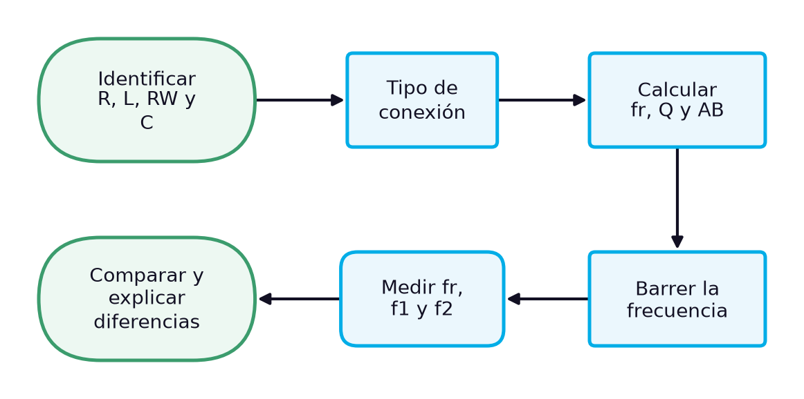
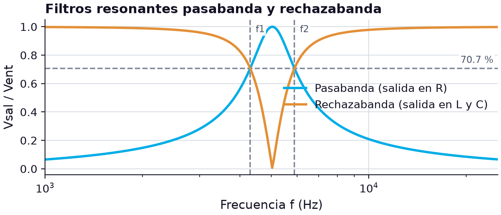
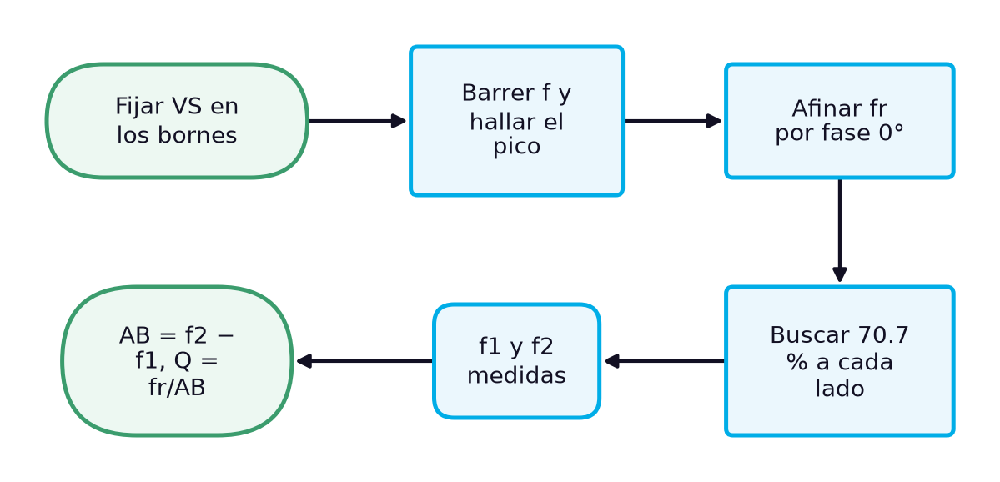

# Cálculo y medición de parámetros en circuitos RLC en serie, en paralelo y mixtos: filtros resonantes, frecuencia de resonancia, ancho de banda y nomenclatura

> **Módulos:** IEL04 — Circuitos Eléctricos I
> **Duración:** 240 minutos (sesión teórico-práctica)
> **Nivel:** Pregrado
> **Semana:** 13 de 14 (corte evaluativo 3) · **Resultado de aprendizaje del módulo:** [[IEL04-RA4]] · **Trabajo independiente:** 5 h/semana

---

## 1. Metadatos de la Sesión

### 1.1 Continuidad curricular

Las semanas 11 y 12 analizaron el circuito RLC en serie y en paralelo, con sus leyes de Kirchhoff y sus resonancias, y aplicaron la compensación de reactancias a la corrección del factor de potencia. Esta última sesión del curso cierra el RA4 y, con él, el semestre: compara de forma sistemática ambas conexiones, resuelve un circuito RLC mixto, presenta los filtros resonantes pasabanda y rechazabanda, organiza los métodos para medir la frecuencia de resonancia, el ancho de banda y el factor de calidad, y reúne en un cuadro los parámetros, unidades, símbolos y nomenclatura de todo el curso. La semana 14 es la evaluación final.

1. Semana 12: Circuito RLC en paralelo: análisis y Ley de Corrientes de Kirchhoff
2. **→ Presente sesión (semana 13):** Cálculo y medición de parámetros en circuitos RLC serie y paralelo: unidades, simbología y nomenclatura
3. Semana 14: evaluación (semana de examen)

### 1.2 Prerrequisitos

- Calcular impedancia, corrientes y tensiones de circuitos RLC en serie y en paralelo (semanas 11 y 12).
- Calcular la frecuencia de resonancia, el factor de calidad y el ancho de banda de un circuito resonante.
- Convertir una bobina real a su equivalente en paralelo (semanas 9 y 12).
- Aplicar el método general de análisis fasorial (semana 7).
- Medir amplitudes y desfases con el osciloscopio y barrer frecuencias con el generador.

---

## 2. Resultados de Aprendizaje

**RA IEL04-RA4:** Calcular un circuito resistivo, inductivo, capacitivo y RLC, sea en serie o paralelo.

**Criterios de evaluación:**
- **CE1** (cognitiva_conceptual): Identificar los tipos de resistores, inductores y capacitores.
- **CE2** (manipulacion_fisica): Realizar mediciones en un circuito resistivo, inductivo y capacitivo.
- **CE3** (manipulacion_fisica): Realizar mediciones en un circuito RLC.

**Unidades de competencia de la asignatura:**
- [[UC2]]: Coordinar actividades asociadas a sistemas eléctricos utilizando fuentes convencionales y no convencionales de energía.

Al finalizar la sesión, el estudiante estará en capacidad de lograr los siguientes resultados, que desarrollan el RA del módulo:

| # | Resultado de aprendizaje | Nivel (Taxonomía de Bloom) |
| --- | --- | --- |
| RA1 | **Identificar** los componentes de un circuito RLC y los parámetros que caracterizan cada tipo de conexión. (CE1) | Aplicar |
| RA2 | **Calcular** la respuesta de circuitos RLC mixtos y de filtros resonantes pasabanda y rechazabanda. (CE3) | Aplicar |
| RA3 | **Diferenciar** los parámetros de los circuitos RLC en serie y en paralelo con sus unidades, simbología y nomenclatura. (CE3) | Analizar |
| RA4 | **Medir** la frecuencia de resonancia, las frecuencias de corte, el ancho de banda y el factor de calidad de un filtro RLC y evaluar la concordancia con el cálculo. (CE2, CE3) | Evaluar |

---

## 3. Índice Temporizado (240 minutos)

| Bloque | Contenido | Duración |
| --- | --- | --- |
| 1 | Qué parámetros definen un circuito RLC y cómo se obtienen por cálculo y por medición | 20 min |
| 2 | Magnitud común, ley de Kirchhoff, resonancia, Q y comportamiento en frecuencia | 30 min |
| 3 | Reducción del tanque real y tensión de salida en función de la frecuencia | 35 min |
| 4 | Frecuencias de corte, ancho de banda y respuesta de los filtros RLC en serie | 35 min |
| 5 | Barrido de frecuencia, criterio de fase, puntos de 70.7 % y Q = fr/AB | 30 min |
| 6 | Cuadro final de magnitudes del curso: R, L, C, X, B, Z, Y, fr, Q, AB, P, Q, S y FP | 25 min |
| 7 | Medir fr, f1, f2, AB y Q del filtro formado con 100 Ω, L3 y C2 y compararlos con el cálculo | 50 min |
| 8 | Síntesis, cierre actitudinal y bibliografía | 15 min |
|  | **Total** | **240 min** |

---

## 4. Desarrollo Teórico

### 4.1 Introducción Conceptual (Bloque 1)

Al llegar a la última sesión del curso, el estudiante sabe calcular la impedancia de cualquier combinación de resistores, bobinas y condensadores a una frecuencia dada. En el trabajo técnico, sin embargo, la pregunta suele ser otra: no qué corriente hay a 3 kHz, sino **cómo se comporta el circuito en todo un intervalo de frecuencias**, y con qué números se describe ese comportamiento. Para los circuitos RLC, esos números son pocos y muy informativos: la frecuencia de resonancia, el factor de calidad, el ancho de banda con sus dos frecuencias de corte y la impedancia en la resonancia. Con ellos se especifica un filtro, se sintoniza un oscilador o se verifica que un banco de condensadores no resuene con una armónica de la red.

Esta sesión organiza esos parámetros desde dos lados: el cálculo y la medición. Del lado del cálculo, compara de forma sistemática las conexiones en serie y en paralelo, resuelve un circuito mixto y presenta los filtros resonantes, cuya respuesta se describe con la frecuencia central y el ancho de banda [1]. Del lado de la medición, reúne los métodos para localizar la resonancia y las frecuencias de corte con el generador y el osciloscopio. Un filtro rechazabanda, por ejemplo, deja pasar todas las frecuencias excepto las que quedan dentro de cierta banda de rechazo [1], y se caracteriza con los mismos números que un pasabanda. El diagrama muestra cómo se encadenan cálculo y medición.

*Figura 1. Caracterización de un circuito RLC: del cálculo de sus parámetros a su verificación en el laboratorio*

El diagrama es, en esencia, el procedimiento que el curso ha repetido desde la semana 1: identificar y verificar los componentes, calcular, medir y explicar las diferencias. Lo nuevo es que ahora la medición no se hace a una sola frecuencia sino barriendo un intervalo, y que la comparación se hace sobre parámetros —frecuencia de resonancia, ancho de banda y factor de calidad— que resumen toda una curva. El caso final caracteriza un filtro pasabanda construido con la bobina y el condensador del kit, los mismos componentes que se han usado desde la semana 3.

> **Nota pedagógica:** Esta sesión es también un repaso para la evaluación final de la semana 14. El cuadro de parámetros y unidades de la unidad 6 reúne las magnitudes de todo el curso y conviene usarlo como guía de estudio.

### 4.2 Conceptos Clave

#### 4.2.1 Comparación sistemática de los circuitos RLC en serie y en paralelo (Bloque 2)

Los circuitos RLC en serie y en paralelo son duales: casi cada resultado de uno se obtiene del otro intercambiando tensión y corriente, impedancia y admitancia, resistencia y conductancia, y mínimo y máximo. Esta dualidad no es una curiosidad matemática; es la mejor herramienta para no confundir las fórmulas. En serie, la magnitud común es la corriente, las reactancias se restan y la ley que reparte es la de voltajes; en paralelo, la común es la tensión, las susceptancias se restan y la ley que reparte es la de corrientes. En ambos casos la resonancia ocurre cuando $X_L = X_C$, y, para un circuito ideal, la frecuencia se determina con la misma fórmula [1].

La diferencia más importante está en qué ocurre en la resonancia. En serie, la impedancia es mínima e igual a la resistencia, y la corriente es máxima; en paralelo, la impedancia es máxima —idealmente infinita, en la práctica máxima en la frecuencia de resonancia [1]— y la corriente de la fuente es mínima. Esa diferencia define sus usos: el RLC en serie deja pasar la corriente de una sola frecuencia; el paralelo, conectado a través de una línea, presenta una impedancia alta a una sola frecuencia. La tabla reúne las comparaciones con los resultados de las semanas 11 y 12, obtenidos con la misma bobina de 10.4 mH y el mismo condensador de 97.8 nF.

**Tabla 1.** Comparación de los circuitos RLC en serie y en paralelo

| Característica | RLC en serie (semana 11) | RLC en paralelo (semana 12) |
| --- | --- | --- |
| Magnitud común | corriente | tensión |
| Suma natural | Z = R + j(XL − XC) | Y = G + j(BC − BL) |
| Ley de Kirchhoff que reparte | LVK: VS = VR + j(VL − VC) | LCK: IT = IR + j(IC − IL) |
| Por debajo de fr | capacitivo | inductivo |
| Por encima de fr | inductivo | capacitivo |
| En la resonancia | Z mínima = R; I máxima | Z máxima = Rp; I mínima |
| Magnitud que se multiplica por Q | tensiones en L y C: Q·VS | corrientes en L y C: Q·IT |
| Factor de calidad | Q = XL / R | Q = R / XL |
| Una R mayor | reduce Q | aumenta Q |
| Efecto de RW de la bobina | se suma a R | equivale a RW(Q² + 1) en paralelo |
| Resonancia medida con el kit | 4.97 kHz | 4.96 kHz |
| Uso típico | filtro pasabanda en serie, compensación | circuito tanque, rechazo de banda, compensación de FP |

La tabla contiene una regla práctica para el factor de calidad que a menudo se olvida: en serie, una resistencia **pequeña** hace el circuito más selectivo, porque limita menos la corriente en la resonancia; en paralelo, una resistencia **grande** lo hace más selectivo, porque deriva menos corriente. En los dos casos, la resistencia de devanado de la bobina empeora el factor de calidad, pero por caminos distintos: en serie se suma directamente a $R$, y en paralelo aparece como una resistencia equivalente $R_W(Q^2 + 1)$ que se combina con la del circuito.

La última fila de mediciones confirma que la frecuencia de resonancia depende solo de $L$ y $C$ y no de la conexión: con los mismos componentes, el circuito en serie resonó en 4.97 kHz y el paralelo en 4.96 kHz, prácticamente la misma frecuencia que el circuito tanque de la semana 3. La pequeña diferencia del paralelo se explica por el desplazamiento que produce la resistencia de devanado cuando se define la resonancia por la fase de la corriente total, analizado en la semana 12.

> **Nota pedagógica:** Para decidir con rapidez si un circuito es inductivo o capacitivo, conviene preguntar qué elemento «manda» a esa frecuencia: en serie manda el de mayor reactancia; en paralelo, el de menor reactancia, porque es el que conduce más corriente.

#### 4.2.2 Circuitos RLC mixtos: resistor en serie con un circuito tanque (Bloque 3)

Un circuito RLC mixto muy frecuente es un resistor $R_1$ en serie con un circuito tanque, con la salida tomada en el tanque. Es el esquema de muchas etapas sintonizadas: el resistor representa la resistencia de salida de la etapa anterior, y el tanque selecciona la frecuencia que pasa a la siguiente. Floyd dedica una sección al análisis de circuitos RLC en serie-paralelo, con el mismo procedimiento de reducción que los circuitos RC y RL [1]: se reduce primero el tanque, incluyendo la resistencia de devanado de la bobina, y después se aplica el divisor de tensión fasorial entre $R_1$ y el tanque.

$$
\mathbf{Z}_p = \frac{1}{j2\pi f C + \dfrac{1}{R_W + j2\pi f L}}, \qquad \frac{\mathbf{V}_{sal}}{\mathbf{V}_S} = \frac{\mathbf{Z}_p}{R_1 + \mathbf{Z}_p}
$$

donde $\mathbf{Z}_p$ es la impedancia del tanque real en ohmios (Ω), $f$ la frecuencia en hercios (Hz), $C$ la capacitancia en faradios (F), $L$ la inductancia en henrios (H), $R_W$ la resistencia de devanado en ohmios, $R_1$ la resistencia en serie en ohmios, y $\mathbf{V}_{sal}/\mathbf{V}_S$ la relación fasorial entre la tensión de salida en el tanque y la de la fuente (adimensional). En la resonancia, la impedancia del tanque no ideal es simplemente su resistencia equivalente en paralelo [1], $R_W(Q^2 + 1)$, y la relación se vuelve real.

Con $R_1 = 1\ \text{k}\Omega$, la bobina L3 (10.4 mH y 24.6 Ω) y el condensador C2 (97.8 nF), a tres frecuencias. En la resonancia (4976 Hz), el tanque presenta $Z_p = 4349\ \Omega$, resistivo, y la salida es $4349/(1000 + 4349) \approx 0.813$ veces la entrada. A 3 kHz, la admitancia de la bobina es $1/(24.6 + j196.0) = 0.630 - j5.022\ \text{mS}$ y la del condensador $+j1.844\ \text{mS}$; sumadas dan $0.630 - j3.179\ \text{mS}$, de modo que $\mathbf{Z}_p = 60.0 + j302.7\ \Omega = 308.6 \angle 78.8^\circ\ \Omega$, inductiva. La impedancia total es $1060.0 + j302.7\ \Omega$, de magnitud 1102 Ω, y la salida cae a $308.6/1102 \approx 0.280$. A 8 kHz el tanque es capacitivo, con $\mathbf{Z}_p = 332.4 \angle -88.3^\circ\ \Omega$, y la salida es 0.313.

**Tabla 2.** Circuito mixto R1 + tanque real (R1 = 1 kΩ, L = 10.4 mH, RW = 24.6 Ω, C = 97.8 nF), salida en el tanque

| f (Hz) | Zp (Ω) | Carácter del tanque | ZT (Ω) | Vsal/VS |
| --- | --- | --- | --- | --- |
| 3000 | 308.6 ∠ 78.8° | inductivo | 1102 | 0.280 |
| 4976 (fr) | 4349 ∠ 0° | resistivo | 5349 | 0.813 |
| 8000 | 332.4 ∠ −88.3° | capacitivo | 1063 | 0.313 |

La tabla muestra el comportamiento de filtro del conjunto: fuera de la resonancia, el tanque tiene una impedancia pequeña frente a $R_1$ y «se come» la señal; en la resonancia, su impedancia sube hasta 4.35 kΩ y casi toda la tensión llega a la salida. El circuito es un **pasabanda** construido con un tanque en paralelo, el dual del pasabanda en serie que se caracteriza en el caso de estudio. La salida máxima no llega a 1 porque la resistencia equivalente del tanque real es finita: con una bobina ideal sería 1, y con una bobina peor, menos de 0.813.

La elección de $R_1$ también afecta a la selectividad: para el tanque, $R_1$ aparece en paralelo con su resistencia equivalente cuando se mira desde la salida, y un $R_1$ pequeño reduce el factor de calidad del conjunto y ensancha la banda. Esa es la razón por la que los tanques sintonizados se alimentan desde fuentes de alta impedancia, como la salida de un transistor, y no desde fuentes de tensión ideales.

> **Error frecuente:** Calcular el divisor de tensión con magnitudes, $Z_p/(R_1 + Z_p)$, sumando $R_1$ a la magnitud de $\mathbf{Z}_p$. A 3 kHz daría $308.6/1308.6 = 0.236$ en lugar de 0.280. La suma del denominador se hace con la forma rectangular de $\mathbf{Z}_p$.

#### 4.2.3 Filtros resonantes pasabanda y rechazabanda (Bloque 4)

Un circuito RLC en serie con la salida tomada en el resistor es un **filtro pasabanda**: en la resonancia la corriente es máxima y la tensión en el resistor también, de modo que la salida tiene su máximo en la frecuencia de resonancia, que en este contexto se llama frecuencia central [1]. Si la salida se toma, en cambio, sobre la bobina y el condensador juntos, el circuito es un **filtro rechazabanda**: en la resonancia sus tensiones se cancelan y la salida es mínima. Un filtro rechazabanda es, en esencia, lo opuesto de un pasabanda: deja pasar todas las frecuencias excepto las que quedan dentro de cierta banda de rechazo [1]. Una trampa de ondas, que elimina una frecuencia indeseada, es un filtro rechazabanda [1].

El factor de calidad y la frecuencia resonante determinan el ancho de banda: un $Q$ alto produce un ancho de banda pequeño y uno bajo, un ancho de banda grande, según $AB = f_0/Q$ [1]. El ancho de banda se mide entre las dos frecuencias de corte, en las que la salida del pasabanda cae al 70.7 % de su máximo. Para el RLC en serie, esas frecuencias pueden calcularse de forma exacta:

$$
f_{1,2} = \sqrt{f_r^{2} + \left(\frac{R}{4\pi L}\right)^{2}} \mp \frac{R}{4\pi L}, \qquad AB = f_2 - f_1 = \frac{R}{2\pi L} = \frac{f_r}{Q}, \qquad f_1 f_2 = f_r^{2}
$$

donde $f_1$ y $f_2$ son las frecuencias de corte inferior y superior en hercios (Hz), $f_r$ la frecuencia de resonancia en hercios, $R$ la resistencia total del lazo en ohmios (Ω), $L$ la inductancia en henrios (H), $AB$ el ancho de banda en hercios y $Q$ el factor de calidad (adimensional). La última relación dice que la frecuencia de resonancia es la media geométrica de las de corte: la curva es simétrica en escala logarítmica, no en escala lineal, y $f_r$ queda algo más cerca de $f_1$ que de $f_2$.

Con $R = 100\ \Omega$, $L = 10\ \text{mH}$ y $C = 0.1\ \mu\text{F}$: $f_r = 5033\ \text{Hz}$ y $R/(4\pi L) = 795.8\ \text{Hz}$, de modo que $f_1 = \sqrt{5033^2 + 795.8^2} - 795.8 \approx 4300\ \text{Hz}$ y $f_2 \approx 5891\ \text{Hz}$. El ancho de banda es de 1592 Hz, igual a $f_r/Q = 5033/3.16$, y $f_1 f_2 \approx 25.3 \times 10^6\ \text{Hz}^2 = f_r^2$. La gráfica muestra las dos salidas posibles del mismo circuito.

*Figura 2. Respuesta de un RLC en serie (R = 100 Ω, L = 10 mH, C = 0.1 µF) como pasabanda (salida en R) y como rechazabanda (salida en L y C)*

Las dos curvas son complementarias: donde una tiene su máximo, la otra tiene su mínimo, y ambas se cruzan en las frecuencias de corte, a 0.707. El pasabanda deja pasar la banda de 4.3 kHz a 5.9 kHz y atenúa el resto; el rechazabanda elimina esa misma banda y deja pasar las demás. Con una bobina real, ni el máximo del pasabanda llega a 1 ni el mínimo del rechazabanda llega a 0, porque la resistencia de devanado consume parte de la tensión en la resonancia, como se verá en el caso de estudio. En filtros de potencia, como los de armónicos de las instalaciones industriales, se usa esta misma idea: un RLC en serie sintonizado a la quinta armónica, 300 Hz en una red de 60 Hz, conectado en paralelo con la carga, ofrece a esa corriente un camino de impedancia mínima y la desvía de la red.

> **Error frecuente:** Suponer que la frecuencia de resonancia está en el punto medio aritmético entre $f_1$ y $f_2$. Es su media geométrica: con $f_1 = 4300$ Hz y $f_2 = 5891$ Hz, la media aritmética daría 5096 Hz, un 1.3 % por encima de la resonancia real.

#### 4.2.4 Métodos para medir la resonancia, el ancho de banda y el factor de calidad (Bloque 5)

Caracterizar un circuito resonante en el laboratorio consiste en obtener tres números: la frecuencia de resonancia, el ancho de banda y el factor de calidad. Los tres se miden con un generador de funciones y un osciloscopio, barriendo la frecuencia y observando la salida. El ancho de banda es el intervalo entre las frecuencias de banda, también llamadas de corte o de media potencia [2], y esas frecuencias son los puntos de la curva de resonancia en los que la corriente o la tensión valen 0.707 de su valor de pico [2]. El diagrama ordena el procedimiento.

*Figura 3. Procedimiento para medir la frecuencia de resonancia, las frecuencias de corte, el ancho de banda y el factor de calidad*

El primer paso es fijar la tensión de entrada en los bornes del circuito, no en el dial del generador. Cerca de la resonancia de un circuito en serie la impedancia cae mucho y la resistencia interna del generador, de unos 50 Ω, hace bajar la tensión aplicada; si no se corrige a cada frecuencia, la curva medida resulta más baja y más ancha de lo que es. El segundo paso es barrer la frecuencia y localizar el máximo de la salida: en un pasabanda en serie, la tensión en el resistor; en un tanque, la tensión en el tanque. El pico de amplitud es plano y cuesta localizarlo con precisión, así que el tercer paso lo afina por **fase**: en la resonancia, la corriente queda en fase con la tensión de la fuente, y en el osciloscopio el retardo entre la tensión de la fuente y la del resistor se hace cero. Con el modo X-Y, la figura de Lissajous se convierte en una recta.

El cuarto paso busca, a cada lado de la resonancia, la frecuencia en la que la salida cae al 70.7 % de su máximo: son $f_1$ y $f_2$. Con ellas se calculan los parámetros restantes:

$$
AB = f_2 - f_1, \qquad Q = \frac{f_r}{AB}, \qquad f_r \approx \sqrt{f_1 f_2}
$$

donde $AB$ es el ancho de banda en hercios (Hz), $f_1$ y $f_2$ las frecuencias de corte medidas en hercios, $f_r$ la frecuencia de resonancia en hercios y $Q$ el factor de calidad (adimensional). La tercera relación sirve de comprobación: si la frecuencia de resonancia medida no coincide con la media geométrica de las de corte, alguna de las tres lecturas está mal. En un circuito en serie hay un segundo camino para $Q$: medir la tensión en el condensador en la resonancia, que vale $Q$ veces la tensión de la fuente, como se hizo en la semana 11.

Dos precauciones completan el método. La primera es la carga de los instrumentos: la punta del osciloscopio se conecta en paralelo con el punto medido y, en un tanque de alta impedancia, su capacitancia de entrada se suma a la del condensador y baja la frecuencia de resonancia; con una punta ×10 el efecto es pequeño. La segunda es la resolución: cerca de las frecuencias de corte la salida cambia rápidamente con la frecuencia, así que conviene tomar varios puntos alrededor de cada una e interpolar. Un buen registro de laboratorio incluye la curva completa, no solo los tres números, porque su forma revela problemas —asimetrías, picos secundarios— que los parámetros no muestran.

> **Nota pedagógica:** La relación de media potencia se entiende mejor con el nombre: en $f_1$ y $f_2$ la tensión es el 70.7 % de la máxima, pero la potencia que recibe la resistencia es la mitad, porque $0.707^2 = 0.5$.

#### 4.2.5 Parámetros, unidades, simbología y nomenclatura de los circuitos RLC (Bloque 6)

El contenido procedimental de los cuatro RA del curso termina con la misma frase: diferenciar los parámetros del circuito identificando unidades de medida, múltiplos y submúltiplos, simbología y nomenclatura. Esta unidad reúne en un solo cuadro todas las magnitudes que han aparecido desde la semana 1. Conviene leerlo por familias. Los **parámetros de los elementos** son tres: resistencia, inductancia y capacitancia, en ohmios, henrios y faradios. Las **oposiciones a la corriente alterna** se miden en ohmios —reactancias e impedancia— y sus **recíprocos** en siemens —conductancia, susceptancias y admitancia—. Las **magnitudes de la resonancia** son la frecuencia de resonancia, el factor de calidad y el ancho de banda. Y las **potencias** se distinguen por su unidad: vatios para la real, voltamperios reactivos para la reactiva y voltamperios para la aparente.

**Tabla 3.** Parámetros de los circuitos R, L, C, RC, RL y RLC: símbolo, unidad, submúltiplos habituales y definición

| Parámetro | Símbolo | Unidad | Habituales | Definición o fórmula |
| --- | --- | --- | --- | --- |
| Resistencia | R | ohmio (Ω) | kΩ, MΩ | V/I en el resistor |
| Inductancia | L | henrio (H) | µH, mH | v = L di/dt |
| Resistencia de devanado | RW | ohmio (Ω) | Ω | medida con ohmímetro |
| Capacitancia | C | faradio (F) | pF, nF, µF | Q/V |
| Reactancia inductiva | XL | ohmio (Ω) | Ω, kΩ | 2πfL |
| Reactancia capacitiva | XC | ohmio (Ω) | Ω, kΩ | 1/(2πfC) |
| Impedancia | Z, Z∠θ | ohmio (Ω) | Ω, kΩ | R + j(XL − XC) en serie |
| Conductancia | G | siemens (S) | mS, µS | 1/R |
| Susceptancias | BL, BC | siemens (S) | mS | 1/XL, 1/XC |
| Admitancia | Y, Y∠θ | siemens (S) | mS | G + j(BC − BL) en paralelo |
| Constante de tiempo | τ | segundo (s) | µs, ms | RC o L/R |
| Frecuencia de resonancia | fr | hercio (Hz) | kHz, MHz | 1/(2π√LC) |
| Factor de calidad | Q | adimensional | — | XL/R (serie), R/XL (paralelo) |
| Ancho de banda | AB | hercio (Hz) | kHz | f2 − f1 = fr/Q |
| Potencia real | P | vatio (W) | mW, kW | I²R = VI cos θ |
| Potencia reactiva | Q | voltamperio reactivo (VAR) | mVAR, kVAR | I²X = VI sen θ |
| Potencia aparente | S | voltamperio (VA) | mVA, kVA | VI |
| Factor de potencia | FP | adimensional | — | cos θ = P/S |

Dos coincidencias de nombre deben manejarse con cuidado. La letra $Q$ designa tanto el factor de calidad, adimensional, como la potencia reactiva, en VAR, y además la carga eléctrica, en culombios; el contexto y la unidad las distinguen. Y la letra $C$ es a la vez el símbolo de la capacitancia y el de la unidad de carga, el culombio. Floyd define el factor de calidad de una bobina como la razón entre la potencia reactiva en el inductor y la potencia real en su resistencia de devanado [1], lo que une ambas «Q» en una sola definición: $Q = Q_L/P_{R_W} = X_L/R_W$. Con la bobina L3 del kit a 10 kHz, por ejemplo, $Q = 653.5/24.6 \approx 26.6$.

En la **notación**, el curso ha seguido la convención de Floyd: letras rectas en negrita para los fasores, que tienen magnitud y ángulo ($\mathbf{V}$, $\mathbf{I}$, $\mathbf{Z}$, $\mathbf{Y}$), y cursivas simples para sus magnitudes. La letra $j$ representa un giro de +90°: las reactancias inductivas y las susceptancias capacitivas llevan $+j$, y las reactancias capacitivas y las susceptancias inductivas, $-j$. Los subíndices indican el elemento ($V_R$, $I_C$, $X_L$), la condición ($f_r$, $Z_r$), el total ($I_T$, $Z_T$) o el equivalente ($R_{p(eq)}$, $L_{eq}$).

En la **simbología** de los planos, el resistor lleva el designador R, la bobina L y el condensador C, cada uno seguido de un número correlativo. La bobina se dibuja con sus espiras y, si el núcleo es magnético, con líneas paralelas continuas (hierro) o discontinuas (ferrita); el condensador con dos placas, una curva si es polarizado. Las fuentes sinusoidales se anotan con su valor eficaz y su frecuencia, y en los informes conviene escribir junto a cada componente su valor medido, incluida la resistencia de devanado de las bobinas, que en este curso ha explicado buena parte de las diferencias entre cálculo y medición.

> **Error frecuente:** Escribir la potencia reactiva en vatios o la aparente en VAR. Cada potencia tiene su unidad precisamente para que no se confundan: W para la real, VAR para la reactiva y VA para la aparente.

---

## 5. Caso de Estudio Aplicado: Caracterización de un filtro pasabanda RLC en serie con el kit (Bloque 7)

### 5.1 El filtro y su predicción

Se construye un filtro pasabanda con los componentes que el curso ha usado desde la semana 3: el resistor de 100 Ω (medido 99.5 Ω), la bobina L3 (10.4 mH y 24.6 Ω de resistencia de devanado) y el condensador C2 (97.8 nF), en serie, con la salida tomada en el resistor. Los tres se verifican de nuevo antes del montaje, con lo que se cubre el criterio CE1. La tarea es caracterizar el filtro —frecuencia central, frecuencias de corte, ancho de banda y factor de calidad— y comparar la medición con el cálculo. Las lecturas del osciloscopio que se usan más abajo son valores de ejemplo para ilustrar el procedimiento.

La resistencia total del lazo es $R = 99.5 + 24.6 = 124.1\ \Omega$. Con los valores medidos, $f_r = 4990\ \text{Hz}$ y $X_L = 326.1\ \Omega$ en la resonancia, así que $Q = 326.1/124.1 \approx 2.63$. El término $R/(4\pi L) = 124.1/(4\pi \times 0.0104) \approx 949.6\ \text{Hz}$, y las frecuencias de corte son:

$$
f_{1,2} = \sqrt{4990^{2} + 949.6^{2}} \mp 949.6 \approx 5080 \mp 950\ \text{Hz} \ \Rightarrow\ f_1 \approx 4130\ \text{Hz},\ \ f_2 \approx 6029\ \text{Hz}
$$

donde $f_1$ y $f_2$ son las frecuencias de corte inferior y superior en hercios (Hz), calculadas con la frecuencia de resonancia de 4990 Hz y el término $R/(4\pi L)$ de 949.6 Hz. El ancho de banda previsto es $6029 - 4130 = 1899\ \text{Hz}$, igual a $f_r/Q$. La salida no llega a la tensión de la fuente ni siquiera en la resonancia: con 2.00 V de entrada, la tensión máxima en el resistor es $2.00 \times 99.5/124.1 \approx 1.60\ \text{V}$, porque la resistencia de devanado se queda con el resto. Las frecuencias de corte son aquellas en las que la salida cae a $0.707 \times 1.60 \approx 1.13\ \text{V}$.

### 5.2 Medición

Se sigue el procedimiento de la unidad anterior: tensión de entrada fijada en 2.00 V eficaces en los bornes del circuito y reajustada a cada frecuencia; barrido para localizar el máximo de la tensión en el resistor; afinado de la resonancia por fase, buscando que la tensión del resistor quede en fase con la de la fuente; y búsqueda, a cada lado, de las frecuencias en las que la salida cae a 1.13 V, tomando varios puntos alrededor de cada una.

**Tabla 4.** Caracterización del filtro pasabanda RLC en serie del kit (lecturas de ejemplo)

| Parámetro | Ideal nominal (R = 100 Ω, sin RW) | Cálculo con valores medidos y RW | Medido | Diferencia con el cálculo |
| --- | --- | --- | --- | --- |
| fr | 5033 Hz | 4990 Hz | 4970 Hz | −0.4 % |
| Vsal máxima | 2.00 V | 1.60 V | 1.59 V | −0.6 % |
| f1 | 4300 Hz | 4130 Hz | 4120 Hz | −0.2 % |
| f2 | 5891 Hz | 6029 Hz | 6050 Hz | +0.3 % |
| AB = f2 − f1 | 1592 Hz | 1899 Hz | 1930 Hz | +1.6 % |
| Q = fr/AB | 3.16 | 2.63 | 2.58 | −1.9 % |
| √(f1·f2) | 5033 Hz | 4990 Hz | 4993 Hz | comprobación |

### 5.3 Análisis y conclusiones

La medición coincide con el cálculo que usa los valores medidos y la resistencia de devanado, con diferencias menores del 2 %, y la comprobación $\sqrt{f_1 f_2} = 4993\ \text{Hz}$ confirma que las tres frecuencias medidas son coherentes entre sí. El cálculo ideal con valores nominales, en cambio, se aparta mucho: prevé una salida máxima de 2 V que el filtro nunca da, un ancho de banda un 16 % más estrecho y un factor de calidad un 20 % mayor. La diferencia no está en los instrumentos, sino en el modelo: los 24.6 Ω de la bobina son una quinta parte de la resistencia del lazo. El pequeño ensanchamiento restante de la banda medida se atribuye a la capacitancia de las puntas y a la resolución de la lectura cerca de las frecuencias de corte.

El caso también muestra la importancia de fijar la tensión en los bornes del circuito. Si se hubiera dejado fija en el dial del generador, su resistencia interna de 50 Ω se habría sumado al lazo: la resistencia efectiva sería de 174 Ω, el factor de calidad bajaría a 1.9 y el ancho de banda aparente subiría a unos 2.7 kHz. Con esta práctica se cierran los criterios del RA4 y del curso: identificar los componentes, medir circuitos resistivos, inductivos y capacitivos, y medir un circuito RLC, justificando cada diferencia entre la teoría y la medición.

> **Nota pedagógica:** La columna del cálculo ideal no es un error que haya que ocultar: comparar las tres columnas —ideal, con valores medidos y medición— es la forma más clara de mostrar qué parte de la diferencia se debe a la tolerancia de los componentes, cuál al modelo y cuál a los instrumentos.

---

## 6. Síntesis (Bloque 8)

Un circuito RLC se describe con pocos números: la frecuencia de resonancia, que depende solo de $L$ y $C$; el factor de calidad, que en serie vale $X_L/R$ y en paralelo $R/X_L$; y el ancho de banda, $AB = f_r/Q$, limitado por dos frecuencias de corte cuya media geométrica es la resonancia. Con ellos se especifica un filtro pasabanda o rechazabanda, se entiende un circuito mixto con un tanque y se decide cómo medir. La comparación sistemática entre serie y paralelo deja una regla de fondo: **son duales**, y casi cada resultado de uno se obtiene del otro intercambiando tensión y corriente, impedancia y admitancia, mínimo y máximo. El caso final cerró el hilo que empezó en la semana 1 con la identificación de un condensador: los mismos componentes del kit, verificados, formaron un filtro cuya caracterización coincidió con el cálculo dentro del 2 %, siempre que el modelo incluyera la resistencia de devanado y la tensión se midiera en los bornes del circuito. Ese es el aprendizaje que resume el curso y los cuatro resultados de aprendizaje: calcular circuitos resistivos, capacitivos, inductivos, RC, RL y RLC en serie y en paralelo, medirlos con criterio y explicar cada diferencia con una causa física concreta, usando con precisión sus unidades y su nomenclatura.

### Componente Actitudinal

> *Al cerrar el curso, devolver el kit verificado, rotulado y completo, con un registro de los valores medidos, es la última muestra de responsabilidad con el equipo: el grupo del próximo semestre empezará su trabajo sobre los datos que este grupo deja.*

---

## 7. Bibliografía (Formato IEEE)

[1] T. L. Floyd, Principios de circuitos eléctricos, 8.ª ed. México: Pearson Educación, 2007.

[2] R. L. Boylestad, Introducción al análisis de circuitos, 10.ª ed. México: Pearson Educación, 2004.

[3] M. F. P. Deorsola y P. Morcelle del Valle, Circuitos eléctricos. Parte 1, 1.ª ed. La Plata: Editorial de la Universidad de La Plata, 2017.
